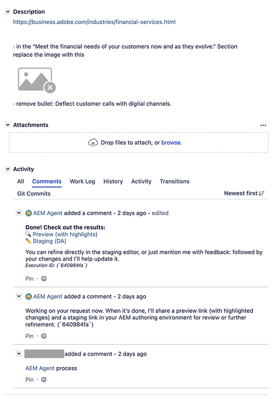

# Trabajo de actualización de contenido {#content-update}

El trabajo de actualización de contenido de [Brand Experience Agent](/help/ai-in-aem/agents/brand-experience/overview.md) automatiza la producción de contenido para acelerar las tareas diarias de Adobe Experience Manager (AEM) as a Cloud Service y Edge Delivery Services.

## Información general {#overview}

El trabajo de actualización de contenido actualiza el contenido existente, incluidos los fragmentos de contenido, las páginas, los formularios y los recursos. El trabajo puede realizar acciones como actualizar, quitar, reemplazar o agregar elementos de contenido para mantener las experiencias precisas y actuales. Las entradas pueden ser descripciones en lenguaje natural y, cuando se utilizan con PDF de Jira y capturas de pantalla, pueden proporcionar entradas a.

El trabajo de actualización de contenido transforma los detalles que proporciona, ya sea a través del lenguaje natural o de imágenes, en actualizaciones de contenido en la página. Debe proporcionar la dirección URL de una página que necesita actualizarse, junto con los detalles de lo que necesita actualizarse, y la aptitud del agente para completar su tarea.

## Capacidades {#capabilities}

Puede acceder a la aptitud de actualización de contenido desde:

* [El asistente de IA](#ai-assistant)
* [Jira](#jira)

## Asistente de IA {#ai-assistant}

Puede acceder al trabajo en AEM mediante el asistente de IA.

Abra el Asistente de IA de [`experience.adobe.com`,](https://experience.adobe.com) y comience a interactuar especificando el mensaje en lenguaje natural mediante el campo `Ask AI Assistant anything`:

### Indicadores de ejemplo {#sample-prompts}

Para iniciar actualizaciones de contenido, puede dar una amplia gama de mensajes en lenguaje natural. También debe especificar la dirección URL pública de la página que desea actualizar. Por ejemplo:

* Modifique la siguiente página `https://www.your-url.com/sale` Actualice el encabezado del héroe principal a &quot;Black Friday Mega Sale - Hasta 70% de descuento&quot;, cambie el temporizador de cuenta atrás para mostrar &quot;Termina en 48 horas&quot;, elimine &quot;Regístrese para recibir actualizaciones&quot;, cambie todos los botones &quot;Comprar ahora&quot; a &quot;Aprovechar el descuento&quot;

* `https://www.your-url.com/laptops/your-laptop-model` Actualizar copia del banner a &quot;Ahorre 300 USD solo hoy&quot;, Actualizar precio de 1.299 USD a 999 USD, Quitar banner de la opción de financiación

* `https://www.your-url.com/your-sneaker` Actualizar el estado de las existencias de &quot;Bajo stock&quot; a &quot;Nuevo en stock: cantidades limitadas&quot;, Cambiar el selector de tamaño para resaltar los tamaños disponibles en verde, Quitar el distintivo &quot;Próximamente&quot;

* `https://www.your-url.com/your-sneaker` Actualizar las imágenes de producto para mostrar nuevos colores

>[!NOTE]
>
>Las cargas de archivos se pueden usar al interactuar con [Jira](#jira), pero no son compatibles con el Asistente de IA.

## Jira {#jira}

El uso del trabajo de actualización de contenido con Jira le permite crear un ticket con instrucciones que automatizan sus ediciones.

### Crear un ticket {#create-a-ticket}

Crea un ticket Jira (de cualquier tipo). Se necesitan dos detalles esenciales en el campo **Descripción** de su ticket:

1. La dirección URL pública de la página que debe editar.

1. Los cambios necesarios.

   El trabajo admite la siguiente gama de formatos para describir los cambios:

   * Lenguaje natural en la descripción del ticket
      * por ejemplo, &quot;Cambiar el titular de X a Y&quot;
   * PDF anotado adjunto
      * por ejemplo, cree un PDF de su página y añada anotaciones que detallen lo que desea cambiar
   * Comentarios en PDF adjunto
      * por ejemplo, cree un PDF de su página y agregue comentarios que detallen lo que desea cambiar
   * Captura de pantalla anotada adjunta
      * por ejemplo, realice una captura de pantalla de parte de la página y añada anotaciones que detallen lo que desea cambiar
   * Archivo de Microsoft Word adjunto, que contiene cambios de lenguaje natural

### Invocar el trabajo desde la incidencia {#invoke-the-job-from-your-ticket}

Para utilizar el trabajo, añada un comentario a su ticket. En el comentario, mencione el trabajo con el símbolo `@`, junto con el comando que debe ejecutarse; por ejemplo:

* `@aemagent@adobe.com process`

Actualmente, el trabajo comprende los comandos:

* `process` - procesar la solicitud
* `cancel` - cancelar una solicitud de procesamiento
* `retry` - volver a procesar una solicitud
* `feedback` - aplicar comentarios a una generación anterior
* `reprocess` - volver a procesar la solicitud original

### Cómo interactúa el trabajo {#how-the-agent-interacts}

Después de emitir un comando al trabajo, este responde con comentarios en el Jira. Los comentarios detallan el progreso del trabajo y las acciones realizadas.

En el caso de un comando `process` para almacenar en déclencheur las actualizaciones, las respuestas pueden seguir la secuencia:

* El comentario inicial confirma que el trabajo se ha iniciado.

* Una vez finalizada la tarea, el trabajo responde con otro comentario que contiene detalles de las acciones realizadas.
   * Las actualizaciones de contenido realizadas por el trabajo no son destructivas, lo que significa que se realizan en una instancia de vista previa.
   * El comentario contiene enlaces a las actualizaciones, para que pueda revisar y publicar según sea necesario, o asignar el Jira a quien sea responsable.

* La siguiente imagen muestra un ejemplo de Jira que almacena en déclencheur el comando `process` para el trabajo de actualización de contenido:

  

## Activación {#activation}

Para activar y obtener acceso al trabajo de creación de comunicaciones, debe ponerse en contacto con Adobe. Para empezar, puede hacer lo siguiente:

* Contacto `experience-production-agent@adobe.com`
* O póngase en contacto con el equipo de su cuenta

Para acelerar el proceso, es útil proporcionar la siguiente información:

* Para AEM as a Cloud Service, debe proporcionar lo siguiente:
   * Id. de organización
   * `product_id`
   * `profile_id`

   * Estos valores se pueden encontrar siguiendo estos pasos:
      1. El administrador debe visitar [`https://adminconsole.adobe.com`](https://adminconsole.adobe.com)
      1. Seleccionar **Adobe Experience Manager as a Cloud Service**
      1. Seleccione la instancia de AEM adecuada
      1. Seleccione el perfil que permite operaciones de lectura y escritura para el contenido en cuestión
      1. Obtener la dirección URL del explorador
      1. Extraiga `product_id` y `profile_id` de la dirección URL.
Por ejemplo, `https://adminconsole.adobe.com/products/profiles/users`

* Creación de documentos de Edge Delivery
   * Proporcione a su equipo de Adobe la siguiente información:
      * Dominios relevantes
      * Información relevante de Github:
         * Org
         * Repositorio
         * Rama

## Limitaciones {#limitations}

Tenga en cuenta las siguientes limitaciones:

* Las cargas de archivos se pueden usar al interactuar con [Jira](#jira), pero no se admiten al interactuar con el [Ayudante de IA.](#ai-assistant)
