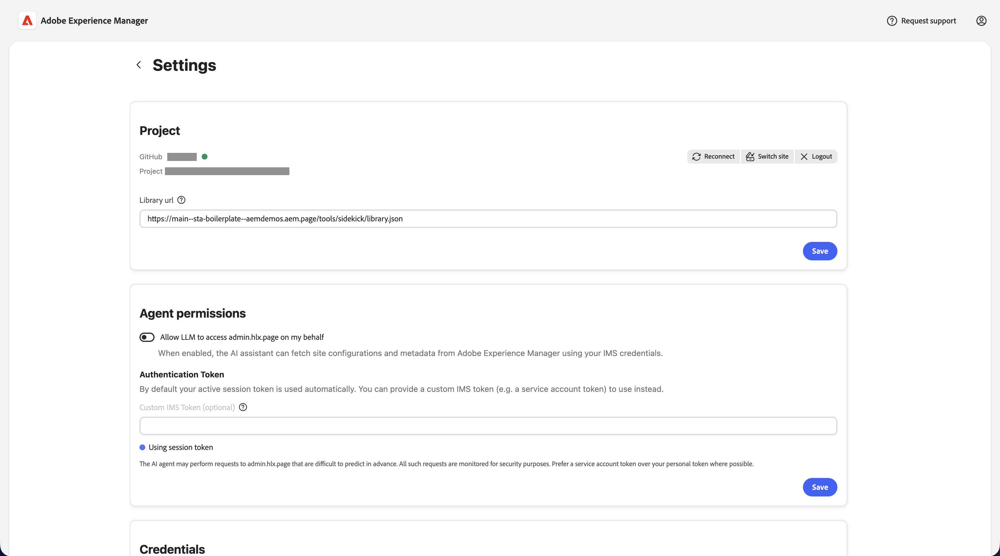

# Consola de modernización de Experience {#console-reference}

Guía de referencia para la interfaz y las funciones de la consola de modernización de Experience

>[!NOTE]
>
>Si está interesado en utilizar la consola de modernización de experiencias, puede solicitar acceso para garantizar una experiencia de incorporación sin problemas.

## Información general {#overview}

La consola de modernización de la experiencia es un entorno de desarrollo alojado y asistido por IA para Edge Delivery Services, que se expone como interfaz web en [`aemcoder.adobe.io`.](https://aemcoder.adobe.io) Después de conectarse a su proyecto de GitHub, puede empezar inmediatamente a solicitar cambios en lenguaje natural sin tener que realizar más ajustes o configuraciones de entorno local.

>[!TIP]
>
>Si está interesado en empezar de inmediato con la consola, consulte el documento [Introducción al agente de modernización de experiencias.](/help/ai-in-aem/agents/brand-experience/modernization/getting-started.md)

## Capacidades {#capabilities}

Funciones principales de la consola:

* Panel de chat interactivo con el agente y sus aptitudes
* Vista previa de Live AEM para obtener comentarios visuales inmediatos sobre los cambios
* Explorador de archivos de contenido y visor de markdown
* Sincronización de contenido con [Document Authoring](https://da.live)
* Explorador de códigos y visor de diferencias para revisar los cambios realizados
* Integración de GitHub con capacidad para crear solicitudes de extracción a partir de cambios

Los desarrolladores conservan el control total sobre lo que se envía. Todos los cambios realizados a través de la consola requieren revisión y aprobación antes de la implementación, lo que garantiza el control, la coherencia de la marca y la seguridad.

## Navegación {#navigation}

Después de iniciar sesión en la consola en [aemcoder.adobe.io,](https://aemcoder.adobe.io), llega a la [página principal](#home-page) de la consola. Una vez que hayas empezado a chatear, accederás directamente a la [página de chat](#chat-page) en las siguientes visitas al agente de modernización de experiencias.

### Barra de menús {#menu-bar}

La barra de menús superior proporciona lo siguiente:

* Un título de **Adobe Experience Manager** a la izquierda que se vincula a la página principal cuando se hace clic en él
* Un botón **Solicitar soporte técnico** donde puede enviar detalles de cualquier problema que se haya encontrado
* Un botón **Account** a la derecha para cambiar al modo oscuro y cerrar sesión en la consola

## Página principal {#home-page}

La página **Home** es el punto de partida para usar la consola.

* En la parte superior hay una [entrada de solicitud](#prompt-input) para realizar solicitudes de la consola.
* Debajo del panel de mensajes hay sugerencias para comenzar con el proyecto.
* Un botón **Iniciar chat** que te lleva a la [página de chat](#chat-page).
* Botón **Configuración** para obtener acceso a la página [Configuración del proyecto](#settings-page)

### Indicar entrada {#prompt-input}

La entrada del mensaje proporciona controles para interactuar con la IA.

* **Modos de planificación/ejecución** (iconos de bombilla y varita mágica): alternar entre los modos de planificación y ejecución, respectivamente
   * **Modo de planificación**: la IA analiza las solicitudes y describe un método sin realizar cambios, lo que resulta útil para comprender la estrategia antes de comprometerse.
   * **Modo de ejecución**: la API lleva a cabo el plan y realiza cambios en el archivo.
* **Adjuntar archivos** (icono de clip): cargue y adjunte archivos al mensaje para obtener contexto adicional (por ejemplo, diseños de referencia, capturas de pantalla, especificaciones técnicas)
* **Cola de mensajes** (icono de reloj): se pueden poner en cola mensajes adicionales para que se ejecuten automáticamente una vez que se haya completado la solicitud actual.

## Página de chat {#chat-page}

La página [**Chat**](https://aemcoder.adobe.io/chat) es la interfaz principal para interactuar con el agente de modernización de experiencias. Esta página está dividida en un [panel de chat](#chat-panel) y [panel de área de trabajo de tamaño variable.](#workspace-panel)

## Panel de chat {#chat-panel}

El panel de chat le permite ver y continuar la conversación con el agente de modernización de experiencias. El panel de chat incluye el historial de mensajes de chat y una [entrada de solicitud](#prompt-input) para realizar solicitudes adicionales de la consola.

El encabezado del panel de chat incluye vínculos para navegar a las vistas [Inicio](#home-page) y [Configuración](#settings-page) y las acciones de chat.

* **Acciones de chat**
   * **Borrar chat**: Esto restablece la conversación y borra la ventana de contexto de la IA. Utilice esta opción cuando inicie una nueva tarea que no esté relacionada con la conversación anterior.
   * **Descargar chat**: Esto descarga el historial de conversaciones como un archivo Markdown.

## Panel Workspace {#workspace-panel}

El panel del espacio de trabajo muestra todo el contenido y el código del sitio. El encabezado de la parte superior del panel incluye un selector para seleccionar la vista específica en la que desea centrarse. Las acciones disponibles en el encabezado del espacio de trabajo cambiarán según la vista seleccionada actualmente.

### Vistas de contenido {#content-view}

Las **vistas de contenido** contienen varios modos para mostrar el contenido de la página seleccionada. Un explorador de archivos contraíble muestra todo el contenido de página disponible para el sitio.

* **Vista previa** (documento con lupa) para ver el contenido de HTML procesado
* **Vista de documento** (icono de documento) para ver la estructura de contenido de creación de documentos subyacente, respectivamente
* **HTML view** (icono de código) para ver el html sin formato sin formato
* **Vista de marcado (creación de AEM)** (icono de párrafo) para ver la estructura de contenido de marcado subyacente
* **Vista XML JCR (creación de AEM)** (icono de datos) para ver la estructura de contenido XML JCR resultante

Las siguientes acciones están disponibles en las vistas de contenido:

* **Actualizar** icono para actualizar el procesamiento del panel de vista previa.
* **Modo interactivo** para ver el contenido de HTML procesado en una vista de escritorio, tableta o móvil
* **Inspeccione el modo** (seleccione el icono) para agregar elementos de la página a su solicitud de contexto adicional
* **Nueva ventana** (abrir en icono) para abrir la URL de vista previa en una nueva pestaña (para una vista previa de escritorio completa)
* **Eliminar** quita la página seleccionada del área de trabajo. El contenido visualizado previamente o publicado no se eliminará.
* El botón **Errores** (Creación en AEM) abre una ventana modal para ver los errores de la página seleccionada.
* El botón **Cargar contenido** abre una ventana modal para cargar archivos en AEM.

### Vistas de código {#code-view}

**Vistas de código** proporciona herramientas para examinar los archivos de proyecto y administrar los cambios de código. La vista incluye un explorador de archivos para obtener una descripción general de los archivos de código o los cambios realizados como diferencias, así como un área de vista previa para ver el archivo o los cambios seleccionados.

* **Archivos** para examinar los archivos de código en el área de trabajo actual
* **Cambios** para ver las diferencias de los cambios de archivos creados por su trabajo en el proyecto

#### Acciones de archivo {#file-actions}

* **Agregar al chat** agrega el archivo seleccionado (o las líneas seleccionadas del archivo) al panel de chat para obtener contexto.
* **Descargar** descargue el archivo seleccionado en su sistema de archivos local

#### Cambios en acciones {#changes-actions}

* **Agregar** (icono + ) para almacenar en zona intermedia el archivo modificado
* **Descartar** (icono de flecha) para descartar el archivo modificado
* **Eliminar** (icono de papelera) para eliminar el archivo no ensayado
* **Actualizar** (icono de actualización) para actualizar la lista de cambios
* **Cambiar rama**: cambia ramas dentro del mismo repositorio
* **Sincronizar**: extrae los cambios más recientes del origen remoto
* **Push**: abre un modal para insertar los cambios del espacio de trabajo en GitHub

Al insertar cambios, primero debe tener cambios clasificados para incluirlos en la notificación push. Al insertar, puede elegir crear una nueva PR o insertar directamente en la rama actual

Se pueden realizar acciones adicionales del proyecto de GitHub en la [página de configuración](#settings-page).

## Página Configuración {#settings-page}

La página [**Configuración**](https://aemcoder.adobe.io/settings) le permite administrar la configuración básica de la consola y se divide en las siguientes secciones.

Si realiza un cambio en cualquier valor de cualquier sección, haga clic en **Guardar** para guardar los cambios en la sección individual. Haga clic en el icono Atrás para volver a la vista anterior.

* **Proyecto** le permite ver y editar la configuración del proyecto, como administrar la conexión de GitHub y personalizar la dirección URL de la biblioteca.
   * **Conectar / Volver a conectar**: inicia la autenticación de GitHub
   * **Repositorio de cambios**: reemplaza el área de trabajo por un repositorio diferente. Se perderá cualquier trabajo no comprometido.
   * **Cerrar sesión**: se desconecta de GitHub
   * **URL de biblioteca**: esta URL apunta a un archivo library.json que define los bloques disponibles, sus variaciones y el contenido de ejemplo.
   * **URL de base del sitio**: URL de origen del sitio web que se está migrando.
* **Permisos de agente** - Permitir que el agente acceda a las opciones de configuración
   * **Permitir que LLM acceda a admin.hlx.page en mi nombre**: cuando está habilitado, el asistente de IA puede recuperar configuraciones de sitio y metadatos de Adobe Experience Manager con sus credenciales de IMS.
   * **Token de IMS personalizado**: puede proporcionar un token de IMS personalizado para usar en lugar del token de sesión predeterminado.
* **Credenciales** le permite especificar un token de acceso personal para Figma de modo que la [consola pueda acceder a los bloques de diseño de su proyecto.](/help/ai-in-aem/agents/brand-experience/modernization/prompting-guide.md#figma-block-migration)
   * El token requiere los siguientes ámbitos de solo lectura:
      * `file_content:read`
      * `file_metadata:read`
      * `library_assets:read`
      * `library_content:read`
      * `team_library_content:read`
      * `file_dev_resources:read`
      * `projects:read`
   * [Consulte la documentación de Figma](https://help.figma.com/hc/en-us/articles/8085703771159-Manage-personal-access-tokens) para obtener más información sobre la configuración de tokens de acceso personal.
* **Asistencia** resume la información compartida con el equipo de asistencia de Adobe cuando realiza una solicitud de asistencia.
   * **Solicitar soporte técnico**. Haga clic para iniciar una solicitud de soporte técnico de Adobe sin salir de la consola.
* **La zona de peligro** contiene opciones de configuración que pueden revertir el espacio de trabajo.
   * **Restablecer área de trabajo** - Haga clic para restablecer el área de trabajo a su estado inicial. Esto no se puede deshacer.
