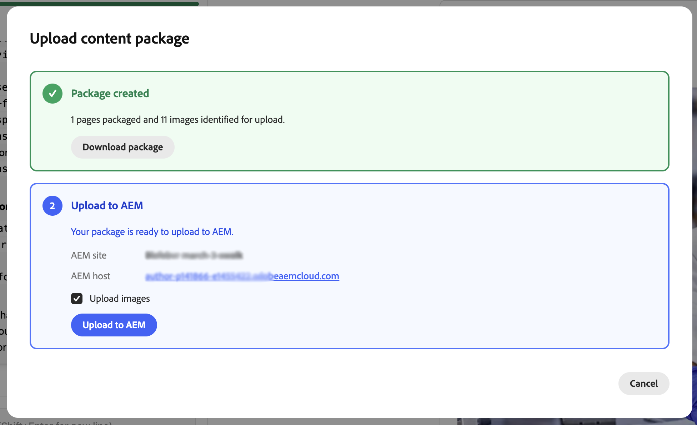

# Introducción al Agente de modernización de experiencias para proyectos de creación de AEM {#getting-started-aem-authoring}

Para los proyectos de creación de AEM que utilizan el Editor universal, la preparación del agente de modernización de experiencias difiere del flujo de Edge Delivery estándar. Este documento cubre esas diferencias de configuración. Una vez completados los pasos siguientes, siga la guía principal de [Introducción al agente de modernización de experiencias](getting-started.md).

## Crear su repositorio de proyecto de Edge Delivery Services {#create-repo}

1. Use el repositorio [`aem-block-collection-xwalk`](https://github.com/adobe-rnd/aem-block-collection-xwalk) como plantilla (no la plantilla de Edge Delivery Services estándar).
1. Siga el [tutorial del editor universal](https://www.aem.live/developer/ue-tutorial) para configurar su repositorio.
   * Deténgase cuando se le pida que cree un sitio en AEM.
1. Eliminar `paths.json` y confirmar este cambio en `main`.
1. Agregue la aplicación [AEM Code Connector](https://github.com/apps/aem-code-connector/installations/select_target) a su repositorio.
   * Esto permite que la consola inspeccione el código.

## Creación de un nuevo sitio en AEM {#create-site}

1. En la consola AEM Sites, seleccione **Crear** > **Sitio a partir de la plantilla**.
1. Seleccione el **sitio de AEM con la plantilla Edge Delivery Services**.
   * ¿No lo ves en la lista? [Instalar la plantilla.](https://github.com/adobe-rnd/aem-boilerplate-xwalk/releases)
1. Mantenga el **nombre** del sitio (no el título) tal como se proporcionó.
   * El nombre del sitio se utiliza como identificador único.
   * El título se puede cambiar para mostrarlo.
1. Haga clic en **Crear**.
   * Se le redirigirá a la página de Sites.
   * Actualice la página si el nuevo sitio no aparece inmediatamente.
1. Si aún no lo ha hecho al [configurar su repositorio,](#create-repo) actualice `fstab.yaml` para que apunte a su host de AEM, propietario de Git y repositorio de Git y confirme esos cambios en `main`.
   * Consulte [Configurar origen de contenido](/help/implementing/cloud-manager/edge-delivery/configure-content-source.md) para obtener instrucciones.

## Continúe con los pasos de introducción estándar {#continue}

Una vez completados los pasos anteriores, puede continuar con la guía de introducción estándar para comenzar a migrar el contenido.

Siga estos pasos de la guía estándar.

1. [Preparación de un repositorio de GitHub de Edge Delivery](/help/ai-in-aem/agents/brand-experience/modernization/getting-started.md#prepare-repo)
1. [Abra la consola de modernización de Experience](/help/ai-in-aem/agents/brand-experience/modernization/getting-started.md#open-console)
1. [Conectar el repositorio de GitHub](/help/ai-in-aem/agents/brand-experience/modernization/getting-started.md#connect-repo)
1. [Iniciar petición de datos](/help/ai-in-aem/agents/brand-experience/modernization/getting-started.md#start-prompting)

Una vez completados los pasos para migrar el contenido, continúe con los siguientes pasos.

## Validar contenido {#validate-content}

Valide el contenido de la página seleccionada en el panel de vista previa. Se mostrarán todos los errores haciendo clic en el botón **Errores**.
Continúe la conversación de chat con el agente para corregir los errores. Utilice la función **Agregar al chat** para dirigir correcciones a elementos específicos de la página, archivos del analizador o archivos del transformador.

## Cargar contenido {#upload-content}

Para cargar el contenido en AEM:

1. Asegúrese de que está en la vista **Contenido** y haga clic en el botón **Cargar contenido** en la parte superior derecha.
1. En el cuadro de diálogo **Crear paquete de contenido**, elija las páginas que desea incluir en el paquete.
   * Si lo desea, escriba un **nombre de paquete** (de manera predeterminada, el nombre del sitio si se deja vacío).
   * Use **Seleccionar todo**, **Borrar selección**, **Expandir todo** o **Contraer todo** para administrar la lista.
1. Haga clic en **Crear paquete**.

   

1. Una vez creado el paquete, el cuadro de diálogo **Cargar paquete de contenido** mostrará que el paquete está listo.
   1. Puede **descargar el paquete** para guardarlo localmente o continuar con la carga.
   1. En **Cargar a AEM**, confirme el **sitio de AEM** y el **host de AEM** (rellenados previamente a partir de la configuración de su proyecto).
      * Si lo desea, deje **Cargar imágenes** marcadas para incluir imágenes.
   1. Haga clic en **Cargar a AEM**.

   

1. El cuadro de diálogo muestra el progreso de carga a medida que las páginas y los recursos se envían a AEM. Cuando termina la carga, se muestra un mensaje de éxito y el registro de carga. Haga clic en **Cerrar** para cerrar el cuadro de diálogo.

   

El contenido importado está ahora en AEM. Continúe con [Cambios en el código push](getting-started.md#push-code-changes) en la guía de introducción principal.

## Recursos adicionales {#additional-resources}

* [Introducción al agente de modernización de experiencias](getting-started.md): flujo de trabajo completo que incluye consola, petición de datos, carga y vista previa
* [Consola de modernización de experiencias](console.md) - Referencia de la consola
* [Tutorial del editor universal](https://www.aem.live/developer/ue-tutorial): configure un proyecto de creación y editor universal de AEM
* [`aem-block-collection-xwalk`](https://github.com/adobe-rnd/aem-block-collection-xwalk) - Repositorio de plantillas para proyectos de AEM authoring y Universal Editor
