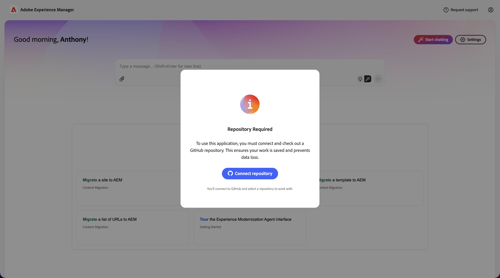
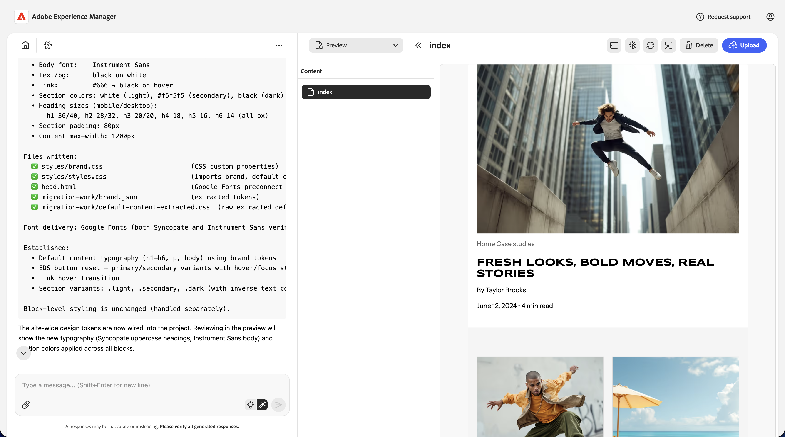
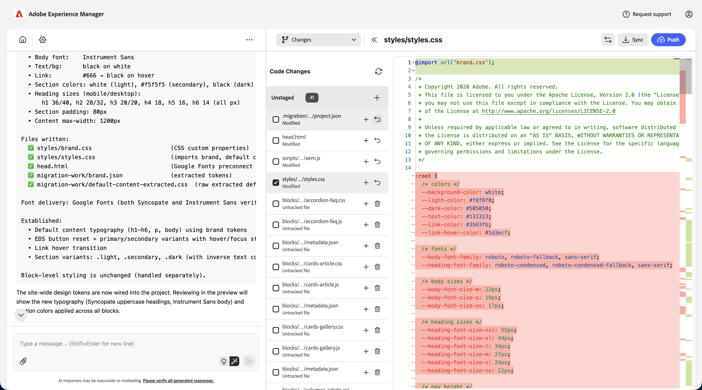
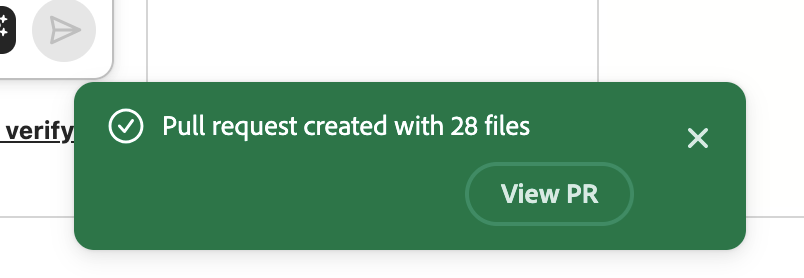

# Introducción a Experience Modernization Agent {#getting-started}

Conozca los primeros pasos para empezar a utilizar Experience Modernization Agent y Experience Modernization Console.

>[!NOTE]
>
>Si está interesado en utilizar la consola de modernización de experiencias, puede solicitar acceso a través de su administrador de cuentas para garantizar una experiencia de incorporación sin problemas.

## Preparación de un repositorio de GitHub de Edge Delivery {#prepare-repo}

>[!NOTE]
>
>¿Utiliza un proyecto de AEM Sites y Universal Editor? Siga los pasos de configuración de [Introducción a AEM Sites/Editor universal](/help/ai-in-aem/agents/brand-experience/modernization/getting-started-aem-authoring.md).

1. Seleccione un repositorio [Edge Delivery Services](/help/edge/overview.md) para utilizarlo con la consola de modernización de experiencias.
   * Puede ser un proyecto existente de Edge Delivery Services o puede crear uno nuevo siguiendo el [tutorial para desarrolladores](https://www.aem.live/developer/tutorial) con el [repositorio de plantillas.](https://github.com/adobe/aem-boilerplate)
1. Asegúrese de que el [Conector de código AEM](https://github.com/apps/aem-code-connector) esté instalado en el repositorio.
   * Esto permite que la consola inspeccione el código.
1. Asegúrese de que la [aplicación GitHub de sincronización de código de AEM](https://github.com/apps/aem-code-sync) esté instalada en el repositorio.
   * Esto permite a Edge Delivery Services sincronizar su código.
   * Si el repositorio se basa en el tutorial, este paso ya está completo.

## Abra la consola de modernización de Experience {#open-console}

1. Ir a [`aemcoder.adobe.io`.](https://aemcoder.adobe.io)
1. Inicie sesión con su Adobe ID.

## Modo de demostración {#demo-mode}

La consola se iniciará en modo de demostración la primera vez que inicie sesión. Este modo le permite explorar un sitio existente en el que puede probar a migrar páginas adicionales. Un banner en la parte inferior de la pantalla indica que se encuentra en modo de demostración.

## Conectar el sitio {#connect-repo}

Cuando esté listo para empezar a trabajar en su propio sitio, puede salir del modo de demostración conectándose a su propio proyecto.

1. Haga clic en **Cambiar sitio** en el banner del modo de demostración.
1. Esto le pedirá que autorice la aplicación AEM Code Connector con sus credenciales de GitHub. Haga clic en **Autorizar conector de código AEM**.
1. Vuelva a la consola y especifique la URL de vista previa del sitio. La URL de vista previa se puede obtener previsualizando cualquier documento del sitio o creándolo a partir de la rama, el nombre del sitio y la organización. El sistema recuperará automáticamente el proyecto de Github asociado. También puede buscar en sus proyectos de GitHub autorizados para encontrar un sitio.
   
1. Haga clic en **Finalizar compra en el espacio de trabajo** una vez verificado el sitio.
1. Cuando se le pida **Reemplazar el área de trabajo existente**, haga clic en **Reemplazar área de trabajo**.
   

El proyecto y el sitio de GitHub ahora están conectados a la consola.

Si se ha salido del modo de demostración pero no se ha conectado un nuevo proyecto, las visitas posteriores al agente de modernización de experiencias forzarán a que un sitio se conecte primero.

## Inicio de consola {#console-home}

Cuando visite [aemcoder](https://aemcoder.adobe.io), la página principal aparecerá hasta que se inicie una conversación de chat. La página de inicio le permite empezar a chatear escribiendo su primer mensaje o seleccionando uno de los mensajes sugeridos.

## Iniciar petición de datos {#start-prompting}

Ahora que la consola puede acceder al código, está listo para empezar a preguntar.

1. Para empezar, puede importar el contenido de un sitio:
   * &quot;Migrar la página `https://wknd-trendsetters.site`.&quot;
1. Esto importa el contenido del sitio.
   * La consola observa la separación de preocupaciones y gestiona el contenido y la presentación por separado.
   * La importación inicial del contenido de un sitio puede tardar varios minutos.
   * La consola le presenta comentarios continuos cuando comienza su trabajo, incluida una descripción general de los pasos planificados.
     
1. Una vez importado el sitio, el panel **Workspace** muestra las páginas. Seleccione una página para previsualizarla en el panel derecho.
   
1. Ahora que tiene contenido, puede pedir que se importen los estilos desde el mismo origen.
   * &quot;Importar los estilos generales de `https://wknd-trendsetters.site`.&quot;
1. Al igual que con la importación de contenido inicial, la importación puede tardar varios minutos y la consola proporciona comentarios a medida que procesa la solicitud e importa los estilos. Una vez finalizada la tarea, haga clic en **Actualizar vista previa** en el panel derecho para ver el contenido con estilo.
   

Ahora tiene el contenido y los estilos importados en la consola.

>[!TIP]
>
>[Consulte la guía de mensajes](/help/ai-in-aem/agents/brand-experience/modernization/prompting-guide.md) para obtener más ideas sobre cómo preguntar al agente y lo que pueden hacer sus habilidades.

## Cargar contenido {#upload-content}

Para cargar el contenido en [Document Authoring](https://da.live):

1. Asegúrate de que estás en una vista de **Contenido** y luego haz clic en el botón **Cargar contenido** en la parte superior derecha.
   * De manera predeterminada, se encuentra en la vista **Contenido** al entrar a la consola.
   * La vista se indica mediante el elemento Selector de vistas seleccionado en el área de espacio de trabajo de la consola.
1. El cuadro de diálogo **Cargar contenido** se abre con la organización de destino y el repositorio ya rellenados desde la configuración del proyecto.
   * Si un(a) `fstab.yaml` no está presente en el repositorio conectado, deberá ingresar manualmente sus **organizaciones** y **repositorios**.
   * Si utilizó la repetidor, se proporciona un `fstab.yaml`.
1. Seleccione los archivos que desee cargar y haga clic en **Cargar**.
   
1. La consola indica el proceso de carga al deshabilitar el botón **Cargar**.
1. Una vez finalizada, aparece una notificación en la parte inferior de la consola.
   

Para tener acceso al contenido cargado en Document Authoring, si lo desea, haga clic en **Ver en AEM** en la notificación cuando finalice la carga o vaya a `https://da.live/#/{organization}/{repository}`.

El contenido importado ahora se encuentra en Document Authoring.

>[!TIP]
>
>Si está trabajando en un proyecto de AEM Sites y Universal Editor, la carga de contenido en AEM funciona de un modo ligeramente distinto. Consulte [Introducción al agente de modernización de experiencias para proyectos de AEM Sites/editor universal](/help/ai-in-aem/agents/brand-experience/modernization/getting-started-aem-authoring.md#upload-content) para obtener instrucciones específicas sobre la carga.

## Cambios en el código push {#push-code-changes}

Una vez que esté satisfecho con los cambios realizados en el código, puede insertarlos en el repositorio de GitHub.

1. Cambiar a la vista **Changes** (icono de bifurcación en el selector de vistas).
   
1. En la lista de archivos modificados, si algunos archivos aparecen como sin seguimiento, haga clic en su botón `+` para almacenarlos en zona intermedia.
1. Haga clic en el botón **Insertar** en la parte superior derecha.
1. En el cuadro de diálogo **Insertar cambios**, elija insertar los cambios en una nueva PR (predeterminada) o en la rama actual y haga clic en **Confirmar** para insertarlos.
   * En caso de duda, puede insertar la rama actual para que las cosas sean sencillas.
1. Una vez finalizada, aparece una notificación en la parte inferior de la consola.
   

Si desea acceder directamente a los cambios insertados en GitHub, haga clic en **Ver PR** en la notificación cuando finalice la inserción.

Su código se encuentra ahora en GitHub.

## Previsualizar sitio {#preview-site}

Para ver los cambios en el entorno de vista previa:

1. Vuelva a Creación de documentos.
   * Aún puede estar abierto en una pestaña del navegador que abriste después de hacer clic en **Ver en AEM** después de cargar el contenido.
   * O vaya a `https://da.live/#/{organization}/{repository}`
1. Abra una de las páginas que cargó anteriormente en AEM.
1. Haga clic en el icono del avión de papel (parte superior derecha) y seleccione **Vista previa**.
   

¡Enhorabuena! El contenido y los estilos migrados ya están activos en el entorno de vista previa de AEM.

Si insertó el código en una rama que no sea `main`, la vista previa abierta desde Document Authoring no mostrará los estilos. Cambie a la rama actualizando la URL de la vista previa y podrá ver sus estilos.

## Resolución de problemas {#troubleshooting}

### Direcciones IP de lista de permitidos {#allowlist-ip-addresses}

Si el sitio está protegido por un cortafuegos o por restricciones de acceso, puede lista de permitidos las siguientes direcciones IP para que los servicios back-end puedan rastrear el sitio:

* `34.228.136.112`
* `54.90.51.39`
* `3.224.194.242`

## Recursos adicionales {#additional-resources}

Los siguientes documentos pueden resultar útiles a medida que continúa explorando el agente de modernización de experiencias y su consola.

* [Consola de modernización de experiencias](/help/ai-in-aem/agents/brand-experience/modernization/console.md): detalles sobre la consola, sus vistas, opciones y capacidades
* [Guía de solicitud del agente de modernización de experiencias](/help/ai-in-aem/agents/brand-experience/modernization/prompting-guide.md): ideas sobre cómo preguntar al agente y lo que pueden hacer sus habilidades
* [Tutorial para desarrolladores de Edge Delivery Services](https://www.aem.live/developer/tutorial) - Útil si es nuevo en proyectos de AEM y Edge Delivery Services
* [Creación de documentos](https://da.live): útil si es nuevo en la creación de documentos para la administración de contenido
