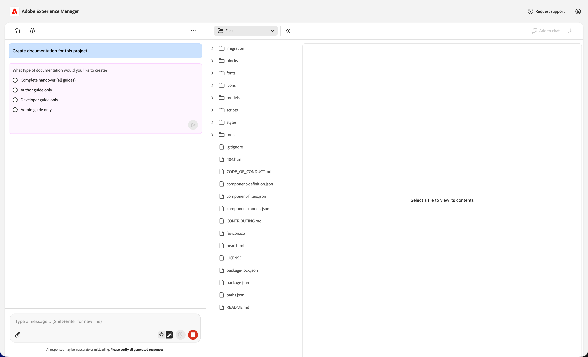
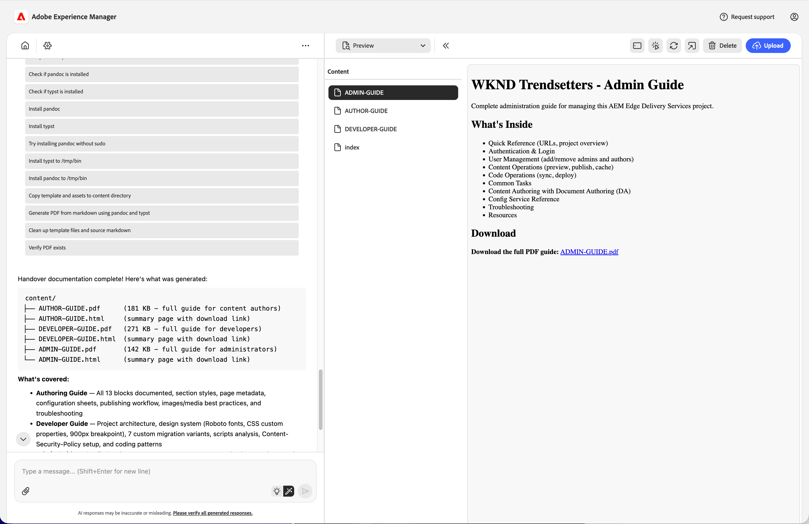

# Habilidad de documentación del proyecto {#project-documentation}

Descubra cómo las habilidades de documentación de Experience Modernization Agent pueden ayudarle a acelerar los traspasos de proyectos.

## Aceleración de traspasos de proyectos {#project-handovers}

[El agente de modernización de experiencias](/help/ai-in-aem/agents/brand-experience/modernization/overview.md) puede generar automáticamente guías de documentación de proyectos para proyectos de AEM Edge Delivery Services que incluyan:

* **Tutorial del proyecto**: explicación de la configuración, estructura y convenciones del proyecto, generadas sin esfuerzo manual
* **Organización de módulos y componentes**: documentación clara sobre cómo se organizan los bloques, módulos y componentes y cómo se relacionan entre sí
* **Guías basadas en roles**: documentación dirigida a autores, desarrolladores y administradores para que cada miembro del equipo obtenga exactamente lo que necesita

Esto simplifica el traspaso de proyectos para proyectos de AEM Edge Delivery Services.

## Requisitos previos {#prerequisites}

Asegúrese de lo siguiente antes de utilizar esta aptitud.

* El proyecto debe estar desprotegido en el espacio de trabajo en la consola.
* Debe tener permisos de administrador en el proyecto para el que está creando documentación.
* Los permisos de agente deben estar permitidos en la consola.
   * Seleccione la opción **Permitir que LLM acceda a admin.hlx.page en mi nombre** [en la configuración de la consola.](/help/ai-in-aem/agents/brand-experience/modernization/console.md#settings-view)
   * Si esta opción no está activada, el agente generará la documentación en función del código base al que tenga acceso.

## Creando documentación del proyecto {#creating-documentation}

Una vez cumplidos los requisitos previos, solo tiene que pedir al agente que cree la documentación para su proyecto.

1. En el gráfico, haga clic en &quot;Crear documentación de este proyecto&quot;.
1. Proporcione el nombre de organización del proyecto si el agente se lo pide.
1. El agente le preguntará qué documentación desea crear. Normalmente, seleccionaría **Todos**.

   

1. Una vez creadas, las guías se colocan en el espacio de trabajo. Seleccione uno para ver una descripción y haga clic en el vínculo para descargar PDF completo.

   

Puede guardar PDF directamente para proporcionárselo a sus equipos o cargarlo como parte del resto del contenido de DA.

>[!NOTE]
>
>Si no tiene autorización para acceder a la API de administración de Edge Delivery Services o a la opción **Permitir que LLM acceda a admin.hlx.page en mi nombre** [en la configuración de la consola.](/help/ai-in-aem/agents/brand-experience/modernization/console.md#settings-view) no está activada, el agente generará la documentación en función del código base al que tenga acceso.

## Resolución de problemas {#troubleshooting}

A continuación, se muestran mensajes de error comunes que se encuentran al utilizar la aptitud de documentación del proyecto y cómo resolverlos.

### &quot;Acceso denegado&quot; o &quot;No autorizado&quot; {#unauthorized}

* **Causa:** faltan permisos de administración o no se han habilitado los permisos de agente
* **Solución:**
   1. Compruebe que tiene acceso de administrador al proyecto
   1. Seleccione la opción **Permitir que LLM acceda a admin.hlx.page en mi nombre** [en la configuración de la consola.](/help/ai-in-aem/agents/brand-experience/modernization/console.md#settings-view)

### &quot;Proyecto no encontrado&quot; {#not-found}

* **Causa:** el repositorio no se desprotegió en el área de trabajo
* **Solución:**
   1. Desproteger el repositorio del proyecto
   1. Asegúrese de que está en el espacio de trabajo correcto

### &quot;Error de API de configuración&quot; {#api-error}

* **Causa:** No se puede obtener acceso a la API del servicio de configuración de Edge Delivery Services
* **Solución:**
   1. Seleccione la opción **Permitir que LLM acceda a admin.hlx.page en mi nombre** [en la configuración de la consola.](/help/ai-in-aem/agents/brand-experience/modernization/console.md#settings-view)
   1. Compruebe la conexión de red/VPN
   1. Confirmar acceso de administrador al proyecto
