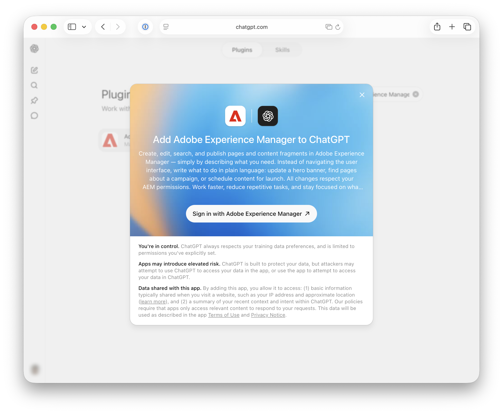
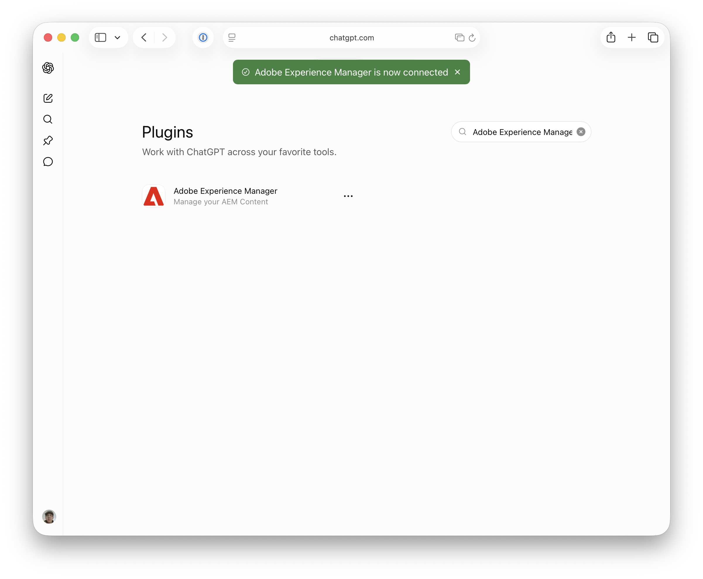

# Configuración de OpenAI ChatGPT con AEM MCP {#setup-chatgpt}

Este artículo cubre dos formas independientes de utilizar OpenAI ChatGPT con AEM:

- Configure manualmente uno o más servidores MCP de AEM en ChatGPT (los servidores descritos en [Uso de MCP con AEM as a Cloud Service — Servidores MCP](/help/ai-in-aem/mcp-support/using-mcp-with-aem-as-a-cloud-service.md#mcp-servers)).
- Instale el complemento de Adobe Experience Manager desde el Marketplace del complemento ChatGPT. Actualmente tiene paridad de características con Content MCP Server y mostrará un subconjunto creciente de herramientas disponibles en los servidores MCP de AEM.

## Configurar manualmente los servidores MCP de AEM en ChatGPT {#manual-configure-aems-mcp-servers-in-chatgpt}

En esta sección se describe el método de **configuración manual**, en el que se agregan uno o más servidores MCP de AEM a ChatGPT como aplicaciones o conectores personalizados.

* Agregue una o más URL de servidor MCP de AEM en el área donde están configuradas las conexiones o herramientas MCP.
* Almacene en déclencheur la conexión e inicie sesión con su Adobe ID cuando se le redirija.
* En un chat, consulte las herramientas de AEM configuradas en las peticiones de datos, por ejemplo:

  ```
  "Using the configured AEM MCP tools, list all sites in the author environment."
  ```

>[!NOTE]
>
>La interfaz de usuario de OpenAI ChatGPT está sujeta a cambios y no es definitiva. Estas instrucciones tienen fines ilustrativos.

1. Abra **Configuración** para que pueda llegar al área donde están configuradas las herramientas o las conexiones MCP.

   

1. En **Aplicaciones y conectores**, abra **Configuración avanzada** para administrar el conector y las opciones relacionadas con MCP.

   

1. Habilite el **modo de desarrollador** en **Aplicaciones y conectores** para poder agregar y configurar un complemento personalizado.

   

1. Inicie **Crear nueva aplicación** (o el control equivalente) para agregar una entrada de aplicación para el servidor MCP de AEM.

   

1. Complete el formulario **Nueva aplicación** (por ejemplo, asigne un nombre a la aplicación, introduzca la URL del servidor MCP de AEM y cualquier otro campo obligatorio) y, a continuación, **guarde**.

   

1. Confirme que **AEM Content MCP Service** (o su aplicación configurada) aparece en **Aplicaciones y conectores** para que ChatGPT pueda usarlo.

   

1. En un chat, escriba un mensaje que indique a ChatGPT que use las **Herramientas de AEM** configuradas (por ejemplo, para consultar el contenido o los sitios de creación).

   

## Instalación del complemento de Adobe Experience Manager (Marketplace del complemento ChatGPT) {#install-adobe-experience-manager-plugin}

En esta sección se describe el **complemento instalable** del mercado de complementos ChatGPT (en lugar de agregar una URL de servidor MCP personalizada). Incluye un subconjunto de las herramientas disponibles en los servidores MCP de AEM.

>[!NOTE]
>
>La interfaz de usuario de OpenAI ChatGPT está sujeta a cambios y no es definitiva. Estas instrucciones tienen fines ilustrativos.

Puede acceder al complemento de Adobe Experience Manager de cualquiera de estas dos formas. Utilice el que sea más conveniente y, a continuación, continúe con los pasos de inicio de sesión siguientes.

**Opción 1: abrir la página del complemento directamente**

Vaya a [https://chatgpt.com/plugins/plugin_asdk_app_6a35d3c1258081919c084a1fd22cd02d](https://chatgpt.com/plugins/plugin_asdk_app_6a35d3c1258081919c084a1fd22cd02d) y elija **Instalar complemento**.


**Opción 2: buscar el complemento en el mercado**

1. En **Configuración**, elige **Complementos** y al final de la lista elige **Complementos de exploración**.

   

1. Busque **Adobe Experience Manager** y, a continuación, selecciónelo.

   

**Inicia sesión y confirma**

Después de localizar o instalar el complemento con cualquiera de las opciones anteriores, complete la conexión:

1. Elija **Iniciar sesión con Adobe Experience Manager** e inicie sesión en AEM cuando se le redirija.

   

1. Confirme que el aviso verde indica que Adobe Experience Manager está conectado.

   
