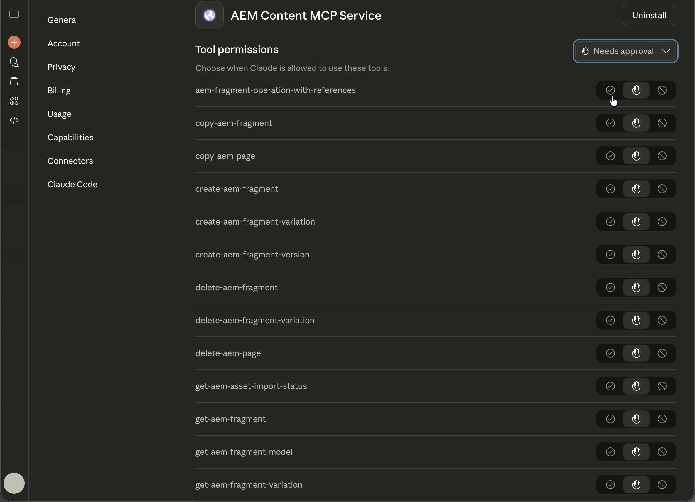

# Configuración de la Claude antrópica con AEM MCP {#setup-claude}

Siga estos pasos para conectar Anthropic Claude a los servidores MCP de AEM.

* En la configuración de MCP de Claude, registre una o más URL de servidor MCP de AEM.
* Complete el flujo de inicio de sesión de Adobe.
* De forma opcional, habilite la confirmación automática para determinadas herramientas del área de configuración. Esta opción se recomienda para operaciones de búsqueda o de solo lectura.
* Asegúrese de que el servidor MCP esté seleccionado antes de iniciar la conversación.
* Pide a Claude que realice tareas relacionadas con AEM. Claude selecciona las herramientas de AEM expuestas por el servidor MCP en función de su solicitud.

