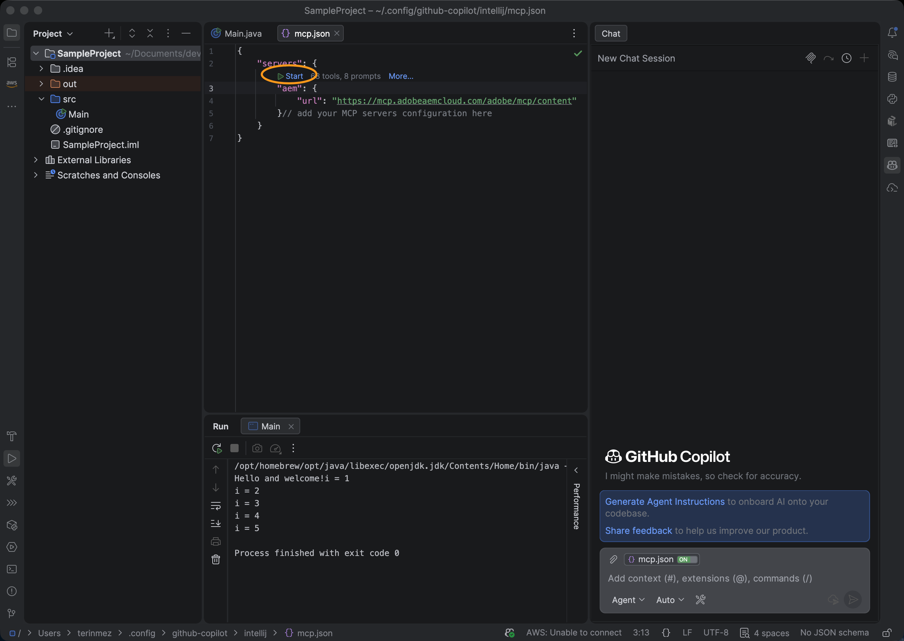

# Configuración de JetBrains con GitHub Copilot y AEM MCP {#setup-jetbrains-copilot}

Siga estos pasos para conectar GitHub Copilot en un IDE de JetBrains (como IntelliJ IDEA, WebStorm o PyCharm) a los servidores MCP de AEM.

1. Abra GitHub Copilot Chat en su IDE de JetBrains haciendo clic en el icono **GitHub Copilot Chat** que se encuentra en la parte derecha del editor.

   

1. Haga clic en el icono **settings** del panel Chat de Copilot para abrir la configuración de MCP.

   

1. En **Configuración**, vaya a **Herramientas > Copiloto de GitHub > Protocolo de contexto de modelo (MCP)** y haga clic en **Configurar** para abrir el archivo de configuración de `mcp.json`.

   

1. Agregue una o más URL de servidor MCP de AEM al archivo `mcp.json`. Por ejemplo:

   ```json
   {
     "servers": {
       "aem": {
         "url": "https://mcp.adobeaemcloud.com/adobe/mcp/content"
       }
     }
   }
   ```


   


1. Guarde el archivo. GitHub Copilot detecta la nueva configuración del servidor automáticamente y muestra una acción **Start**.

   

1. Haga clic en la acción **Iniciar** y, cuando se le solicite, inicie sesión con su Adobe ID para completar el flujo de autenticación.

1. Puede revisar y administrar las herramientas detectadas si hace clic en el indicador **tools** que aparece en el panel Chat de Copilot. De forma opcional, habilite o deshabilite las herramientas individuales.


   

1. Utilice GitHub Copilot Chat para invocar las herramientas de AEM como parte de los flujos de trabajo de desarrollo o contenido.
