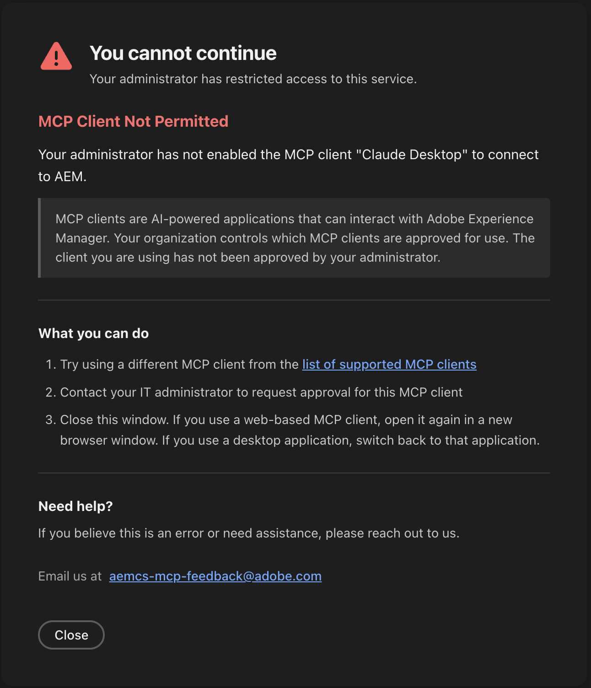

# Uso de MCP con AEM as a Cloud Service {#using-mcp-with-aem-as-a-cloud-service}

## Introducción {#introduction}

Muchos equipos de Adobe Experience Manager (AEM) ahora trabajan en entornos de desarrollo integrado (IDE) y aplicaciones basadas en chat como Cursor, OpenAI ChatGPT, Anthropic Claude y Microsoft Copilot Studio. Estas aplicaciones admiten el Protocolo de contexto de modelo (MCP), que permite a las aplicaciones exponer las herramientas back-end a modelos de lenguaje grande (LLM) de forma estandarizada.

Con la integración de MCP de AEM, diferentes personas pueden colaborar en torno al mismo contenido:

* **Los desarrolladores** pueden organizar operaciones de contenido y flujos de trabajo desde su IDE o aplicación de chat
* **Los profesionales** y los arquitectos de contenido pueden administrar sitios, fragmentos de contenido y recursos con ayuda de IA mientras se mantienen dentro del modelo de permisos existente de AEM.

>[!IMPORTANT]
>
> En los casos en los que se modifica o elimina contenido, los profesionales deben utilizar la interfaz del Asistente de IA en lugar de invocar las herramientas de MCP directamente. Los agentes de AEM gestionados por AI Assistant incluyen protecciones integradas.
>

En este artículo se explica qué proporciona la funcionalidad MCP de AEM, qué aplicaciones MCP son compatibles, cómo configurarla y cómo utilizarla en la práctica.

## Por qué MCP es útil para los clientes de AEM {#why-mcp-is-useful-for-aem-customers}

Las modernas aplicaciones de IDE y chat utilizan MCP como una forma para que un LLM llame a las herramientas expuestas detrás de los servidores MCP. Los clientes pueden describir su intención en lenguaje natural en lugar de escribir código con especificaciones de API de bajo nivel. Por ejemplo, un mensaje como *&quot;actualice el banner principal de esta campaña en todas las páginas&quot;* permite que el LLM invoque las herramientas de MCP adecuadas, que luego interactúan con las API de AEM.

Las métricas clave incluyen lo siguiente:

* **Interacción en lenguaje natural en lugar de canalización de API**
Las herramientas de MCP describen qué operaciones están disponibles y cómo llamarlas. El LLM utiliza estos esquemas para decidir qué herramientas invocar y con qué parámetros.
* **Experiencia coherente entre aplicaciones**
Las mismas herramientas de MCP de AEM se pueden usar desde varias aplicaciones compatibles con MCP, lo que permite a los equipos trabajar donde son más productivos mientras llaman a las mismas capacidades de AEM subyacentes.
* **Conservación de la seguridad y el control**
Las solicitudes a las herramientas de MCP de AEM se ejecutan bajo la identidad del usuario autenticado y cada herramienta aplica los permisos de AEM existentes del usuario. Las operaciones asistidas por IA siguen las mismas reglas de acceso que el trabajo manual en AEM.

## Servidores MCP proporcionados por AEM {#mcp-servers-provided-by-aem}

AEM expone los servidores MCP como extremos HTTP. Los extremos enumerados a continuación son relativos a:

`https://mcp.adobeaemcloud.com/adobe/mcp/`

### Servidores MCP {#mcp-servers}

| **Servidor MCP** | **Extremo** | **Descripción** |
|---|---|----------------------------------------------------------------------------------------------------------------------|
| **Contenido** | `/content` | Todas las operaciones de contenido de bajo nivel, incluidas las de creación, lectura, actualización y eliminación (CRUD) de páginas, fragmentos y recursos. |
| **Contenido (solo lectura)** | `/content-readonly` | Operaciones de contenido de solo lectura (Get, List/Search) para páginas, fragmentos y recursos. |
| **Cloud Manager** | `/cloudmanager` | Administre entidades de Cloud Manager, incluidos programas, entornos, repositorios y canalizaciones, que también se pueden activar. <br><br>*Este servidor MCP está ahora en **beta**; para solicitar acceso, envíe un mensaje de correo electrónico a [aemcs-mcp-feedback@adobe.com](mailto:aemcs-mcp-feedback@adobe.com) con una descripción de su caso de uso.* |

Las herramientas específicas expuestas por cada servidor MCP pueden evolucionar con el tiempo. En la práctica, puede pedir a su aplicación habilitada para MCP que descubra las herramientas a través de un mensaje como:

```
"List all AEM MCP tools available from this server and describe what they do."
```

El cliente MCP utiliza el protocolo MCP para recuperar la lista de herramientas y los esquemas, que el LLM puede utilizar a continuación.

## Aplicaciones MCP compatibles {#supported-mcp-applications}

Los servidores MCP de AEM están diseñados para funcionar con un conjunto definido de aplicaciones compatibles con MCP. Cada aplicación proporciona su propia experiencia de configuración, pero los pasos de alto nivel son similares.

### Aplicaciones de chat (web y escritorio) {#chat-applications}

* Claude antrópico
* OpenAI ChatGPT

### Herramientas para desarrolladores (extensiones IDE, aplicaciones de escritorio, CLI) {#developer-tools}

* Código Claude antrópico (CLI, JetBrains, VS Code, Cursor)
* Aumentar código (CLI, JetBrains, código VS, cursor)
* Aumentar aplicación de sangría para escritorio
* Cline (JetBrains, código VS, cursor)
* Cursor
* Copiloto de GitHub (código VS)
* Kiro (aplicación de escritorio, CLI)
* Códice OpenAI (aplicación de escritorio)
* CLI de códex de OpenAI
* Windsurf

### Plataformas empresariales {#enterprise-platforms}

* Microsoft Copilot Studio

## Información general de configuración {#setup-overview}

La configuración de MCP para AEM consta de dos partes principales:

1. **Configuración en cada aplicación cliente MCP** para que la aplicación sepa cómo conectarse a los servidores MCP de AEM y realizar el inicio de sesión de OAuth
1. **Seleccione el servidor MCP** antes de empezar a preguntar, de modo que el cliente MCP sepa que debe utilizarlo.

### Configuración de AEM {#aem-configuration}

De forma predeterminada, los permisos que tienen los usuarios individuales en AEM rigen el acceso a los servidores MCP de AEM. Cuando un usuario se autentica a través de una aplicación cliente MCP, las herramientas MCP aplican las mismas reglas de acceso que las operaciones manuales en AEM. Un usuario solo puede realizar acciones para las que ya está autorizado a realizar.

#### Aplicaciones cliente MCP permitidas {#permitted-mcp-client-applications}

Las siguientes aplicaciones cliente MCP están permitidas de forma predeterminada:

* Claude antrópico
* Código Claude antrópico
* Aumentar código
* Aumentar sangría
* Cline
* Cursor
* Copiloto de GitHub
* Kiro
* Microsoft Copilot Studio
* OpenAI ChatGPT
* Códice OpenAI
* CLI de códex de OpenAI
* Windsurf

#### Restricción de servidores MCP {#restricting-mcp-servers}

Todos los servidores MCP están incluidos en la lista de permitidos de forma predeterminada. Como administrador, tiene la opción de restringir el acceso a servidores MCP específicos en el nivel de organización, programa o entorno. Esta restricción le proporciona un control granular sobre las capacidades de MCP que están disponibles para los usuarios de su organización.

#### Administrar el acceso de cliente MCP {#managing-mcp-client-access}

Los administradores también pueden deshabilitar el acceso para aplicaciones cliente MCP específicas si las directivas de su organización lo requieren. Si desea que Adobe habilite la compatibilidad para productos de cliente MCP adicionales, envíe un vínculo al sitio web del producto. Si necesita realizar la lista de permitidos de un cliente MCP personalizado, póngase en contacto con nosotros también.

Para todas las solicitudes relacionadas con el servidor MCP, comuníquese con nosotros en **aemcs-mcp-feedback@adobe.com**

### Configuración de la aplicación cliente MCP {#mcp-client-application-configuration}

Cada usuario realiza este paso, o un administrador de la aplicación cliente MCP puede realizarlo donde se admita. Los detalles de configuración varían ligeramente entre aplicaciones. Los clientes de MCP evolucionan rápidamente y se está desarrollando activamente la compatibilidad con servidores MCP remotos. Es posible que tenga que habilitar el modo de desarrollador para acceder a la funcionalidad para agregar servidores remotos, pero el proceso general es el siguiente:

1. Añadir una o más URL de servidor MCP de AEM
   * Configure uno o más extremos de MCP de la tabla anterior. Por ejemplo:`https://mcp.adobeaemcloud.com/adobe/mcp/content-readonly`
1. Déclencheur de la conexión
   * Guarde o active la configuración para que la aplicación cliente MCP intente conectarse al servidor MCP de AEM
1. Iniciar sesión con Adobe ID
   * Cuando se le solicite, complete el flujo de inicio de sesión de Adobe para que la aplicación pueda obtener tokens de OAuth vinculados a su Adobe ID
1. Verificar las herramientas detectadas
   * Una vez autenticada, la aplicación detecta las herramientas MCP del servidor. A continuación, puede empezar a solicitar al LLM que realice operaciones de AEM.

A continuación se muestran guías paso a paso para cada aplicación admitida:

#### Aplicaciones de chat (web y escritorio) {#setup-chat-applications}

* [Claude antrópico](/help/ai-in-aem/mcp-support/setup-claude.md)
* [OpenAI ChatGPT](/help/ai-in-aem/mcp-support/setup-chatgpt.md)

#### Herramientas para desarrolladores (extensiones IDE, aplicaciones de escritorio, CLI) {#setup-developer-tools}

* Código Claude antrópico (CLI, JetBrains, VS Code, Cursor)
* Aumentar código (CLI, JetBrains, código VS, cursor)
* Aumentar aplicación de sangría para escritorio
* Cline (JetBrains, código VS, cursor)
* [Cursor](/help/ai-in-aem/mcp-support/setup-cursor.md)
* Copiloto de GitHub (código VS)
* Kiro (aplicación de escritorio, CLI)
* Códice OpenAI (aplicación de escritorio)
* CLI de códex de OpenAI
* Windsurf

#### Plataformas empresariales {#setup-enterprise-platforms}

* [Microsoft Copilot Studio](/help/ai-in-aem/mcp-support/setup-microsoft-copilot-studio.md)

## Autenticación {#authentication}

Los servidores MCP alojados en Adobe implementan OAuth y están integrados con el sistema Identity de Adobe.

* Cuando una aplicación cliente MCP se conecta a un servidor MCP de AEM, los usuarios ven un cuadro de diálogo de inicio de sesión de Adobe y se autentican con su **Adobe ID**
* Después de iniciar sesión correctamente, el sistema comprueba que la aplicación cliente MCP está permitida en su organización y que el servidor MCP solicitado está permitido. Si alguna de las comprobaciones falla, se muestra un mensaje de error.



* Una vez verificado, el servidor MCP emite tokens que la aplicación utiliza para las llamadas de herramienta subsiguientes
* Las herramientas de MCP respetan los permisos de AEM del usuario. Solo los usuarios que tengan permiso para modificar un fragmento de contenido en AEM pueden modificarlo mediante MCP.

Este enfoque garantiza que las operaciones asistidas por IA cumplan con su modelo de seguridad y gobernanza de AEM.

## Uso de MCP con AEM {#using-mcp-with-aem}

Una vez configurados AEM y las aplicaciones cliente MCP, puede trabajar en la aplicación que desee y solicitar al LLM que realice las operaciones de AEM. El LLM lee los esquemas de herramientas de MCP, elige a qué herramientas llamar y los secuenciará según sea necesario para cumplir con su solicitud.

>[!IMPORTANT]
>
>Las peticiones de datos que contienen varios pasos o dirigen diferentes tipos de contenido, como imágenes y texto, funcionan mejor con un modelo lógico. Habilite un modelo mental o seleccione la opción Pensamiento en su cliente MCP en lugar de depender del modo automático.

### Ejemplos de casos de uso {#example-usecases}

Algunos escenarios representativos incluyen:

* **Descubrimiento del entorno**
   * Enumerar entornos y licencias para decidir dónde ejecutar un flujo de trabajo.

* **Administración de sitios**
   * Enumerar sitios
   * Crear, leer, actualizar y eliminar páginas y contenido de páginas.

* **Administración de fragmentos de contenido**
   * Buscar fragmentos de contenido
   * Crear nuevos fragmentos
   * Actualice los fragmentos existentes cuando cambie la mensajería de campaña.

* **Administración de Assets**
   * Importar recursos
   * Búsqueda de recursos existentes
   * Publicar recursos.

### Flujos de trabajo de ejemplo {#example-workflows}

Los siguientes ejemplos ilustran cómo un LLM podría encadenar herramientas de MCP.

1. **Trabajando con un fragmento de contenido al que hace referencia una página**
   * **Obtener contenido de página** - Llame a una herramienta como `get-aem-page-content` para recuperar la página y localizar la propiedad `fragmentPath`.
   * **Resolver la ruta de acceso del fragmento** - Usar `resolve_fragment_path` para convertir la ruta en un UUID.
   * **Recuperar datos de fragmento**: llame a `get_fragment` para recuperar los campos actuales.
   * **Actualizar el fragmento** - Llamar a `patch_fragment` para aplicar cambios al contenido del fragmento.
1. **Creando contenido nuevo basado en un modelo**
   * **Descubrir modelos** - Usar `list_models` para ver qué modelos de fragmento de contenido están disponibles.
   * **Inspeccionar un modelo**: use `get_model` para comprender el esquema de campo del modelo.
   * **Crear contenido** - Use `create_fragment` para crear un nuevo fragmento con valores derivados de la solicitud.
1. **Actualizando contenido existente de forma segura**
   * **Leer datos actuales** - Usar `get_fragment` para recuperar los datos existentes y una ETag.
   * **Aplicar un parche JSON** - Utilice `patch_fragment` con el ETag y un documento de parche JSON para actualizar el fragmento y admitir la concurrencia optimista.

Desde la perspectiva del usuario, estos flujos de trabajo se pueden iniciar con indicadores como:

```
"Create a new content fragment for the spring campaign based on our hero banner model and fill in its fields from this brief."
```

El LLM elige y coordina automáticamente las herramientas MCP necesarias.

## Gestión de expectativas {#expectation-management}

Cuando trabaje con LLM a través de MCP, tenga en cuenta lo siguiente:

* **Muy capaz pero no infalible**
Los LLM pueden realizar tareas complejas pero son propensos a errores ocasionales. El mismo mensaje puede producir resultados o presentaciones ligeramente diferentes sin una razón obvia. Revise siempre los resultados antes de aplicar cambios en el contenido de producción.

* **Funciones en evolución**
Los modelos LLM mejoran continuamente. Con el tiempo, se vuelven más inteligentes a la hora de descubrir nuevas formas de combinar las herramientas de MCP para lograr sus objetivos. Una tarea que hoy requiere varias solicitudes puede funcionar perfectamente con una sola solicitud mañana.

* **La supervisión humana es esencial:**
Piense en el LLM como un asistente experto que necesita supervisión. Tiene un amplio conocimiento y puede diseñar soluciones creativas, pero se beneficia de su orientación y revisión. Compruebe los resultados, especialmente para operaciones críticas, y proporcione comentarios cuando la salida no coincida con sus expectativas.

* **Tenga cuidado con las ejecuciones de la herramienta de reconocimiento automático**
Algunas aplicaciones cliente de MCP, como Claude, ofrecen la opción de reconocer automáticamente las ejecuciones de herramientas solicitadas por LLM. Aunque esta opción puede resultar conveniente para operaciones de solo lectura, como buscar o recuperar contenido, tenga cuidado con las herramientas que actualizan o eliminan contenido. Revise cada solicitud de ejecución de herramienta antes de confirmar las acciones que modifican el entorno de AEM.

## Limitaciones {#limitations}

AEM admite actualmente la configuración de servidores MCP en las aplicaciones enumeradas en [Aplicaciones MCP admitidas](#supported-mcp-applications).

Si desea usar una aplicación cliente MCP diferente, no dude en ponerse en contacto en **aemcs-mcp-feedback@adobe.com** para solicitar soporte para clientes adicionales o para realizar una lista de permitidos a uno personalizado.
