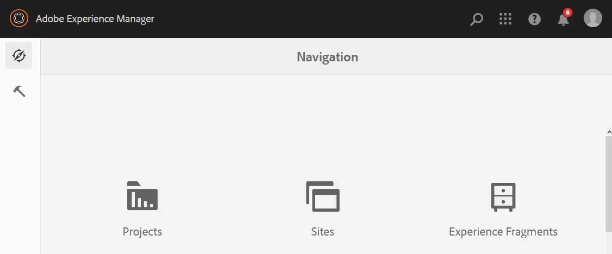

<!--
Original scope of this article for Core Assets for all a11y topics is around the following topics. This has changed since then but keeping this list of topics for posterity's sake.

* Convert the absolute doc links to relative links.
* Add an overview
* Compile a list of enhancements done in the last ~1 year.
* Top-level actions supported, such as clickable UI elements, keyboard shortcuts, popup dialogs, etc.)
* Specific user tasks supported, such as, download assets, datepicker, editing metadata, etc.
* Support matrix of user tasks with browsers and screen readers + OSes combinations
* Exceptions that users should be aware of.
* CTA – what is next and more info from AEM team:
  * Link to ACRs on a.com.
  * Generic a11y info by Adobe to begin with.
  * Examples of other a11y DX Docs from Elle.
  * Link to a11y-specific channels to report issues, seek support, or request enhancements, if any. Available info from Elle.
-->

# Accessibility in [!DNL Adobe Experience Manager Assets] as a Cloud Service {#accessibility-in-aem-assets}

[!DNL Adobe Experience Manager] permite a los creadores y editores de contenido ofrecer experiencias increíbles en la web. El Adobe se esfuerza por incluir a los creadores discapacitados mejorando la accesibilidad de [!DNL Experience Manager]. El software se mejora continuamente para satisfacer las necesidades de todos los tipos de usuarios y cumplir con los estándares mundiales que incluyen personas con discapacidades visuales, auditivas, de movilidad u otras discapacidades.

[!DNL Experience Manager] publica información de conformidad que describe los estándares a los que se adhiere, describe las características de accesibilidad del producto y describe el nivel de cumplimiento. Estos informes de conformidad de accesibilidad ayudan a [!DNL Experience Manager] los usuarios a comprender el alcance de la adherencia. Las mejoras realizadas en [!DNL Assets] permiten a todos los usuarios utilizar fácilmente las interfaces mediante el teclado, el lector de pantalla, los ampliadores y otra tecnología de asistencia.

[!DNL Experience Manager] proporciona distintos niveles de soporte para los siguientes estándares:

* [Directrices de accesibilidad del contenido web (WCAG) 2.1](https://www.w3.org/TR/WCAG/).
* [Se revisó el artículo 508 de la Ley](https://www.access-board.gov/guidelines-and-standards/communications-and-it/about-the-ict-refresh/final-rule/text-of-the-standards-and-guidelines)de rehabilitación.
* [Iniciativa de Accesibilidad - Aplicaciones de Internet enriquecidas y accesibles (WAI-ARIA) por W3C](https://www.w3.org/WAI/standards-guidelines/aria/).
* [ES 301 549](https://en.wikipedia.org/wiki/EN_301_549).

Para acceder al informe que detalla los niveles de cumplimiento, consulte la página Informes [de conformidad de](https://www.adobe.com/accessibility/compliance.html) accesibilidad (ACR) para todas las soluciones de Adobe.

## Tecnologías de asistencia {#at-support}

Los usuarios con discapacidades suelen utilizar hardware y software para acceder al contenido web. Estas herramientas se conocen como tecnologías de asistencia. [!DNL Experience Manager Assets] Puede trabajar con los siguientes tipos de tecnologías de asistencia (AT) al utilizar las funciones principales del software:

* Lectores de pantalla y ampliador de pantalla.
* Software de reconocimiento de voz.
* Uso del teclado: navegación y accesos directos.
* Hardware de asistencia, incluidos los controles del conmutador, pantallas Braille actualizables y otros dispositivos de entrada de equipos.
* Herramientas de ampliación de la interfaz de usuario.

## [!DNL Experience Manager Assets] casos de uso accesibles {#accessible-assets-use-cases}

En [!DNL Experience Manager]concreto, las funciones de accesibilidad satisfacen dos requisitos clave de [!DNL Experience Manager] los usuarios y sus clientes.

Para los diseñadores y creadores de contenido, existen funciones para crear y publicar contenido accesible que sus clientes y visitantes de sitios web utilizan a su vez. El contenido puede ser utilizado por personas con discapacidades con la ayuda de tecnologías de asistencia. Para obtener más información, consulte las directrices [de accesibilidad](/help/onboarding/accessibility/web-accessibility.md)web.

Además, [!DNL Experience Manager] permite a los usuarios y administradores con discapacidades acceder a la interfaz de usuario y a los controles para crear y administrar contenido. Las personas con discapacidades pueden utilizar tecnologías de asistencia para navegar, utilizar y administrar la [!DNL Assets] capacidad.

Las funciones principales de [!DNL Assets] son más accesibles que antes y se actualizan periódicamente para mejorar el cumplimiento de las normas mundiales. Las operaciones de CRUD en Assets tienen cierto grado de accesibilidad incorporada en ellas. Se puede acceder a flujos de trabajo DAM como agregar, administrar, buscar y distribuir recursos con la ayuda de métodos abreviados de teclado, texto del lector de pantalla, contraste de color, etc.

## Compatibilidad con el uso del teclado {#keyboard-use}

Muchos elementos de la interfaz de usuario en los que se puede hacer clic o en los que se puede realizar una acción con un puntero también se pueden utilizar con el teclado. Con un teclado, los usuarios pueden centrarse en los elementos de la interfaz de usuario y realizar una acción adecuada. Los usuarios pueden utilizar directamente los métodos abreviados de teclado para activar un comando o una acción sin tener que centrarse en los elementos de la interfaz de usuario y activarlos con el teclado. Por ejemplo, los usuarios pueden abrir la línea de tiempo de un recurso en el lado izquierdo navegando hasta el control de la interfaz de usuario mediante un teclado, pulsando `Return` y `Alt + 2` el método abreviado de teclado.

<!-- TBD items:

* The button/menu to toggle between list view and card view exposes relevant info to the screen readers. What about column view option? This info can go into ‘basic handling’ info aka article to ‘understand and use the workspace’.
* How to open and browse through the profile popup dialog in [!DNL Experience Manager] UI using a keyboard? The navigation does not match the order of visual display of options on the UI. This info can go into ‘basic handling’ info aka article to ‘understand and use the workspace’. What about setting preferences and impersonating a user?
* Using the [!DNL Experience Manager] tag browser and operating the buttons like delete tag? This info can go into ‘basic handling’ info aka article to ‘understand and use the workspace’.
* Read-only form fields can be focused with the keyboard. Can users tab to these fields to understand the contents and are they able to copy text from the fields?
-->

### Métodos abreviados de teclado en Recursos {#keyboard-shortcuts}

Las siguientes acciones en Recursos funcionan con los métodos abreviados de teclado enumerados. La mayoría de los métodos abreviados de teclado que se aplican a las [!DNL Experience Manager] consolas también se aplican a los recursos. See [keyboard shortcuts for Consoles](/help/sites-cloud/authoring/getting-started/keyboard-shortcuts.md). Consulte cómo [habilitar o deshabilitar los métodos abreviados](/help/sites-cloud/authoring/getting-started/keyboard-shortcuts.md)de teclado.

| Interfaz de usuario o escenario | Método abreviado de teclado | Acción |
|---|---|---|
| Vista de columnas en la interfaz de usuario de Recursos | Teclas de flecha arriba y abajo | Navegue a archivos y carpetas dentro de la misma jerarquía. |
| Vista de columnas en la interfaz de usuario de Recursos | Teclas de flecha izquierda y derecha | Vaya a los archivos y carpetas situados encima o debajo de la carpeta actual. |
| Exploración de carpetas en Recursos | `/` | Invocar la búsqueda abriendo el cuadro Omnisearch. |
| Consola de recursos | ` | Conmutar raíles laterales |
| Consola de recursos | `Alt + 1` | Abra el árbol de contenido. |
| Consola de recursos | `Alt + 2` | Abra el carril izquierdo [!UICONTROL de navegación] . |
| Consola de recursos | `Alt + 3` | Mostrar [!UICONTROL cronología] de un recurso seleccionado. |
| Consola de recursos | `Alt + 4` | Abra las referencias de Live Copy del recurso seleccionado. |
| Consola de recursos | `Alt + 5` | Invocar la búsqueda dentro de la carpeta seleccionada. |
| El recurso o la carpeta están seleccionados | Retroceso | Elimine el recurso o la carpeta seleccionados. |
| El recurso o la carpeta están seleccionados | `p` | Abra la página Propiedades del recurso seleccionado. |
| El recurso o la carpeta están seleccionados | `e` | Edite el recurso seleccionado. |
| El recurso o la carpeta están seleccionados | `m` | Mueva el recurso seleccionado. |
| El recurso o la carpeta están seleccionados | `Ctrl + c` | Copie el recurso seleccionado. |
| El recurso o la carpeta están seleccionados | `Esc` | Anule la selección. |
| Se abre el cuadro de diálogo y está en el foco | `Esc` | Cerrar. |
| Dentro de una carpeta en DAM | `Ctrl + v` | Pegue el recurso copiado. |
| Consola de recursos | `Ctrl + A` | Seleccione todos los recursos. |
| Páginas de propiedades de recursos | `Ctrl + S` | Guarde los cambios. |
| Consola de recursos | `?` | Consulte una lista de métodos abreviados de teclado. |

## Inicio de sesión y navegación por la interfaz [!DNL Assets] de usuario {#login}

Los usuarios pueden utilizar el teclado para desplazarse hasta el campo de inicio de sesión y rellenarlo para iniciar sesión. Los mensajes de error debido a combinaciones incorrectas de nombre de usuario y contraseña en la página de inicio de sesión son anunciados por los lectores de pantalla cada vez que se produce el error.

Después de iniciar sesión, los usuarios de DAM pueden navegar por la interfaz de [!DNL Assets] usuario mediante el teclado. Los elementos de la interfaz de usuario, como el carril izquierdo, los menús, el perfil del usuario, la barra de búsqueda, los archivos y las carpetas, y la configuración y la administración se pueden navegar mediante el teclado. El orden de navegación del teclado es de izquierda a derecha y de arriba abajo. Cuando se navega con un teclado, una opción procesable cuando se selecciona se resalta con un mejor contraste de color y es narrada por un lector de pantalla. Cuando corresponde, un lector de pantalla anuncia el estado (por ejemplo, expandido, contraído y estado mixto) de las opciones centradas en el menú. Además, un lector de pantalla anuncia el propósito de la opción procesable, en lugar de indicar el aspecto o la ubicación de la interfaz de usuario.

Si un usuario expande la opción de ayuda o perfil del usuario desde el menú, el lector de pantalla anunciará la opción o el estado correspondientes. Si un usuario expande la opción de perfil de usuario, las opciones disponibles se pueden seleccionar con un teclado. Por ejemplo, un administrador puede hacerse pasar por otro usuario. Si un usuario busca una cadena desde la opción [!UICONTROL Ayuda] , un narrador anuncia &#39;Búsqueda de ayuda&#39; para indicar que se está realizando una búsqueda.

<!-- TBD: Removing for now. Add a more informative video later. Host it on tv.adobe

*Figure: Navigating through the options at the top of Experience Manager user interface using `Tab` key.*
-->

## Examinar los recursos existentes y la información relacionada con la vista {#browse}

En la interfaz de usuario, los usuarios pueden utilizar el teclado para explorar la lista de recursos digitales existentes en el repositorio de DAM, realizar la previsualización o descarga de un recurso, ver las representaciones generadas, cambiar de vista, ver las representaciones generadas, ver la línea de tiempo y el historial de versiones, ver comentarios y referencias, y vista y administración de metadatos. [!DNL Assets]

<!-- TBD: Not sure about the following list items mean:

In Experience Manager header section, when navigating in browse mode, screen reader now announces,
  
  * Suggestions to search in Omnisearch.
  * The state as expanded or collapsed for Solutions, Help, Inbox and User options.
  * The Searching Help status message that is displayed when user enters a search string in Search for Help field under Help option
  * The error message if incorrect value is entered in Impersonate as field under User option and focus correctly moves to the text field (NPR-33804).

Review CQ-4282133 before adding - Close button in a coral-dialog wasn't accessible through keyboard, due to which user cannot trigger close button through keyboard press in version preview dialog. After fix, user can close dialog through close button using keyboard.

* CQ-4273122 - Assets of video/audio type will have aria-label in format "Multimedia player: <Title>" so users relying on screen-reader will get to know that they are video/audio assets.
-->

Al explorar el repositorio de recursos, la siguiente funcionalidad mejora la accesibilidad:

* El lector de pantalla anuncia alternativas de texto que ilustran el propósito o la funcionalidad de los iconos en lugar de sus nombres.
* Los usuarios pueden acceder a las opciones interactivas de la interfaz de usuario y centrarlas en la lista Referencias de los recursos con las teclas del teclado.
* Los elementos de cada fila de la vista de lista son anunciados como los elementos de la misma fila por los lectores de pantalla.
* El enfoque del usuario al navegar con `Tab` la tecla puede moverse a la opción de cierre en la previsualización de la versión.
* Cuando se utiliza el teclado para examinar, las opciones de interfaz de usuario activables resaltadas tienen un enfoque visual más prominente con un contraste mejorado. Hace que el área enfocada sea más identificable para el usuario.
* El uso de la `Esc` tecla para eliminar los iconos de acción rápida de la vista de miniaturas no elimina el enfoque del teclado del último elemento seleccionado.
* Con un recurso seleccionado, al pulsar `Alt + 4` el método abreviado de teclado se abre la lista [!UICONTROL Referencias] en el carril izquierdo. Con `Tab` la tecla , los usuarios pueden navegar por las entradas de referencia que no sean cero. Al navegar únicamente por las entradas de referencia que no son cero, también se ahorra esfuerzo y pulsaciones de teclas.
* Los comentarios de un recurso están disponibles en la línea de tiempo del recurso. Se puede acceder a ella si se accede al carril izquierdo mediante un teclado o un método abreviado de teclado.
* [!UICONTROL Se puede acceder a la configuración] de vista en [!DNL Experience Manager] mediante un teclado. Los usuarios pueden navegar por los tamaños de tarjeta disponibles mediante las teclas de flecha y seleccionar y desplazarse por las fichas para navegar y establecer otros elementos en la vista de configuración de Vista existente.

<!-- TBD: Gradually,  as more enhancements are done in these categories, add more content.

## Add and upload digital assets {#upload}

## Configure and administer [!DNL Assets] {#config-admin}

* List the a11y fixes in workflows to configure and administer [!DNL Experience Manager Assets]?
* Some enhancements in Processing profiles creation or application to a folder?
* Some enhancements to metadata properties UI?
-->

## Administre recursos digitales {#manage-assets}

Muchas tareas de administración de recursos, como las operaciones de CRUD, la descarga de recursos y la adición de metadatos, son accesibles en diversos grados. Assets permite realizar las tareas mediante diversas tecnologías de asistencia, especialmente un lector de pantalla y un teclado.

Vea una demostración en vídeo de cómo utilizar un teclado para [examinar el repositorio y descargar un recurso](https://youtu.be/K3dgqMRQJys).

Para las operaciones de metadatos que normalmente realizan funciones como los especialistas en marketing y los administradores, las siguientes funciones mejoran la accesibilidad:

* [!UICONTROL Ahora se puede acceder a la opción Guardar y cerrar] de la página Propiedades del recurso mediante el teclado.
* Los lectores de pantalla anuncian las opciones para eliminar las etiquetas seleccionadas en la ficha Básico de los botones Propiedades del recurso para eliminar las etiquetas seleccionadas.
* El cuadro de diálogo emergente Selector de fecha se puede utilizar con un teclado. El elemento de interfaz de usuario del selector de datos se utiliza para establecer tiempos de activación y tiempos de inactividad.
* La funcionalidad de arrastrar mediante el teclado funciona correctamente en el Editor de Esquemas de metadatos en el modo de exploración del lector de pantalla.
* Un usuario puede mover el enfoque mediante el teclado al campo Añadir usuario o grupo en Grupo cerrado de usuarios en la ficha Permisos de Propiedades de la carpeta.

## Buscar recursos digitales {#search-assets}

Una experiencia de búsqueda de recursos rápida y fluida aumenta la velocidad de contenido. Los casos de uso de velocidad de contenido son parte de la funcionalidad principal [!DNL Assets] . Para realizar el inicio de una búsqueda desde la barra de Omniture, los usuarios pueden utilizar la combinación de teclas `/` o utilizar junto `Tab` con los lectores de pantalla para localizar rápidamente la opción de búsqueda. El lector de pantalla narra el nombre de la opción como Botón [!UICONTROL de] búsqueda cuando el enfoque está en la opción búsqueda de opciones de búsqueda. Los usuarios pueden presionar `Return` para abrir el cuadro Omniture Search. El lector de pantalla no sólo narra la palabra clave escrita en el cuadro de búsqueda, sino que también narra las sugerencias ofrecidas por [!DNL Experience Manager Assets]. Los usuarios pueden utilizar una combinación de teclas de flecha `Return`, y `Tab` acceder a las distintas opciones para activar una búsqueda.

La funcionalidad de búsqueda se hace más accesible gracias a las siguientes funciones:

* El título de la página, según esté disponible para un lector de pantalla, ayuda a identificar la página como página de búsqueda de recursos.
* Los usuarios buscan recursos desde la barra de Omniture. Utilice las teclas del teclado o la combinación de teclas `/` para acceder a la barra de Omniture.
* Inicio escribiendo la palabra clave de búsqueda y utilice el teclado para seleccionar las sugerencias automáticas. Pulse la tecla Retorno para aceptar una cadena sugerida automáticamente y buscar recursos para ella.
* Los lectores de pantalla pueden identificar y anunciar las casillas de verificación de estado mixto (en las que, a menos que se seleccionen todos los predicados anidados, las casillas de verificación de primer nivel no se seleccionan y se rompen) en el panel Filtros al filtrar los resultados de búsqueda.
* El enfoque del usuario pasa a las opciones de búsqueda después de que se cierre el cuadro de búsqueda de Omniture.

Al filtrar los resultados de búsqueda:

* La página de resultados de la búsqueda tiene un título informativo para comprender mejor a los usuarios del lector de pantalla.
* Un lector de pantalla anuncia las opciones del filtro de búsqueda como acordeones ampliables.
* Los lectores de pantalla anuncian los predicados con botones de estado mixto.

## Compartir recursos {#share-assets}

<!-- TBD: Anything about accessibility in DA, BP? AAL team confirmed there's no content.
-->

Al compartir recursos, las siguientes funciones mejoran la accesibilidad:

* Un usuario puede mover el enfoque mediante el teclado en el campo Buscar y Añadir dirección de correo electrónico del cuadro de diálogo de uso compartido de vínculos.

* En el cuadro de diálogo de uso compartido de vínculos, al navegar en el modo Examinar, los lectores de pantalla,

   * No anote la información de la tabla en cuanto se cargue el cuadro de diálogo.
   * Puede navegar a todas las sugerencias de la lista.
   * Narre las sugerencias que se muestran para Añadir la dirección de correo electrónico y los campos de búsqueda.

<!-- TBD: With more info from the DM team. A few Sev1 issues are fixed and if those are shipped, then mention those here.

## Accessibility in [!DNL Dynamic Media] {#dynamic-media-accessibility}

When using Dynamic Media, the following functionality helps make it accessible:

* A user can focus to `Flyout`, `InlineZoom`, `Shoppable_Banner`, `Zoom_dark`, `Zoom_light`, `ZoomVertical_dark`, and `ZoomVertical_light` options using `Tab` key in asset details Viewers in [!DNL Dynamic Media].
-->

## Documentación accesible {#accessible-docs}

[!DNL Experience Manager] proporciona documentación accesible que puede ser consumida por personas con discapacidades. Lo siguiente ayuda a hacer accesible la oferta de contenido por ahora, mientras que Adobe sigue mejorando la plantilla y el contenido:

* Los lectores de pantalla pueden leer el texto.
* Las imágenes y las ilustraciones tienen texto alternativo disponible.
* Se puede navegar con el teclado.
* Las tasas de contraste ayudan a resaltar algunas partes del sitio web de documentación.

<!-- 
## More resources for accessibility {#a11y-resources}

TBD: If anyone is aware of AEM-specific resources that help users leverage any accessibility features or use any assistive technology with AEM, please share a reference with asgupta@adobe.com.
-->

>[!MORELIKETHIS]
>
>* [Notas de la versión de las mejoras específicas realizadas en cada versión](/help/release-notes/release-notes-cloud/release-notes-current.md)individual.
>* [AEM guía](/help/onboarding/accessibility/web-accessibility.md)de accesibilidad.
>* [Informes de conformidad para soluciones](https://www.adobe.com/accessibility/compliance.html)de Adobe.

