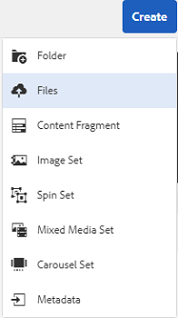
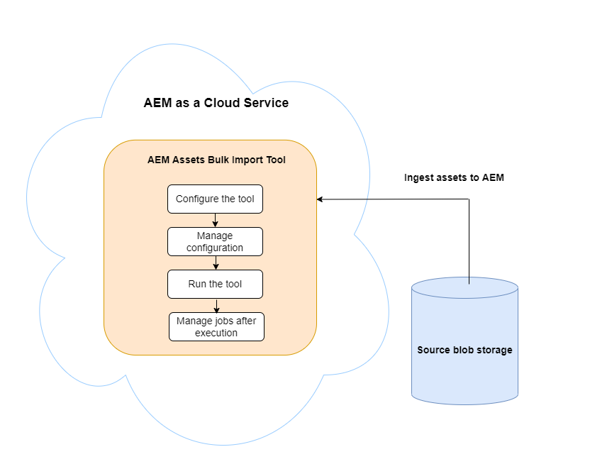
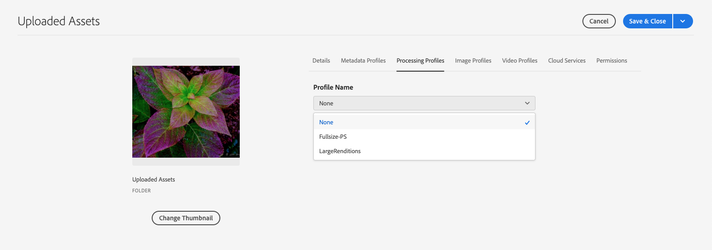

# Agregar recursos digitales a [!DNL Adobe Experience Manager] como [!DNL Cloud Service] [!DNL Assets] {#add-assets-to-experience-manager}

[!DNL Adobe Experience Manager Assets] acepta muchos tipos de recursos digitales de muchos orígenes. Almacena los binarios y las representaciones creadas. Puede realizar el procesamiento de recursos mediante varios flujos de trabajo y [!DNL Adobe AI] servicios, lo que permite la distribución a través de muchos canales en muchas superficies.

[!DNL Adobe Experience Manager] enriquece el contenido binario de los archivos digitales cargados con metadatos enriquecidos, etiquetas inteligentes, representaciones y otros servicios de administración de recursos digitales (DAM). Puede cargar varios tipos de archivos, como imágenes, documentos y archivos de imagen sin procesar, desde la carpeta local o desde una unidad de red a [!DNL Experience Manager Assets].

Además de la carga del explorador más utilizada, existen otros métodos para agregar recursos al repositorio [!DNL Experience Manager]. Estos otros métodos incluyen clientes de escritorio, como Adobe Asset Link o la aplicación de escritorio [!DNL Experience Manager], secuencias de comandos de carga e ingesta que los clientes crearían y integraciones de ingesta automatizadas agregadas como extensiones [!DNL Experience Manager].

Aunque puede cargar y administrar cualquier archivo binario en [!DNL Experience Manager], los formatos de archivo más utilizados son compatibles con servicios adicionales, como la extracción de metadatos o la generación de previsualización/representación. Consulte [formatos de archivo compatibles](file-format-support.md) para obtener más información.

También puede solicitar que se realice un procesamiento adicional de los recursos cargados. Se pueden configurar varios perfiles de procesamiento de recursos en la carpeta, en la que se cargan los recursos, para agregar metadatos, representaciones o servicios de procesamiento de imágenes específicos. Ver [recursos de proceso al cargar](#process-when-uploaded).

[!DNL Assets] proporciona los siguientes métodos de carga. Adobe recomienda que entienda su caso de uso y la aplicabilidad de una opción de carga antes de utilizarla.

| Método de carga | ¿Cuándo usar? | Persona principal |
|---------------------|----------------|-----------------|
| [Interfaz de usuario de la consola Assets](#upload-assets) | Carga ocasional, facilidad para presionar y arrastrar, carga del buscador. No utilice para cargar muchos recursos. | Todos los usuarios |
| [Cargar API](#upload-using-apis) | Para las decisiones dinámicas durante la carga. | Desarrollador |
| Aplicación de escritorio de [[!DNL Experience Manager]  &#x200B;](https://experienceleague.adobe.com/docs/experience-manager-desktop-app/using/using.html?lang=es) | Ingesta de recursos de bajo volumen, pero no para la migración. | Administrador, Especialista en marketing |
| [[!DNL Adobe Asset Link]](https://helpx.adobe.com/es/enterprise/using/adobe-asset-link.html?lang=es) | Resulta útil cuando los creativos y los especialistas en marketing trabajan en recursos desde las aplicaciones de escritorio de [!DNL Creative Cloud] admitidas. | Creative, experto en marketing |
| [Ingestor masivo de recursos](#asset-bulk-ingestor) | Recomendado para migraciones a gran escala e ingestas masivas ocasionales. Solo para almacenes de datos compatibles. | Administrador, Desarrollador |

## Carga de activos {#upload-assets}

<!-- #ENGCHECK do we support pausing? I couldn't get pause to show with 1.5GB upload.... If not, this should be removed#

   You can pause the uploading of large assets (greater than 500 MB) and resume it later from the same page. Select the **[!UICONTROL Pause]** icon beside progress bar that appears when an upload starts.

   The size above which an asset is considered a large asset is configurable. For example, you can configure the system to consider assets above 1000 MB (instead of 500 MB) as large assets. In this case, **[!UICONTROL Pause]** appears on the progress bar when assets of size greater than 1000 MB are uploaded.

   The [!UICONTROL Pause] option does not show if a file greater than 1000 MB is uploaded with a file less than 1000 MB. However, if you cancel the less than 1000 MB file upload, the **[!UICONTROL Pause]** option appears.

   To modify the size limit, configure the `chunkUploadMinFileSize` property of the `fileupload` node in the CRX repository.

   When you click the **[!UICONTROL Pause]** icon, it toggles to a **[!UICONTROL Play]** icon. To resume uploading, click **[!UICONTROL Play]** option.
-->

<!-- #ENGCHECK do we support pausing? I couldn't get pause to show with 1.5GB upload.... If not, this should be removed#
   The ability to resume uploading is especially helpful in low-bandwidth scenarios and network glitches, where it takes a long time to upload a large asset. You can pause the upload operation and continue later when the situation improves. When you resume, uploading starts from the point where you paused it.
-->

<!-- #ENGCHECK assuming this is not relevant? remove after confirming#
   During the upload operation, [!DNL Experience Manager] saves the portions of the asset being uploaded as chunks of data in the CRX repository. When the upload completes, [!DNL Experience Manager] consolidates these chunks into a single block of data in the repository.

   To configure the cleanup task for the unfinished chunk upload jobs, go to `https://[aem_server]:[port]/system/console/configMgr/org.apache.sling.servlets.post.impl.helper.ChunkCleanUpTask`.
-->

Para cargar un archivo (o varios archivos), puede seleccionarlos en el escritorio y arrastrarlos en la interfaz de usuario (explorador web) a la carpeta de destino. También puede iniciar la carga desde la interfaz de usuario de.

>[!IMPORTANT]
>
>Assets que cargue en Experience Manager y que tenga un nombre de archivo de más de 100 caracteres tendrá un nombre abreviado cuando se utilice en Dynamic Media.
>
>Los 100 primeros caracteres del nombre de archivo se utilizan tal cual; los caracteres restantes se sustituyen por una cadena alfanumérica. Este método de cambio de nombre garantiza un nombre único cuando el recurso se utiliza en Dynamic Media. También está diseñado para dar cabida a la longitud máxima de nombre de archivo de recursos permitida en Dynamic Media.


1. En la interfaz de usuario [!DNL Assets], vaya a la ubicación donde desee agregar recursos digitales.
1. Para cargar los recursos, realice una de las siguientes acciones:

   * En la barra de herramientas, haga clic en **[!UICONTROL Crear]** > **[!UICONTROL Archivos]**. Puede cambiar el nombre del archivo en el cuadro de diálogo presentado si es necesario.
   * En un explorador que admita HTML5, arrastre los recursos directamente a la interfaz de usuario [!DNL Assets]. No se muestra el cuadro de diálogo para cambiar el nombre del archivo.

   

   Para seleccionar varios archivos, seleccione la clave `Ctrl` o `Command` y seleccione los recursos en el cuadro de diálogo del selector de archivos. Al utilizar una iPad, solo puede seleccionar un archivo a la vez.

1. Para cancelar una carga en curso, haga clic en Cerrar (`X`) junto a la barra de progreso. Al cancelar la operación de carga, [!DNL Assets] elimina la parte del recurso que se ha cargado parcialmente.
Si cancela una operación de carga antes de que se carguen los archivos, [!DNL Assets] detiene la carga del archivo actual y actualiza el contenido. Sin embargo, los archivos que ya se han cargado no se eliminan.

1. El cuadro de diálogo de progreso de carga en [!DNL Assets] muestra el recuento de archivos cargados correctamente y los archivos que no se cargaron.
Además, la interfaz de usuario [!DNL Assets] muestra el recurso más reciente que ha cargado o la carpeta que creó en primer lugar.

>[!NOTE]
>
>Para cargar jerarquías de carpetas anidadas, consulte [cargar recursos en lotes](#bulk-upload).

<!-- #ENGCHECK I'm assuming this is no longer relevant.... If yes, this should be removed#

### Serial uploads {#serialuploads}

Uploading numerous assets in bulk consumes significant I/O resources, which may adversely impact the performance of [!DNL Assets]. In particular, if you have a slow internet connection, the time to upload drastically increases due to a spike in disk I/O. Moreover, your web browser may introduce additional restrictions to the number of POST requests [!DNL Assets] can handle for concurrent asset uploads. As a result, the upload operation fails or terminate prematurely. In other words, [!DNL Assets] may miss some files while ingesting a bunch of files or altogether fail to ingest any file.

To overcome this situation, [!DNL Assets] ingests one asset at a time (serial upload) during a bulk upload operation, instead of the concurrently ingesting all the assets.

Serial uploading of assets is enabled by default. To disable the feature and allow concurrent uploading, overlay the `fileupload` node in CRX-DE and set the value of the `parallelUploads` property to `true`.

### Streamed uploads {#streamed-uploads}

If you upload many assets to [!DNL Experience Manager], the I/O requests to server increase drastically, which reduces the upload efficiency and can even cause some upload task to time out. [!DNL Assets] supports streamed uploading of assets. Streamed uploading reduces the disk I/O during the upload operation by avoiding asset storage in a temporary folder on the server before copying it to the repository. Instead, the data is transferred directly to the repository. This way, the time to upload large assets and the possibility of timeouts is reduced. Streamed upload is enabled by default in [!DNL Assets].

>[!NOTE]
>
>Streaming upload is disabled for [!DNL Experience Manager] running on JEE server with servlet-api version lower than 3.1.
-->

### Gestión de cargas para recursos existentes {#handling-upload-existing-file}

Puede cargar un recurso con la misma ruta (el mismo nombre y la misma ubicación) que un recurso existente. Sin embargo, se muestra un cuadro de diálogo de advertencia con las siguientes opciones:

* Reemplazar recurso existente: si reemplaza un recurso existente, se eliminarán los metadatos del recurso y cualquier modificación anterior (por ejemplo, anotaciones y recortes) que haya realizado en el recurso existente.

  >[!NOTE]
  >
  >La opción para reemplazar recursos no está disponible si el recurso está bloqueado o desprotegido.

* Crear otra versión: Se crea una nueva versión del recurso existente en el repositorio. Puede ver las dos versiones en la [!UICONTROL cronología] y puede revertir a la versión existente si es necesario.
* Mantener ambos: si decide conservar ambos recursos, se cambiará el nombre del nuevo recurso.

Para conservar el recurso duplicado en [!DNL Assets], haga clic en **[!UICONTROL Conservar]**. Para eliminar el recurso duplicado que subió, haga clic en **[!UICONTROL Eliminar]**.

### Administración de nombres de archivo y caracteres prohibidos {#filename-handling}

[!DNL Experience Manager Assets] evita que cargue recursos con los caracteres prohibidos en sus nombres de archivo. Si intenta cargar un recurso con nombres de archivo que contengan un carácter no permitido o más, [!DNL Assets] muestra un mensaje de advertencia y detiene la carga hasta que elimine estos caracteres o realice la carga con un nombre permitido.

Para adaptarse a convenciones específicas de nomenclatura de archivos para su organización, el cuadro de diálogo [!UICONTROL Cargar Assets] le permite especificar nombres largos para los archivos que carga. No se admiten los siguientes caracteres (lista de caracteres separados por espacios):

* Caracteres no válidos para el nombre del recurso: `* / : [ \\ ] | # % { } ? &`
* Caracteres no válidos para el nombre de la carpeta de recursos: `* / : [ \\ ] | # % { } ? \" . ^ ; + & \t`

## Carga masiva de recursos {#bulk-upload}

El ingestor masivo de recursos puede gestionar muchos recursos de forma eficaz. Sin embargo, una ingesta a gran escala no es solo un volcado de archivos amplio o una migración casual. Para que una ingesta a gran escala sea un proyecto significativo que sirva a su propósito comercial y que sea eficiente, planifique la migración y depure la organización de recursos. Todas las ingestas son diferentes, por lo que, en lugar de generalizar, tiene en cuenta la composición del repositorio con matices y las necesidades comerciales. A continuación se ofrecen algunas sugerencias generales para planificar y ejecutar una ingesta masiva:

* Depurar recursos: elimine los recursos que no sean necesarios en DAM. Considere la posibilidad de eliminar los recursos no utilizados, obsoletos o duplicados. Este mantenimiento reduce los datos transferidos y los activos ingeridos, lo que conduce a ingestas más rápidas.
* Organizar recursos: considere la posibilidad de organizar el contenido en algún orden lógico, por ejemplo, por tamaño de archivo, formato de archivo, caso de uso o prioridad. En general, los archivos grandes y complejos requieren más procesamiento. También puede considerar la posibilidad de ingerir archivos grandes por separado mediante la opción de filtrado de tamaño de archivo (descrita a continuación).
* Escalonar las ingestas: considere la posibilidad de dividir la ingesta en varios proyectos de ingesta masiva. q le permite ver el contenido antes y actualizar la ingesta según sea necesario. Por ejemplo, puede ingerir recursos que requieran mucho procesamiento durante las horas de menor actividad o de forma gradual en varios fragmentos. Sin embargo, puede ingerir recursos más pequeños y sencillos que no requieran mucho procesamiento de una sola vez.

Para cargar un número mayor de archivos, utilice uno de los siguientes métodos. Vea también los [casos de uso y métodos](#upload-methods-comparison)

* [API de carga de recursos](developer-reference-material-apis.md#asset-upload): use un script de carga personalizado o una herramienta que use API para agregar administración adicional de recursos (por ejemplo, traducir metadatos o cambiar el nombre de archivos), si es necesario.
* [[!DNL Experience Manager] aplicación de escritorio](https://experienceleague.adobe.com/docs/experience-manager-desktop-app/using/using.html?lang=es): útil para los profesionales creativos y los especialistas en marketing que cargan recursos desde su sistema de archivos local. Utilícela para cargar carpetas anidadas disponibles localmente.
* [Herramienta de ingesta masiva](#asset-bulk-ingestor): Se utiliza para la ingesta de grandes cantidades de recursos de forma ocasional o inicial al implementar [!DNL Experience Manager].

### Herramienta Importación masiva de recursos {#asset-bulk-ingestor}

La herramienta solo se proporciona al grupo de administradores para que la utilice para la ingesta a gran escala de recursos de almacenes de datos de Azure o S3. Consulte un vídeo de introducción a la configuración y la ingesta.

>[!VIDEO](https://video.tv.adobe.com/v/341381/?captions=spa&quality=12&learn=on)

La siguiente imagen ilustra las distintas etapas de la ingesta de recursos en Experience Manager desde un almacén de datos:



**Requisitos previos**

Se requiere una cuenta de almacenamiento externa o un contenedor de Azure o AWS para utilizar esta función.

>[!NOTE]
>
>Cree el contenedor o el contenedor de la cuenta de almacenamiento como privado y acepte conexiones solo desde solicitudes autorizadas. Sin embargo, no se admiten restricciones adicionales en las conexiones de red de entrada.

>[!NOTE]
>
>Las cuentas de almacenamiento externo pueden tener reglas de nombre de archivo/carpeta diferentes a las de la herramienta Importación masiva. Consulte [Gestión de nombres de archivo durante la importación masiva](#filename-handling-bulkimport) para obtener más información sobre los nombres no permitidos o con escape.


### Configuración de la herramienta Importación masiva {#configure-bulk-ingestor-tool}

Para configurar la herramienta Importación masiva, siga estos pasos:

1. Vaya a **[!UICONTROL Herramientas]** > **[!UICONTROL Assets]** > **[!UICONTROL Importación en lotes]**. Seleccione la opción **[!UICONTROL Crear]**.

1. Especifique un título para la configuración de importación masiva en el campo **[!UICONTROL Title]**.

1. Seleccione el tipo de fuente de datos de la lista desplegable **[!UICONTROL Importar Source]**.

1. Proporcione los valores para crear una conexión con el origen de datos. Por ejemplo, si selecciona **Azure Blob Storage** como origen de datos, especifique los valores de la cuenta de Azure Storage, el contenedor de Azure Blob y la clave de acceso de Azure.

1. Seleccione el modo de autenticación necesario en la lista desplegable. **Clave de acceso de Azure** proporciona acceso completo a la cuenta de almacenamiento de Azure, mientras que **Token SAS de Azure** permite al administrador limitar las capacidades del token mediante permisos y directivas de caducidad.

1. Proporcione el nombre de la carpeta raíz que contiene los recursos de la fuente de datos en el campo **[!UICONTROL Carpeta de origen]**.

1. (Opcional) Proporcione el tamaño mínimo de archivo de los recursos en MB para incluirlos en el proceso de ingesta en el campo **[!UICONTROL Filtrar por tamaño mínimo]**.

1. (Opcional) Proporcione el tamaño máximo de archivo de los recursos en MB para incluirlos en el proceso de ingesta en **[!UICONTROL Filtrar por tamaño máximo]**.

1. (Opcional) Especifique una lista de tipos MIME separados por comas que excluir de la ingesta en el campo **[!UICONTROL Excluir tipos MIME]**. Por ejemplo, `image/jpeg, image/.*, video/mp4`. Ver [todos los formatos de archivo compatibles](/help/assets/file-format-support.md).

1. Especifique la lista de tipos MIME separados por comas que se incluirán en la ingesta en el campo **[!UICONTROL Incluir tipos MIME]**. Ver [todos los formatos de archivo compatibles](/help/assets/file-format-support.md).

1. Seleccione la opción **[!UICONTROL Eliminar archivo de origen después de importar]** para eliminar los archivos originales del almacén de datos de origen después de importar los archivos en [!DNL Experience Manager].

1. Seleccione el **[!UICONTROL Modo de importación]**. Seleccione **Omitir**, **Reemplazar** o **Crear versión**. El modo de omisión es el predeterminado y, en este modo, el ingestor omite la importación de un recurso si ya existe. Ver el significado de [reemplazar y crear opciones de versión](#handling-upload-existing-file).

1. Especifique una ruta para definir una ubicación en DAM en la que se importarán los recursos mediante **[!UICONTROL Carpeta de destino de recursos]**. Por ejemplo, `/content/dam/imported_assets`.

1. (Opcional) Especifique el archivo de metadatos que desea importar, proporcionado en formato CSV, en el campo **[!UICONTROL Archivo de metadatos]**. Especifique el archivo CSV en la ubicación del blob de origen y consulte la ruta al configurar la herramienta Importación masiva. El formato de archivo CSV al que se hace referencia en este campo es el mismo que el formato de archivo CSV cuando [importa y exporta metadatos de recursos de forma masiva](https://experienceleague.adobe.com/docs/experience-manager-cloud-service/content/assets/admin/metadata-import-export.html?lang=es). Si selecciona la opción **Eliminar archivo de origen después de importar**, filtre los archivos CSV usando los campos **Excluir** o **Incluir tipo MIME** o **Filtrar por ruta/archivo**. Puede utilizar una expresión regular para filtrar los archivos CSV en estos campos.

1. Haga clic en **[!UICONTROL Guardar]** para guardar la configuración.

### Administrar la configuración de la herramienta Importación masiva {#manage-bulk-import-configuration}

Después de crear la configuración de la herramienta Importación masiva, puede realizar tareas para evaluar la configuración antes de la ingesta masiva de recursos en la instancia de Experience Manager. Para ver las opciones disponibles para administrar la configuración de la herramienta Importación masiva, seleccione la configuración disponible en **[!UICONTROL Herramientas]** > **[!UICONTROL Assets]** > **[!UICONTROL Importación masiva]**.

### Editar la configuración {#edit-configuration}

Para editar los detalles de configuración, selecciónela y haga clic en **[!UICONTROL Editar]**. No se puede editar el título de la configuración y el origen de datos de importación mientras se realiza la operación de edición.

### Eliminar la configuración {#delete-configuration}

Seleccione la configuración y haga clic en **[!UICONTROL Eliminar]** para eliminar la configuración de importación masiva.

### Validar la conexión con el origen de datos {#validate-connection}

Para validar la conexión con el origen de datos, seleccione la configuración y haga clic en **[!UICONTROL comprobar]**. Si la conexión se realiza correctamente, Experience Manager muestra el siguiente mensaje:


### Invocar una ejecución de prueba para el trabajo de importación masiva {#invoke-test-run-bulk-import}

Seleccione la configuración y haga clic en **[!UICONTROL Ejecución en seco]** para invocar una ejecución de prueba para el trabajo de importación en lotes. Experience Manager muestra los siguientes detalles sobre el trabajo de importación masiva:


### Uso de nombres de archivo durante la importación masiva {#filename-handling-bulkimport}

Al importar recursos o carpetas de forma masiva, [!DNL Experience Manager Assets] importa toda la estructura existente en el origen de importación. [!DNL Experience Manager] sigue las reglas integradas en cuanto a los caracteres especiales en los nombres de recursos y carpetas, por lo que estos nombres de archivo necesitan limpiarse. Tanto para el nombre de la carpeta como para el nombre del recurso, el título definido por el usuario permanece sin cambios y se almacena en `jcr:title`.

Durante la importación masiva, [!DNL Experience Manager] busque las carpetas existentes para evitar volver a importar los recursos y las carpetas, y compruebe también las reglas de limpieza aplicadas en la carpeta principal en la que se realiza la importación. Si las reglas de limpieza se aplican en la carpeta principal, se aplicarán las mismas reglas al origen de importación. Para la nueva importación, se aplican las siguientes reglas de limpieza para administrar los nombres de archivo de los recursos y las carpetas.

**Nombres no permitidos en la importación masiva**

No se permiten los siguientes caracteres en los nombres de archivo y carpeta:

* Caracteres de control y uso privado (0x00 a 0x1F, \u0081, \uE000)
* Los nombres de archivo o carpeta terminan con un punto (.)

Los archivos o carpetas con nombres que coincidan con estas condiciones se omitirán durante el proceso de importación y se marcarán como erróneos.

**Gestión del nombre del recurso en la importación masiva**

Para los nombres de archivo de recursos, el nombre JCR y la ruta de acceso se sanean mediante la API: `JcrUtil.escapeIllegalJcrChars`.

* Los caracteres Unicode no cambian
* Reemplace los caracteres especiales por su código de escape de dirección URL, por ejemplo, `new%asset.png` se actualiza a `new%25asset.png`:

  ```
                  URL escape code   
  
  "               %22
  %               %25
  '               %27
  *               %2A
  /               %2F
  :               %3A
  [               %5B
  \n              %0A
  \r              %0D
  \t              %09
  ]               %5D
  |               %7C
  ```

**Gestión del nombre de carpeta en la importación masiva**

Para los nombres de archivo de la carpeta, el nombre JCR y la ruta de acceso se sanean mediante la API: `DamUtil.getSanitizedFolderName`.

* Los caracteres en mayúsculas se convierten en minúsculas
* Los caracteres Unicode no cambian
* Reemplace los caracteres especiales por un guión (&#39;-&#39;), por ejemplo, `new folder` se ha actualizado a `new-folder`:

  ```
  "                           
  #                         
  %                           
  &                          
  *                           
  +                          
  .                           
  :                           
  ;                          
  ?                          
  [                           
  ]                           
  ^                         
  {                         
  }                         
  |                           
  /         It is used for split folder in cloud storage and is pre-handled, no conversion here.
  \         Not allowed in Azure, allowed in AWS.
  \t
  space     It is the space character.
  ```

<!-- 
[!DNL Experience Manager Assets] manages the forbidden characters in the filenames while you upload assets or folders. [!DNL Experience Manager] updates only the node names in the DAM repository. However, the `title` of the asset or folder remains unchanged.

Following are the file naming conventions that are applied while uploading assets or folders in [!DNL Experience Manager Assets]:

| Characters &Dagger; | When occurring in file names | When occurring in folder names | Example |
|---|---|---|---|
| `. / : [ ] | *` | Replaced with `-` (hyphen). | Replaced with `-` (hyphen). A `.` (dot) in the filename extension is retained as is. | Replaced with `-` (hyphen). | `myimage.jpg` remains as is and `my.image.jpg` changes to `my-image.jpg`. |
| `% ; # , + ? ^ { } "` and whitespaces | Whitespaces are retained | Replaced with `-` (hyphen). | `My Folder.` changes to `my-folder-`. |
| `# % { } ? & .` | Replaced with `-` (hyphen). | NA. | `#My New File.` changes to `-My New File-`. |
| Uppercase characters | Casing is retained as is. | Changed to lowercase characters. | `My New Folder` changes to `my-new-folder`. |
| Lppercase characters | Casing is retained as is. | Casing is retained as is. | NA. |

&Dagger; The list of characters is a whitespace-separated list.
-->

#### Programar una importación masiva única o recurrente {#schedule-bulk-import}

Para programar una importación masiva única o recurrente, ejecute los siguientes pasos:

1. Cree una configuración de importación masiva.
1. Seleccione la configuración y seleccione **[!UICONTROL Programar]** en la barra de herramientas.
1. Establezca una ingesta única o programe una programación horaria, diaria o semanal. Haga clic en **[!UICONTROL Enviar]**.

   


#### Ver la carpeta de destino de Assets {#view-assets-target-folder}

Para ver la ubicación de destino de Assets donde se importan los recursos después de ejecutar el trabajo de importación masiva, seleccione la configuración y haga clic en **[!UICONTROL Ver Assets]**.

#### Ejecute la herramienta Importación masiva {#run-bulk-import-tool}

Después de [configurar la herramienta Importación masiva](#configure-bulk-ingestor-tool) y, opcionalmente, de [administrar la configuración de la herramienta Importación masiva](#manage-bulk-import-configuration), puede ejecutar el trabajo de configuración para iniciar la ingesta masiva de recursos.

Para iniciar el proceso de importación en lotes, vaya a **[!UICONTROL Herramientas]** > **[!UICONTROL Assets]** > **[!UICONTROL Importación en lotes]**, seleccione la [configuración de importación en lotes](#configure-bulk-ingestor-tool) y, a continuación, haga clic en **[!UICONTROL Ejecutar]**. Vuelva a hacer clic en **[!UICONTROL Ejecutar]** para confirmar.

Experience Manager actualiza el estado del trabajo a **Procesando** y a **Correcto** tras completar correctamente el trabajo. Para ver los recursos importados en Experience Manager, haga clic en **Ver Assets**.

Cuando el trabajo está en curso, también puede seleccionar la configuración y hacer clic en **Detener** para detener el proceso de ingesta masiva. Vuelva a hacer clic en **Ejecutar** para reanudar el proceso. También puede hacer clic en **Ejecución en seco** para conocer los detalles de los recursos que aún están pendientes de importación.

#### Administrar trabajos después de la ejecución {#manage-jobs-after-execution}

Experience Manager le permite ver el historial de los trabajos de importación masiva. El historial de trabajos incluye el estado del trabajo, el creador del trabajo, los registros y otros detalles, como la fecha y la hora de inicio, la fecha y la hora de creación y la fecha y la hora de finalización.

Para acceder al historial de trabajos de una configuración, seleccione la configuración y haga clic en **[!UICONTROL Historial de trabajos]**. Seleccione un trabajo y haga clic en **Abrir**.


Experience Manager muestra el historial de trabajos. En la página Historial de trabajos de importación masiva, también puede hacer clic en **Eliminar** para eliminar ese trabajo para la configuración de importación masiva.


## Carga de recursos mediante clientes de escritorio {#upload-assets-desktop-clients}

Además de la interfaz de usuario del explorador web, [!DNL Experience Manager] admite otros clientes en el escritorio. También proporcionan una experiencia de carga sin necesidad de ir al explorador web.

* [[!DNL Adobe Asset Link]](https://helpx.adobe.com/es/enterprise/using/adobe-asset-link.html?lang=es) proporciona acceso a los recursos de [!DNL Experience Manager] en las aplicaciones de escritorio de Adobe Photoshop, Adobe Illustrator y Adobe InDesign. Puede cargar el documento abierto actualmente en [!DNL Experience Manager] directamente desde la interfaz de usuario de Adobe Asset Link desde estas aplicaciones de escritorio.
* [[!DNL Experience Manager] aplicación de escritorio](https://experienceleague.adobe.com/docs/experience-manager-desktop-app/using/using.html?lang=es) simplifica el trabajo con recursos en el escritorio, independientemente del tipo de archivo o de la aplicación nativa que los administra. Es útil cargar archivos en jerarquías de carpetas anidadas desde el sistema de archivos local, ya que la carga desde el explorador solo permite cargar listas de archivos sin formato.

## Procesar recursos al cargarlos {#process-when-uploaded}

Para realizar un procesamiento adicional de los recursos cargados, puede aplicar perfiles de procesamiento en las carpetas de carga. Los perfiles están disponibles en la página **[!UICONTROL Propiedades]** de una carpeta en [!DNL Assets]. Un recurso digital sin una extensión o con una extensión incorrecta no se procesa como se desea. Por ejemplo, al cargar estos recursos, no ocurre nada o puede aplicarse un perfil de procesamiento incorrecto al recurso. Los usuarios aún pueden almacenar los archivos binarios en DAM.



Las pestañas disponibles son las siguientes:

* [Los perfiles de metadatos](metadata-profiles.md) le permiten aplicar propiedades de metadatos predeterminadas a los recursos cargados en esa carpeta.
* [Perfiles de procesamiento](asset-microservices-configure-and-use.md) le permiten generar más representaciones de las que son posibles de forma predeterminada.

Además, si [!DNL Dynamic Media] está habilitado en la implementación, están disponibles las siguientes pestañas:

* Los [[!DNL Dynamic Media] perfiles de imagen](dynamic-media/image-profiles.md) le permiten aplicar un recorte específico (**[!UICONTROL recorte inteligente]** y recorte de píxeles) y una configuración perfeccionada a los recursos cargados.
* [[!DNL Dynamic Media] Los perfiles de vídeo](dynamic-media/video-profiles.md) le permiten aplicar perfiles específicos de codificación de vídeo (resolución, formato, parámetros).

>[!NOTE]
>
>El recorte de [!DNL Dynamic Media] y otras operaciones en los recursos no son destructivas; es decir, las operaciones no cambian el original cargado. En su lugar, proporciona parámetros para recortar o transformar al enviar los recursos.

En el caso de las carpetas que tienen un perfil de procesamiento asignado, el nombre del perfil aparece en la miniatura en la vista de tarjeta. En la vista de lista, el nombre del perfil aparece en la columna **[!UICONTROL Perfil de procesamiento]**.

## Carga o ingesta de recursos mediante API {#upload-using-apis}

Los detalles técnicos de las API y el protocolo de carga, así como los vínculos a SDK de código abierto y clientes de muestra, se proporcionan en la sección [carga de recursos](developer-reference-material-apis.md#asset-upload) de la referencia para desarrolladores.

## Sugerencias, prácticas recomendadas y limitaciones {#tips-limitations}

* La carga binaria directa es un nuevo método para cargar recursos. Es compatible de forma predeterminada con las funciones y los clientes del producto, como la interfaz de usuario [!DNL Experience Manager], [!DNL Adobe Asset Link] y la aplicación de escritorio [!DNL Experience Manager]. Cualquier código personalizado personalizado o ampliado por los equipos técnicos de los clientes debe utilizar las nuevas API y protocolos de carga.

* [!DNL Experience Manager Assets] ahora admite carpetas que contienen una gran cantidad de recursos secundarios. Una vez que una carpeta contiene más de 1000 elementos secundarios directos (recursos o subcarpetas), la IU de administración utiliza un índice actualizado asincrónicamente para enumerar el contenido de la carpeta. Como tal, puede haber un breve retraso en la visibilidad de las carpetas y recursos recién creados (generalmente solo unos segundos) y al abrir una carpeta de este tipo en la vista de administración, se muestra un banner para notificar a los usuarios finales de este comportamiento, que indica lo siguiente: &quot;Este directorio contiene más de 1000 elementos. Las cargas y las nuevas creaciones de carpetas pueden retrasarse&quot;.

* Cuando selecciona **[!UICONTROL Reemplazar]** en el cuadro de diálogo [!UICONTROL Conflicto de nombres], el ID de recurso se regenera para el nuevo recurso. Este ID es diferente del ID del recurso anterior. Si [Assets Insights](/help/assets/assets-insights.md) está habilitado para rastrear impresiones o clics con [!DNL Adobe Analytics], el ID de recurso regenerado invalida los datos capturados para el recurso en [!DNL Analytics].

* Algunos métodos de carga no impiden que se carguen recursos con [caracteres prohibidos](#filename-handling) en los nombres de archivo. Los caracteres se reemplazaron con el símbolo `-`.

* La carga de recursos mediante el explorador solo admite listas de archivos planos y no jerarquías de carpetas anidadas. Para cargar todos los recursos dentro de una carpeta anidada, considere la posibilidad de usar [aplicación de escritorio](#upload-assets-desktop-clients).

* El método de importación masiva importa toda la estructura de carpetas tal como existe en el origen de datos. Sin embargo, solo se crean las carpetas que no están vacías en [!DNL Experience Manager].


<!-- TBD: Link to file name handling in DA docs when it is documented. 
-->

**Consulte también**

* [Traducir recursos](translate-assets.md)
* [API HTTP de recursos](mac-api-assets.md)
* [Formatos de archivo compatibles con recursos](file-format-support.md)
* [Buscar recursos](search-assets.md)
* [Recursos de red](use-assets-across-connected-assets-instances.md)
* [Informes de recurso](asset-reports.md)
* [Esquemas de metadatos](metadata-schemas.md)
* [Descarga de recursos](download-assets-from-aem.md)
* [Administración de metadatos](manage-metadata.md)
* [Facetas de búsqueda](search-facets.md)
* [Administrar colecciones](manage-collections.md)
* [Importación masiva de metadatos](metadata-import-export.md)
* [Publicación de recursos en AEM y Dynamic Media](/help/assets/publish-assets-to-aem-and-dm.md)

>[!MORELIKETHIS]
>
>* Aplicación de escritorio de [[!DNL Adobe Experience Manager]  &#x200B;](https://experienceleague.adobe.com/docs/experience-manager-desktop-app/using/introduction.html?lang=es)
>* [Acerca de [!DNL Adobe Asset Link]](https://www.adobe.com/es/creativecloud/business/enterprise/adobe-asset-link.html)
>* [[!DNL Adobe Asset Link] documentación](https://helpx.adobe.com/es/enterprise/using/adobe-asset-link.html?lang=es)
>* [Referencia técnica para la carga de recursos](developer-reference-material-apis.md#asset-upload)
