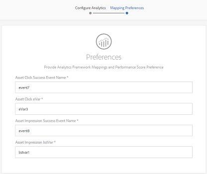

# Añadir recursos digitales a Adobe Experience Manager {#add-assets-to-experience-manager}

[!DNL Adobe Experience Manager] enriquece el contenido binario de los archivos digitales cargados con metadatos enriquecidos, etiquetas inteligentes, representaciones y otros servicios de administración de recursos digitales (DAM). Puede cargar varios tipos de archivos, como imágenes, documentos y archivos de imagen sin procesar, desde la carpeta local o desde una unidad de red a [!DNL Experience Manager Assets].

Se proporcionan varios métodos de carga. Además de la carga del navegador que se utiliza con más frecuencia, existen otros métodos para agregar recursos al repositorio de Experience Manager, incluidos los clientes de escritorio, como Adobe Asset Link o la aplicación de escritorio de Experience Manager, los scripts de carga e ingestión que los clientes crearían, y las integraciones de ingesta automatizada se agregan como extensiones de Experience Manager.

Nos centraremos en los métodos de carga para los usuarios finales aquí y proporcionaremos vínculos a artículos que describen los aspectos técnicos de la carga y la ingesta de recursos mediante API y SDK de Experience Manager.

Aunque puede cargar y administrar cualquier archivo binario en Experience Manager, los formatos de archivo más utilizados son compatibles con servicios adicionales, como la extracción de metadatos o la generación de previsualizaciones y representaciones. Consulte [formatos de archivo admitidos](file-format-support.md) para obtener más información.

También puede elegir que se realice un procesamiento adicional en los recursos cargados. Se pueden configurar varios perfiles de procesamiento de recursos en la carpeta, en la que se cargan los recursos, para agregar metadatos, representaciones o servicios de procesamiento de imágenes específicos. Consulte [procesamiento de recursos al cargarlos](#process-when-uploaded).

>[!NOTE]
>
>Experience Manager como [!DNL Cloud Service] aprovecha una nueva forma de cargar recursos: carga binaria directa. Se admite de forma predeterminada por las prestaciones y los clientes del producto, como la interfaz de usuario de Experience Manager, el vínculo de recursos de Adobe, la aplicación de escritorio de Experience Manager y, por lo tanto, es transparente para los usuarios finales.
>
>El código de carga personalizado o ampliado por los equipos técnicos de los clientes debe utilizar las nuevas API y protocolos de carga.

Assets como [!DNL Cloud Service] proporciona los siguientes métodos de carga. Adobe recomienda comprender el caso de uso y la aplicabilidad de una opción de carga antes de utilizarla.

| Método de carga | ¿Cuándo usar? | Persona principal |
|---------------------|----------------|-----------------|
| [Interfaz de usuario de la consola de recursos](#upload-assets) | Carga ocasional, facilidad de pulsar y arrastrar, carga del buscador. No utilizar para cargar un gran número de recursos. | Todos los usuarios |
| [API de carga](#upload-using-apis) | Para decisiones dinámicas durante la carga. | Desarrollador |
| [[!DNL Experience Manager] aplicación de escritorio](https://experienceleague.adobe.com/docs/experience-manager-desktop-app/using/using.html) | Consumo de recursos de bajo volumen, pero para migración. | Administrador, especialista en marketing |
| [Adobe Asset Link](https://helpx.adobe.com/enterprise/admin-guide.html/enterprise/using/adobe-asset-link.ug.html) | Resulta útil cuando los creativos y los especialistas en marketing trabajan en recursos desde las [!DNL Creative Cloud] aplicaciones de escritorio admitidas. | Creativo, especialista en marketing |
| [Ingreso masivo de recursos](#asset-bulk-ingestor) | Recomendado para migraciones a gran escala y compras masivas ocasionales. Solo para los almacenes de datos admitidos. | Administrador, Desarrollador |

## Carga de recursos {#upload-assets}

<!-- #ENGCHECK do we support pausing? I couldn't get pause to show with 1.5GB upload.... If not, this should be removed#

   You can pause the uploading of large assets (greater than 500 MB) and resume it later from the same page. Tap the **[!UICONTROL Pause]** icon beside progress bar that appears when an upload starts.

   

   The size above which an asset is considered a large asset is configurable. For example, you can configure the system to consider assets above 1000 MB (instead of 500 MB) as large assets. In this case, **[!UICONTROL Pause]** appears on the progress bar when assets of size greater than 1000 MB are uploaded.

   The Pause button does not show if a file greater than 1000 MB is uploaded with a file less than 1000 MB. However, if you cancel the less than 1000 MB file upload, the **[!UICONTROL Pause]** button appears.

   To modify the size limit, configure the `chunkUploadMinFileSize` property of the `fileupload`node in the CRX repository.

   When you click the **[!UICONTROL Pause]** icon, it toggles to a **[!UICONTROL Play]** icon. To resume uploading, click the **[!UICONTROL Play]** icon.

   
-->

<!-- #ENGCHECK do we support pausing? I couldn't get pause to show with 1.5GB upload.... If not, this should be removed#
   The ability to resume uploading is especially helpful in low-bandwidth scenarios and network glitches, where it takes a long time to upload a large asset. You can pause the upload operation and continue later when the situation improves. When you resume, uploading starts from the point where you paused it.
-->

<!-- #ENGCHECK assuming this is not relevant? remove after confirming#
   During the upload operation, [!DNL Experience Manager] saves the portions of the asset being uploaded as chunks of data in the CRX repository. When the upload completes, [!DNL Experience Manager] consolidates these chunks into a single block of data in the repository.

   To configure the cleanup task for the unfinished chunk upload jobs, go to `https://[aem_server]:[port]/system/console/configMgr/org.apache.sling.servlets.post.impl.helper.ChunkCleanUpTask`.
-->

Para cargar un archivo (o varios archivos), puede seleccionarlos en el escritorio y arrastrarlos en la interfaz de usuario (navegador web) a la carpeta de destino. También puede iniciar la carga desde la interfaz de usuario.

1. En la interfaz de usuario [!DNL Assets], navegue a la ubicación donde desee agregar recursos digitales.
1. Para cargar los recursos, realice una de las siguientes acciones:

   * En la barra de herramientas, haga clic en **[!UICONTROL Crear]** > **[!UICONTROL Archivos]**. Si es necesario, puede cambiar el nombre del archivo en el cuadro de diálogo presentado.
   * En un navegador compatible con HTML5, arrastre los recursos directamente en la interfaz de usuario [!DNL Assets]. No se muestra el cuadro de diálogo para cambiar el nombre del archivo.

   

   Para seleccionar varios archivos, seleccione la tecla `Ctrl` o `Command` y seleccione los recursos en el cuadro de diálogo del selector de archivos. Al utilizar un iPad, solo puede seleccionar un archivo a la vez.

1. Para cancelar una carga en curso, haga clic en cerrar (`X`) al lado de la barra de progreso. Al cancelar la operación de carga, [!DNL Assets] elimina la parte parcialmente cargada del recurso.
Si cancela una operación de carga antes de que se carguen los archivos, [!DNL Assets] detiene la carga del archivo actual y actualiza el contenido. Sin embargo, los archivos que ya se han cargado no se eliminan.

1. El cuadro de diálogo de progreso de carga de [!DNL Assets] muestra el recuento de archivos cargados correctamente y los archivos que no se pudieron cargar.
Además, la interfaz de usuario [!DNL Assets] muestra el recurso más reciente que ha cargado o la carpeta que ha creado primero.

>[!NOTE]
>
>Para cargar jerarquías de carpetas anidadas, consulte [carga masiva de recursos](#bulk-upload).

<!-- #ENGCHECK I'm assuming this is no longer relevant.... If yes, this should be removed#

### Serial uploads {#serialuploads}

Uploading numerous assets in bulk consumes significant I/O resources, which may adversely impact the performance of [!DNL Assets]. In particular, if you have a slow internet connection, the time to upload drastically increases due to a spike in disk I/O. Moreover, your web browser may introduce additional restrictions to the number of POST requests [!DNL Assets] can handle for concurrent asset uploads. As a result, the upload operation fails or terminate prematurely. In other words, [!DNL Assets] may miss some files while ingesting a bunch of files or altogether fail to ingest any file.

To overcome this situation, [!DNL Assets] ingests one asset at a time (serial upload) during a bulk upload operation, instead of the concurrently ingesting all the assets.

Serial uploading of assets is enabled by default. To disable the feature and allow concurrent uploading, overlay the `fileupload` node in Crx-de and set the value of the `parallelUploads` property to `true`.

### Streamed uploads {#streamed-uploads}

If you upload many assets to [!DNL Experience Manager], the I/O requests to server increase drastically, which reduces the upload efficiency and can even cause some upload task to time out. [!DNL Assets] supports streamed uploading of assets. Streamed uploading reduces the disk I/O during the upload operation by avoiding asset storage in a temporary folder on the server before copying it to the repository. Instead, the data is transferred directly to the repository. This way, the time to upload large assets and the possibility of timeouts is reduced. Streamed upload is enabled by default in [!DNL Assets].

>[!NOTE]
>
>Streaming upload is disabled for [!DNL Experience Manager] running on JEE server with servlet-api version lower than 3.1.
-->

### Administración de cargas cuando el recurso ya existe {#handling-upload-existing-file}

Puede cargar un recurso con la misma ruta (el mismo nombre y la misma ubicación) que la de un recurso existente. Sin embargo, se muestra un cuadro de diálogo de advertencia con las siguientes opciones:

* Reemplazar recurso existente: Si sustituye un recurso existente, se eliminarán los metadatos del recurso y las modificaciones anteriores (por ejemplo, anotaciones, recortes, etc.) que haya realizado en el recurso existente.
* Crear otra versión: Se crea una nueva versión del recurso existente en el repositorio. Puede realizar la vista de las dos versiones en la [!UICONTROL Línea de tiempo] y puede revertir a la versión existente anteriormente si es necesario.
* Mantener ambos: Si decide conservar ambos recursos, se cambiará el nombre del nuevo recurso por el número `1` anexado al nombre.

>[!NOTE]
>
>Cuando selecciona **[!UICONTROL Reemplazar]** en el cuadro de diálogo [!UICONTROL Conflicto de nombres], el ID de recursos se regenera para el nuevo recurso. Este ID es diferente del ID del recurso anterior.
>
>Si Asset Insights está habilitado para rastrear impresiones o clics con [!DNL Adobe Analytics], el ID de recurso regenerado invalida los datos capturados para el recurso en [!DNL Analytics].

Para conservar el recurso de duplicado en [!DNL Assets], haga clic en **[!UICONTROL Mantener]**. Para eliminar el recurso de duplicado que ha cargado, toque o haga clic en **[!UICONTROL Eliminar]**.

### Administración de nombres de archivo y caracteres prohibidos {#filename-handling}

[!DNL Experience Manager Assets] intenta evitar que cargue recursos con los caracteres prohibidos en sus nombres de archivo. Si intenta cargar un recurso con un nombre de archivo que contenga uno o varios caracteres no permitidos, [!DNL Assets] muestra un mensaje de advertencia y detiene la carga hasta que elimine estos caracteres o la cargue con un nombre permitido. Algunos métodos de carga no impiden que se carguen recursos con caracteres prohibidos en los nombres de archivo, pero reemplazan los caracteres por `-`.

Para adaptarse a las convenciones de nombres de archivo específicas de su organización, el cuadro de diálogo [!UICONTROL Cargar recursos] permite especificar nombres largos para los archivos que cargue. No se admiten los siguientes caracteres (lista separada por espacios):

* caracteres no válidos para el nombre de archivo de recurso `* / : [ \\ ] | # % { } ? &`
* caracteres no válidos para el nombre de la carpeta de recursos `* / : [ \\ ] | # % { } ? \" . ^ ; + & \t`

## Carga masiva de recursos {#bulk-upload}

El inversor de recursos masivo puede gestionar miles de recursos de forma eficaz. Sin embargo, una ingestión a gran escala no es sólo una descarga de archivos amplia y grande o una migración ciega. Para que sea un proyecto significativo que sirva a su propósito comercial, planificar y depurar los activos lleva a una ingestión mucho más eficiente. Todas las ingestas no son iguales y no se pueden realizar generalizaciones sin tener en cuenta la composición del repositorio con matices y las necesidades comerciales. Las siguientes son sugerencias generales para planificar y ejecutar una ingesta masiva:

* Depurar recursos: Elimine los recursos que no sean necesarios en DAM. Considere la posibilidad de eliminar recursos no utilizados, obsoletos o de duplicado. Esto reduce la transferencia de datos y la ingesta de recursos, lo que lleva a una mayor rapidez de las ingestas.
* Organización de recursos: Considere la posibilidad de organizar el contenido en algún orden lógico, por ejemplo, por tamaño de archivo, formato de archivo, caso de uso o prioridad. En general, los archivos complejos de gran tamaño requieren más procesamiento. También puede considerar la posibilidad de ingerir archivos grandes por separado mediante la opción de filtrado de tamaño de archivo (que se describe a continuación).
* Ensayos: Considere desglosar la ingestión en varios proyectos de ingestión masiva. Esto le permite ver el contenido antes y actualizar la ingestión según sea necesario. Por ejemplo, puede ingerir recursos con gran intensidad de procesamiento durante horas no pico o de forma gradual en varios fragmentos. Sin embargo, puede ingerir recursos más pequeños y simples que no requieran mucho procesamiento de una sola vez.

Para cargar un mayor número de archivos, utilice uno de los siguientes métodos. Consulte también los [casos y métodos de uso](#upload-methods-comparison)

* [API](developer-reference-material-apis.md#asset-upload-technical) de carga de recursos: Utilice un script o una herramienta de carga personalizada que utilice las API para añadir un control adicional de los recursos (por ejemplo, traducir metadatos o cambiar el nombre de los archivos), si es necesario.
* [Aplicación](https://experienceleague.adobe.com/docs/experience-manager-desktop-app/using/using.html) de escritorio Experience Manager: Útil para los profesionales creativos y los especialistas en marketing que cargan recursos desde su sistema de archivos local. Utilícelo para cargar carpetas anidadas disponibles localmente.
* [Herramienta](#asset-bulk-ingestor) de ingestión masiva: Se utiliza para la ingestión de grandes cantidades de recursos de forma ocasional o inicial al realizar la implementación  [!DNL Experience Manager].

### Herramienta de ingestor masivo de recursos {#asset-bulk-ingestor}

La herramienta se proporciona únicamente al grupo de administradores para su uso en la ingestión a gran escala de recursos de los almacenes de datos de Azure o S3.

Para configurar la herramienta, siga estos pasos:

1. Vaya a **[!UICONTROL Herramientas]** > **[!UICONTROL Recursos]** > **[!UICONTROL Importación masiva]**. Seleccione la opción **[!UICONTROL Crear]**.

1. En la página [!UICONTROL configuración de importación masiva], proporcione los valores necesarios.

   * [!UICONTROL Título]: Un título descriptivo.
   * [!UICONTROL Importar origen]: Seleccione el origen de datos aplicable.
   * [!UICONTROL Filtrar por tamaño] mínimo: Proporcione el tamaño mínimo de archivo de los recursos en MB.
   * [!UICONTROL Filtrar por tamaño] máximo: Proporcione el tamaño máximo de archivo de los recursos en MB.
   * [!UICONTROL Excluir tipos] de MIME: Lista separada por comas de tipos MIME para excluir de la ingesta. Por ejemplo, `image/jpeg, image/.*, video/mp4`.
   * [!UICONTROL Incluir tipos] Mime: Lista separada por comas de tipos MIME para incluir en la ingesta. Consulte [todos los formatos de archivo admitidos](/help/assets/file-format-support.md).
   * [!UICONTROL Modo] de importación: Seleccione Omitir, Reemplazar o Crear versión. El modo de omisión es el predeterminado y, en este modo, el inversor omite importar un recurso si ya existe. Consulte el significado de [reemplazar y crear opciones de versión](#handling-upload-existing-file).
   * [!UICONTROL Carpeta] de Destinatario de recursos: Importar carpeta en DAM donde se van a importar los recursos. Por ejemplo, `/content/dam/imported_assets`

1. Puede eliminar, modificar, ejecutar y hacer más con las configuraciones de ingestor creadas. Cuando se selecciona una configuración de ingestor de importación masiva, la siguiente opción está disponible en la barra de herramientas.

   * [!UICONTROL Editar]: Edite la configuración seleccionada.
   * [!UICONTROL Eliminar]: Elimine la configuración seleccionada.
   * [!UICONTROL Comprobación]: Valide la conexión al almacén de datos.
   * [!UICONTROL Ensayo]: Invocar una ejecución de prueba de la ingestión masiva.
   * [!UICONTROL Ejecutar]: Ejecute la configuración seleccionada.
   * [!UICONTROL Detener]: Finalice una configuración activa.
   * [!UICONTROL Estado] del trabajo: Vista el estado de la configuración cuando se utiliza en un trabajo de importación en curso o para un trabajo completado.
   * [!UICONTROL Recursos] de vista: Vista la carpeta destinatario si existe.

>[!NOTE]
>
>La carga masiva como parte de la migración de contenido desde otros sistemas cuando se configura e implementa en Experience Manager requiere una planificación, consideración y elección cuidadosas de las herramientas. Consulte la [guía de implementación](/help/implementing/deploying/overview.md) para obtener instrucciones sobre los enfoques de migración de contenido.

## Carga de recursos mediante clientes de escritorio {#upload-assets-desktop-clients}

Además de la interfaz de usuario del navegador web, Experience Manager admite otros clientes en el escritorio. También proporcionan una experiencia de carga sin necesidad de ir al navegador web.

* [Adobe Asset ](https://helpx.adobe.com/es/enterprise/using/adobe-asset-link.html) Link proporciona acceso a los recursos desde  [!DNL Experience Manager] las aplicaciones de escritorio de Adobe Photoshop, Adobe Illustrator y Adobe InDesign. Puede cargar el documento abierto en [!DNL Experience Manager] directamente desde la interfaz de usuario de Adobe Asset Link desde estas aplicaciones de escritorio.
* [La aplicación de escritorio Experience Manager ](https://experienceleague.adobe.com/docs/experience-manager-desktop-app/using/using.html) simplifica el trabajo con los recursos en el escritorio, independientemente del tipo de archivo o la aplicación nativa que los gestione. Resulta especialmente útil cargar archivos en jerarquías de carpetas anidadas desde el sistema de archivos local, ya que la carga del navegador solo admite la carga de listas de archivos planos.

## Procesar recursos al cargarse {#process-when-uploaded}

Para realizar un procesamiento adicional en los recursos cargados, puede aplicar perfiles de procesamiento en las carpetas de carga. Los perfiles están disponibles en la página **[!UICONTROL Propiedades]** de una carpeta en [!DNL Assets].

Están disponibles las fichas siguientes:

* [Los ](metadata-profiles.md) perfiles de metadatos permiten aplicar propiedades de metadatos predeterminadas a los recursos cargados en esa carpeta
* [El procesamiento de ](asset-microservices-configure-and-use.md) perfiles le permite generar más representaciones de las posibles de forma predeterminada.

Además, si [!DNL Dynamic Media] está habilitado en la implementación, estarán disponibles las fichas siguientes:

* [Los ](dynamic-media/image-profiles.md) perfiles de imagen de Dynamic Media permiten aplicar a los recursos cargados un recorte específico (recorte **[!UICONTROL inteligente]** y recorte de píxeles) y una configuración de enfoque.
* [Los ](dynamic-media/video-profiles.md) perfiles de vídeo de Dynamic Media le permiten aplicar perfiles de codificación de vídeo específicos (resolución, formato, parámetros).

>[!NOTE]
>
>El recorte de Dynamic Media y otras operaciones en los recursos no son destructivos, es decir, no cambian el original cargado, sino que proporcionan parámetros para recortar o transformar los medios que se deben realizar al entregar los recursos

Para las carpetas que tienen asignado un perfil de procesamiento, el nombre del perfil aparece en la miniatura de la vista de tarjeta. En la vista de lista, el nombre del perfil aparece en la columna **[!UICONTROL Perfil de procesamiento]**.

## Carga o ingesta de recursos mediante API {#upload-using-apis}

En la sección [carga de recursos](developer-reference-material-apis.md#asset-upload-technical) de la referencia del desarrollador, se proporcionan detalles técnicos de las API y el protocolo de carga y vínculos al SDK de código abierto y a los clientes de muestra.

>[!MORELIKETHIS]
>
>* [Aplicación de escritorio de Adobe Experience Manager](https://experienceleague.adobe.com/docs/experience-manager-desktop-app/using/introduction.html)
>* [Acerca de Adobe Asset Link](https://www.adobe.com/creativecloud/business/enterprise/adobe-asset-link.html)
>* [Documentación de Adobe Asset Link](https://helpx.adobe.com/enterprise/using/adobe-asset-link.html)
>* [Referencia técnica para la carga de recursos](developer-reference-material-apis.md#asset-upload-technical)

