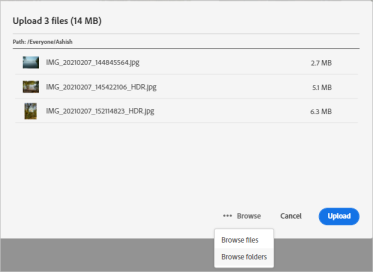

# Carga de recursos {#add-assets}

Para añadir nuevos recursos con los que trabajar, cargue algunos desde el sistema de archivos local. <!-- TBD: Many of the [common file formats are supported](/help/assets/supported-file-formats-assets-view.md). -->

Puede utilizar los siguientes métodos para cargar uno o varios recursos o una carpeta que los contenga:

* Arrastre recursos o carpetas en la interfaz de usuario y siga las instrucciones que aparecen en la pantalla.
* Haga clic en la opción **[!UICONTROL Agregar Assets]** de la barra de herramientas y agregue algunos archivos al cuadro de diálogo de carga.

<!-- TBD: Update this GIF
 -->

Puede utilizar cualquiera de estos métodos para cargar recursos después de crear una carpeta. Para crear una carpeta vacía, haga clic en **[!UICONTROL Crear carpeta]** en la barra de herramientas. [!DNL Assets view] ofrece una potente funcionalidad de búsqueda de texto completo, pero también puede utilizar carpetas para organizar mejor los recursos.

Una vez seleccionados los archivos, aparece un cuadro de diálogo de confirmación para añadir más archivos o para eliminar los ya seleccionados. Para añadir más archivos a una selección, haga clic en **[!UICONTROL Examinar]** y seleccione **[!UICONTROL Examinar archivos]** o **[!UICONTROL Examinar carpetas]**. Añada más archivos o carpetas de la misma o de otra carpeta.

Una vez que todos los archivos estén en cola, haga clic en **[!UICONTROL Cargar]**.

*Imagen: antes de cargar los recursos seleccionados, puede añadirlos o eliminarlos de la cola.*

>[!TIP]
>
>Si carga una estructura de carpetas en la vista de Assets, no necesita crear un archivo .ZIP con la estructura de carpetas, puede cargar estructuras de carpetas directamente. Un archivo .ZIP cargado en la vista de Assets se almacena como un recurso ZIP y no se extrae automáticamente después de la carga.

## Visualización del progreso y estado de la carga {#upload-progress}

Al cargar muchos recursos o carpetas anidadas en [!DNL Assets view], algunos recursos pueden no cargarse debido a varios motivos, como problemas de red y recursos duplicados.

Para realizar un seguimiento del progreso de carga, haga clic en la opción de **[!UICONTROL Progreso de carga]** en la barra de herramientas. Un panel muestra el progreso de carga de todos los recursos.

Para ver un subconjunto de recursos en función del progreso o estado de carga, utilice el filtro de la barra lateral **[!UICONTROL Progreso de carga]**. Los distintos filtros muestran todos los recursos, las cargas completadas, las cargas en curso, los recursos en cola que se van a cargar, las cargas en pausa, los recursos duplicados y los recursos que no se han cargado.

*Imagen: filtre los recursos que ha intentado cargar en función de su estado de carga o del progreso de carga.*

Inmediatamente después de cargar los recursos, [!DNL Assets view] los procesa para generar miniaturas y procesar metadatos. Para muchos recursos, el procesamiento lleva algún tiempo. Si no ve una miniatura y ve un mensaje de procesamiento en la miniatura del marcador de posición, vuelva a comprobar la carpeta después de unos minutos. Durante el procesamiento, entre otras cosas, [!DNL Assets view] genera las representaciones, añade las etiquetas inteligentes e indexa los detalles del recurso para la búsqueda.

*Imagen: los recursos cargados muestran el procesamiento en el mosaico que se procesa.*

## Representaciones de recursos {#renditions}

[!DNL Assets view] procesa los recursos cargados casi en tiempo real y, para muchos tipos de archivo admitidos, genera representaciones. Creadas para imágenes, las representaciones son versiones con el tamaño modificado de la imagen cargada. Puede descargar no solo el recurso, sino también las representaciones, para utilizar una versión adecuada. Puede ver todas las representaciones de un recurso al [previsualizar un recurso](/help/assets/navigate-assets-view.md#preview-assets).

*Imagen: vea y descargue las representaciones.*

## Administración de cargas fallidas {#resolve-upload-fails}

Si la carga de un recurso admitido falla por algún motivo, haga clic en **[!UICONTROL Reintentar]** en el panel [!UICONTROL Progreso de carga].

*Imagen: vuelva a intentarlo si un archivo compatible no se puede cargar por algún motivo.*

Si intenta cargar recursos duplicados, estos no se cargarán hasta que confirme explícitamente la carga. Al principio, los recursos duplicados se marcan como cargas fallidas. Para resolverlo, simplemente puede crear una versión, eliminar y reemplazar los recursos existentes o crear una copia duplicada cambiando el nombre del recurso. Puede resolver estos errores de un recurso a la vez o hacerlo por lotes para todos los duplicados fallidos de una sola vez.

*Imagen: para los recursos duplicados que no se cargan de forma predeterminada, resuelva el problema de uno en uno.*

*Imagen: para los recursos duplicados que no se cargan de forma predeterminada, resuelva los problemas de todos los recursos a la vez.*

>[!TIP]
>
>Puede cargar recursos al repositorio de DAM directamente desde sus [!DNL Creative Cloud] aplicaciones de escritorio.
<!--TBD
See how [[!DNL Assets view] integrates with [!DNL Adobe Asset Link]](/help/assets/integration-assets-view.md).
-->

## Eliminación de recursos o carpetas {#delete-assets}

Los usuarios pueden eliminar recursos o carpetas individuales que ya no sean necesarios. Para eliminar un recurso o una carpeta, realice una de las siguientes acciones:

* Utilice la opción disponible en la miniatura de un recurso o de una carpeta.

  

  *Imagen: las acciones para archivos y carpetas están disponibles en el mosaico del recurso o de la carpeta.*

* Seleccione un recurso o una carpeta y haga clic en **[!UICONTROL Eliminar]**  en la barra de herramientas.

## Siguientes pasos {#next-steps}

* [Vea un vídeo para cargar recursos en la vista de Assets](https://experienceleague.adobe.com/docs/experience-manager-learn/assets-essentials/basics/creating.html?lang=es)

* Realice comentarios del producto mediante la opción [!UICONTROL Comentarios] disponible en la interfaz de usuario de la vista Recursos

* Proporcione comentarios sobre la documentación usando [!UICONTROL Editar esta página]  o [!UICONTROL Registrar una incidencia] , disponibles en la barra lateral derecha

* Contacto con el [Servicio de atención al cliente](https://experienceleague.adobe.com/?support-solution=General&lang=es#support)
