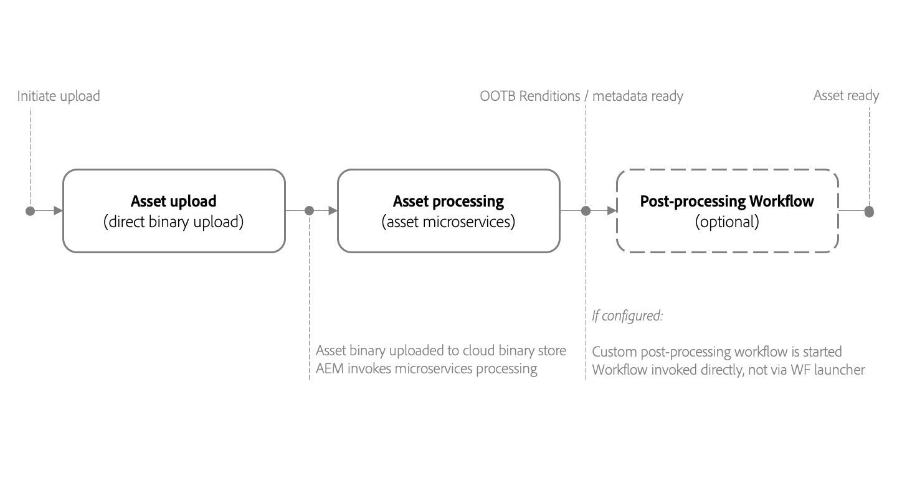

# Uso de microservicios de recursos y perfiles de procesamiento {#get-started-using-asset-microservices}

Los microservicios de recursos proporcionan un procesamiento escalable y flexible de los recursos que utilizan aplicaciones nativas de la nube (también denominadas trabajadores). Adobe administra los servicios para una gestión óptima de los distintos tipos de recursos y opciones de procesamiento.

Los microservicios de recursos le permiten procesar un [amplia gama de tipos de archivo](/help/assets/file-format-support.md) cubre más formatos predeterminados de los posibles [!DNL Experience Manager]. Por ejemplo, la extracción en miniatura de los formatos PSD y PSB ahora es posible, pero anteriormente se requieren soluciones de terceros como [!DNL ImageMagick].

El procesamiento de recursos depende de la configuración de **[!UICONTROL Perfiles de procesamiento]**. Experience Manager proporciona una configuración predeterminada básica y permite que los administradores agreguen una configuración de procesamiento de recursos más específica. Los administradores crean, mantienen y modifican las configuraciones de los flujos de trabajo posteriores al procesamiento, incluida la personalización opcional. Customizing the workflows lets developers extend the default offering.

<!-- Proposed DRAFT diagram for asset microservices flow - see section "asset-microservices-flow.png (asset-microservices-configure-and-use.md)" in the PPTX deck

https://adobe-my.sharepoint.com/personal/gklebus_adobe_com/_layouts/15/guestaccess.aspx?guestaccesstoken=jexDC5ZnepXSt6dTPciH66TzckS1BPEfdaZuSgHugL8%3D&docid=2_1ec37f0bd4cc74354b4f481cd420e07fc&rev=1&e=CdgElS
-->

>[!NOTE]
>
>The asset processing described here replaces the `DAM Update Asset` workflow model that exists in the previous versions of [!DNL Experience Manager]. La mayoría de los pasos estándar de generación de representación y relacionados con los metadatos se sustituyen por el procesamiento de los microservicios de recursos, y los pasos restantes, si los hay, se pueden sustituir por la configuración del flujo de trabajo posterior al procesamiento.

## Comprender las opciones de procesamiento de recursos {#get-started}

[!DNL Experience Manager] permite los siguientes niveles de procesamiento.

| Opción | Descripción | Casos de uso cubiertos |
|---|---|---|
| [Configuración predeterminada](#default-config) | It is available as is and cannot be modified. Esta configuración proporciona una capacidad de generación de representaciones muy básica. | <ul> <li>Standard thumbnails used by [!DNL Assets] user interface (48, 140, and 319 pixels) </li> <li> Large preview (web rendition - 1280 pixels) </li><li> Metadata and text extraction.</li></ul> |
| [Configuración personalizada](#standard-config) | Configured by administrators via user interface. Proporciona más opciones para la generación de representación ampliando la opción predeterminada. Amplíe la opción predeterminada para proporcionar diferentes formatos y representaciones. | <ul><li>Representación de FPO. </li> <li>Cambiar el formato de archivo y la resolución de las imágenes</li> <li> Conditionally apply to configured file types. </li> </ul> |
| [Perfil personalizado](#custom-config) | Configurado por los administradores a través de la interfaz de usuario para utilizar código personalizado a través de aplicaciones personalizadas para llamar a [Servicio de asset compute](https://experienceleague.adobe.com/docs/asset-compute/using/introduction.html). Admite requisitos más complejos en un método nativo de la nube y escalable. | Consulte [casos de uso permitidos](#custom-config). |

<!-- To create custom processing profiles specific to your custom requirements, say to integrate with other systems, see [post-processing workflows](#post-processing-workflows).
-->

## Formatos de archivo compatibles {#supported-file-formats}

Los microservicios de recursos admiten una amplia variedad de formatos de archivo para procesar, generar representaciones o extraer metadatos. Consulte [formatos de archivo compatibles](file-format-support.md) para obtener la lista completa de tipos MIME y la funcionalidad admitida para cada tipo.

## Configuración predeterminada {#default-config}

Algunos valores predeterminados están preconfigurados para garantizar que estén disponibles las representaciones predeterminadas necesarias en Experience Manager. La configuración predeterminada también garantiza que las operaciones de extracción de metadatos y de extracción de texto estén disponibles. Los usuarios pueden empezar a cargar o actualizar recursos inmediatamente, y el procesamiento básico está disponible de forma predeterminada.

Con la configuración predeterminada, solo se configura el perfil de procesamiento más básico. Este perfil de procesamiento no está visible en la interfaz de usuario y no se puede modificar. Siempre se ejecuta para procesar los recursos cargados. Este perfil de procesamiento predeterminado garantiza que el procesamiento básico requerido por [!DNL Experience Manager] se completa en todos los recursos.

<!-- 
-->

## Configuración estándar {#standard-config}

[!DNL Experience Manager] proporciona funciones para generar representaciones más específicas para formatos comunes según las necesidades del usuario. Un administrador puede crear [!UICONTROL Perfiles de procesamiento] para facilitar la creación de dicha representación. A continuación, los usuarios asignan uno o más de los perfiles disponibles a carpetas específicas para realizar el procesamiento adicional. Por ejemplo, el procesamiento adicional puede generar representaciones para la web, móviles y tabletas. El siguiente vídeo ilustra cómo crear y aplicar [!UICONTROL Perfiles de procesamiento] y cómo acceder a las representaciones creadas.

* **Anchura y altura de representación**: La especificación de anchura y altura de representación proporciona tamaños máximos de la imagen de salida generada. Los microservicios de recursos intentan producir la representación más grande posible, cuya anchura y altura no son mayores que la anchura y la altura especificadas, respectivamente. Se conserva la relación de aspecto, la misma que la original. Un valor vacío significa que el procesamiento de recursos asume la dimensión de píxeles del original.

* **Reglas de inclusión de tipo MIME**: Cuando se procesa un recurso con un tipo MIME específico, primero se comprueba el tipo MIME con el valor de tipos MIME excluidos para la especificación de representación. Si coincide con esa lista, esta representación específica no se genera para el recurso (lista de bloqueados). De lo contrario, el tipo MIME se compara con el tipo MIME incluido y, si coincide con la lista, se genera la representación (lista de permitidos).

* **Representación especial de FPO**: Al colocar recursos de gran tamaño desde [!DNL Experience Manager] into [!DNL Adobe InDesign] documentos, un profesional creativo espera un tiempo considerable después de [colocar un recurso](https://helpx.adobe.com/indesign/using/placing-graphics.html). Mientras tanto, se bloquea el uso del usuario [!DNL InDesign]. Esto interrumpe el flujo creativo y afecta negativamente a la experiencia del usuario. Adobe permite colocar temporalmente representaciones de tamaño pequeño en [!DNL InDesign] para empezar, que se pueden sustituir por activos de resolución completa bajo demanda más adelante. [!DNL Experience Manager] proporciona representaciones que se utilizan solo para la colocación (FPO). Estas representaciones de FPO tienen un tamaño de archivo pequeño, pero tienen la misma proporción de aspecto.

El perfil de procesamiento puede incluir una representación de FPO (solo para ubicación). See [!DNL Adobe Asset Link] [documentation](https://helpx.adobe.com/enterprise/using/manage-assets-using-adobe-asset-link.html) to understand if you need to turn it on for your processing profile. Para obtener más información, consulte [Adobe Documentación completa de Asset Link](https://helpx.adobe.com/es/enterprise/using/adobe-asset-link.html).

### Creación de un perfil estándar {#create-standard-profile}

To create a standard processing profile, follow these steps:

1. Acceso de los administradores **[!UICONTROL Herramientas]** > **[!UICONTROL Recursos]** > **[!UICONTROL Perfiles de procesamiento]**. Haga clic en **[!UICONTROL Crear]**.
1. Proporcione un nombre que le ayude a identificar el perfil de forma única al aplicar a una carpeta.
1. Para generar representaciones de FPO, en la sección **[!UICONTROL Imagen]** ficha, habilitar **[!UICONTROL Crear representación de FPO]**. Entrada a **[!UICONTROL Calidad]** entre 1 y 100.
1. Para generar otras representaciones, haga clic en **[!UICONTROL Agregar nuevo]** y proporcione la siguiente información:

   * Nombre de archivo de cada representación.
   * Formato de archivo (PNG, JPEG, GIF o WebP) de cada representación.
   * Anchura y altura en píxeles de cada representación. Si no se especifican los valores, se utiliza el tamaño de píxeles completo de la imagen original.
   * Calidad en porcentaje de cada JPEG y representación WebP.
   * Se han incluido y excluido tipos MIME para definir la aplicabilidad de un perfil.

   

1. Haga clic en **[!UICONTROL Guardar]**.

<!-- TBD: Update the video link when a new video is available from Tech Marketing.

The following video demonstrates the usefulness and usage of standard profile.

>[!VIDEO](https://video.tv.adobe.com/v/29832?quality=9)
-->

<!-- This image was removed per cqdoc-15624, as requested by engineering.
  
 -->

## Perfil personalizado y casos de uso {#custom-config}

La variable [!DNL Asset Compute Service] admite una variedad de casos de uso, como el procesamiento predeterminado, el procesamiento de formatos específicos de Adobe, como archivos Photoshop, y la implementación de un procesamiento personalizado o específico de la organización. La personalización del flujo de trabajo de los recursos de actualización de DAM requerida en el pasado se gestiona automáticamente o mediante la configuración de perfiles de procesamiento. Si estas opciones de procesamiento no satisfacen las necesidades comerciales, Adobe recomienda desarrollar y usar [!DNL Asset Compute Service] para ampliar las funciones predeterminadas. For an overview, see [understand extensibility and when to use it](https://experienceleague.adobe.com/docs/asset-compute/using/extend/understand-extensibility.html).

>[!NOTE]
>
>Adobe recommends using a custom application only when the business requirements cannot be accomplished using the default configurations or the standard profile.

It can transform image, video, document, and other file formats into different renditions including thumbnails, extracted text and metadata, and archives.

Developers can use the [!DNL Asset Compute Service] to [create custom applications](https://experienceleague.adobe.com/docs/asset-compute/using/extend/develop-custom-application.html) for the supported use cases. [!DNL Experience Manager] puede llamar a estas aplicaciones personalizadas desde la interfaz de usuario utilizando perfiles personalizados que los administradores configuran. [!DNL Asset Compute Service] supports the following use cases of invoking external services:

* Uso [!DNL Adobe Photoshop]&#39;s [API de ImageCutout](https://github.com/AdobeDocs/photoshop-api-docs-pre-release#imagecutout) y guarde el resultado como representación.
* Llame a sistemas de terceros para actualizar datos, por ejemplo, un sistema PIM.
* Uso [!DNL Photoshop] API para generar diversas representaciones basadas en la plantilla de Photoshop.
* Uso [API de Adobe Lightroom](https://github.com/AdobeDocs/lightroom-api-docs#supported-features) para optimizar los recursos ingestados y guardarlos como representaciones.

>[!NOTE]
>
>No se pueden editar los metadatos estándar mediante las aplicaciones personalizadas. You can only modify custom metadata.

### Crear un perfil personalizado {#create-custom-profile}

Para crear un perfil personalizado, siga estos pasos:

1. Administrators access **[!UICONTROL Tools]** > **[!UICONTROL Assets]** > **[!UICONTROL Processing Profiles]**. Haga clic en **[!UICONTROL Crear]**.
1. Haga clic en **[!UICONTROL Personalizado]** pestaña . Haga clic en **[!UICONTROL Agregar nuevo]**. Proporcione el nombre de archivo deseado para la representación.
1. Proporcione la siguiente información.

   * Nombre de archivo de cada representación y extensión de archivo admitida.
   * [URL de punto final de una aplicación personalizada de Firefly](https://experienceleague.adobe.com/docs/asset-compute/using/extend/deploy-custom-application.html). La aplicación debe pertenecer a la misma organización que la cuenta de Experience Manager.
   * Añadir parámetros de servicio a [pasar información o parámetros adicionales a la aplicación personalizada](https://experienceleague.adobe.com/docs/asset-compute/using/extend/develop-custom-application.html#extend).
   * Se han incluido y excluido tipos MIME para limitar el procesamiento a algunos formatos de archivo específicos.

   Haga clic en **[!UICONTROL Guardar]**.

Las aplicaciones personalizadas no tienen encabezado [Proyecto Firefly](https://github.com/AdobeDocs/project-firefly) aplicaciones. La aplicación personalizada obtiene todos los archivos proporcionados si están configurados con un perfil de procesamiento. La aplicación debe filtrar los archivos.

>[!CAUTION]
>
>Si la aplicación Firefly y [!DNL Experience Manager] no son de la misma organización, la integración no funciona.

### Ejemplo de perfil personalizado {#custom-profile-example}

Para ilustrar el uso del perfil personalizado, consideremos un caso de uso para aplicar texto personalizado a las imágenes de campaña. Puede crear un perfil de procesamiento que aproveche la API de Photoshop para editar las imágenes.

La integración del servicio de asset compute permite que el Experience Manager pase estos parámetros a la aplicación personalizada mediante el [!UICONTROL Parámetros de servicio] campo . A continuación, la aplicación personalizada llama a la API de Photoshop y pasa estos valores a la API. Por ejemplo, puede pasar el nombre de la fuente, el color del texto, el peso del texto y el tamaño del texto para agregar el texto personalizado a las imágenes de campaña.

<!-- TBD: Check screenshot against the interface. -->

*Figura: Uso [!UICONTROL Parámetros de servicio] para pasar información añadida a parámetros predefinidos integrados en la aplicación personalizada. En este ejemplo, cuando se cargan imágenes de campaña, las imágenes se actualizan con `Jumanji` texto en `Arial-BoldMT` fuente.*

## Uso de perfiles de procesamiento para procesar recursos {#use-profiles}

Cree y aplique perfiles de procesamiento personalizados adicionales a carpetas específicas para que el Experience Manager pueda procesar los recursos cargados o actualizados en estas carpetas. El perfil de procesamiento estándar predeterminado e integrado siempre se ejecuta, pero no es visible en la interfaz de usuario. Si agrega un perfil personalizado, ambos perfiles se utilizan para procesar los recursos cargados.

Aplique perfiles de procesamiento a las carpetas mediante uno de los métodos siguientes:

* Los administradores pueden seleccionar una definición de perfil de procesamiento en **[!UICONTROL Herramientas]** > **[!UICONTROL Recursos]** > **[!UICONTROL Perfiles de procesamiento]** y utilice **[!UICONTROL Aplicar perfil a carpetas]** acción. Abre un navegador de contenido que le permite desplazarse a carpetas específicas, seleccionarlas y confirmar la aplicación del perfil.
* Los usuarios pueden seleccionar una carpeta en la interfaz de usuario de Assets y utilizar **[!UICONTROL Propiedades]** acción para abrir la pantalla de propiedades de la carpeta, haga clic en el botón **[!UICONTROL Procesamiento de recursos]** y en la [!UICONTROL Perfil de procesamiento] seleccione el perfil de procesamiento adecuado para esa carpeta. Para guardar los cambios, haga clic en **[!UICONTROL Guardar y cerrar]**.
   

* Los usuarios pueden seleccionar carpetas o recursos específicos en la interfaz de usuario de Assets para aplicar un perfil de procesamiento y, a continuación, seleccionar  **[!UICONTROL Volver a procesar recursos]** en las opciones disponibles en la parte superior.

>[!TIP]
>
>Only one processing profile can be applied to a folder. Para generar más representaciones, agregue más definiciones de representación al perfil de procesamiento existente.

Después de aplicar un perfil de procesamiento a una carpeta, todos los recursos nuevos cargados (o actualizados) en esta carpeta o en cualquiera de sus subcarpetas se procesan con el perfil de procesamiento adicional configurado. Este procesamiento se suma al perfil predeterminado estándar.

>[!NOTE]
>
>Un perfil de procesamiento aplicado a una carpeta funciona para todo el árbol, pero se puede sobrescribir con otro perfil aplicado a una subcarpeta. Cuando los recursos se cargan en una carpeta, el Experience Manager comprueba si hay un perfil de procesamiento en las propiedades de la carpeta contenedora. If none is applied, a parent folder in the hierarchy is checked for a processing profile to apply.

Para comprobar que los recursos se han procesado, previsualice las variantes de representación generadas en la [!UICONTROL Representaciones] en el carril izquierdo. Abra la vista previa del recurso y abra el carril izquierdo para acceder al **[!UICONTROL Representaciones]** vista. Las representaciones específicas del perfil de procesamiento, para las que el tipo de recurso específico coincide con las reglas de inclusión de tipo MIME, deben ser visibles y accesibles.

*Figura: Ejemplo de dos representaciones adicionales generadas por un perfil de procesamiento aplicado a la carpeta principal.*

## Flujos de trabajo posteriores al procesamiento {#post-processing-workflows}

En un caso en el que se requiera un procesamiento adicional de los recursos que no se pueda lograr con los perfiles de procesamiento, se pueden añadir flujos de trabajo adicionales posteriores al procesamiento a la configuración. El procesamiento posterior le permite añadir un procesamiento completamente personalizado además del procesamiento configurable mediante los microservicios de recursos.

Los flujos de trabajo posteriores al procesamiento, si están configurados, los ejecuta automáticamente [!DNL Experience Manager] una vez finalizado el procesamiento de los microservicios. No es necesario añadir los iniciadores de flujo de trabajo manualmente para almacenar en déclencheur los flujos de trabajo. Los ejemplos incluyen:

* Pasos personalizados del flujo de trabajo para procesar recursos.
* Integraciones para agregar metadatos o propiedades a recursos de sistemas externos, por ejemplo, información de productos o procesos.
* Procesamiento adicional realizado por servicios externos.

To add a post-processing workflow configuration to [!DNL Experience Manager], follow these steps:

* Cree uno o varios modelos de flujo de trabajo. These custom models are referred to as *post-processing workflow models* in this documentation. Those are regular [!DNL Experience Manager] workflow models.
* Add the required workflow steps to these models. Revise los pasos del flujo de trabajo predeterminado y añada todos los pasos predeterminados necesarios al flujo de trabajo personalizado. Los pasos se ejecutan en los recursos en función de una configuración de modelo de flujo de trabajo. Por ejemplo, si desea que el etiquetado inteligente se produzca automáticamente al cargar los recursos, agregue el paso al modelo de flujo de trabajo personalizado posterior al procesamiento.
* Agregar [!UICONTROL Flujo de trabajo de recursos de actualización DAM completado] al final. Añadir este paso garantiza que el Experience Manager sepa cuándo termina el procesamiento y el recurso se puede marcar como procesado, es decir, *Nuevo* se muestra en el recurso.
* Cree una configuración para el Servicio de ejecución de flujo de trabajo personalizado que permita configurar la ejecución de un modelo de flujo de trabajo posterior al procesamiento mediante una ruta (ubicación de carpeta) o una expresión regular.

Para obtener más información sobre qué paso de flujo de trabajo estándar se puede utilizar en el flujo de trabajo posterior al procesamiento, consulte [pasos del flujo de trabajo en el flujo de trabajo posterior al procesamiento](developer-reference-material-apis.md#post-processing-workflows-steps) en la referencia del desarrollador.

### Creación de modelos de flujo de trabajo posteriores al procesamiento {#create-post-processing-workflow-models}

Los modelos de flujo de trabajo posteriores al procesamiento son normales [!DNL Experience Manager] modelos de flujo de trabajo. Cree diferentes modelos si necesita un procesamiento diferente para diferentes ubicaciones de repositorios o tipos de recursos.

Los pasos de procesamiento se añaden según sea necesario. Puede utilizar ambos, los pasos admitidos que están disponibles, así como cualquier paso de flujo de trabajo personalizado.

Asegúrese de que el último paso de cada flujo de trabajo posterior al procesamiento sea `DAM Update Asset Workflow Completed Process`. El último paso ayuda a garantizar que el Experience Manager sepa cuándo se completa el procesamiento de recursos.

### Configurar la ejecución del flujo de trabajo posterior al procesamiento {#configure-post-processing-workflow-execution}

Una vez que los microservicios de recursos completan el procesamiento de los recursos cargados, puede definir el flujo de trabajo posterior al procesamiento para procesar los recursos. Para configurar el posprocesamiento mediante modelos de flujo de trabajo, puede realizar una de las siguientes acciones:

* [Aplicar un modelo de flujo de trabajo en la carpeta Propiedades](#apply-workflow-model-to-folder).
* [Configurar el servicio Workflow Runner personalizado](#configure-custom-workflow-runner-service).

#### Aplicación de un modelo de flujo de trabajo a una carpeta {#apply-workflow-model-to-folder}

Para casos de uso típicos posteriores al procesamiento, considere la posibilidad de utilizar el método para aplicar un flujo de trabajo a una carpeta. Aplicación de un modelo de flujo de trabajo en la carpeta [!UICONTROL Propiedades], siga estos pasos:

1. Cree un modelo de flujo de trabajo.
1. Seleccione una carpeta, haga clic en **[!UICONTROL Propiedades]** en la barra de herramientas y, a continuación, haga clic en **[!UICONTROL Procesamiento de recursos]** pestaña .
1. En **[!UICONTROL Flujo de trabajo de inicio automático]**, seleccione el flujo de trabajo necesario, proporcione un título para el flujo de trabajo y, a continuación, guarde los cambios.

   

#### Configurar el servicio Workflow Runner personalizado {#configure-custom-workflow-runner-service}

Puede configurar el servicio de ejecución de flujo de trabajo personalizado para las configuraciones avanzadas que no se pueden cumplir fácilmente aplicando un flujo de trabajo a una carpeta. Por ejemplo, un flujo de trabajo que utiliza una expresión regular. El ejecutor de flujo de trabajo personalizado de Adobe CQ DAM (`com.adobe.cq.dam.processor.nui.impl.workflow.CustomDamWorkflowRunnerImpl`) es un servicio OSGi. Proporciona las dos opciones de configuración siguientes:

* Flujos de trabajo posteriores al procesamiento por ruta (`postProcWorkflowsByPath`): Se pueden enumerar varios modelos de flujo de trabajo basados en diferentes rutas de repositorio. Separe las rutas y los modelos utilizando dos puntos. Se admiten rutas de repositorio simples. Asigne estos elementos a un modelo de flujo de trabajo en la variable `/var` ruta. Por ejemplo: `/content/dam/my-brand:/var/workflow/models/my-workflow`.
* Flujos de trabajo posteriores al procesamiento por expresión (`postProcWorkflowsByExpression`): Se pueden enumerar varios modelos de flujo de trabajo basados en diferentes expresiones regulares. Las expresiones y los modelos deben separarse con dos puntos. La expresión regular debe señalar directamente al nodo Asset y no a una de las representaciones o archivos. Por ejemplo: `/content/dam(/.*/)(marketing/seasonal)(/.*):/var/workflow/models/my-workflow`.

Para saber cómo implementar una configuración OSGi, consulte [implementar a [!DNL Experience Manager]](/help/implementing/deploying/overview.md).

## Prácticas recomendadas y limitaciones {#best-practices-limitations-tips}

* Tenga en cuenta sus necesidades para todos los tipos de representaciones al diseñar flujos de trabajo. Si no prevé la necesidad de una representación en el futuro, elimine su paso de creación del flujo de trabajo. Las representaciones no se pueden eliminar de forma masiva posteriormente. Las variantes de representación no deseadas pueden ocupar mucho espacio de almacenamiento tras el uso prolongado de [!DNL Experience Manager]. Para recursos individuales, puede eliminar las representaciones manualmente desde la interfaz de usuario. Para varios recursos, puede personalizar [!DNL Experience Manager] para eliminar representaciones específicas o eliminar los recursos y volver a cargarlos.
* Actualmente, la compatibilidad se limita a la generación de representaciones. No se admite la generación de recursos nuevos.
* Actualmente, el límite de tamaño de archivo para la extracción de metadatos es de aproximadamente 15 GB. Al cargar recursos muy grandes, a veces se produce un error en la operación de extracción de metadatos.

>[!MORELIKETHIS]
>
>* [Introducción al servicio de Asset compute](https://experienceleague.adobe.com/docs/asset-compute/using/introduction.html).
>* [Comprender la extensibilidad y cuándo utilizarla](https://experienceleague.adobe.com/docs/asset-compute/using/extend/understand-extensibility.html).
>* [How to create custom applications](https://experienceleague.adobe.com/docs/asset-compute/using/extend/develop-custom-application.html).
>* [Tipos MIME admitidos para varios casos de uso](/help/assets/file-format-support.md).

<!-- TBD: 
* How/where can admins check what's already configured and provisioned.
* How/where to request for new provisioning/purchase.
-->
