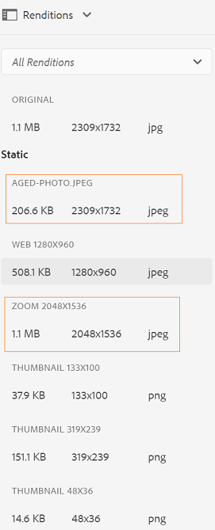

# Introducción a los microservicios de recursos {#get-started-using-asset-microservices}

<!--
* Current capabilities of asset microservices offered. If workers have names then list the names and give a one-liner description. (The feature-set is limited for now and continues to grow. So will this article continue to be updated.)
* How to access the microservices. UI. API. Is extending possible right now?
* Detailed list of what file formats and what processing is supported by which workflows/workers process.
* How/where can admins check what's already configured and provisioned.
* How to create new config or request for new provisioning/purchase.

* [DO NOT COVER?] Exceptions or limitations or link back to lack of parity with AEM 6.5.
-->

Los microservicios de recursos proporcionan un procesamiento escalable y flexible de los recursos mediante servicios en la nube. Adobe gestiona los servicios para una gestión óptima de los distintos tipos de recursos y opciones de procesamiento.

El procesamiento de recursos depende de la configuración de los Perfiles **[!UICONTROL de]** procesamiento, que proporcionan una configuración predeterminada, y permiten al administrador agregar una configuración de procesamiento de recursos más específica. Los administradores pueden crear y mantener las configuraciones de flujos de trabajo posteriores al procesamiento, incluida la personalización opcional. La personalización de flujos de trabajo permite la extensibilidad y la personalización total.

A continuación se muestra un flujo de alto nivel para el procesamiento de recursos.

<!-- Proposed DRAFT diagram for asset microservices flow - see section "asset-microservices-flow.png (asset-microservices-configure-and-use.md)" in the PPTX deck

https://adobe-my.sharepoint.com/personal/gklebus_adobe_com/_layouts/15/guestaccess.aspx?guestaccesstoken=jexDC5ZnepXSt6dTPciH66TzckS1BPEfdaZuSgHugL8%3D&docid=2_1ec37f0bd4cc74354b4f481cd420e07fc&rev=1&e=CdgElS
-->

>[!NOTE]
>
> El procesamiento de recursos que se describe aquí sustituye al modelo de flujo de trabajo que existe en las versiones anteriores de Experience Manager. `DAM Update Asset` La mayoría de los pasos de generación de representación estándar y relacionados con los metadatos se sustituyen por el procesamiento de los microservicios de recursos y los pasos restantes, si los hay, se pueden reemplazar por la configuración del flujo de trabajo posterior al procesamiento.

## Introducción al procesamiento de recursos {#get-started}

El procesamiento de recursos con microservicios de recursos está preconfigurado con una configuración predeterminada, lo que garantiza que las representaciones predeterminadas que requiere el sistema estén disponibles. También garantiza la disponibilidad de operaciones de extracción de metadatos y extracción de texto. Los usuarios pueden cargar o actualizar los recursos de forma inmediata con inicio y el procesamiento básico está disponible de forma predeterminada.

Para requisitos específicos de generación de representaciones o procesamiento de recursos, un administrador de AEM puede crear Perfiles [!UICONTROL de]procesamiento adicionales. Los usuarios pueden asignar una o más de las perfiles disponibles a carpetas específicas para realizar un procesamiento adicional. Por ejemplo, para generar representaciones específicas de web, móviles y tabletas. El siguiente vídeo muestra cómo crear y aplicar Perfiles  de procesamiento y cómo acceder a las representaciones creadas.

>[!VIDEO](https://video.tv.adobe.com/v/29832?quality=9)

Para cambiar el perfil existente, consulte [configuraciones para microservicios](#configure-asset-microservices)de recursos.
Para crear perfiles de procesamiento personalizados específicos de los requisitos personalizados, por ejemplo, para integrarlos con otros sistemas, consulte flujos de trabajo [de](#post-processing-workflows)postprocesamiento.

## Configuraciones para microservicios de recursos {#configure-asset-microservices}

Para configurar los microservicios de recursos, los administradores pueden utilizar la interfaz de usuario de configuración en **[!UICONTROL Herramientas > Recursos > Perfiles]** de procesamiento.

### Configuración predeterminada {#default-config}

Con la configuración predeterminada, solo se configura el perfil de procesamiento estándar. El perfil de procesamiento estándar no está visible en la interfaz de usuario y no se puede modificar. Siempre se ejecuta para procesar los recursos cargados. Un perfil de procesamiento estándar garantiza que todo el procesamiento básico requerido por Experience Manager se complete en todos los recursos.

<!--  -->

El perfil de procesamiento estándar proporciona la siguiente configuración de procesamiento:

* Miniaturas estándar utilizadas por la interfaz de usuario de recursos (48, 140 y 319 píxeles)
* previsualización grande (representación web - 1280 px)
* Extracción de metadatos
* extracción de texto

### Formatos de archivo admitidos {#supported-file-formats}

Los microservicios de recursos admiten una amplia variedad de formatos de archivo en cuanto a la capacidad de generar representaciones o extraer metadatos. Consulte los formatos [de archivo](file-format-support.md) admitidos para obtener la lista completa.

### Añadir perfiles de procesamiento adicionales {#processing-profiles}

Se pueden agregar perfiles de procesamiento adicionales mediante la acción **[!UICONTROL Crear]** .

Cada configuración de perfil de procesamiento incluye una lista de representaciones. Para cada representación, puede especificar lo siguiente:

* Nombre de la representación.
* Formato de representación admitido, como JPEG, PNG o GIF.
* Anchura y altura de representación en píxeles. Si no se especifica, se utiliza el tamaño de píxel completo de la imagen original.
* Calidad de representación de JPEG en porcentaje.
* Se han incluido y excluido tipos MIME para definir la aplicabilidad de un perfil.

Al crear y guardar un nuevo perfil de procesamiento, se agrega a la lista de perfiles de procesamiento configurados. Puede aplicar estos perfiles de procesamiento a las carpetas de la jerarquía de carpetas para que sean eficaces en la carga de recursos y en el procesamiento de recursos.

<!-- Removed per cqdoc-15624 request by engineering.
  -->

#### Anchura y altura de representación {#rendition-width-height}

La especificación de anchura y altura de representación proporciona los tamaños máximos de la imagen de salida generada. El microservicio de recursos intenta producir la representación más grande posible, cuya anchura y altura no superan la anchura y la altura especificadas, respectivamente. Se conserva la relación de aspecto, que es la misma que la original.

Un valor vacío significa que el procesamiento de recursos asume la dimensión de píxeles del original.

#### Reglas de inclusión de tipo MIME {#mime-type-inclusion-rules}

Cuando se procesa un recurso con un tipo MIME específico, se comprueba primero el tipo MIME con el valor de tipos MIME excluidos para la especificación de representación. Si coincide con esa lista, esta representación específica no se genera para el recurso (&quot;lista negra&quot;).

De lo contrario, el tipo MIME se compara con el tipo MIME incluido y, si coincide con la lista, se genera la representación (&quot;lista blanca&quot;).

#### Representación especial de FPO {#special-fpo-rendition}

Al colocar recursos de gran tamaño de AEM en documentos de Adobe InDesign, un profesional creativo debe esperar un tiempo considerable después de [colocar un recurso](https://helpx.adobe.com/indesign/using/placing-graphics.html). Mientras tanto, el usuario no puede utilizar InDesign. Esto interrumpe el flujo creativo y afecta negativamente a la experiencia del usuario. Adobe permite la colocación temporal de representaciones de pequeño tamaño en documentos de InDesign para empezar, que se pueden reemplazar con recursos de resolución completa más adelante. Experience Manager proporciona representaciones que se utilizan solo para la colocación (FPO). Estas representaciones de FPO tienen un tamaño de archivo pequeño pero tienen la misma proporción de aspecto.

El perfil de procesamiento puede incluir una representación FPO (solo para ubicación). Consulte la [documentación](https://helpx.adobe.com/enterprise/using/manage-assets-using-adobe-asset-link.html) de Adobe Asset Link para saber si necesita activarla para su perfil de procesamiento. Para obtener más información, consulte la documentación [completa de](https://helpx.adobe.com/enterprise/using/adobe-asset-link.html)Adobe Asset Link.

## Uso de microservicios de recursos para procesar recursos {#use-asset-microservices}

Cree y aplique los perfiles de procesamiento personalizados adicionales a carpetas específicas para que Experience Manager pueda procesar los recursos cargados o actualizados en estas carpetas. El perfil de procesamiento estándar predeterminado e integrado siempre se ejecuta, pero no es visible en la interfaz de usuario. Si agrega un perfil personalizado, se utilizan ambos perfiles para procesar los recursos cargados.

Existen dos formas de aplicar perfiles de procesamiento a las carpetas:

* Los administradores pueden seleccionar una definición de perfil de procesamiento en **[!UICONTROL Herramientas > Recursos > Perfiles]** de procesamiento y utilizar la acción **[!UICONTROL Aplicar Perfil a carpetas]** . Abre un navegador de contenido que le permite desplazarse a carpetas específicas, seleccionarlas y confirmar la aplicación del perfil.
* Los usuarios pueden seleccionar una carpeta en la interfaz de usuario de Assets, utilizar la acción **[!UICONTROL Propiedades]** para abrir la pantalla Propiedades de la carpeta, hacer clic en la pestaña **[!UICONTROL Perfiles de procesamiento]** y, en la lista desplegable, seleccionar el perfil de procesamiento correcto para esa carpeta. La opción se guardará tras la acción **[!UICONTROL Guardar y cerrar]**.

>[!NOTE]
>
>Solo se puede aplicar un perfil de procesamiento a una carpeta específica. Si necesita que se generen más representaciones, puede agregar más definiciones de representación al perfil de procesamiento.

Después de aplicar un perfil de procesamiento a una carpeta, todos los recursos nuevos cargados (o actualizados) en esta carpeta o en cualquiera de sus subcarpetas se procesan con el perfil de procesamiento adicional configurado. Este procesamiento adicional se suma al perfil predeterminado estándar. Si aplica varios perfiles a una carpeta, los recursos cargados o actualizados se procesan con cada uno de estos perfiles.

>[!NOTE]
>
>Cuando los recursos se cargan en una carpeta, Experience Manager comprueba si hay un perfil de procesamiento en las propiedades de la carpeta contenedora. Si no se aplica ninguno, sube al árbol de carpetas hasta que encuentra un perfil de procesamiento aplicado y lo utiliza para el recurso. Esto significa que un perfil de procesamiento aplicado a una carpeta funciona para todo el árbol, pero se puede sobrescribir con otro perfil aplicado a una subcarpeta.

Los usuarios pueden comprobar que el procesamiento se ha realizado abriendo un recurso recién cargado para el que ha finalizado el procesamiento, abriendo la previsualización de recursos y haciendo clic en la vista **[!UICONTROL Representaciones]** del carril izquierdo. Las representaciones específicas del perfil de procesamiento, para las que el tipo de recurso específico coincide con las reglas de inclusión de tipo MIME, deben ser visibles y accesibles.

adicionales *Figura: Ejemplo de dos representaciones adicionales generadas por un perfil de procesamiento aplicado a la carpeta principal*

## flujos de trabajo posteriores al procesamiento {#post-processing-workflows}

En el caso de que sea necesario un procesamiento adicional de los recursos que no se pueda lograr con los perfiles de procesamiento, se pueden agregar flujos de trabajo adicionales posteriores al procesamiento a la configuración. Esto permite agregar un procesamiento totalmente personalizado además del procesamiento configurable mediante microservicios de recursos.

Los flujos de trabajo posteriores al procesamiento, si se configuran, son ejecutados automáticamente por AEM una vez finalizado el procesamiento de microservicios. No es necesario agregar los iniciadores de flujo de trabajo manualmente para activarlos.

Algunos ejemplos son:

* pasos de flujo de trabajo personalizados para procesar recursos, por ejemplo, código Java para generar representaciones a partir de formatos de archivo propietarios.
* integraciones para agregar metadatos o propiedades a recursos de sistemas externos, por ejemplo, información de productos o procesos.
* procesamiento adicional realizado por servicios externos

Añadir una configuración de flujo de trabajo posterior al procesamiento en Experience Manager consta de los siguientes pasos:

* Creación de uno o varios modelos de flujo de trabajo. Los llamaremos &quot;modelos de flujo de trabajo posteriores al procesamiento&quot;, pero son modelos de flujo de trabajo normales de AEM.
* Añadir pasos específicos del flujo de trabajo a estos modelos. Estos pasos se ejecutarán en los recursos según la configuración del modelo de flujo de trabajo.
* El último paso de ese modelo debe ser el `DAM Update Asset Workflow Completed Process` paso. Esto es necesario para garantizar que AEM sepa que el procesamiento ha finalizado y que el recurso se puede marcar como procesado (&quot;Nuevo&quot;)
* Creación de una configuración para el servicio de ejecución de flujo de trabajo personalizado, que permite configurar la ejecución de un modelo de flujo de trabajo posterior al procesamiento por ruta (ubicación de carpeta) o expresión regular

### Crear modelos de flujo de trabajo posteriores al procesamiento {#create-post-processing-workflow-models}

Los modelos de flujo de trabajo posteriores al procesamiento son modelos habituales de flujo de trabajo de AEM. Cree distintos modelos si necesita un procesamiento diferente para diferentes ubicaciones de repositorio o tipos de recursos.

Los pasos de procesamiento deben agregarse en función de las necesidades. Puede utilizar los pasos admitidos disponibles, así como cualquier paso de flujo de trabajo personalizado.

Asegúrese de que el último paso de cada flujos de trabajo posterior al procesamiento sea `DAM Update Asset Workflow Completed Process`. El último paso ayuda a garantizar que Experience Manager sabe cuándo se completa el procesamiento de recursos.

### Configurar la ejecución del flujo de trabajo posterior al procesamiento {#configure-post-processing-workflow-execution}

Para configurar los modelos de flujo de trabajo posteriores al procesamiento que se van a ejecutar para los recursos cargados o actualizados en el sistema una vez finalizado el procesamiento de los microservicios de recursos, es necesario configurar el servicio de ejecución de flujo de trabajo personalizado.

El servicio Ejecutor de flujo de trabajo personalizado (`com.adobe.cq.dam.processor.nui.impl.workflow.CustomDamWorkflowRunnerImpl`) es un servicio OSGi y proporciona dos opciones de configuración:

* flujos de trabajo posteriores al procesamiento por ruta (`postProcWorkflowsByPath`): Se pueden enumerar varios modelos de flujo de trabajo, basados en diferentes rutas de repositorio. Las rutas y los modelos deben separarse con dos puntos. Se admiten rutas de repositorio simples que deben asignarse a un modelo de flujo de trabajo en la `/var` ruta. Por ejemplo: `/content/dam/my-brand:/var/workflow/models/my-workflow`.
* flujos de trabajo posteriores al procesamiento por expresión (`postProcWorkflowsByExpression`): Se pueden enumerar varios modelos de flujo de trabajo, basados en diferentes expresiones regulares. Las Expresiones y los modelos deben separarse con dos puntos. La expresión regular debe apuntar directamente al nodo Recurso y no a una de las representaciones o archivos. Por ejemplo: `/content/dam(/.*/)(marketing/seasonal)(/.*):/var/workflow/models/my-workflow`.

>[!NOTE]
>
>La configuración del Ejecutor de flujo de trabajo personalizado es una configuración de un servicio OSGi. Consulte [Implementación en Experience Manager](/help/implementing/deploying/overview.md) para obtener información sobre cómo implementar una configuración OSGi.
> La consola web OSGi, a diferencia de las implementaciones de servicios locales y gestionados de AEM, no está disponible directamente en las implementaciones de servicios en la nube.

Para obtener más información sobre qué paso de flujo de trabajo estándar se puede utilizar en el flujo de trabajo posterior al procesamiento, consulte los pasos de [flujo de trabajo en el flujo de trabajo](developer-reference-material-apis.md#post-processing-workflows-steps) posterior al procesamiento en la referencia del desarrollador.
