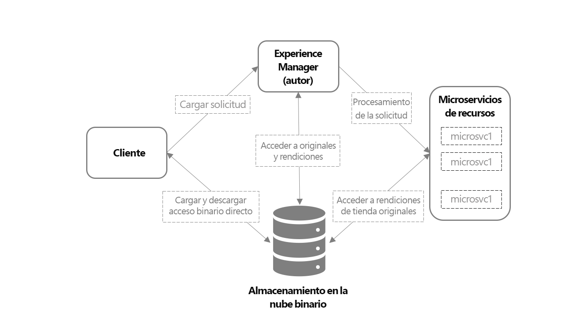

# Información general sobre la ingesta y el procesamiento de recursos con microservicios de recursos {#asset-microservices-overview}

Adobe Experience Manager as a [!DNL Cloud Service] proporciona un método nativo en la nube para utilizar las aplicaciones y las funcionalidades de Experience Manager. Uno de los elementos clave de esta nueva arquitectura es la ingesta y el procesamiento de recursos, con tecnología de microservicios de recursos. Los microservicios de recursos proporcionan un procesamiento escalable y resiliente de los recursos mediante servicios en la nube. Adobe administra los servicios de nube para una gestión óptima de los distintos tipos de recursos y opciones de procesamiento. Las ventajas clave de los microservicios de recursos nativos de la nube son los siguientes:

* Una arquitectura escalable que permite un procesamiento optimizado para operaciones que requieren muchos recursos.
* Una indexación y extracciones de texto eficaces que no afectan al rendimiento de los entornos de Experience Manager.
* Se minimiza la necesidad de flujos de trabajo para gestionar el procesamiento de recursos en el entorno de Experience Manager. Esto libera recursos, minimiza la carga en Experience Manager y proporciona escalabilidad.
* Mejora de la resiliencia del procesamiento de recursos. Los problemas potenciales al gestionar archivos atípicos, como archivos dañados o archivos extremadamente grandes, ya no afectan al rendimiento de la implementación.
* Configuración simplificada del procesamiento de recursos para los administradores.
* La configuración del procesamiento de recursos se administra y mantiene en Adobe para proporcionar la configuración más conocida para administrar representaciones, metadatos y extracción de texto para varios tipos de archivo.
* Los servicios nativos de procesamiento de archivos de Adobe se utilizan cuando corresponde, lo que proporciona una salida fiable y un [manejo eficiente de los formatos propietarios de Adobe](file-format-support.md).
* Posibilidad de configurar el flujo de trabajo posprocesamiento para añadir acciones e integraciones específicas del usuario.

Los microservicios de recursos evitan la necesidad de herramientas y métodos de procesamiento de terceros (como [!DNL ImageMagick] y la transcodificación FFmpeg) y simplifican las configuraciones, a la vez que proporcionan una funcionalidad básica para los formatos de archivo comunes de forma predeterminada.

## Arquitectura de alto nivel {#asset-microservices-architecture}

Un diagrama de arquitectura de alto nivel representa los elementos clave de la ingesta y del procesamiento de recursos y el flujo de recursos en todo el sistema.

<!-- Proposed DRAFT diagram for asset microservices overview - see section "Asset processing - high-level diagram" in the PPTX deck

https://adobe-my.sharepoint.com/personal/gklebus_adobe_com/_layouts/15/guestaccess.aspx?guestaccesstoken=jexDC5ZnepXSt6dTPciH66TzckS1BPEfdaZuSgHugL8%3D&docid=2_1ec37f0bd4cc74354b4f481cd420e07fc&rev=1&e=CdgElS
-->

Los pasos clave de la ingesta y del procesamiento mediante los microservicios de recursos son los siguientes:

* Los clientes, como los navegadores web o Adobe Asset Link, envían una solicitud de carga a [!DNL Experience Manager] y empiezan a cargar el binario directamente en el almacenamiento binario en la nube.
* Cuando se completa la carga binaria directa, el cliente lo notifica a [!DNL Experience Manager].
* [!DNL Experience Manager] envía una solicitud de procesamiento a los microservicios de recursos. El contenido de la solicitud depende de la configuración de perfiles de procesamiento de [!DNL Experience Manager] que especifique y de las representaciones que desea generar.
* El back-end de los microservicios de recursos recibe la solicitud y la envía a uno o varios microservicios en función de la solicitud. Cada microservicio accede al binario original directamente desde el almacén de nube binario.
* Los resultados del procesamiento, como las representaciones, se almacenan en el almacenamiento en la nube binario.
* Se notifica a Experience Manager de que el procesamiento se ha completado junto con punteros directos a los binarios generados (representaciones). Las representaciones generadas están disponibles en [!DNL Experience Manager] para el recurso cargado.

Este es el flujo básico de la ingesta y del procesamiento de recursos. Si está configurado, el Experience Manager también puede iniciar un modelo de flujo de trabajo personalizado para realizar el posprocesamiento del recurso. Por ejemplo, ejecuta pasos personalizados específicos de su entorno, como recuperar información de un sistema de empresa y la agrega a las propiedades del recurso.

La ingesta y el flujo de procesamiento son conceptos clave de la arquitectura de microservicios de recursos para Experience Manager.

* **Acceso binario directo**: los recursos se transportan (y se cargan) a Cloud Binary Store una vez configurados para entornos de Experience Manager y, a continuación, [!DNL Experience Manager], los microservicios de recursos y finalmente los clientes tienen acceso directo a ellos para llevar a cabo su trabajo. Esto minimiza la carga en las redes y la duplicación de binarios almacenados
* **Procesamiento externo**: el procesamiento de los recursos se realiza fuera del entorno de [!DNL Experience Manager] y guarda sus recursos (CPU, memoria) para proporcionar funcionalidades clave de la administración de activos digitales (DAM) y admitir el trabajo interactivo con el sistema para los usuarios finales.

## Carga de activos con acceso binario directo {#asset-upload-with-direct-binary-access}

Los clientes de Experience Manager, que forman parte de la oferta de productos, admiten la carga con acceso binario directo de forma predeterminada. Incluyen la carga mediante la interfaz web, Adobe Asset Link, y la aplicación de escritorio de [!DNL Experience Manager].

Puede utilizar herramientas de carga personalizadas que funcionen directamente con las API HTTP de [!DNL Experience Manager]. Puede utilizar estas API directamente o utilizar y ampliar los siguientes proyectos de código abierto que implementan el protocolo de carga:

* [Biblioteca de carga de código abierto](https://github.com/adobe/aem-upload)
* [Herramienta de línea de comandos de código abierto](https://github.com/adobe/aio-cli-plugin-aem)

Para obtener más información, consulte [Carga de recursos](add-assets.md).

## Añadir posprocesamiento de recursos personalizados {#add-custom-asset-post-processing}

Aunque la mayoría de los clientes deben obtener todos los servicios de procesamiento de recursos que los microservicios de recursos configurables necesitan, es posible que algunos necesiten un procesamiento de recursos adicional. Esto es especialmente cierto si los recursos deben procesarse en función de la información proveniente de otros sistemas mediante integraciones. En casos como este, se pueden utilizar flujos de trabajo de posprocesamiento personalizados.

Los flujos de trabajo de posprocesamiento son modelos de flujo de trabajo de [!DNL Experience Manager] normales, creados y administrados en el editor de flujo de trabajo de [!DNL Experience Manager]. Los clientes pueden configurar los flujos de trabajo para realizar pasos de procesamiento adicionales en un recurso, incluido el uso de pasos de flujo de trabajo predeterminados disponibles y flujos de trabajo personalizados.

Adobe Experience Manager se puede configurar para que active automáticamente los flujos de trabajo de posprocesamiento una vez finalizado el procesamiento de los recursos.

<!-- TBD asgupta, Engg: Create some asset-microservices-data-flow-diagram.
-->

**Consulte también**

* [Traducir recursos](translate-assets.md)
* [API HTTP de recursos](mac-api-assets.md)
* [Formatos de archivo compatibles con recursos](file-format-support.md)
* [Buscar recursos](search-assets.md)
* [Recursos de red](use-assets-across-connected-assets-instances.md)
* [Informes de recurso](asset-reports.md)
* [Esquemas de metadatos](metadata-schemas.md)
* [Descarga de recursos](download-assets-from-aem.md)
* [Administración de metadatos](manage-metadata.md)
* [Facetas de búsqueda](search-facets.md)
* [Administrar colecciones](manage-collections.md)
* [Importación masiva de metadatos](metadata-import-export.md)
* [Publicación de recursos en AEM y Dynamic Media](/help/assets/publish-assets-to-aem-and-dm.md)

>[!MORELIKETHIS]
>
>* [Introducción al uso de los microservicios de recursos](asset-microservices-configure-and-use.md)
>* [Formatos de archivo compatibles](file-format-support.md)
>* [Adobe Asset Link](https://helpx.adobe.com/es/enterprise/using/adobe-asset-link.html)
>* Aplicación de escritorio de [[!DNL Experience Manager]  ](https://experienceleague.adobe.com/docs/experience-manager-desktop-app/using/introduction.html?lang=es)
>* [Documentación de Apache Oak sobre el acceso binario directo](https://jackrabbit.apache.org/oak/docs/features/direct-binary-access.html)
