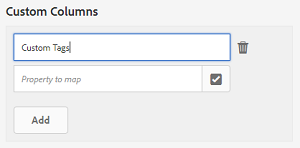

# Informes de Asset {#asset-reports}

El informe de recursos permite evaluar la utilidad de la implementación [!DNL Adobe Experience Manager Assets]. Con [!DNL Assets], puede generar varios informes para sus recursos digitales. Los informes proporcionan información útil sobre el uso del sistema, cómo interactúan los usuarios con los recursos y qué recursos se <!-- downloaded and --> comparten.

Utilice la información de los informes para derivar métricas de éxito clave con el fin de medir la adopción de [!DNL Assets] dentro de su empresa y por parte de los clientes.

El marco de informes [!DNL Assets] utiliza [!DNL Sling] trabajos para procesar de forma asincrónica las solicitudes de informes de forma ordenada. Es escalable para repositorios grandes. El procesamiento asincrónico de informes aumenta la eficacia y la velocidad con que se generan los informes.

La interfaz de administración de informes es intuitiva e incluye opciones y controles detallados para acceder a informes archivados y ver estados de ejecución de informes (éxito, error y cola).

Cuando se genera un informe, se le notifica mediante <!-- through an email (optional) and --> una notificación en la bandeja de entrada. Puede ver, descargar o eliminar un informe desde la página de lista de informes, donde se muestran todos los informes generados anteriormente.

## Generar informes {#generate-reports}

[!DNL Experience Manager Assets] genera los siguientes informes estándar:

* Cargar
* Vencimiento
* Modificación
* Publicación
* [!DNL Brand Portal] instancias de publicación
* Uso del disco
* Archivos
* Vínculos compartidos

<!-- Removed download report.
* Upload
* Download
* Expiration
* Modification
* Publish
* [!DNL Brand Portal] publish
* Disk Usage
* Files
* Link Share
-->

[!DNL Adobe Experience Manager] los administradores pueden generar y personalizar fácilmente estos informes para su implementación. Un administrador puede seguir estos pasos para generar un informe:

1. En la interfaz [!DNL Experience Manager], haga clic en **[!UICONTROL Herramientas]** > **[!UICONTROL Recursos]** > **[!UICONTROL Informes]**.

   

1. En la página [!UICONTROL Informes de recursos], haga clic en **[!UICONTROL Crear]** en la barra de herramientas.
1. En la página **[!UICONTROL Crear informe]**, elija el informe que desee crear y haga clic en **[!UICONTROL Siguiente]**.

   

1. Configure los detalles del informe como título, descripción, miniatura y ruta de carpeta en el repositorio CRX donde se almacena el informe. De forma predeterminada, la ruta de la carpeta es `/content/dam`. Puede especificar una ruta diferente.

   

   Elija el intervalo de fechas del informe. Puede elegir generar el informe ahora o en una fecha y hora futuras.

   >[!NOTE]
   >
   >Si decide programar el informe más adelante, asegúrese de especificar la fecha y la hora en los campos Fecha y Hora. Si no especifica ningún valor, el motor de informes lo considera un informe que se generará al instante.

   Los campos de configuración pueden variar según el tipo de informe que cree. Por ejemplo, el informe **[!UICONTROL Uso del disco]** proporciona opciones para incluir representaciones de recursos al calcular el espacio en disco utilizado por los recursos. Puede elegir incluir o excluir recursos en subcarpetas para el cálculo del uso del disco.

   >[!NOTE]
   >
   >El informe **[!UICONTROL Uso del disco]** no incluye campos de intervalo de fechas porque solo indica el uso actual del espacio en disco.

   

   Al crear el informe **[!UICONTROL Files]**, puede incluir/excluir subcarpetas. Sin embargo, no puede incluir representaciones de recursos para este informe.

   

   El informe **[!UICONTROL Compartir vínculos]** muestra las direcciones URL de los recursos que se comparten con usuarios externos desde [!DNL Assets]. <!-- It includes email ids of the user who shared the assets, emails ids of users with which the assets are shared, share date, and expiration date for the link. --> Las columnas no se pueden personalizar.

   El informe **[!UICONTROL Compartir vínculos]** no incluye opciones para subcarpetas y representaciones porque solo publica las direcciones URL compartidas que aparecen en `/var/dam/share`.

   

1. Haga clic en **[!UICONTROL Next]** en la barra de herramientas.

1. En la página **[!UICONTROL Configurar columnas]**, se seleccionan algunas columnas para que aparezcan en el informe de forma predeterminada. Puede seleccionar más columnas. Cancelar la selección de una columna para excluirla en el informe.

   

   Para mostrar un nombre de columna personalizado o una ruta de propiedad, configure las propiedades del binario de recursos bajo el nodo `jcr:content` en CRX. También puede agregarlo mediante el selector de rutas de propiedad.

   

1. Haga clic en **[!UICONTROL Crear]** en la barra de herramientas. Un mensaje notifica que se ha iniciado la generación del informe.
1. En la página [!UICONTROL Informes de recursos], el estado de generación de informes se basa en el estado actual del trabajo del informe, por ejemplo [!UICONTROL Éxito], [!UICONTROL Fallido], [!UICONTROL En cola] o [!UICONTROL Programado]. El mismo estado aparece en la bandeja de entrada de notificaciones. Para ver la página del informe, haga clic en el vínculo del informe. Como alternativa, seleccione el informe y haga clic en **[!UICONTROL Ver]** en la barra de herramientas.

   

   Haga clic en **[!UICONTROL Descargar]** desde la barra de herramientas para descargar el informe en formato CSV.

## Agregar columnas personalizadas a informes {#add-custom-columns}

Puede agregar columnas personalizadas a los siguientes informes para mostrar más datos según sus necesidades personalizadas:

<!-- Remove download report.
* Upload
* Download
* Expiration
* Modification
* Publish
* [!DNL Brand Portal] publish
* Files
-->

* Cargar
* Vencimiento
* Modificación
* Publicación
* [!DNL Brand Portal] instancias de publicación
* Archivos

Para agregar columnas personalizadas a estos informes, siga estos pasos:

1. En [!DNL Manager interface], haga clic en **[!UICONTROL Herramientas]** > **[!UICONTROL Recursos]** > **[!UICONTROL Informes]**.
1. En la página [!UICONTROL Informes de recursos], haga clic en **[!UICONTROL Crear]** en la barra de herramientas.

1. En la página **[!UICONTROL Crear informe]**, elija un informe para crear. Haga clic en **[!UICONTROL Siguiente]**. 

1. Configure los detalles del informe, como título, descripción, miniatura, ruta de carpeta e intervalo de fechas, según corresponda. Haga clic en **[!UICONTROL Siguiente]**. 

1. Seleccione la información aplicable en la lista de **[!UICONTROL Columnas predeterminadas]**. Para mostrar una columna personalizada, especifique el nombre de la columna en **[!UICONTROL Columnas personalizadas]**.

   

1. Añada la ruta de la propiedad bajo el nodo `jcr:content` en CRXDE utilizando el selector de rutas de la propiedad. También puede escribir la ruta en el campo de ruta de la propiedad.

   

   Para agregar más columnas personalizadas, haga clic en **[!UICONTROL Agregar]** y repita los pasos anteriores.

1. Haga clic en **[!UICONTROL Crear]** en la barra de herramientas. Un mensaje notifica que se ha iniciado la generación del informe.

<!-- TBD: How to configure purge now? Is it using OSGi configurations?

## Configure purging service {#configure-purging-service}

To remove reports that you no longer require, configure the DAM Report Purge service from the web console to purge existing reports based on their quantity and age.

1. Access the web console (configuration manager) from `https://[aem_server]:[port]/system/console/configMgr`.
1. Open the **[!UICONTROL DAM Report Purge Service]** configuration.
1. Specify the frequency (time interval) for the purging service in the `scheduler.expression.name` field. You can also configure the age and the quantity threshold for reports.
1. Save the changes.
-->

## Información sobre resolución de problemas {#tips-troubleshoot}

* Si el [!UICONTROL Informe de uso del disco] no se genera y si utiliza [!DNL Dynamic Media], asegúrese de que todos los recursos se realicen correctamente. Para resolverlo, vuelva a procesar los recursos y vuelva a generar el informe.

<!-- These notes were present in generate report section above. Removing commented text from in between the instructions to preserve the numbering of the ordered list.

TBD: How do enable this in CS now? Is it done using some OSGi config now?
   >[!NOTE]
   >
   >Before you can generate an **[!UICONTROL Asset Downloaded]** report, ensure that the Asset Download service is enabled. From the web console (`https://[aem_server]:[port]/system/console/configMgr`), open the **[!UICONTROL Day CQ DAM Event Recorder]** configuration, and select the **[!UICONTROL Asset Downloaded (DOWNLOADED)]** option in Event Types if not already selected.
-->

<!-- Removed download report.
   >[!NOTE]
   >
   >By default, the Content Fragments and link shares are included in the asset [!UICONTROL Download] report. Select the appropriate option to create a report of link shares or to exclude Content Fragments from the download report.

   >[!NOTE]
   >
   >The [!UICONTROL Download] report displays details of only those assets which are downloaded after selecting individually or are downloaded using Quick Action. However, it does not include the details of the assets that are inside a downloaded folder.
-->
