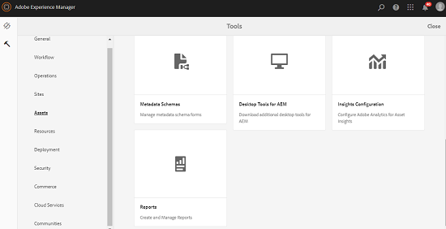

# Informes de recurso {#asset-reports}

| Versión | Vínculo del artículo |
| -------- | ---------------------------- |
| AEM 6.5 | [Haga clic aquí](https://experienceleague.adobe.com/docs/experience-manager-65/assets/administer/asset-reports.html?lang=es) |
| AEM as a Cloud Service | Este artículo |

Los informes de recursos le permiten evaluar la utilidad de su implementación de [!DNL Adobe Experience Manager Assets]. Con [!DNL Assets], puede generar varios informes para sus recursos digitales. Los informes proporcionan información útil sobre el uso del sistema, cómo los usuarios interactúan con los recursos y cuáles son los recursos compartidos de <!-- downloaded and -->.

Utilice la información de los informes para derivar métricas de éxito clave para medir la adopción de [!DNL Assets] en su empresa y por parte de los clientes.

El marco de informes [!DNL Assets] usa [!DNL Sling] trabajos de forma asincrónica para procesar solicitudes de informes de forma ordenada. Es escalable para repositorios grandes. El procesamiento asincrónico de informes aumenta la eficacia y la velocidad con que se generan los informes.

La interfaz de administración de informes es intuitiva e incluye opciones y controles específicos para acceder a informes archivados y ver los estados de ejecución de informes (correcto, fallido y en cola).

Cuando se genera un informe, se le notifica mediante <!-- through an email (optional) and --> una notificación de la bandeja de entrada. Puede ver, descargar o eliminar un informe desde la página de lista de informes, en la que se muestran todos los informes generados anteriormente.

## Generación de informes {#generate-reports}

[!DNL Experience Manager Assets] genera los siguientes informes estándar para usted:

* Cargar
* Descargar
* Vencimiento
* Modificación
* Publicación
* Publicación de [!DNL Brand Portal]
* Uso del disco
* Archivos
* Vínculos compartidos

<!-- Removed download report.
* Upload
* Download
* Expiration
* Modification
* Publish
* [!DNL Brand Portal] publish
* Disk Usage
* Files
* Link Share
-->

Los administradores de [!DNL Adobe Experience Manager] pueden generar y personalizar fácilmente estos informes para su implementación. Un administrador puede seguir estos pasos para generar un informe:

1. En la interfaz de [!DNL Experience Manager], haga clic en **[!UICONTROL Herramientas]** > **[!UICONTROL Assets]** > **[!UICONTROL Informes]**.

   

1. En la página [!UICONTROL Informes de recursos], haga clic en **[!UICONTROL Crear]** en la barra de herramientas.
1. En la página **[!UICONTROL Crear informe]**, elija el informe que desee crear y haga clic en **[!UICONTROL Siguiente]**.

   >[!NOTE]
   >
   >Asigne un título a un **perfil de producto del administrador de AEM** para crear un informe de **Descargar**. Consulte [Asignación de perfiles de producto de AEM](https://experienceleague.adobe.com/es/docs/experience-manager-cloud-service/content/onboarding/journey/assign-profiles-aem) para obtener un perfil de producto de administrador de AEM.

   

1. Configure los detalles del informe, como título, descripción, miniatura y ruta de la carpeta. De manera predeterminada, la ruta de la carpeta es `/content/dam`. Puede especificar una ruta diferente para ejecutar el informe en una carpeta específica.

   

   Elija el intervalo de fechas para el informe. Puede optar por generar el informe ahora o en una fecha y hora futuras.

   >[!NOTE]
   >
   >Si decide programar el informe más adelante, asegúrese de especificar la fecha y la hora en los campos Fecha y Hora. Si no se especifica ningún valor, el motor de informes lo trata como un informe que se va a generar instantáneamente.

   Los campos de configuración pueden variar según el tipo de informe que cree. Por ejemplo, el informe **[!UICONTROL Uso del disco]** proporciona opciones para incluir representaciones de recursos al calcular el espacio en disco utilizado por los recursos. Puede elegir incluir o excluir recursos en subcarpetas para el cálculo del uso del disco.

   >[!NOTE]
   >
   >El informe **[!UICONTROL Uso del disco]** no incluye campos de intervalo de fechas porque solo indica el uso actual del espacio en disco.

   

   Al crear el informe **[!UICONTROL Archivos]**, puede incluir o excluir subcarpetas. Sin embargo, no puede incluir representaciones de recursos para este informe.

   

   El informe **[!UICONTROL Vínculo compartido]** muestra las direcciones URL de los recursos compartidos con usuarios externos desde [!DNL Assets]. <!-- It includes email ids of the user who shared the assets, emails ids of users with which the assets are shared, share date, and expiration date for the link. -->: las columnas no se pueden personalizar.

   El informe **[!UICONTROL Vínculo compartido]** no incluye opciones para subcarpetas y representaciones porque solo publica las direcciones URL compartidas que aparecen en `/var/dam/share`.

   

1. Haga clic en **[!UICONTROL Siguiente]** en la barra de herramientas.

1. En la página **[!UICONTROL Configurar columnas]**, algunas columnas están seleccionadas para aparecer en el informe de forma predeterminada. Puede seleccionar más columnas. Cancelar la selección de una columna para excluirla en el informe.

   

   Para mostrar un nombre de columna personalizado o una ruta de acceso a la propiedad, configure las propiedades del binario de recursos en el nodo `jcr:content` en CRX. También puede agregarlo a través de un selector de ruta de propiedad.

   

1. Haga clic en **[!UICONTROL Crear]** en la barra de herramientas. Un mensaje notifica que se ha iniciado la generación del informe.
1. En la página [!UICONTROL Informes de recursos], el estado de generación de informes se basa en el estado actual del trabajo de informes como, por ejemplo, [!UICONTROL Éxito], [!UICONTROL Error], [!UICONTROL En cola] o [!UICONTROL Programado]. El mismo estado aparece en la bandeja de entrada de notificaciones. Para ver la página del informe, haga clic en el vínculo del informe. También puede seleccionar el informe y hacer clic en **[!UICONTROL Ver]** en la barra de herramientas.

   <!---->
   

   Haga clic en **[!UICONTROL Descargar]** en la barra de herramientas para descargar el informe en formato CSV.

   >[!NOTE]
   >
   >Puede generar informes basados en los eventos generados durante los últimos 360 días. Experience Manager conserva los datos del ID de usuario durante 30 días.

## Añadir columnas personalizadas a informes {#add-custom-columns}

Puede agregar columnas personalizadas a los siguientes informes para mostrar más datos para sus requisitos personalizados:

<!-- Remove download report.
* Upload
* Download
* Expiration
* Modification
* Publish
* [!DNL Brand Portal] publish
* Files
-->

* Cargar
* Vencimiento
* Modificación
* Publicación
* Publicación de [!DNL Brand Portal]
* Archivos

Para añadir columnas personalizadas a estos informes, siga estos pasos:

1. En [!DNL Manager interface], haga clic en **[!UICONTROL Herramientas]** > **[!UICONTROL Assets]** > **[!UICONTROL Informes]**.
1. En la página [!UICONTROL Informes de recursos], haga clic en **[!UICONTROL Crear]** en la barra de herramientas.

1. En la página **[!UICONTROL Crear informe]**, elija el informe que desea crear. Haga clic en **[!UICONTROL Siguiente]**.

1. Configure los detalles del informe, como título, descripción, miniatura, ruta de la carpeta e intervalo de fechas, según corresponda. Haga clic en **[!UICONTROL Siguiente]**.

1. Seleccione la información aplicable de la lista de **[!UICONTROL Columnas predeterminadas]**. Para mostrar una columna personalizada, especifique el nombre de la columna en **[!UICONTROL Columnas personalizadas]**.

   

1. Agregue la ruta de la propiedad en el nodo `jcr:content` de CRXDE mediante el selector de ruta de propiedad. También puede escribir la ruta en el campo de ruta de la propiedad.

   

   Para agregar más columnas personalizadas, haga clic en **[!UICONTROL Agregar]** y repita los pasos anteriores.

1. Haga clic en **[!UICONTROL Crear]** en la barra de herramientas. Un mensaje notifica que se ha iniciado la generación del informe.

<!-- TBD: How to configure purge now? Is it using OSGi configurations?

## Configure purging service {#configure-purging-service}

To remove reports that you no longer require, configure the DAM Report Purge service from the web console to purge existing reports based on their quantity and age.

1. Access the web console (configuration manager) from `https://[aem_server]:[port]/system/console/configMgr`.
1. Open the **[!UICONTROL DAM Report Purge Service]** configuration.
1. Specify the frequency (time interval) for the purging service in the `scheduler.expression.name` field. You can also configure the age and the quantity threshold for reports.
1. Save the changes.
-->

## Información de resolución de problemas {#tips-troubleshoot}

* Si el [!UICONTROL Informe de uso del disco] no se genera y está usando [!DNL Dynamic Media], asegúrese de que todos los recursos se procesen correctamente. Para resolverlos, vuelva a procesar los recursos y genere el informe de nuevo.

<!-- These notes were present in generate report section above. Removing commented text from in between the instructions to preserve the numbering of the ordered list.

TBD: How do enable this in CS now? Is it done using some OSGi config now?
   >[!NOTE]
   >
   >Before you can generate an **[!UICONTROL Asset Downloaded]** report, ensure that the Asset Download service is enabled. From the web console (`https://[aem_server]:[port]/system/console/configMgr`), open the **[!UICONTROL Day CQ DAM Event Recorder]** configuration, and select the **[!UICONTROL Asset Downloaded (DOWNLOADED)]** option in Event Types if not already selected.
-->

<!-- Removed download report.
   >[!NOTE]
   >
   >By default, the Content Fragments and link shares are included in the asset [!UICONTROL Download] report. Select the appropriate option to create a report of link shares or to exclude Content Fragments from the download report.

   >[!NOTE]
   >
   >The [!UICONTROL Download] report displays details of only those assets which are downloaded after selecting individually or are downloaded using Quick Action. However, it does not include the details of the assets that are inside a downloaded folder.
-->

**Consulte también**

* [Traducir recursos](translate-assets.md)
* [API HTTP de recursos](mac-api-assets.md)
* [Formatos de archivo compatibles con recursos](file-format-support.md)
* [Buscar recursos](search-assets.md)
* [Recursos de red](use-assets-across-connected-assets-instances.md)
* [Esquemas de metadatos](metadata-schemas.md)
* [Descarga de recursos](download-assets-from-aem.md)
* [Administración de metadatos](manage-metadata.md)
* [Facetas de búsqueda](search-facets.md)
* [Administrar colecciones](manage-collections.md)
* [Importación masiva de metadatos](metadata-import-export.md)
* [Publicación de recursos en AEM y Dynamic Media](/help/assets/publish-assets-to-aem-and-dm.md)
