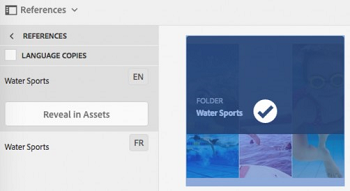

# Assets Insights {#asset-insights}

| Versión | Vínculo del artículo |
| -------- | ---------------------------- |
| AEM 6.5 | [Haga clic aquí](https://experienceleague.adobe.com/docs/experience-manager-65/assets/managing/asset-insights.html?lang=es) |
| AEM as a Cloud Service | Este artículo |

La funcionalidad Assets Insights le permite hacer un seguimiento de las clasificaciones de los usuarios y las estadísticas de uso de las imágenes que se utilizan en sitios web de terceros, campañas de marketing y las soluciones creativas de Adobe. Ayuda a obtener información sobre el rendimiento y la popularidad de las imágenes.

Assets Insights captura los detalles de la actividad del usuario, como el número de veces que se clasifica, hace clic en una imagen y las impresiones (el número de veces que se carga una imagen en el sitio web). Asigna puntuaciones a las imágenes en función de estas estadísticas. Puede utilizar las puntuaciones y las estadísticas de rendimiento para seleccionar imágenes populares para incluirlas en catálogos, campañas de marketing, etc. Incluso puede formular políticas de archivado y renovación de licencias basadas en estas estadísticas.

Para que Assets Insights capture estadísticas de uso de imágenes de un sitio web, debe incluir el código incrustado de la imagen en el código del sitio web.

Para permitir que Assets Insights muestre las estadísticas de uso de los recursos, primero configure la característica para recuperar los datos de informes de [!DNL Adobe Analytics]. Para obtener más información, consulte [Configuración de Assets Insights](#configure-asset-insights). Para usar esta característica, compre la licencia de [!DNL Adobe Analytics] por separado.

>[!NOTE]
>
>Las perspectivas son compatibles y se proporcionan solo para imágenes.

## Visualización de estadísticas de una imagen {#viewing-statistics-for-an-image}

Puede ver las puntuaciones de Assets Insights desde la página de metadatos.

1. En la interfaz de usuario de Assets, seleccione la imagen y, a continuación, haga clic en **[!UICONTROL Propiedades]** en la barra de herramientas.
1. En la página Propiedades, haga clic en **[!UICONTROL Información]**.
1. Revise los detalles de uso del recurso en la ficha **[!UICONTROL Información]**. La sección **[!UICONTROL Puntuación]** describe el uso total de recursos y las puntuaciones de rendimiento de un recurso

   La puntuación de uso describe el número de veces que el recurso se utiliza en varias soluciones.

   La puntuación **[!UICONTROL Impresiones]** es el número de veces que el recurso se carga en el sitio web. El número mostrado bajo **[!UICONTROL Clics]** es el número de veces que se hace clic en el recurso.

1. Revise la sección **[!UICONTROL Estadísticas de uso]** para saber de qué entidades formaba parte el recurso y qué soluciones creativas lo utilizaron recientemente. Cuanto mayor sea el uso, mayores serán las probabilidades de que el recurso sea popular entre los usuarios. Los datos de uso se muestran bajo los siguientes encabezados:

   * **[!UICONTROL Recurso]**: el número de veces que el recurso formaba parte de una colección o de un recurso compuesto.
   * **[!UICONTROL Web y dispositivos móviles]**: La cantidad de veces que el recurso formaba parte de sitios web y aplicaciones.
   * **[!UICONTROL Social]**: El número de veces que el recurso se usó en otras soluciones como [!DNL Adobe Campaign].
   * **[!UICONTROL Correo electrónico]**: El número de veces que el recurso se usó en campañas de correo electrónico.

   

   >[!NOTE]
   >
   >Debido a que la característica Assets Insights generalmente obtiene los datos de soluciones de [!DNL Adobe Analytics] de manera periódica, es posible que la sección Soluciones no muestre los datos más recientes. El período de tiempo durante el cual se muestran los datos depende de la programación de la operación de recuperación que ejecuta Assets Insights para recuperar datos de Analytics.

1. Para ver las estadísticas de rendimiento del recurso gráficamente durante un período de tiempo, seleccione el período en la sección **[!UICONTROL Estadísticas de rendimiento]**. Los detalles, incluidos los clics y las impresiones, se muestran como líneas de tendencia de un gráfico.

   

   >[!NOTE]
   >
   >A diferencia de los datos de la sección Soluciones, la sección Estadísticas de rendimiento muestra los datos más recientes.

1. Para obtener el código incrustado del recurso que incluye en los sitios web a fin de obtener datos de rendimiento, haga clic en **[!UICONTROL Obtener código incrustado]** debajo de la miniatura del recurso. <!-- For more information on how to include your Embed code in third-party web pages, see [Using Page Tracker and Embed code in web pages](/help/assets/use-page-tracker.md). -->

   

## Visualización de estadísticas acumuladas de imágenes {#viewing-aggregate-statistics-for-images}

Puede ver las puntuaciones de todos los recursos de una carpeta simultáneamente mediante la **[!UICONTROL Vista de la información]**.

1. En la interfaz de usuario de Assets, vaya a la carpeta que contiene los recursos para los que desea ver información.
1. Haga clic en la opción **[!UICONTROL Diseño]** de la barra de herramientas y, a continuación, elija **[!UICONTROL Vista de la información]**.
1. La página muestra las puntuaciones de uso de los recursos. Compare las clasificaciones de los distintos recursos y obtenga información.

<!-- TBD: Commenting as Web Console is not available. Document the appropriate OSGi config method if available in CS.

## Schedule background job {#scheduling-background-job}

Assets Insights fetches usage data for assets from Adobe Analytics report suites in a periodic manner. By default, Assets Insights runs a background job every 24 hours at 2 AM to the fetch data. However, you can modify both the frequency and the time by configuring the **[!UICONTROL Adobe CQ DAM Asset Performance Report Sync Job]** service from the web console.

1. Click the [!DNL Experience Manager] logo, and go to **[!UICONTROL Tools]** > **[!UICONTROL Operations]** > **[!UICONTROL Web Console]**.
1. Open the **[!UICONTROL Adobe CQ DAM Asset Performance Report Sync Job]** service configuration.

   

1. Specify the desired scheduler frequency and the start time for the job in the property scheduler expression. Save the changes.
-->

## Configuración de Assets Insights {#configure-asset-insights}

[!DNL Experience Manager Assets] obtiene datos de uso de recursos digitales utilizados por sitios web de terceros de [!DNL Adobe Analytics]. Para permitir que Assets Insights recupere estos datos y genere información, primero configure la característica para integrarla con [!DNL Adobe Analytics].

>[!NOTE]
>
>Las perspectivas solo son compatibles y se proporcionan para las imágenes.

1. En [!DNL Experience Manager], haga clic en **[!UICONTROL Herramientas]** > **[!UICONTROL Assets]**.

   

1. Haga clic en la tarjeta **[!UICONTROL Configuración de información]**.

1. Para obtener la información de acceso al servicio web de Analytics, ve a **[!UICONTROL Analytics]** > **[!UICONTROL Admin]** > **[!UICONTROL Herramientas de administración]** > **[!UICONTROL Configuración de la empresa]** > **[!UICONTROL Servicios web]** y copia la clave de **[!UICONTROL Secreto compartido]**.

   En el asistente, seleccione el **[!UICONTROL Centro de datos]**, proporcione el nombre para mostrar de **[!UICONTROL Compañía]**, **[!UICONTROL Nombre de usuario]** de Servicios Web y pegue la clave **[!UICONTROL Secreto compartido]**.

   Haga clic en **[!UICONTROL Autenticar]**.

   ![Configurar Adobe Analytics para las estadísticas de Assets en [!DNL Experience Manager]](assets/analytics-insight-config.png)

   *Figura: Configuración de Adobe Analytics para las perspectivas de Assets en[!DNL Experience Manager]*

1. Si la autenticación se realiza correctamente, los grupos de informes aparecen en la lista desplegable. Seleccione el **[!UICONTROL grupo de informes]** de Adobe Analytics del que quiere que Assets Insights obtenga datos. Haga clic en **[!UICONTROL Agregar]**.

1. Una vez que [!DNL Experience Manager] haya configurado el grupo de informes, haga clic en **[!UICONTROL Listo]**.

Para obtener más información, consulte [Servicios web de Adobe Analytics](https://experienceleague.adobe.com/docs/analytics/admin/company-settings/web-services-admin.html?lang=es#api-access-information).

### Rastreador de página {#page-tracker}

Después de configurar la cuenta de Adobe Analytics, se genera el código de seguimiento de página. Para permitir que Assets Insights rastree los recursos de [!DNL Experience Manager] utilizados en sitios web de terceros, incluya el código de rastreador de páginas en el código del sitio web. Utilice la utilidad Rastreador de páginas de Assets para generar el código de rastreador de páginas. <!--  For more information on how to include your Page Tracker code in third-party web pages, see [Using Page Tracker and Embed code in web pages](/help/assets/use-page-tracker.md). -->

1. En [!DNL Experience Manager], haga clic en **[!UICONTROL Herramientas]** > **[!UICONTROL Assets]**.

   

1. En la página **[!UICONTROL Navegación]**, haga clic en la tarjeta **[!UICONTROL Rastreador de páginas de perspectivas]**.
1. Haga clic en **[!UICONTROL Descargar]** para descargar el código de rastreador de páginas.

<!--
Add page tracker code, CQDOC-18045, 30/07/2021
-->
El siguiente fragmento de código de ejemplo muestra el código de seguimiento de página incluido en una página web de ejemplo:

```xml
 <head>
            <script type="text/javascript" src="http://localhost:4502/xxxx/etc.clientlibs/dam/clientlibs/sitecatalyst/appmeasurement.js"></script>
            <script type="text/javascript" src="http://localhost:4502/xxxx/etc.clientlibs/dam/clientlibs/foundation/assetinsights/pagetracker.js"></script>
            <script type="text/javascript">
                                assetAnalytics.attrTrackable = 'trackable';
                assetAnalytics.defaultTrackable = false;
                assetAnalytics.attrAssetID = 'aem-asset-id';
                assetAnalytics.assetImpressionPollInterval = 200; // interval in millis
                assetAnalytics.charsLimitForGET = 2000; // bytes
                assetAnalytics.dispatcher.init("assetstesting","abc.net","bee","list1","eVar3","event8","event7");
            </script>

 </head>
```


<!--

## Using demo package for Assets Insights {#using-demo-package-for-asset-insights}

Using the demo package, you can enable Adobe Assets Insights to capture data from and generate insights for a sample web page.

1. Configure Assets Insights using the instructions in [Configure Assets Insights](#configure-asset-insights).
1. Download the sample [!DNL Experience Manager Assets] package from below and install the package from CRXDE package manager.

   [Get File](assets/insightsdemo.zip)

1. Download the ZIP file containing the sample web page from below and extract on your local file system.

   [Get File](assets/demosite.zip)

1. Click the web page to open it in the web browser.

   >[!CAUTION]
   >
   >Web Page is configured to load asset from the localhost server . In case your server is running somewhere else change server address from localhost to server address in the HTML content of the web page.

   >[!NOTE]
   >
   >The external web page can be in [!DNL Experience Manager] itself.

-->

**Consulte también**

* [Traducir recursos](translate-assets.md)
* [API HTTP de recursos](mac-api-assets.md)
* [Formatos de archivo compatibles con recursos](file-format-support.md)
* [Buscar recursos](search-assets.md)
* [Recursos de red](use-assets-across-connected-assets-instances.md)
* [Informes de recurso](asset-reports.md)
* [Esquemas de metadatos](metadata-schemas.md)
* [Descarga de recursos](download-assets-from-aem.md)
* [Administración de metadatos](manage-metadata.md)
* [Facetas de búsqueda](search-facets.md)
* [Administrar colecciones](manage-collections.md)
* [Importación masiva de metadatos](metadata-import-export.md)
* [Publicación de recursos en AEM y Dynamic Media](/help/assets/publish-assets-to-aem-and-dm.md)
