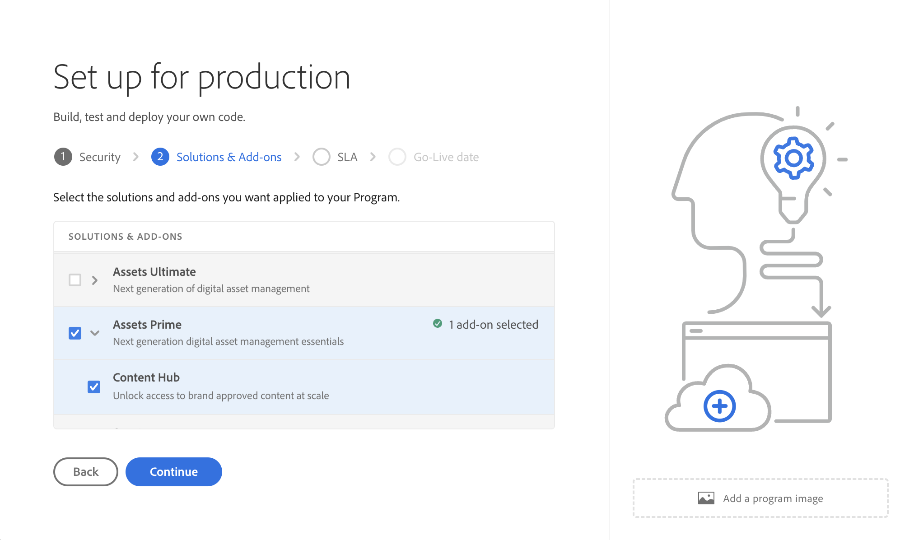

# [!DNL Assets] as a Cloud Service Prime  {#assets-prime}

<table>
    <tr>
        <td>
            <i>Nuevo</i> <a href="/help/assets/dynamic-media/dm-prime-ultimate.md"><b>Dynamic Media Prime y Ultimate</b></a>
        </td>
        <td>
            <i>Nuevo</i> <a href="/help/assets/assets-ultimate-overview.md"><b>AEM Assets Ultimate</b></a>
        </td>
        <td>
            <i>Nuevo</i> <a href="/help/assets/integrate-aem-assets-edge-delivery-services.md"><b>Integración de AEM Assets con Edge Delivery Services</b></a>
        </td>
        <td>
            <i>New</i> <a href="/help/assets/aem-assets-view-ui-extensibility.md"><b>Extensibilidad de la IU</b></a>
        </td>
          <td>
            <i>Nuevo</i> <a href="/help/assets/dynamic-media/enable-dynamic-media-prime-and-ultimate.md"><b>Habilitar Dynamic Media Prime y Ultimate</b></a>
        </td>
    </tr>
    <tr>
        <td>
            <a href="/help/assets/search-best-practices.md"><b>Prácticas recomendadas de búsqueda</b></a>
        </td>
        <td>
            <a href="/help/assets/metadata-best-practices.md"><b>Prácticas recomendadas de metadatos</b></a>
        </td>
        <td>
            <a href="/help/assets/product-overview.md"><b>Centro de contenido</b></a>
        </td>
        <td>
            <a href="/help/assets/dynamic-media-open-apis-overview.md"><b>Dynamic Media con funciones de OpenAPI</b></a>
        </td>
        <td>
            <a href="https://developer.adobe.com/experience-cloud/experience-manager-apis/"><b>Documentación de desarrollador de AEM Assets</b></a>
        </td>
    </tr>
</table>

Assets as a Cloud Service Prime incluye un DAM ligero que le permite realizar varias funciones clave, como las siguientes:

* **Servicios de biblioteca y administración de recursos**: herramientas que permiten a los usuarios ingestar, almacenar, catalogar, controlar, administrar y gobernar los recursos digitales de una marca en un repositorio centralizado

* **Búsqueda, descubrimiento y colaboración**: herramientas que permiten a los usuarios examinar, descubrir, colaborar y compartir los recursos que necesitan para crear experiencias de cliente enriquecidas.

* **Seguridad y Rights Management**: herramientas para administrar el acceso, los permisos, los derechos y la seguridad con el fin de garantizar el cumplimiento, la coherencia y la integridad de la marca.

* **Conexiones de Creative Cloud**: herramientas que permiten a los equipos creativos y de marketing colaborar con el acceso simplificado, los comentarios, la revisión y las anotaciones para actualizar o finalizar los recursos digitales.

* **Conexiones de Experience Cloud**: herramientas para admitir el acceso nativo a recursos digitales desde otras aplicaciones y servicios de Experience Cloud.

* **Experiencia del portal de distribución sin opciones de extensibilidad (Content Hub)**: Herramientas para ampliar el acceso a los recursos digitales aprobados de una marca a las partes interesadas extendidas a fin de garantizar el uso y la coherencia de la marca.

* **Integraciones**: integraciones con otras aplicaciones de Adobe y que no sean de Adobe.

* **Dynamic Media (complemento)**: herramientas para transformar y enviar imágenes, vídeos y otro contenido emergente para experiencias multimedia interactivas enriquecidas para cualquier dispositivo a escala.

  >[!NOTE]
  >
  >Dynamic Media con capacidades OpenAPI, que le proporciona acceso a modificadores de imagen básicos como rotar, recortar (solo manual: sin recorte inteligente), voltear, alto, ancho, calidad, formato y flujo de vídeo adaptable, también está disponible con Assets Prime. Póngase en contacto con el equipo de la cuenta de Adobe para obtener más información.

1. [Crear un nuevo programa](/help/journey-onboarding/create-program.md).

Sin embargo, a medida que sus necesidades de DAM crezcan y necesite más funcionalidades, como extensibilidad de la interfaz de usuario, automatización impulsada por API e implementación de código personalizado, debe considerar la posibilidad de actualizar a [Assets Ultimate](/help/assets/assets-ultimate-overview.md).

Este artículo proporciona un flujo de trabajo completo para habilitar Assets as a Cloud Service Prime.

## Habilitar Assets as a Cloud Service Prime{#enable-assets-prime}

Habilite Assets Prime al crear un nuevo programa con Cloud Manager. Ejecute los siguientes pasos:

1. Inicie sesión en Cloud Manager como administrador del sistema. Asegúrese de seleccionar la organización correcta al iniciar sesión.

   >[!NOTE]
   >
   >Asegúrese de que está añadido al perfil de producto de Cloud Manager correspondiente para añadir un nuevo programa. Para obtener más información, consulte [Permisos basados en roles en Cloud Manager](/help/onboarding/cloud-manager-introduction.md#role-based-permissions).

1. [Crear un nuevo programa](/help/journey-onboarding/create-program.md).

   Al crear el nuevo programa, en la ficha **[!UICONTROL Soluciones y complementos]**, seleccione **[!UICONTROL Assets Prime]**. También puede expandir **[!UICONTROL Assets Prime]** y seleccionar **[!UICONTROL Content Hub]** para habilitar [Content Hub](/help/assets/product-overview.md) para la distribución de recursos.

   

1. Haga clic en **[!UICONTROL Crear]** para crear el programa.

1. Haga clic en la tarjeta de programa y luego en **[!UICONTROL Agregar entorno]**.

1. Especifique el nombre del entorno, defina una región y haga clic en **[!UICONTROL Guardar]** para crear el entorno.

   

>[!NOTE]
>
>Assets Prime solo le permite crear un entorno de producción. La opción Añadir entorno ya no está disponible una vez que el entorno de producción se ha creado correctamente.

Assets Prime ahora está habilitado para Experience Manager Assets as a Cloud Service.

El administrador del sistema tiene automáticamente derecho de administrador de AEM y recibe un correo electrónico para ir a Admin Console y administrar los perfiles de producto.

La instancia de AEM as a Cloud Service en Admin Console consta de los siguientes perfiles de producto:

* Administradores de AEM

* Usuarios de AEM 

* [Usuarios colaboradores de AEM Assets](#onboard-collaborator-users)

* [Usuarios avanzados de AEM Assets](#onboard-power-users)

Puede empezar a añadir usuarios o grupos de usuarios a los perfiles de producto de AEM Assets, usuarios de Collaborator y usuarios avanzados de AEM Assets. Para obtener más información, consulte [AEM Assets incorporados, usuarios colaboradores](#onboard-collaborator-users) y [AEM Assets incorporados, usuarios avanzados](#onboard-power-users).

Si ha habilitado Content Hub para Assets as a Cloud Service, hay una nueva instancia creada dentro de AEM Assets as a Cloud Service en Admin Console con `delivery` como sufijo:

>[!NOTE]
>
>Si ha aprovisionado Content Hub antes del 14 de agosto de 2024, la nueva instancia se creará con `contenthub` como sufijo.

Tenga en cuenta que no hay `author` ni `publish` en el nombre de instancia de Content Hub.

Haga clic en el nombre de la instancia para ver el perfil de producto de Content Hub `AEM Assets Limited Users`.

Puede empezar a añadir usuarios o grupos de usuarios a este perfil de producto para proporcionarles acceso a Content Hub.

>[!NOTE]
>
>Si ha aprovisionado Content Hub antes del 14 de agosto de 2024, el perfil de producto de Content Hub tiene `contenthub` mencionado después de `Limited Users` en lugar de `delivery`.

## Incorporación de usuarios de AEM Assets Collaborator {#onboard-collaborator-users}

AEM Assets Los usuarios de Collaborator pueden trabajar con recursos de Experience Manager mediante integraciones de Assets disponibles para su organización en otros productos de Adobe y aplicaciones que no sean de Adobe, crear y editar recursos mediante Adobe Express y Firefly integrados aprovechando las plantillas, los kits de marca, los recursos de Adobe Stock, etc. de diseño profesional, y acceder a los recursos aprobados de su organización y aprovecharlos mediante el portal de AEM Assets Content Hub.

Para incorporar usuarios de Collaborator:

1. Para acceder a los perfiles de producto de Experience Manager Assets, haga clic en el nombre del producto de AEM as a Cloud Service en la lista de productos en Admin Console.

1. Haga clic en la instancia de autor de producción para AEM as a Cloud Service:
   

1. Haga clic en el perfil de producto Usuarios de Collaborators y luego en **[!UICONTROL Agregar usuarios]** para agregar el usuario al perfil de producto.
   

1. Haga clic en **[!UICONTROL Guardar]** para guardar los cambios.

También puede acceder y ver los servicios asignados a los usuarios de Collaborator, como se muestra en la siguiente imagen:

Los servicios `Adobe Express` y `AEM Assets Collaborator Users` están habilitados de manera predeterminada. Puede desactivar y activar la opción según sus necesidades; sin embargo, Adobe recomienda utilizar los servicios predeterminados habilitados para los perfiles de producto.

## AEM Assets integrados Usuarios avanzados {#onboard-power-users}

AEM Assets Los usuarios avanzados pueden acceder a todas las funciones de los AEM Assets, incluida la administración de recursos, permisos, metadatos, y al control y la automatización generales de los recursos digitales, trabajar con recursos de Experience Manager mediante integraciones de Assets disponibles para su organización en otras aplicaciones de Adobe y que no sean de Adobe, crear y editar recursos mediante Adobe Express y Firefly integrados que aprovechan las plantillas de diseño profesional, los kits de marca, los recursos de Adobe Stock, etc., y acceder a los recursos aprobados de su organización y aprovecharlos mediante el portal de AEM Assets de Content Hub.

Para incorporar usuarios avanzados:

1. Para acceder a los perfiles de producto de Experience Manager Assets, haga clic en el nombre del producto de AEM as a Cloud Service en la lista de productos en Admin Console.

1. Haga clic en la instancia de autor de producción para AEM as a Cloud Service:
   

1. Haga clic en el perfil de producto Usuarios avanzados y haga clic en **[!UICONTROL Agregar usuarios]** para agregar el usuario al perfil de producto.
   

1. Haga clic en **[!UICONTROL Guardar]** para guardar los cambios.

También puede acceder y ver los servicios asignados a usuarios avanzados, como se muestra en la siguiente imagen:

Los servicios `Adobe Express` y `AEM Assets Power Users` están habilitados de manera predeterminada. Puede desactivar y activar la opción según sus necesidades; sin embargo, Adobe recomienda utilizar los servicios predeterminados habilitados para los perfiles de producto.
