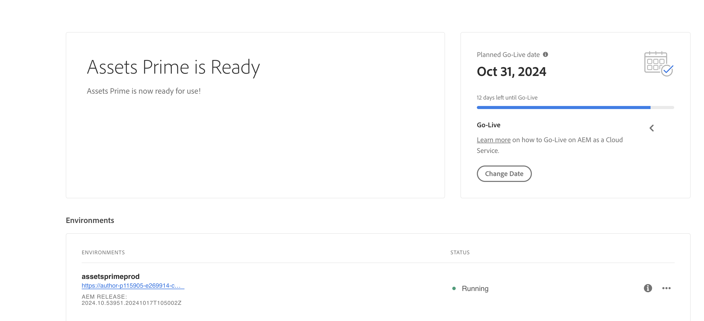

# [!DNL Assets] de as a Cloud Service calidad  {#assets-prime}

| [Prácticas recomendadas de búsqueda](/help/assets/search-best-practices.md) | [Prácticas recomendadas de metadatos](/help/assets/metadata-best-practices.md) | [Centro de contenido](/help/assets/product-overview.md) | [Dynamic Media con funciones de OpenAPI](/help/assets/dynamic-media-open-apis-overview.md) | [Documentación de desarrollador de AEM Assets](https://developer.adobe.com/experience-cloud/experience-manager-apis/) |
| ------------- | --------------------------- |---------|----|-----|

Assets as a Cloud Service Prime includes a lightweight DAM that enables you to perform various key capabilities, such as:

* ****

* ****

* ****

* ****

* ****

* ****

* ****

* ****

This article provides an end-to-end workflow to enable Assets as a Cloud Service Prime.

## Habilitar Assets as a Cloud Service Prime{#enable-assets-prime}

Habilite Assets Prime al crear un nuevo programa con Cloud Manager. Ejecute los siguientes pasos:

1. Inicie sesión en Cloud Manager como administrador del sistema. Ensure that you select the right organization while logging in.

   >[!NOTE]
   >
   >Ensure that you are added to the appropriate Cloud Manager product profile to add a new program. 

1. [Crear un nuevo programa](/help/journey-onboarding/create-program.md).

   Al crear el nuevo programa, en la ficha **[!UICONTROL Soluciones y complementos]**, seleccione **[!UICONTROL Assets Prime]**. También puede expandir **[!UICONTROL Assets Prime]** y seleccionar **[!UICONTROL Content Hub]** para habilitar [Content Hub](/help/assets/product-overview.md) para la distribución de recursos.

   

1. Haga clic en **[!UICONTROL Crear]** para crear el programa.

1. Haga clic en la tarjeta de programa y luego en **[!UICONTROL Agregar entorno]**.

1. ****

   

>[!NOTE]
>
>Assets Prime only allows you to create a production environment. The option to Add environment is no longer available once the production environment is created successfully.

Assets Prime is now enabled for Experience Manager Assets as a Cloud Service.

System administrator is automatically entitled as AEM administrator and receives an email to navigate to Admin Console to manage product profiles.

Your AEM as a Cloud Service instance on Admin Console comprises the following product profiles:

* AEM Administrators

* Usuarios de AEM 

* [AEM Assets Collaborator Users](#onboard-collaborator-users)

* [AEM Assets Power Users](#onboard-power-users)

Puede empezar a añadir usuarios o grupos de usuarios a los perfiles de producto de Usuarios de AEM Assets Collaborator y Usuarios avanzados de AEM Assets. Para obtener más información, consulte [Incorporar usuarios de AEM Assets Collaborator](#onboard-collaborator-users) y [Incorporar usuarios de AEM Assets Power](#onboard-power-users).

`delivery`

>[!NOTE]
>
>`contenthub`

`author``publish`

`AEM Assets Limited Users`

You can start adding users or user groups to this product profile to provide them access to Content Hub.

>[!NOTE]
>
>`contenthub``Limited Users``delivery`

## Onboard AEM Assets Collaborator users {#onboard-collaborator-users}

AEM Assets Collaborator users can work with assets from Experience manager via integrations of Assets available to your organization in other Adobe products and non-Adobe applications, create and edit assets using built-in Adobe Express and Firefly leveraging professionally designed templates, brand kits, Adobe Stock assets, and so on, and access and leverage approved assets from your organization using AEM Assets Content Hub portal.

To onboard Collaborator users:

1. Access Experience Manager Assets product profiles by clicking the AEM as a Cloud Service product name in the list of products on Admin Console.

1. Click the production author instance for AEM as a Cloud Service:
   

1. Haga clic en el perfil de producto Usuarios de Collaborators y luego en **[!UICONTROL Agregar usuarios]** para agregar el usuario al perfil de producto.
   

1. Haga clic en **[!UICONTROL Guardar]** para guardar los cambios.

También puede acceder y ver los servicios asignados a los usuarios de Collaborator, como se muestra en la siguiente imagen:

Los servicios `Adobe Express` y `AEM Assets Collaborator Users` están habilitados de manera predeterminada. Puede desactivar y activar la opción según sus necesidades; sin embargo, Adobe recomienda utilizar los servicios predeterminados habilitados para los perfiles de producto.

## Incorporación de usuarios avanzados de AEM Assets {#onboard-power-users}

Los usuarios avanzados de AEM Assets pueden acceder a todas las funciones de AEM Assets, incluida la administración de recursos, permisos, metadatos y al control y la automatización generales de los recursos digitales, trabajar con recursos de Experience Manager mediante integraciones de Assets disponibles para su organización en otras aplicaciones de Adobe y que no sean de Adobe, crear y editar recursos con Adobe Express y Firefly integrados aprovechando las plantillas diseñadas profesionalmente, los kits de marca, los recursos de Adobe Stock, etc., y acceder y aprovechar los recursos aprobados de su organización mediante AEM Assets Content Hub Portal.

Para incorporar usuarios avanzados:

1. Acceda a los perfiles de producto de Experience Manager Assets haciendo clic en el nombre del producto de AEM as a Cloud Service en la lista de productos en el Admin Console.

1. Click the production author instance for AEM as a Cloud Service:
   

1. ****
   

1. ****

You can also access and view the services assigned to Power users, as depicted in the following image:

`Adobe Express``AEM Assets Power Users` You can turn the toggle off and on, as per your requirements, however, Adobe recommends to use the default services enabled for the product profiles.
