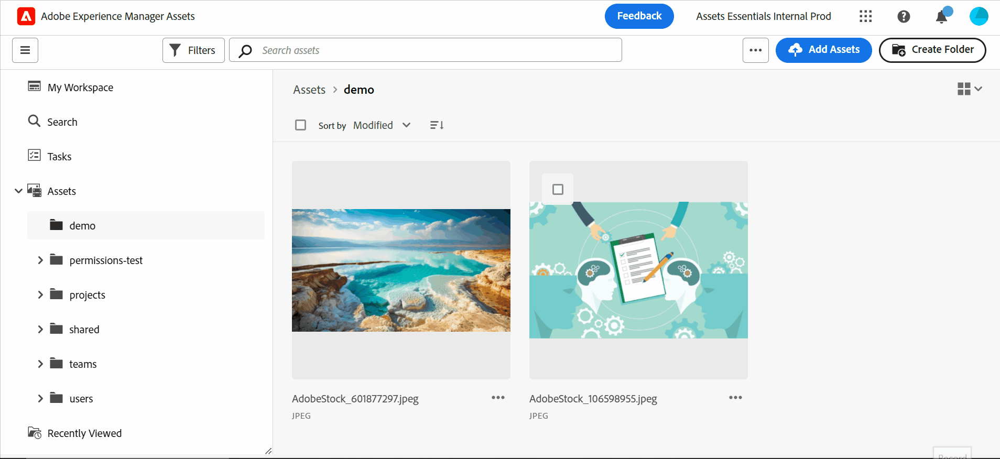

# Presentación de la nueva IU de AEM Assets {#assets-view}

En el acelerado panorama actual de acceso digital, donde la creación y entrega de contenido en tiempo real son esenciales, una experiencia de administración de activos digitales (DAM) diseñada para la velocidad de marketing descendente es primordial. Adobe, aprovechando su experiencia en el empoderamiento de los profesionales creativos y de marketing, presenta una nueva experiencia de usuario que cambia el juego. Este enfoque, que da prioridad al flujo de trabajo, revoluciona la forma en que las empresas gestionan sus activos digitales dinámicos, lo que permite a los especialistas en marketing maximizar la eficacia a la hora de buscar, colaborar, personalizar y entregar recursos. Estos flujos de trabajo optimizados aceleran la velocidad del contenido e impulsan los esfuerzos de marketing a otro nivel.

Para obtener más información sobre las experiencias basadas en personas disponibles para Assets as a Cloud Service, consulte [Introducción a Assets as a Cloud Service](/help/assets/overview.md#persona-based-experiences).

## ¿Cómo acceder a la nueva interfaz de usuario de AEM Assets? {#access-assets-view}

Puede acceder a la nueva interfaz de usuario de AEM Assets o a la nueva vista de AEM Assets de las siguientes maneras:

<!--

* **Toggle in Admin view**

    * Log into [!DNL Experience Manager] using Cloud Manager.
    * Navigate to **[!UICONTROL Assets]** > **[!UICONTROL Files]**.
    * Click the profile icon on the top right corner.
    * Click **[!UICONTROL Switch View]** from the **[!UICONTROL Profile Settings]** section.
    Repeat these steps to switch back to the Admin view.

* **Product Switcher**
    * Log into [!DNL Experience Manager] and click .
    * Select **[!UICONTROL Experience Manager Assets]** to access the Assets view.
    * Select **[!UICONTROL Experience Manager]** to access the Admin view.

* **Quick Links** 
    * Log into experience.adobe.com.
    * Click **[!UICONTROL Experience Manager Assets]** to access the Assets view.
    * Click **[!UICONTROL Experience Manager Assets]** to access the Assets view.

    -->

## ¿Por qué la nueva vista de AEM Assets?

La nueva interfaz de usuario de AEM Assets ofrece las siguientes ventajas clave que no están disponibles en la vista de administración:

* [Mi tablero de Workspace para ofrecer experiencias optimizadas](#my-workspace-for-streamlined-experience)
* [Enfoque de búsqueda para mejorar la eficacia](#search-first)
* [Perspectivas para tomar decisiones basadas en datos](#insights-data)
* [Integración de Adobe Photoshop Express para acelerar la colaboración](#accelerate-collaboration)
* [Cargas de carpetas para configurar la estructura jerárquica de su organización](#folder-uploads)
* [Suscripción al contenido del repositorio para una administración eficiente de los recursos](#subscribe-content)
* [Eliminación suave de recursos para proporcionar un mejor control a los administradores](#soft-delete-assets)

### Mi tablero de Workspace para ofrecer experiencias optimizadas {#my-workspace-for-streamlined-experience}

Diga hola a una solución de administración de activos digitales que comprende las diversas necesidades de diferentes funciones organizativas. La nueva y elegante vista de la interfaz de usuario de AEM Assets da prioridad a la facilidad de uso y la velocidad, según la preferencia de los especialistas en marketing por el atractivo visual y los espacios de trabajo sin desorden. Con un panel de Mi espacio de trabajo personalizable y específico del usuario, los especialistas en marketing pueden encontrar, previsualizar, editar, administrar y entregar recursos rápidamente con una eficacia notable. Despídase de las interminables horas invertidas en la búsqueda de activos específicos y dé la bienvenida a una experiencia optimizada que ponga todo lo que necesita al alcance de su mano.

### Perspectivas para tomar decisiones basadas en datos {#insights-data}

Para mantener el ritmo de la velocidad del contenido, son esenciales perspectivas procesables. La nueva experiencia de la interfaz de usuario de AEM Assets ofrece perspectivas avanzadas dentro de Mi espacio de trabajo, lo que proporciona datos valiosos sobre el rendimiento del recurso, el uso de la audiencia y las participaciones. Los especialistas en marketing pueden tomar decisiones basadas en datos, optimizar las estrategias de contenido y refinar su envío descendente para lograr resultados óptimos. Con acceso a perspectivas significativas, las empresas pueden mantenerse por delante de la competencia e impulsar resultados excepcionales.

### Integración de Adobe Photoshop Express para acelerar la colaboración {#accelerate-collaboration}

La nueva experiencia ofrece un sólido conjunto de funciones de colaboración, incluida la edición en tiempo real con funciones integradas de Adobe Photoshop, controles de versión y herramientas de anotación. Esto permite una colaboración perfecta entre los equipos de diseño, creativos, de marca y de marketing, lo que les permite superar cuellos de botella y acelerar el proceso de operaciones de marketing. Los especialistas en marketing ahora tienen a su disposición potentes herramientas para acelerar la entrega de proyectos y aumentar su productividad general.

Vea este vídeo para comprender el poder de la nueva integración de la interfaz de usuario de AEM Assets con Adobe Photoshop Express:

>[!VIDEO](https://video.tv.adobe.com/v/3420922)

Las próximas versiones para Assets as a Cloud Service también incluirían [Integración de Adobe Firefly mediante Adobe Express](https://firefly.adobe.com/?gclid=EAIaIQobChMIlZeKuNfj_wIVeyCtBh3e5g2cEAAYASAAEgL56_D_BwE&amp;sdid=JM4FW6VL&amp;mv=search&amp;mv2=paidsearch&amp;ef_id=EAIaIQobChMIlZeKuNfj_wIVeyCtBh3e5g2cEAAYASAAEgL56_D_BwE:G:s&amp;s_kwcid=AL!3085!3!652077237594!e!!g!!adobe%20firefly!19870733758!148140507838).

### Cargas de carpetas para configurar la estructura jerárquica de su organización {#folder-uploads}

Configure rápidamente una estructura de carpetas para su organización mediante la nueva interfaz de usuario de AEM Assets cargando carpetas que existan en el sistema de archivos local. No es necesario crear carpetas bajo la carpeta raíz y luego cargar los recursos en esas carpetas manualmente para mantener la estructura jerárquica lógica. Todas las carpetas y recursos de la carpeta raíz se cargan automáticamente en Experience Manager Assets.

### Enfoque de búsqueda para mejorar la eficacia {#search-first}

Libere el potencial de la biblioteca de recursos digitales de su organización con la potencia de la búsqueda con la funcionalidad de vanguardia. Puede despedirse de la molestia de tamizar manualmente innumerables archivos y carpetas. Cualquier usuario puede localizar al instante la imagen, el vídeo o el documento perfectos que necesita para crear campañas de marketing impresionantes, presentaciones cautivadoras y contenido atractivo. Nuestro primer motor de búsqueda le permite navegar sin esfuerzo por los tipos de recursos, los metadatos, las etiquetas inteligentes e incluso el contenido en sí sin saber la palabra clave exacta. Adopte el futuro de DAM con nuestro servicio Search-First y libere todo el potencial de su biblioteca de recursos digitales.

### Suscripción al contenido del repositorio para una administración eficiente de los recursos {#subscribe-content}

La nueva interfaz de usuario de AEM Assets permite supervisar las operaciones realizadas en los recursos, carpetas o colecciones disponibles en el repositorio. Debe seleccionar y suscribirse al contenido para el que se le envían las notificaciones. También puede configurar los tipos de eventos, como la eliminación del contenido suscrito, las modificaciones del contenido suscrito, etc. A continuación, las notificaciones se envían únicamente para esos tipos de eventos.

### Eliminación suave de recursos para proporcionar un mejor control a los administradores {#soft-delete-assets}

La carpeta Papelera disponible en la nueva interfaz de usuario de AEM Assets enumera los recursos eliminados de la carpeta raíz Recursos. Puede seleccionar un recurso de la carpeta Papelera para restaurarlo a la ubicación original o eliminarlo de forma permanente. También puede especificar una palabra clave o aplicar filtros estándar o personalizados para buscar los recursos adecuados en la carpeta Papelera.

Además de estas funciones, la nueva IU de AEM Assets también le permite realizar las siguientes funciones que no están disponibles en la vista Administrador:

* Cargue una nueva versión de un recurso, con un nombre diferente, desde el sistema de archivos local al repositorio de recursos. El recurso cargado está disponible como una nueva versión con el mismo nombre que la del recurso original.

* Cambie el nombre de los recursos y las carpetas disponibles en el repositorio.

La nueva interfaz de usuario de AEM Assets está diseñada para optimizar los flujos de trabajo, fomentar la colaboración y acelerar la entrega de recursos. Al adoptar la velocidad del contenido, los especialistas en marketing pueden desbloquear todo el potencial de sus recursos digitales y dar rienda suelta a la creatividad como nunca antes.

Utilice estos vínculos para empezar rápidamente con la nueva interfaz de usuario de AEM Assets:

* [Mi espacio de trabajo](/help/assets/my-workspace-assets-view.md)
* [Introducción a la vista de recursos](/help/assets/get-started-assets-view.md)

