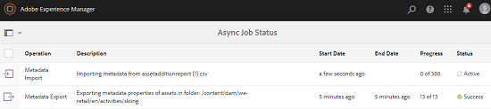

# Operaciones asincrónicas {#asynchronous-operations}

Para reducir el impacto negativo en el rendimiento, Recursos Adobe Experience Manager (AEM) procesa de forma asíncrona determinadas operaciones de recursos que requieren muchos recursos y que se ejecutan durante mucho tiempo.

Estas operaciones incluyen:

* Eliminación de muchos recursos
* Desplazamiento de muchos recursos o recursos con muchas referencias
* Exportación e importación masiva de metadatos de recursos.
* Recuperación de recursos, que están por encima del límite establecido, desde una implementación remota de AEM.

El procesamiento asincrónico implica poner en cola varios trabajos y, finalmente, ejecutarlos en serie, según la disponibilidad de los recursos del sistema.

Puede ver el estado de los trabajos asincrónicos desde la página Estado **[!UICONTROL del trabajo]** asincrónico.

>[!NOTE]
>
>De forma predeterminada, los trabajos de Recursos AEM se ejecutan en paralelo. Si N es el número de núcleos de CPU, los trabajos N/2 se pueden ejecutar en paralelo de forma predeterminada. Para utilizar la configuración personalizada de la cola de trabajos, modifique la configuración de la cola **predeterminada de operaciones** asincrónicas desde la consola web. Para obtener más información, consulte Configuraciones [de cola](https://sling.apache.org/documentation/bundles/apache-sling-eventing-and-job-handling.html#queue-configurations).

## Monitoreo del estado de las operaciones asincrónicas {#monitoring-the-status-of-asynchronous-operations}

Siempre que Recursos AEM procese una operación de forma asíncrona, recibirá una notificación en la bandeja de entrada <!-- and through email -->.

Para ver el estado de las operaciones asincrónicas en detalle, vaya a la página Estado **[!UICONTROL del trabajo]** asincrónico.

1. Pulse o haga clic en el logotipo de AEM y vaya a **[!UICONTROL Assets]** > **[!UICONTROL Trabajos]**.
1. En la página Estado **[!UICONTROL del trabajo]** asincrónico, revise los detalles de las operaciones.

   

   Para determinar el progreso de una operación en particular, consulte el valor en la columna **[!UICONTROL Estado]** . Según el progreso, se muestra uno de los siguientes estados:

   **[!UICONTROL Activo]**: Se está procesando la operación

   **[!UICONTROL Correcto]**: Se completó la operación

   **[!UICONTROL Fallo]** o **[!UICONTROL Error]**: No se pudo procesar la operación

   **[!UICONTROL Programado]**: La operación está programada para procesarse más tarde

1. Para detener una operación activa, selecciónela en la lista y toque o haga clic en el icono **[!UICONTROL Detener]** de la barra de herramientas.

   

1. Para ver detalles adicionales, por ejemplo descripción y registros, seleccione la operación y toque o haga clic en el icono **[!UICONTROL Abrir]** de la barra de herramientas.

   

   Se muestra la página de detalles del trabajo.

   

1. Para eliminar la operación de la lista, seleccione **[!UICONTROL Eliminar]** en la barra de herramientas. Para descargar los detalles en un archivo CSV, toque o haga clic en el icono **[!UICONTROL Descargar]** .

   >[!NOTE]
   >
   >No puede eliminar un trabajo si su estado está activo o en cola.

## Depuración de trabajos completados {#purging-completed-jobs}

Recursos AEM ejecuta un trabajo de depuración todos los días a la 1:00 a.m. para eliminar los trabajos asincrónicos completados que tengan más de un día de antigüedad.

Puede modificar la programación del trabajo de depuración y la duración durante la cual se conservan los detalles de los trabajos completados antes de que se eliminen. También puede configurar el número máximo de trabajos completados para los que se conservan los detalles en cualquier momento.

1. Pulse o haga clic en el logotipo de AEM y vaya a **[!UICONTROL Herramientas]** > **[!UICONTROL Operaciones]** > **[!UICONTROL Consola web]**.
1. Abra el trabajo programado de depuración de trabajos asincrónicos de **[!UICONTROL Adobe CQ DAM]** .
1. Especifique el número de umbral de días después de los cuales se eliminarán los trabajos completados y el número máximo de trabajos para los que se conservarán los detalles en el historial.

   
   *Figura: Configuración para programar la depuración de trabajos asincrónicos*

1. Guarde los cambios.

## Configuración de umbrales para procesamiento asincrónico {#configuring-thresholds-for-asynchronous-processing}

Puede configurar el número de umbral de recursos o referencias para que Recursos AEM procese una operación concreta de forma asincrónica.

### Configuración de umbrales para operaciones de eliminación asincrónica {#configuring-thresholds-for-asynchronous-delete-operations}

Si el número de recursos o carpetas que se van a eliminar supera el número de umbral, la operación de eliminación se realiza de forma asíncrona.

1. Pulse o haga clic en el logotipo de AEM y vaya a **[!UICONTROL Herramientas]** > **[!UICONTROL Operaciones]** > **[!UICONTROL Consola web]**.
1. En la consola web, abra la configuración de Procesamiento **[!UICONTROL de trabajos de eliminación]** asincrónica.
1. En el cuadro **[!UICONTROL Umbral de número de recursos]** , especifique el número de umbral de recursos/carpetas para el procesamiento asincrónico de las operaciones de eliminación.

   

1. Guarde los cambios.

### Configuración de umbrales para operaciones de movimiento asincrónico {#configuring-thresholds-for-asynchronous-move-operations}

Si el número de recursos/carpetas o referencias que se van a mover supera el número de umbral, la operación de movimiento se realiza de forma asíncrona.

1. Pulse o haga clic en el logotipo de AEM y vaya a **[!UICONTROL Herramientas]** > **[!UICONTROL Operaciones]** > **[!UICONTROL Consola web]**.
1. Desde la consola web, abra la configuración Procesamiento **[!UICONTROL de trabajos de operación de movimiento]** asincrónico.
1. En el cuadro **[!UICONTROL Umbral número de recursos/referencias]** , especifique el número de umbral de recursos/carpetas o referencias para el procesamiento asincrónico de operaciones de movimiento.

   

1. Guarde los cambios.
