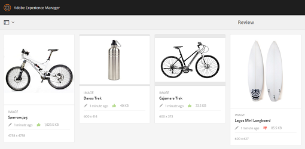

# Revisar recursos en carpetas y colecciones {#review-folder-assets-and-collections}

Con Adobe Experience Manager Assets, puede definir flujos de trabajo de revisión específicos para los recursos que se encuentran en una carpeta o en una colección. Puede compartirlo con revisores o socios creativos para obtener sus comentarios. Puede asociar un flujo de trabajo de revisión con un proyecto o crear una tarea de revisión independiente.

Después de compartir los recursos, los revisores pueden aprobarlos o rechazarlos. Las notificaciones se envían en varias etapas del flujo de trabajo para notificar a los destinatarios previstos la finalización de diversas tareas. Por ejemplo, cuando comparte una carpeta o colección, el revisor recibe una notificación de que se ha compartido una carpeta o colección para su revisión.

Una vez que el revisor haya completado la revisión (aprueba o rechaza recursos), recibirá una notificación de finalización de la revisión.

## Creación de una tarea de revisión para carpetas {#creating-a-review-task-for-folders}

1. En la interfaz de usuario de Recursos, seleccione la carpeta para la que desea crear una tarea de revisión.
1. En la barra de herramientas, pulse o haga clic en el icono **[!UICONTROL Crear tarea de revisión]** para abrir la página **[!UICONTROL Revisar tarea]**. Si no puede ver el icono en la barra de herramientas, pulse o haga clic en **[!UICONTROL Más]** y, a continuación, seleccione el icono.

   

1. (Opcional) En la lista **[!UICONTROL Proyecto]**, seleccione el proyecto al que desea asociar la tarea de revisión. De forma predeterminada, la opción **[!UICONTROL Ninguno]** está seleccionada. Si no desea asociar ningún proyecto con la tarea de revisión, mantenga esta selección.

   >[!NOTE]
   >
   >En la lista **[!UICONTROL Projects]** solo se pueden ver los proyectos para los que tiene permisos de nivel de editor (o superior).

1. Escriba un nombre para la tarea de revisión y seleccione un aprobador en la lista **[!UICONTROL Asignar a]**.

   >[!NOTE]
   >
   >Los miembros o grupos del proyecto seleccionado están disponibles como aprobadores en la lista **[!UICONTROL Asignar a]**.

1. Introduzca una descripción, la prioridad de tarea y la fecha de vencimiento de la tarea de revisión.

   

1. En la ficha Avanzado, escriba una etiqueta para crear el URI.

   

1. Pulse o haga clic en **[!UICONTROL Enviar]** y, a continuación, pulse o haga clic en **[!UICONTROL Listo]** para cerrar el mensaje de confirmación. Se envía una notificación para la nueva tarea al aprobador.
1. Inicie sesión en [!DNL Experience Manager Assets] como aprobador y vaya a la interfaz de usuario de Recursos. Para aprobar recursos, toque o haga clic en el icono **[!UICONTROL Notificaciones]** y seleccione la tarea de revisión en la lista.

   

1. En la página **[!UICONTROL Revisar tarea]**, examine los detalles de la tarea de revisión y, a continuación, pulse o haga clic en **[!UICONTROL Revisar]**.
1. En la página **[!UICONTROL Revisar tarea]**, seleccione los recursos y pulse o haga clic en el icono **[!UICONTROL Aprobar/Rechazar]** para aprobarlos o rechazarlos, según corresponda.

   

1. Toque o haga clic en el icono **[!UICONTROL Completar]** de la barra de herramientas. En el cuadro de diálogo, escriba un comentario y toque/haga clic **[!UICONTROL Completar]** para confirmar.
1. Vaya a la interfaz de usuario de Recursos y abra la carpeta. Los iconos de estado de aprobación de los recursos aparecen en las vistas Tarjeta y Lista.

   **Vista de tarjeta**

   

   **Vista de lista**

   

## Creación de una tarea de revisión para colecciones {#creating-a-review-task-for-collections}

1. En la página Colecciones, seleccione la colección para la que desea crear una tarea de revisión.
1. En la barra de herramientas, pulse o haga clic en el icono **[!UICONTROL Crear tarea de revisión]** para abrir la página **[!UICONTROL Revisar tarea]**. Si no puede ver el icono en la barra de herramientas, pulse o haga clic en **[!UICONTROL Más]** y, a continuación, seleccione el icono.

   

1. (Opcional) En la lista **[!UICONTROL Proyecto]**, seleccione el proyecto al que desea asociar la tarea de revisión. De forma predeterminada, la opción **[!UICONTROL Ninguno]** está seleccionada. Si no desea asociar ningún proyecto con la tarea de revisión, mantenga esta selección.

   >[!NOTE]
   >
   >En la lista **[!UICONTROL Projects]** solo se pueden ver los proyectos para los que tiene permisos de nivel de editor (o superior).

1. Escriba un nombre para la tarea de revisión y seleccione un aprobador en la lista **[!UICONTROL Asignar a]**.

   >[!NOTE]
   >
   >Los miembros o grupos del proyecto seleccionado están disponibles como aprobadores en la lista **[!UICONTROL Asignar a]**.

1. Introduzca una descripción, la prioridad de tarea y la fecha de vencimiento de la tarea de revisión.

   

1. Pulse o haga clic en **[!UICONTROL Enviar]** y, a continuación, pulse o haga clic en **[!UICONTROL Listo]** para cerrar el mensaje de confirmación. Se envía una notificación para la nueva tarea al aprobador.
1. Inicie sesión en [!DNL Experience Manager Assets] como Aprobador y navegue a la consola Recursos. Para aprobar recursos, toque o haga clic en el icono **[!UICONTROL Notificaciones]** y, a continuación, seleccione la tarea de revisión en la lista.
1. En la página **[!UICONTROL Revisar tarea]**, examine los detalles de la tarea de revisión y, a continuación, pulse o haga clic en **[!UICONTROL Revisar]**.
1. Todos los recursos de la colección están visibles en la página de revisión. Seleccione los recursos y toque o haga clic en el icono **[!UICONTROL Aprobar/Rechazar]** para aprobar o rechazar los recursos, según corresponda.

   

1. Toque o haga clic en el icono **[!UICONTROL Completar]** de la barra de herramientas. En el cuadro de diálogo, escriba un comentario y toque/haga clic **[!UICONTROL Completar]** para confirmar.
1. Vaya a la consola Colecciones y abra la colección. Los iconos de estado de aprobación de los recursos aparecen en las vistas Tarjeta y Lista.

   **Vista de tarjeta**

   

   **Vista de lista**

   

