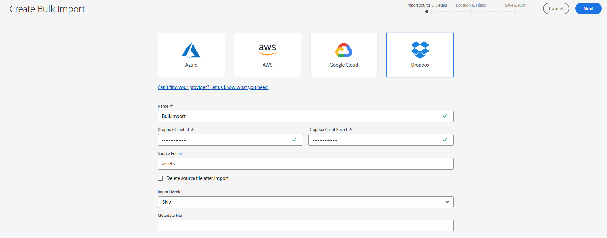

# Importación masiva de recursos mediante la vista Recursos  {#bulk-import-assets-view}

La importación masiva en la vista de AEM Assets permite a los administradores importar un gran número de recursos desde un origen de datos a AEM Assets. Los administradores ya no tienen que cargar recursos o carpetas individuales en AEM Assets.

Puede importar recursos desde las siguientes fuentes de datos:

* Azure
* AWS
* Google Cloud
* Dropbox

## Requisitos previos {#prerequisites}

| Fuente de datos | Requisitos previos |
|-----|------|
| Azure | <ul> <li>Cuenta de almacenamiento de Azure </li> <li> Contenedor de blob de Azure <li> Clave de acceso de Azure o token SAS basado en el modo de autenticación </li></ul> |
| AWS | <ul> <li>Región de AWS </li> <li> Cubo de AWS <li> Clave de acceso de AWS </li><li> Secreto de acceso de AWS </li></ul> |
| Google Cloud | <ul> <li>Contenedor de GCP </li> <li> Correo electrónico de la cuenta de servicio de GCP <li> Clave privada de la cuenta de servicio de GCP</li></ul> |
| Dropbox | <ul> <li>ID de cliente de Dropbox </li> <li> Secreto de cliente de Dropbox</li></ul> |

Además de estos requisitos previos basados en el origen de datos, debe tener en cuenta el nombre de la carpeta de origen disponible en el origen de datos que contiene todos los recursos que deben importarse en AEM Assets.

## Crear configuración de importación masiva {#create-bulk-import-configuration}

Siga estos pasos para crear una configuración de importación masiva:

1. Vaya a **[!UICONTROL Configuración]** > **[!UICONTROL Importación masiva]** y haga clic en **[!UICONTROL Crear importación]**.
1. Seleccione la fuente de datos. Las opciones disponibles incluyen Azure, AWS, Google Cloud y Dropbox.
1. Especifique un nombre para la configuración de importación masiva en la **[!UICONTROL Nombre]** field.
1. Especifique las credenciales específicas de la fuente de datos, como se menciona en [Requisitos previos](#prerequisites).
1. Proporcione el nombre de la carpeta raíz que contiene los recursos de la fuente de datos en la **[!UICONTROL Carpeta de origen]** field.
1. (Opcional) Seleccione la **[!UICONTROL Eliminar archivo de origen tras importar]** opción para eliminar los archivos originales del almacén de datos de origen después de importar los archivos en Experience Manager Assets.
1. Seleccione el **[!UICONTROL Modo de importación]**. Seleccionar **[!UICONTROL Omitir]**, **[!UICONTROL Reemplazar]**, o **[!UICONTROL Crear versión]**. El modo de omisión es el predeterminado y, en este modo, el ingestor omite la importación de un recurso si ya existe.
   

1. (Opcional) Especifique el archivo de metadatos que desea importar, proporcionado en formato CSV, en el campo Archivo de metadatos y haga clic en **[!UICONTROL Siguiente]** para ir a **[!UICONTROL Ubicación y filtros]**.
1. Para definir una ubicación en DAM en la que se importarán los recursos mediante **[!UICONTROL Carpeta de destino de recursos]** , especifique una ruta. Por ejemplo, `/content/dam/imported_assets`.
1. (Opcional) En el **[!UICONTROL Elegir filtros]** , proporcione el tamaño mínimo de archivo de los recursos en MB para incluirlos en el proceso de ingesta en la **[!UICONTROL Filtrar por tamaño mínimo]** field.
1. (Opcional) Proporcione el tamaño máximo de archivo de los recursos en MB para incluirlos en el proceso de ingesta en **[!UICONTROL Filtrar por tamaño máximo]** field.
1. (Opcional) Seleccione los tipos MIME que desea incluir en el proceso de ingesta mediante la variable **[!UICONTROL Incluir tipo MIME]** field. Puede seleccionar varios tipos MIME en este campo. Si no define un valor, todos los tipos MIME se incluyen en el proceso de ingesta.

1. (Opcional) Seleccione los tipos MIME que desea excluir en el proceso de ingesta mediante la variable **[!UICONTROL Excluir tipo MIME]** field. Puede seleccionar varios tipos MIME en este campo. Si no define un valor, todos los tipos MIME se incluyen en el proceso de ingesta.

   

1. Haga clic en **[!UICONTROL Siguiente]**. Seleccionar **[!UICONTROL Guardar y ejecutar importación]** para guardar la configuración y ejecutar la importación masiva. Seleccionar **[!UICONTROL Guardar importación]** para guardar la configuración por ahora y poder ejecutarla más adelante.

   

1. Clic **[!UICONTROL Guardar]** para ejecutar la opción seleccionada.

## Ver configuraciones de importación masiva existentes {#view-import-configuration}

Si selecciona guardar la configuración después de crearla, la configuración se muestra en la **[!UICONTROL Importaciones guardadas]** pestaña.

Si selecciona guardar y ejecutar la importación, la configuración de importación se muestra en la **[!UICONTROL Importaciones ejecutadas]** pestaña.

Si programa una importación, se muestra en la **[!UICONTROL Importaciones programadas]** pestaña.

## Editar configuración de importación masiva {#edit-import-configuration}

Para editar los detalles de configuración, haga clic en ... correspondiente al nombre de la configuración y haga clic en **[!UICONTROL Editar]**. No se puede editar el título de la configuración y el origen de datos de importación mientras se realiza la operación de edición. Puede editar la configuración mediante las pestañas Ejecutado, Programado o Importaciones guardadas.

## Programar importaciones únicas o recurrentes {#schedule-imports}

Para programar una importación masiva única o recurrente, ejecute los siguientes pasos:

1. haga clic en ... correspondiente al nombre de configuración disponible en la **[!UICONTROL Importaciones ejecutadas]** o **[!UICONTROL Importaciones guardadas]** y haga clic en **[!UICONTROL Programación]**. También puede reprogramar una importación programada existente navegando hasta **[!UICONTROL Importaciones programadas]** y hacer clic en **[!UICONTROL Programación]**.

1. Establezca una ingesta única o programe una programación por hora, diaria o semanal. Haga clic en **[!UICONTROL Enviar]**.

   

## Realizar una comprobación de estado de importación {#import-health-check}

Para validar la conexión con el origen de datos, haga clic en ... correspondiente al nombre de la configuración y, a continuación, haga clic en **[!UICONTROL Marque]**. Si la conexión se realiza correctamente, Experience Manager Assets muestra el siguiente mensaje:

## Realice una ejecución en seco antes de ejecutar una importación {#dry-run-bulk-import}

Haga clic en ... correspondiente al nombre de la configuración y haga clic en **[!UICONTROL Ejecución en seco]** para invocar una ejecución de prueba para el trabajo de importación masiva. Experience Manager Assets muestra los siguientes detalles sobre el trabajo de importación masiva:

## Ejecución de una importación masiva {#run-bulk-import}

Si ha guardado la importación al crear la configuración, puede navegar a la pestaña Importaciones guardadas, hacer clic en ... correspondiente a la configuración y hacer clic en **[!UICONTROL Ejecutar]**.

Del mismo modo, si necesita ejecutar una importación ya ejecutada, vaya a la pestaña Importaciones ejecutadas, haga clic en ... correspondiente al nombre de configuración y haga clic en **[!UICONTROL Ejecutar]**.

## Detener o programar una importación en curso {#schedule-stop-ongoing-report}

Puede programar o detener una importación masiva en curso mediante el cuadro de diálogo de estado de importación masiva que aparece en la página de inicio Importación masiva durante una importación.

También puede ver los recursos que se han importado en la carpeta de destino haciendo clic en **[!UICONTROL Ver recursos]**.

## Eliminar una configuración de importación masiva {#delete-bulk-import-configuration}

Haga clic en ... correspondiente al nombre de configuración existente en **[!UICONTROL Importaciones ejecutadas]**, **[!UICONTROL Importaciones programadas]**, o **[!UICONTROL Importaciones guardadas]** y haga clic en **[!UICONTROL Eliminar]** para eliminar la configuración de importación masiva.

## Navegar a los recursos después de realizar una importación masiva {#view-assets-after-bulk-import}

Para ver la ubicación de destino de los recursos donde se importan después de ejecutar el trabajo de importación masiva, haga clic en ... correspondiente al nombre de la configuración y, a continuación, haga clic en **[!UICONTROL Ver recursos]**.

