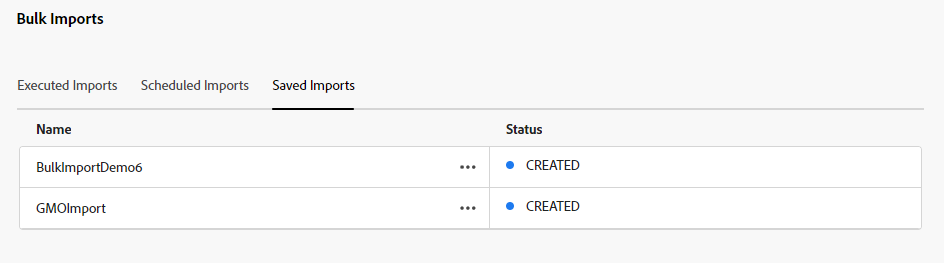

# Importación masiva de recursos mediante la vista Recursos  {#bulk-import-assets-view}

La importación masiva en la vista de AEM Assets permite a los administradores importar un gran número de recursos desde una fuente de datos a AEM Assets. Los administradores ya no tienen que cargar archivos o carpetas individuales en Experience Manager Assets.

>[!NOTE]
>
>El importador en bloque de la vista Recursos utiliza el mismo backend que el del importador en bloque de la vista Administración. Sin embargo, ofrece más fuentes de datos para importar de y una experiencia de usuario más optimizada.

Puede importar recursos desde las siguientes fuentes de datos:

* Azure
* AWS
* Google Cloud
* Dropbox
* OneDrive

## Requisitos previos {#prerequisites}

| Fuente de datos | Requisitos previos |
|-----|------|
| Azure | <ul> <li>Cuenta de almacenamiento de Azure </li> <li> Contenedor de blob de Azure <li> Clave de acceso de Azure o token SAS basado en el modo de autenticación </li></ul> |
| AWS | <ul> <li>Región de AWS </li> <li> Contenedor de AWS <li> Clave de acceso de AWS </li><li> Secreto de acceso de AWS </li></ul> |
| Google Cloud | <ul> <li>Contenedor de GCP </li> <li> Correo electrónico de la cuenta de servicio de GCP <li> Clave privada de la cuenta de servicio de GCP</li></ul> |
| Dropbox | <ul> <li>ID de cliente de Dropbox (Clave de aplicación) </li> <li> Secreto de cliente de Dropbox (secreto de aplicación)</li></ul> |
| OneDrive | <ul> <li>Identificador de inquilino de OneDrive  </li> <li> Identificador de cliente de OneDrive</li><li> Secreto de cliente de OneDrive</li></ul> |

Además de estos requisitos previos basados en la fuente de datos, debe tener en cuenta el nombre de la carpeta de origen disponible en la fuente de datos que contiene todos los recursos que deben importarse en AEM Assets.

## Configuración de la aplicación para desarrolladores de Dropbox {#dropbox-developer-application}

Antes de importar recursos desde la cuenta de Dropbox a AEM Assets, cree y configure la aplicación de desarrollador de Dropbox.

Siga estos pasos:

1. Inicie sesión en su [cuenta de Dropbox](https://www.dropbox.com/developers) y haga clic en **[!UICONTROL Creación de aplicaciones]**.

1. En el **[!UICONTROL Elegir una API]** , seleccione el único botón de opción disponible.

1. En el **[!UICONTROL Elija el tipo de acceso que necesita]** , seleccione una de las siguientes opciones:

   * Seleccionar **[!UICONTROL Carpeta de aplicación]**, si necesita acceder a una única carpeta creada dentro de su aplicación en su cuenta de Dropbox.

   * Seleccionar **[!UICONTROL Dropbox completo]**, si necesita acceder a todos los archivos y carpetas de su cuenta de Dropbox.

1. Especifique un nombre para la aplicación y haga clic en **[!UICONTROL Crear aplicación]**.

1. En el **[!UICONTROL Configuración]** de la aplicación, agregue lo siguiente a la **[!UICONTROL URI de redireccionamiento]** sección:

   * https://exc-unifiedcontent.experience.adobe.net

   * https://exc-unifiedcontent.experience-stage.adobe.net (válido solo para entornos de ensayo)

1. Copie los valores de **[!UICONTROL Clave de aplicación]** y **[!UICONTROL Secreto de aplicación]** campos. Los valores son necesarios al configurar la herramienta de importación masiva en AEM Assets.

1. En el **[!UICONTROL Permisos]** , agregue los siguientes permisos dentro de la pestaña **[!UICONTROL Ámbitos individuales]** sección.

   * account_info.read

   * files.metadata.read

   * files.content.read

   * files.content.write

1. Clic **[!UICONTROL Enviar]** para guardar los cambios.

## Configurar la aplicación para desarrolladores de OneDrive {#onedrive-developer-application}

Antes de importar recursos desde la cuenta de OneDrive a AEM Assets, cree y configure la aplicación para desarrolladores de OneDrive.

Siga estos pasos:

1. Inicie sesión en su [Cuenta de OneDrive](https://portal.azure.com/#view/Microsoft_AAD_RegisteredApps/ApplicationsListBlade) y haga clic en **[!UICONTROL Nuevo registro]**.

1. Especifique un nombre para la aplicación, seleccione **[!UICONTROL Solo cuentas en este directorio organizativo (solo Adobe: inquilino único)]** de **[!UICONTROL Tipos de cuenta admitidos]** y haga clic en **[!UICONTROL Registrar]**. La aplicación se ha creado correctamente.

1. Copie los valores de los campos ID de cliente de aplicación e ID de inquilino. Los valores son necesarios al configurar la herramienta de importación masiva en AEM Assets.

1. Ejecute los siguientes pasos para agregar un certificado:
   1. En la página de información general de la aplicación, haga clic en **[!UICONTROL Agregar un certificado o secreto]** y luego haga clic en **[!UICONTROL Nuevo secreto de cliente]**.
   1. Especifique la descripción y la caducidad del secreto del cliente y haga clic en **[!UICONTROL Añadir]**.
   1. Después de crear el Secreto del cliente, copie el **[!UICONTROL Valor]** (No copie el campo ID secreto). Es necesario al configurar la importación masiva en AEM Assets.

1. Siga estos pasos para agregar URI de redireccionamiento:
   1. En la página de información general de la aplicación, haga clic en **[!UICONTROL Añadir un URI de redireccionamiento]** > **[!UICONTROL Añadir una plataforma]** > **[!UICONTROL Web]**.
   1. Añada lo siguiente a **[!UICONTROL URI de redireccionamiento]** sección:

      * https://exc-unifiedcontent.experience.adobe.net

      * https://exc-unifiedcontent.experience-stage.adobe.net (válido solo para entornos de ensayo)

      Añada el primer URI y haga clic en **[!UICONTROL Configurar]** para agregarlo. Para agregar más, haga clic en **[!UICONTROL Añadir URI]** opción disponible en el **[!UICONTROL Web]** en la sección **[!UICONTROL Autenticación]** página.

1. Ejecute los siguientes pasos para agregar permisos de API para la aplicación:
   1. Clic **[!UICONTROL Permisos de API]** en el panel izquierdo y haga clic en **[!UICONTROL Añadir un permiso]**.
   1. Clic **[!UICONTROL Gráfico de Microsoft]** > **[!UICONTROL Permisos delegados]**. El **[!UICONTROL Seleccionar permiso]** Esta sección muestra los permisos disponibles.
   1. Seleccionar `offline_access` permiso de `OpenId permissions` y `Files.ReadWrite.All` permiso de `Files`.
   1. Clic **[!UICONTROL Añadir permisos]** para guardar las actualizaciones.

## Crear configuración de importación masiva {#create-bulk-import-configuration}

Siga estos pasos para crear una configuración de importación masiva:

1. Vaya a **[!UICONTROL Configuración]** > **[!UICONTROL Importación masiva]** y haga clic en **[!UICONTROL Crear importación]**.
1. Seleccione la fuente de datos. Las opciones disponibles incluyen Azure, AWS, Google Cloud y Dropbox.
1. Especifique un nombre para la configuración de importación masiva en el campo **[!UICONTROL Nombre]**.
1. Especifique las credenciales específicas de la fuente de datos, tal como se menciona en [Requisitos previos](#prerequisites).
1. Proporcione el nombre de la carpeta que contiene los recursos de la fuente de datos en la **[!UICONTROL Carpeta de origen]** field.

   >[!NOTE]
   >
   >Si utiliza Dropbox como fuente de datos, especifique la ruta de la carpeta de origen en función de las siguientes reglas:
   >* Si selecciona **Dropbox completo** al crear la aplicación Dropbox, y la carpeta que contiene los recursos existe en `https://www.dropbox.com/home/bulkimport-assets`y luego especifique `bulkimport-assets` en el **[!UICONTROL Carpeta de origen]** field.
   >* Si selecciona **Carpeta de aplicación** al crear la aplicación Dropbox, y la carpeta que contiene los recursos existe en `https://www.dropbox.com/home/Apps/BulkImportAppFolderScope/bulkimport-assets`y luego especifique `bulkimport-assets` en el **[!UICONTROL Carpeta de origen]** field, donde `BulkImportAppFolderScope` hace referencia al nombre de la aplicación. `Apps` se añade automáticamente después de `home` en este caso.

1. (Opcional) Seleccione la opción **[!UICONTROL Eliminar archivo de origen tras importar]** para eliminar los archivos originales del almacén de datos de origen después de importar los archivos en Experience Manager Assets.
1. Seleccione el **[!UICONTROL Modo de importación]**. Seleccione **[!UICONTROL Omitir]**, **[!UICONTROL Reemplazar]** o **[!UICONTROL Crear versión]**. El modo de omisión es el predeterminado y, en este modo, el ingestor omite la importación de un recurso si ya existe.
   

1. (Opcional) Especifique el archivo de metadatos que desea importar, proporcionado en formato CSV, en el campo Archivo de metadatos y haga clic en **[!UICONTROL Siguiente]** para ir a **[!UICONTROL Ubicación y filtros]**.
1. Especifique una ruta para definir una ubicación en DAM en la que se importarán los recursos mediante **[!UICONTROL Carpeta de destino de recursos]**. Por ejemplo, `/content/dam/imported_assets`.
1. (Opcional) En la sección **[!UICONTROL Elegir filtros]**, proporcione el tamaño mínimo de archivo de los recursos en MB para incluirlos en el proceso de ingesta en el campo **[!UICONTROL Filtrar por tamaño mínimo]**.
1. (Opcional) Proporcione el tamaño máximo de archivo de los recursos en MB para incluirlos en el proceso de ingesta en **[!UICONTROL Filtrar por tamaño máximo]**.
1. (Opcional) Seleccione los tipos MIME que desea incluir en el proceso de ingesta mediante el campo **[!UICONTROL Incluir tipo MIME]**. Puede seleccionar varios tipos MIME en este campo. Si no define un valor, todos los tipos MIME se incluyen en el proceso de ingesta.

1. (Opcional) Seleccione los tipos MIME que desea excluir en el proceso de ingesta mediante el campo **[!UICONTROL Excluir tipo MIME]**. Puede seleccionar varios tipos MIME en este campo. Si no define un valor, todos los tipos MIME se incluyen en el proceso de ingesta.

   

1. Haga clic en **[!UICONTROL Siguiente]**. Seleccione **[!UICONTROL Guardar y ejecutar importación]** para guardar la configuración y ejecutar la importación masiva. Seleccionar **[!UICONTROL Guardar importación]** para guardar la configuración por ahora y poder ejecutarla más adelante.

   

1. Haga clic en **[!UICONTROL Guardar]** para ejecutar la opción seleccionada.

### Administración de nombres de archivo durante la importación masiva {#filename-handling-bulkimport-assets-view}

Al importar recursos o carpetas de forma masiva, [!DNL Experience Manager Assets] importa toda la estructura de lo que existe en el origen de importación. [!DNL Experience Manager] sigue las reglas integradas para los caracteres especiales en los nombres de recursos y carpetas, por lo que estos nombres de archivo necesitan saneamiento. Tanto para el nombre de la carpeta como para el nombre del recurso, el título definido por el usuario permanece sin cambios y se almacena en `jcr:title`.

Durante la importación masiva, [!DNL Experience Manager] busque las carpetas existentes para evitar volver a importar los recursos y las carpetas, y compruebe también las reglas de saneamiento aplicadas en la carpeta principal en la que se realiza la importación. Si las reglas de saneamiento se aplican en la carpeta principal, las mismas reglas se aplican al origen de importación. Para la nueva importación, se aplican las siguientes reglas de saneamiento para administrar los nombres de archivo de los recursos y las carpetas.

Para obtener más información sobre los nombres no permitidos, la administración de nombres de recursos y la administración de nombres de carpetas durante la importación masiva, consulte [Administración de nombres de archivo durante la importación masiva en la vista de administración](add-assets.md##filename-handling-bulkimport).

## Ver configuraciones de importación masiva existentes {#view-import-configuration}

Si selecciona guardar la configuración después de crearla, la configuración se muestra en la pestaña **[!UICONTROL Importaciones guardadas]**.

Si selecciona guardar y ejecutar la importación, la configuración de importación se muestra en la pestaña **[!UICONTROL Importaciones ejecutadas]**.

Si programa una importación, se muestra en la pestaña **[!UICONTROL Importaciones programadas]**.

## Editar configuración de importación masiva {#edit-import-configuration}

Para editar los detalles de configuración, haga clic en Más opciones (...) correspondientes al nombre de la configuración y haga clic en **[!UICONTROL Editar]**. No se puede editar el título de la configuración y la fuente de datos de importación mientras se realiza la operación de edición. Puede editar la configuración mediante las pestañas Importaciones ejecutadas, programadas o guardadas.

## Programar importaciones únicas o recurrentes {#schedule-imports}

Para programar una importación masiva única o recurrente, ejecute los siguientes pasos:

1. haga clic en Más opciones (...) correspondientes al nombre de la configuración disponible en la **[!UICONTROL Importaciones ejecutadas]** o **[!UICONTROL Importaciones guardadas]** y haga clic en **[!UICONTROL Programación]**. También puede reprogramar una importación programada existente navegando hasta **[!UICONTROL Importaciones programadas]** y haciendo clic en **[!UICONTROL Programación]**.

1. Establezca una ingesta única o programe una programación horaria, diaria o semanal. Haga clic en **[!UICONTROL Enviar]**.

   

## Realizar una comprobación de estado de importación {#import-health-check}

Para validar la conexión con el origen de datos, haga clic en Más opciones (...) correspondientes al nombre de configuración y, a continuación, haga clic en **[!UICONTROL Marque]**. Si la conexión se realiza correctamente, Experience Manager Assets muestra el siguiente mensaje:

## Realice un ensayo antes de ejecutar una importación {#dry-run-bulk-import}

Haga clic en Más opciones (...) correspondientes al nombre de la configuración y haga clic en **[!UICONTROL Ejecución en seco]** para invocar una ejecución de prueba para el trabajo de importación masiva. Experience Manager Assets muestra los siguientes detalles sobre el trabajo de importación masiva:

## Ejecución de una importación masiva {#run-bulk-import}

Si ha guardado la importación al crear la configuración, puede navegar a la pestaña Importaciones guardadas, hacer clic en Más opciones (...) correspondientes a la configuración y hacer clic en **[!UICONTROL Ejecutar]**.

Del mismo modo, si necesita ejecutar una importación ya ejecutada, vaya a la pestaña Importaciones ejecutadas, haga clic en Más opciones (...) correspondientes al nombre de la configuración y haga clic en **[!UICONTROL Ejecutar]**.

## Detener o programar una importación en curso {#schedule-stop-ongoing-report}

Puede programar o detener una importación masiva en curso mediante el cuadro de diálogo de estado de importación masiva que aparece en la página de inicio Importación masiva durante una importación.

También puede ver los recursos que se han importado en la carpeta de destino haciendo clic en **[!UICONTROL Ver recursos]**.

## Eliminar una configuración de importación masiva {#delete-bulk-import-configuration}

Haga clic en Más opciones (...) correspondientes al nombre de configuración existente en **[!UICONTROL Importaciones ejecutadas]**, **[!UICONTROL Importaciones programadas]**, o **[!UICONTROL Importaciones guardadas]** y haga clic en **[!UICONTROL Eliminar]** para eliminar la configuración de importación masiva.

## Ir a los recursos después de realizar una importación masiva {#view-assets-after-bulk-import}

Para ver la ubicación de destino de los recursos donde se importan después de ejecutar el trabajo de importación masiva, haga clic en Más opciones (...) correspondientes al nombre de la configuración y, a continuación, haga clic en **[!UICONTROL Ver recursos]**.
