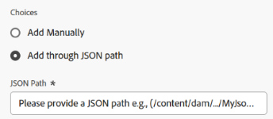
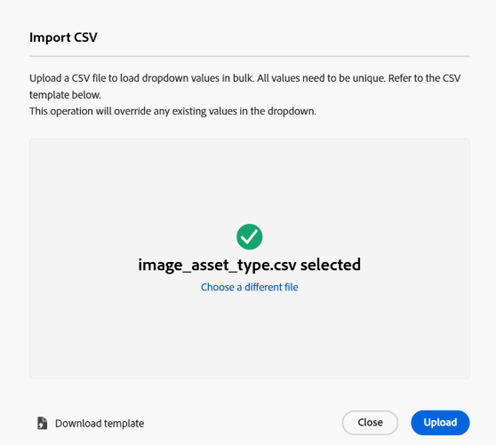
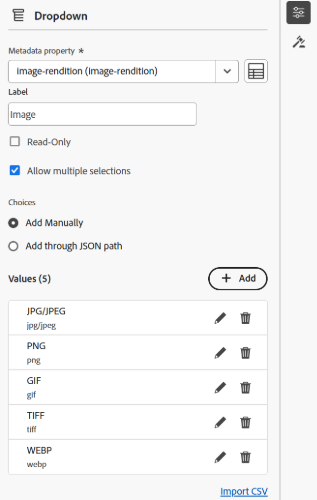

# Vista de Assets de metadatos en cascada{#cascading-metadata-assets-view}

Al capturar la información de metadatos de un recurso, los usuarios proporcionan información en los distintos campos disponibles. Puede mostrar campos de metadatos específicos o valores de campo que dependan de las opciones seleccionadas en los demás campos. Esta visualización condicional de metadatos se denomina metadatos en cascada. En otras palabras, puede crear una dependencia entre un campo o valor de metadatos determinado y uno o varios campos o sus valores.

Utilice Forms de metadatos para definir reglas para mostrar los metadatos en cascada. Por ejemplo, si el formulario de metadatos incluye un campo de tipo de recurso, puede definir un conjunto pertinente de campos que se mostrarán en función del tipo de recurso que seleccione un usuario.

Estos son algunos casos de uso para los que puede definir metadatos en cascada:

* Cuando se requiera la ubicación del usuario, se mostrarán los nombres de ciudades relevantes según el país y el estado que haya elegido el usuario.
* Cargue los nombres de marcas relevantes en una lista basada en la categoría de producto que haya elegido el usuario.
* Alterne la visibilidad de un campo concreto en función del valor especificado en otro campo. Por ejemplo, mostrar campos de dirección de envío independientes si el usuario desea que el envío se envíe en una dirección diferente.
* Designe un campo como obligatorio en función del valor especificado en otro campo.
* Cambie las opciones mostradas para un campo en particular en función del valor especificado en otro campo.
* Establezca el valor de metadatos predeterminado en un campo concreto en función del valor especificado en otro campo.

>[!IMPORTANT]
>
>La función Metadatos en cascada está disponible como funciones de disponibilidad limitada. Puede [crear y enviar un caso de asistencia al cliente de Adobe](https://helpx.adobe.com/es/enterprise/using/support-for-experience-cloud.html) para habilitarlo para su implementación.

## Configurar metadatos en cascada en [!DNL Experience Manager] {#configure-cascading-metadata-in-aem}

Imagine un escenario en el que desee mostrar metadatos en cascada en función del tipo de recurso seleccionado. Por ejemplo:

* Para un vídeo, mostrar campos aplicables como formato, códec, duración, etc.
* Para un documento de Word o PDF, muestre campos como, por ejemplo, recuento de páginas, autor, etc.

Se está utilizando un campo desplegable denominado `Image` como ejemplo para categorizar los archivos según su tipo de imagen. La lista desplegable contiene opciones que representan extensiones de imagen compatibles (como JPG/JPEG, GIF, etc.). Para garantizar la coherencia de los datos y evitar que se seleccionen o procesen formatos no compatibles, se aplica una regla de validación a este campo. La regla evalúa el valor desplegable seleccionado e impone restricciones que se alinean con los formatos de imagen aceptados.

>[!IMPORTANT]
>
>Solo puede crear reglas basadas en campos desplegables.

Independientemente del tipo de recurso elegido, muestre la información de copyright como un campo obligatorio. Puede usar los [componentes de metadatos predefinidos](metadata-assets-view.md#property-components) y [asignar metadatos a una carpeta](metadata-assets-view.md#assign-metadata-form-folder).

### Generar Forms de metadatos {#build-metadata-schema-forms}

Tenga en cuenta los pasos siguientes para crear un nuevo formulario de metadatos:

1. Seleccione el logotipo de [!DNL Experience Manager] y vaya a **[!UICONTROL Configuración]** > **[!UICONTROL Metadatos de Forms]** > **[!UICONTROL Crear]**.

1. En el menú desplegable **[!UICONTROL Tipo]**, seleccione el tipo de formulario adecuado: **[!UICONTROL Archivo]**, **[!UICONTROL Carpeta]** o **[!UICONTROL Colección]**.

1. Especifique el título del formulario de metadatos en el campo **[!UICONTROL Nombre]**.

1. También puede elegir una plantilla de formulario de metadatos existente de la lista desplegable **[!UICONTROL Elegir entre la plantilla de formulario existente]**.

1. Aparecerá un formulario de metadatos en blanco. Añada una pestaña nueva.

   

   * **A:** Cambiar entre [!UICONTROL Editar] o [!UICONTROL Vista previa]
   * **B:** [Componentes del formulario de metadatos](metadata-assets-view.md#property-components)
   * **C:** cambiar a otro formulario de metadatos
   * **D:** Agregar una nueva ficha
   * **E:** Lienzo
   * **F:** Configuración general del componente seleccionado
   * **G:** ficha Reglas
   * **H:** Propiedades del componente

Vea este vídeo para ver la secuencia de pasos, [Configuración del Forms de metadatos](https://video.tv.adobe.com/v/341275).

### Modificación de un formulario de metadatos existente {#modify-existing-metadata-form}

Para modificar un formulario de metadatos existente, siga los pasos a continuación:

1. Abra un formulario de metadatos existente, vaya a los [componentes predefinidos](metadata-assets-view.md#property-components) que desee agregar al formulario y suelte los elementos en el lienzo.

   De acuerdo con el caso de uso **Image**, agregue un campo desplegable para definir los tipos de recursos de imagen. Especifique el nombre y la ruta de la propiedad en **Configuración** y, opcionalmente, configure el campo como **[!UICONTROL Solo lectura]** o **[!UICONTROL Selecciones múltiples]**.

1. Proporcione las opciones clave-valor del menú desplegable introduciéndolas manualmente, especificando una ruta JSON o importando un archivo CSV.

   * Para especificar los valores manualmente, seleccione **[!UICONTROL Agregar manualmente]** en **[!UICONTROL Opciones]**, haga clic en `Add` y especifique la etiqueta y el valor de la opción. Por ejemplo, especifique los tipos de recursos Vídeo, PDF e Imagen.

     

   * Para recuperar valores de una ruta de acceso JSON, seleccione **[!UICONTROL Agregar mediante la ruta de acceso JSON]** y especifique la ruta de acceso del archivo JSON.

     >[!NOTE]
     >
     >Asegúrese de almacenar el archivo JSON en una ubicación compartida accesible para todos los editores y autores de DAM.

     

   * Para recuperar los valores de un CSV de forma dinámica, haga clic en **[!UICONTROL Importar CSV]** y proporcione la ruta del archivo CSV. [!DNL Experience Manager] recupera los pares clave-valor en tiempo real cuando se presenta el formulario al usuario.

     

   >[!NOTE]
   > 
   >No puede importar las opciones de un archivo CSV y editarlas manualmente, ya que ambas opciones se excluyen mutuamente.

1. Para crear una dependencia entre el campo Imagen y otros campos, seleccione el campo dependiente y abra la pestaña **[!UICONTROL Reglas]**. Cada componente admite un conjunto específico de reglas. Para este caso de uso, se utilizan las opciones del tipo de recurso de imagen para definir la lógica de regla.

   <!---->

   <!---->

1. En **[!UICONTROL Obligatorio]**, elija la opción **[!UICONTROL Requerido según la nueva regla]**. Haga clic en  para agregar una regla nueva.

   

   En el caso de uso actual, el campo Tipo de recurso es necesario cuando el formato del recurso de imagen es JPG/JPEG, PNG, GIF, TIFF o WEBP. Además, haga clic en  para redefinir la regla o haga clic en  para eliminar la regla definida.

   

1. En **[!UICONTROL Visibilidad]**, elija la opción **[!UICONTROL Visible, según la nueva regla]**. Haga clic en  para agregar una regla nueva.

   >[!NOTE]
   >
   >Puede aplicar la condición **[!UICONTROL Requisito]** y la condición **[!UICONTROL Visibilidad]** de forma independiente entre sí.

   

   En el caso de uso actual, el campo Tipo de recurso está visible cuando el formato del recurso de imagen es JPG/JPEG, PNG o GIF. Además, haga clic en  para redefinir la regla o haga clic en  para eliminar la regla definida.

   

1. Seleccione **[!UICONTROL Opciones basadas en la regla]** para crear una dependencia y definir una regla. Haga clic en  para agregar una regla nueva.

   

   Para configurar opciones basadas en reglas para el menú desplegable Tipo de recurso, cree una regla y establezca Imagen como campo dependiente. A continuación, defina los valores de visualización para cada formato de imagen seleccionando Imagen para JPG/JPEG, PNG, GIF y TIFF, y Vídeo para WEBP, asegurándose de que solo se comprueben los valores deseados para cada formato para mostrar dinámicamente las opciones relevantes. Además, haga clic en  para redefinir la regla o haga clic en  para eliminar la regla definida.

   

1. Del mismo modo, repita los pasos para crear dependencia entre otros recursos, como PDF y Word, en el campo [!UICONTROL Tipo de recurso], y campos como [!UICONTROL Recuento de páginas] y [!UICONTROL Autor].

1. Haga clic en **[!UICONTROL Guardar]**. Aplique el formulario de metadatos a una carpeta.

1. Vaya a la carpeta en la que aplicó el formulario de metadatos y abra la página de propiedades de un recurso. Según su elección en el campo Tipo de recurso, se muestran los campos de metadatos en cascada correspondientes.

   

>[!NOTE]
> 
>Para obtener acceso anticipado a los metadatos en cascada en su cuenta de Assets View, [cree y envíe un caso de asistencia al cliente de Adobe](https://helpx.adobe.com/es/enterprise/using/support-for-experience-cloud.html).

## Próximos pasos {#next-steps}

* [Vea un vídeo para administrar formularios de metadatos en la vista de Assets](https://experienceleague.adobe.com/docs/experience-manager-learn/assets-essentials/configuring/metadata-forms.html?lang=es)

* Realice comentarios del producto mediante la opción [!UICONTROL Comentarios] disponible en la interfaz de usuario de la vista Recursos

* Proporcione comentarios sobre la documentación usando [!UICONTROL Editar esta página]  o [!UICONTROL Registrar una incidencia] , disponibles en la barra lateral derecha

* Contacto con el [Servicio de atención al cliente](https://experienceleague.adobe.com/?support-solution=General&lang=es#support)

