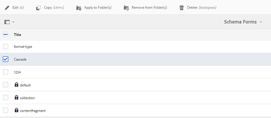
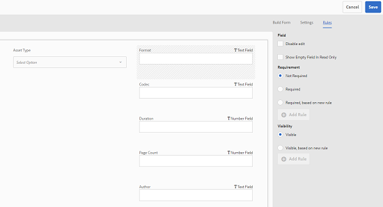

# Metadatos en cascada {#cascading-metadata}

Al capturar la información de metadatos de un recurso, los usuarios proporcionan información en los distintos campos disponibles. Puede mostrar campos de metadatos específicos o valores de campo que dependan de las opciones seleccionadas en los demás campos. Esta visualización condicional de metadatos se denomina metadatos en cascada. En otras palabras, puede crear una dependencia entre un campo o valor de metadatos determinado y uno o varios campos o sus valores.

Utilice esquemas de metadatos para definir reglas para mostrar metadatos en cascada. Por ejemplo, si el esquema de metadatos incluye un campo de tipo de recurso, puede definir un conjunto pertinente de campos que se mostrarán en función del tipo de recurso que seleccione un usuario.

Estos son algunos casos de uso para los que puede definir metadatos en cascada:

* Cuando se requiera la ubicación del usuario, se mostrarán los nombres de ciudades relevantes según el país y el estado que haya elegido el usuario.
* Cargue los nombres de marcas relevantes en una lista basada en la categoría de producto que haya elegido el usuario.
* Alterne la visibilidad de un campo concreto en función del valor especificado en otro campo. Por ejemplo, mostrar campos de dirección de envío independientes si el usuario desea que el envío se envíe en una dirección diferente.
* Designe un campo como obligatorio en función del valor especificado en otro campo.
* Cambie las opciones mostradas para un campo en particular en función del valor especificado en otro campo.
* Establezca el valor de metadatos predeterminado en un campo concreto en función del valor especificado en otro campo.

## Configurar metadatos en cascada en [!DNL Experience Manager] {#configure-cascading-metadata-in-aem}

Imagine un escenario en el que desee mostrar metadatos en cascada en función del tipo de recurso seleccionado. Algunos ejemplos

* Para un vídeo, mostrar campos aplicables como formato, códec, duración, etc.
* Para un documento de Word o PDF, muestre campos como, por ejemplo, recuento de páginas, autor, etc.

Independientemente del tipo de recurso elegido, muestre la información de copyright como un campo obligatorio.

1. Seleccione el logotipo de [!DNL Experience Manager] y vaya a **[!UICONTROL Herramientas]** > **[!UICONTROL Assets]** > **[!UICONTROL Esquemas de metadatos]**.
1. En la página **[!UICONTROL Esquema Forms]**, seleccione un formulario de esquema y, a continuación, seleccione **[!UICONTROL Editar]** en la barra de herramientas para editar el esquema.

   

1. (Opcional) En el editor de esquemas de metadatos, cree un campo para condicionalizar. Especifique un nombre y una ruta de acceso de propiedad en la ficha **[!UICONTROL Configuración]**.

   Para crear una ficha, seleccione `+` para agregar una ficha y luego agregue un campo de metadatos.

   

1. Agregue un campo desplegable para el tipo de recurso. Especifique un nombre y una ruta de acceso de propiedad en la ficha **[!UICONTROL Configuración]**. Añada una descripción opcional.

   

1. Los pares clave-valor son las opciones proporcionadas para un usuario de formulario. Puede proporcionar los pares clave-valor manualmente o desde un archivo JSON.

   * Para especificar los valores manualmente, seleccione **[!UICONTROL Agregar manualmente]**, seleccione **[!UICONTROL Agregar opción]** y especifique el texto y el valor de la opción. Por ejemplo, especifique los tipos de recursos de vídeo, PDF, Word e Imagen.

   * Para recuperar los valores de un archivo JSON de forma dinámica, seleccione **[!UICONTROL Agregar mediante la ruta de acceso JSON]** y proporcione la ruta de acceso del archivo JSON. [!DNL Experience Manager] recupera los pares clave-valor en tiempo real cuando se presenta el formulario al usuario.

   Ambas opciones son mutuamente excluyentes. No puede importar las opciones de un archivo JSON y editarlas manualmente.

   

   >[!NOTE]
   >
   >Cuando se agrega un archivo JSON, los pares clave-valor no se muestran en el editor de esquemas de metadatos, pero están disponibles en el formulario publicado.

   >[!NOTE]
   >
   >Al agregar opciones, si hace clic en el campo emergente, la interfaz se distorsiona y el icono de eliminación de las opciones deja de funcionar. No haga clic en la lista desplegable hasta que guarde los cambios. Si tiene este problema, guarde el esquema y ábralo de nuevo para seguir editando.

1. (Opcional) Añada los demás campos obligatorios. Por ejemplo, formato, códec y duración para el vídeo de tipo de recurso.

   Del mismo modo, agregue campos dependientes para otros tipos de recursos. Por ejemplo, agregue campos, recuento de páginas y autor para los recursos del documento, como archivos de PDF y Word.

   

1. Para crear una dependencia entre el campo de tipo de recurso y otros campos, elija el campo dependiente y abra la pestaña **[!UICONTROL Reglas]**.

   

1. En **[!UICONTROL Requisito]**, elija la opción **[!UICONTROL Requerido, según la nueva regla]**.
1. Seleccione **[!UICONTROL Agregar regla]** y elija el campo **[!UICONTROL Tipo de recurso]** para crear una dependencia. Elija también el valor del campo en el que desea crear la dependencia. En este caso, seleccione **[!UICONTROL Vídeo]**. Seleccione **[!UICONTROL Listo]** para guardar los cambios.

   

   >[!NOTE]
   >
   >Con las reglas se pueden utilizar listas desplegables con valores predefinidos manualmente. Los menús desplegables con la ruta JSON configurada no se pueden utilizar con reglas que utilizan valores predefinidos para aplicar condiciones. Si los valores se cargan desde JSON en tiempo de ejecución, no es posible aplicar una regla predefinida.

1. En **[!UICONTROL Visibilidad]**, seleccione la opción **[!UICONTROL Visible, según la nueva regla]**.

1. Seleccione **[!UICONTROL Agregar regla]** y elija el campo **[!UICONTROL Tipo de recurso]** para crear una dependencia. También elija el valor del campo en el que desea crear la dependencia. En este caso, seleccione **[!UICONTROL Vídeo]**. Seleccione **[!UICONTROL Listo]** para guardar los cambios.

   

   >[!CAUTION]
   >
   >Para restablecer los valores, seleccione en cualquier lugar de la interfaz que no sean los valores. Si se restablecen los valores, vuelva a seleccionarlos.

   >[!NOTE]
   >
   >Puede aplicar condiciones de **[!UICONTROL requisito]** y **[!UICONTROL visibilidad]** independientes entre sí.

1. Del mismo modo, cree una dependencia entre el valor Vídeo en el campo Tipo de recurso y otros campos, como Códec y Duración.
1. Repita los pasos para crear dependencia entre los recursos de documento (PDF y Word) en el campo [!UICONTROL Tipo de recurso] y campos como [!UICONTROL Recuento de páginas] y [!UICONTROL Autor].
1. Haga clic en **[!UICONTROL Guardar]**. Aplicar el esquema de metadatos a una carpeta.

1. Vaya a la carpeta en la que aplicó el esquema de metadatos y abra la página de propiedades de un recurso. Según su elección en el campo Tipo de recurso, se muestran los campos de metadatos en cascada correspondientes.

   
   *Figura: Metadatos en cascada para el recurso de vídeo*

   
   *Figura: Metadatos en cascada para el recurso de documento*

**Consulte también**

* [Traducir recursos](translate-assets.md)
* [API HTTP de recursos](mac-api-assets.md)
* [Formatos de archivo compatibles con recursos](file-format-support.md)
* [Buscar recursos](search-assets.md)
* [Recursos de red](use-assets-across-connected-assets-instances.md)
* [Informes de recurso](asset-reports.md)
* [Esquemas de metadatos](metadata-schemas.md)
* [Descarga de recursos](download-assets-from-aem.md)
* [Administración de metadatos](manage-metadata.md)
* [Facetas de búsqueda](search-facets.md)
* [Administrar colecciones](manage-collections.md)
* [Importación masiva de metadatos](metadata-import-export.md)
* [Publicación de recursos en AEM y Dynamic Media](/help/assets/publish-assets-to-aem-and-dm.md)
