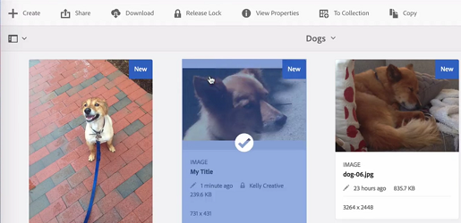

# Proteger y desproteger archivos en [!DNL Experience Manager] DAM {#check-in-and-check-out-files-in-assets}

<table>
    <tr>
        <td>
            <i>Nuevo</i> <a href="/help/assets/dynamic-media/dm-prime-ultimate.md"><b>Dynamic Media Prime y Ultimate</b></a>
        </td>
        <td>
            <i>Nuevo</i> <a href="/help/assets/assets-ultimate-overview.md"><b>AEM Assets Ultimate</b></a>
        </td>
        <td>
            <i>Nueva</i> integración de <a href="/help/assets/integrate-aem-assets-edge-delivery-services.md"><b>AEM Assets con Edge Delivery Services</b></a>
        </td>
        <td>
            <i>Nueva</i> <a href="/help/assets/aem-assets-view-ui-extensibility.md"><b>extensibilidad de la interfaz de usuario</b></a>
        </td>
          <td>
            <i>Nuevo</i> <a href="/help/assets/dynamic-media/enable-dynamic-media-prime-and-ultimate.md"><b>Habilitar Dynamic Media Prime y Ultimate</b></a>
        </td>
    </tr>
    <tr>
        <td>
            <a href="/help/assets/search-best-practices.md"><b>Prácticas recomendadas de búsqueda</b></a>
        </td>
        <td>
            <a href="/help/assets/metadata-best-practices.md"><b>Prácticas recomendadas de metadatos</b></a>
        </td>
        <td>
            <a href="/help/assets/product-overview.md"><b>Centro de contenido</b></a>
        </td>
        <td>
            <a href="/help/assets/dynamic-media-open-apis-overview.md"><b>Dynamic Media con funciones de OpenAPI</b></a>
        </td>
        <td>
            <a href="https://developer.adobe.com/experience-cloud/experience-manager-apis/"><b>Documentación de desarrollador de AEM Assets</b></a>
        </td>
    </tr>
</table>

| Versión | Vínculo del artículo |
| -------- | ---------------------------- |
| AEM 6.5 | [Haga clic aquí](https://experienceleague.adobe.com/docs/experience-manager-65/assets/managing/check-out-and-submit-assets.html?lang=es) |
| AEM as a Cloud Service | Este artículo |

[!DNL Adobe Experience Manager Assets] le permite extraer recursos para editarlos y volver a protegerlos una vez que haya completado los cambios. Después de desproteger un recurso, solo puede editarlo, anotarlo, publicarlo, moverlo o eliminarlo. La extracción de un recurso bloquea el recurso. Otros usuarios no podrán realizar ninguna de estas operaciones en el recurso hasta que vuelva a proteger el recurso en [!DNL Assets]. Sin embargo, aún pueden cambiar los metadatos del recurso bloqueado.

Para poder desproteger o proteger recursos, se requiere acceso de escritura en ellos.

Esta función ayuda a evitar que otros usuarios anulen los cambios realizados por un autor en el que varios usuarios colaboran en la edición de flujos de trabajo entre equipos.

## Desproteger recursos {#checking-out-assets}

1. En la interfaz de usuario [!DNL Assets], seleccione el recurso que desea desproteger. También puede seleccionar varios recursos para extraerlos.

1. En la barra de herramientas, haga clic en **[!UICONTROL Finalizar compra]**. La opción **[!UICONTROL Finalizar compra]** cambia a **[!UICONTROL Registrar]**.
Para comprobar si otros usuarios pueden editar el recurso que ha desprotegido, inicie sesión con otro usuario. El icono  se muestra en la miniatura del recurso que ha retirado.

   

   Seleccione el recurso. Tenga en cuenta que la barra de herramientas no muestra ninguna opción que le permita editar, anotar, publicar o eliminar el recurso.

   

   Para editar los metadatos del recurso bloqueado, haga clic en **[!UICONTROL Ver propiedades]**.

1. Haga clic en **[!UICONTROL Editar]** para abrir el recurso en modo de edición.

1. Edite el recurso y guarde los cambios. Por ejemplo, recorte la imagen y guárdela. También puede realizar anotaciones o publicar el recurso.

1. Seleccione el recurso editado de la interfaz [!DNL Assets] y haga clic en **[!UICONTROL Proteger]** en la barra de herramientas. El recurso modificado se protegió en [!DNL Assets] y está disponible para que otros usuarios lo editen.

## Protección forzada {#forced-check-in}

Los administradores pueden proteger los recursos que han desprotegido otros usuarios.

1. Inicie sesión en [!DNL Assets] como administrador.
1. En la interfaz de usuario [!DNL Assets], seleccione uno o varios recursos que otros usuarios han desprotegido.

   

1. En la barra de herramientas, haga clic en **[!UICONTROL Liberar bloqueo]**. El recurso se vuelve a registrar y está disponible para su edición por parte de otros usuarios.

## Prácticas recomendadas y limitaciones {#tips-limitations}

* Es posible eliminar una *carpeta* que contenga archivos de recursos desprotegidos. Antes de eliminar una carpeta, asegúrese de que los usuarios no desprotejan ningún recurso digital.

**Consulte también**

* [Traducir recursos](translate-assets.md)
* [API HTTP de recursos](mac-api-assets.md)
* [Formatos de archivo compatibles con recursos](file-format-support.md)
* [Buscar recursos](search-assets.md)
* [Recursos de red](use-assets-across-connected-assets-instances.md)
* [Informes de recurso](asset-reports.md)
* [Esquemas de metadatos](metadata-schemas.md)
* [Descarga de recursos](download-assets-from-aem.md)
* [Administración de metadatos](manage-metadata.md)
* [Facetas de búsqueda](search-facets.md)
* [Administrar colecciones](manage-collections.md)
* [Importación masiva de metadatos](metadata-import-export.md)
* [Publicación de recursos en AEM y Dynamic Media](/help/assets/publish-assets-to-aem-and-dm.md)

>[!MORELIKETHIS]
>
>* [Comprenda cómo registrar y desproteger en [!DNL Experience Manager] aplicación de escritorio](https://experienceleague.adobe.com/docs/experience-manager-desktop-app/using/using.html?lang=es#how-app-works2)
>* [Tutorial de vídeo para comprender el registro y la salida en [!DNL Assets]](https://experienceleague.adobe.com/docs/experience-manager-learn/assets/collaboration/check-in-and-check-out.html?lang=es)
