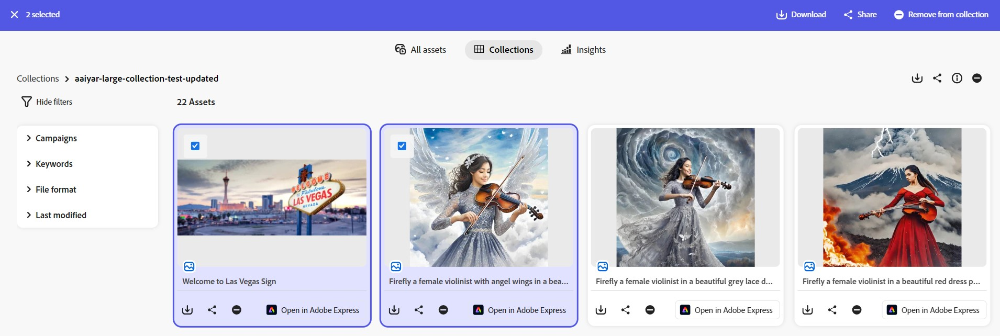

# Administrar colecciones en [!DNL Content Hub] {#manage-collections}

<!--  -->

Una colección hace referencia a un conjunto de recursos que se pueden compartir entre los usuarios. Una colección puede incluir recursos de diferentes ubicaciones manteniendo al mismo tiempo su integridad referencial.

[!DNL Content Hub] le permite crear colecciones públicas. Estas colecciones son accesibles para todos los usuarios con derecho a ellas, lo que crea un espacio compartido en el que varios usuarios pueden acceder y utilizar el contenido de forma eficaz. Las colecciones promueven el uso colaborativo de los recursos para aumentar la eficiencia y la comodidad. En la página de exploración de la colección, puede:

* **Crear**: crea una o más colecciones.
* **Ver**: vea los recursos y sus propiedades.
* **Compartir**: comparte recursos como vínculo con otros usuarios.
* **Descargar**: Descargue los recursos.
* **Quitar**: quite recursos específicos de una colección.
* **Eliminar**: elimine toda la colección.
* **Fijar/Desfijar**: Fijar o desanclar la colección.
* **Favorito**: marca la colección como favorita.

Ayuda a los usuarios a acceder y administrar fácilmente los diversos recursos disponibles en [!DNL Content Hub].

## Requisitos previos {#prerequisites}

[Usuarios de Content Hub](deploy-content-hub.md#onboard-content-hub-users) pueden realizar las acciones mencionadas en este artículo.

## Crear colecciones{#create-collections}

Puede elegir [crear una nueva colección](#create-new-collection) o [agregar recursos a una colección existente](#add-assets-to-existing-collection) mientras administra el control.

### Crear una nueva colección{#create-new-collection}

Siga estos pasos para controlar el acceso al crear colecciones:

1. Vaya a la ficha **[!DNL Collections]** y haga clic en **[!UICONTROL Crear colección]**. Aparece una nueva ventana Colección.

1. Agregue **[!UICONTROL Título]** y **[!UICONTROL Descripción]** para la colección.

   

1. En **[!UICONTROL Quién puede acceder a]**, lista desplegable > seleccione el tipo de control de acceso. Las opciones disponibles son las siguientes:

   | Método de acceso | Tipo de acceso | Descripción |
   |---|---|---|
   | **Solo usted y los administradores pueden editar** | Privado | Solo el creador y los administradores pueden editar y acceder a esta colección. |
   | **Cualquiera puede ver** | Público | Todos pueden acceder a esta colección, pero solo el creador y los administradores pueden editarla. |
   | **Cualquier persona puede ver y editar** | Público | Esta colección está abierta a todos, con acceso completo y permisos de edición concedidos sin restricciones. |

   >[!NOTE]
   >
   > El administrador de [!DNL Content Hub] puede ver todas las opciones disponibles en la lista desplegable **[!UICONTROL Quién puede acceder a]**, mientras que para los usuarios normales, necesita [especificar y configurar](configure-content-hub-ui-options.md) las opciones a las que pueden acceder.

1. Haga clic en **[!UICONTROL Crear]**. Una vez finalizado, puede [agregar recursos a la colección](#add-assets-to-existing-collection).

>[!VIDEO](https://video.tv.adobe.com/v/3463336)

<!--
>[!NOTE]
>
>Collections governance is a limited availability feature. You can get it enabled  by creating a support ticket. Once enabled, you need to [Configure Collections in Content Hub](configure-content-hub-ui-options.md#configure-collections-content-hub).-->

<!--To create a new collection, navigate to the **[!UICONTROL Collections]** tab and click **[!UICONTROL Create new collection]**. Enter the **[!UICONTROL Title]** and provide an optional **[!UICONTROL Description]** for the assets. Click **[!UICONTROL Create]**.
          
-->

### Agregar recursos a una colección existente{#add-assets-to-existing-collection}

Para agregar recursos a una colección existente, seleccione los recursos que debe agregar a la colección. Haga clic en **[!UICONTROL Agregar a la colección]**. Se le pedirá que seleccione la colección.

Elija la colección donde debe agregar el recurso. También puede buscar en la colección existente mediante la barra de búsqueda.  Seleccione las colecciones a las que debe agregar los recursos y haga clic en **[!UICONTROL Agregar a la colección]**.

## Ver colecciones{#view-collections}

Vaya a la pestaña **[!UICONTROL Colecciones]** y busque el nombre de la colección. Puede utilizar filtros para restringir los resultados de búsqueda seleccionando criterios específicos, lo que le ayuda a encontrar rápidamente las colecciones más relevantes.

Para ver la lista de recursos disponibles en una colección, haga clic en el nombre de la colección. También puede aplicar filtros dentro de una colección para reducir los resultados del recurso. Haga clic en el recurso que debe ver dentro de una colección. [!DNL Content Hub] muestra la vista detallada del recurso. [Ver detalles del recurso](asset-properties-content-hub.md).

### Filtrar vista de colecciones {#filter-collections-view}

Content Hub le permite filtrar la vista de colecciones para encontrar fácilmente lo que está buscando, restringiendo las opciones en función de sus preferencias. Asegúrese de que [se hayan configurado las colecciones en Content Hub](configure-content-hub-ui-options.md#configure-collections-content-hub).

Para filtrar la vista de colecciones, vaya a la pestaña **[!DNL Collections]** y navegue hasta la lista desplegable Colecciones. Elija entre las siguientes opciones:

* **[!UICONTROL Todas las colecciones]:** Seleccione esta opción para ver y editar todas las colecciones, incluidas las que sean privadas o compartidas con usted.
* **[!UICONTROL Solo yo]:** Seleccione esta opción para ver las colecciones a las que tiene acceso.
* **[!UICONTROL Cualquier persona puede ver]:** Esta opción le permite filtrar colecciones que son accesibles para todos pero que solo el creador puede editar.
* **[!UICONTROL Cualquier persona puede editar]:** Seleccione esta opción para filtrar colecciones que sean accesibles y editables para todos.

  

Además, para filtrar la vista de colecciones en función de los permisos de acceso, vaya a la pestaña **[!DNL Collections]** y desplácese a una de las siguientes opciones:

* **[!UICONTROL Creado por cualquier persona]:** Este filtro restringe la visualización de colecciones creadas por cualquier usuario.

* **[!UICONTROL Creado por mí]:** Este filtro te restringe a ver las colecciones que has creado.

  

<!--

* **A**: Details and metadata of the asset 
* **B**: Zoom In or Zoom Out the asset 
* **C**: Reset Zoom view 
* **D**: View the previous or next asset 
* **E**: Download the asset 
* **F**: Open the asset in Adobe Express 
* **G**: Hide the metadata of the asset 
* **H**: Share the asset as a link 
-->

## Descargar recursos disponibles en una colección{#download-assets-within-collection}

Para descargar los recursos disponibles en una colección, vaya a la ficha **[!UICONTROL Colecciones]**.\
Haga clic en el icono  de la tarjeta de colección.

Se descargan todos los recursos de la colección.

También puede abrir la colección para descargar los recursos individualmente. Haga clic en la colección que contiene los recursos que debe descargar. Seleccione los recursos y haga clic en **[!UICONTROL Descargar]**.

Obtenga información sobre cómo [descargar un recurso de [!DNL Content Hub]](download-assets-content-hub.md).

## Compartir recursos disponibles en una colección {#share-assets-available-within-collection}

También puede compartir los recursos disponibles en una colección. Asegúrese de [habilitar el uso compartido de vínculos públicos en Content Hub](configure-content-hub-ui-options.md#configure-collections-content-hub). Vaya a la pestaña **[!UICONTROL Colecciones]**. Seleccione el icono  en la tarjeta de recursos. Se copia el vínculo compartido. Puede compartir el vínculo copiado con el destinatario. Más información sobre [compartir recursos en [!DNL Content Hub]](share-assets-content-hub.md).

Content Hub Collections proporciona herramientas de gobernanza completas para una administración eficaz de los recursos, incluidos permisos de uso compartido personalizables y funciones de colaboración. Desde el acceso de solo lectura hasta el control administrativo completo, esta configuración admite la buena gobernanza en la distribución de recursos. Al compartir un recurso de forma individual o como parte de una colección, el ámbito de acceso viene determinado por el nivel de acceso actual de la colección asignado al usuario. Como alternativa, no puede compartir una colección privada.

## Editar detalles de una colección {#edit-details-of-collection}

Para editar **[!UICONTROL Título]** y **[!UICONTROL Descripción]** de una colección, haga clic en el nombre de la colección y luego en el icono . Aparece la pantalla [!UICONTROL Detalles de colección] que le permite editar el **[!UICONTROL Título]** y la **[!UICONTROL Descripción]** de una colección. Haga clic en **[!UICONTROL Guardar cambios]** para confirmar las modificaciones. Además, puede actualizar el acceso a la colección mediante el cuadro de diálogo Editar colección, según la configuración.

## Eliminación de recursos de una colección{#remove-assets-from-a-collection}

Los siguientes usuarios pueden quitar uno o varios recursos de una colección:

* Un administrador
* Propietario de la colección
* Un usuario no administrador con derechos de edición

Para quitar recursos de una colección, haga clic en la colección de la que debe quitarlos, selecciónelos y haga clic en **[!UICONTROL Quitar de la colección]**.

Se le pedirá que confirme la eliminación del recurso. Haga clic en **[!UICONTROL Quitar]**.\
Los recursos seleccionados se han eliminado correctamente de la colección.

## Eliminar una colección{#delete-collection}

Solo los administradores y el creador pueden eliminar una colección. Para eliminar una colección, vaya a la ficha **[!UICONTROL Colecciones]** y haga clic en la colección que debe eliminar. Haga clic en el icono  para eliminar la colección.

## Fijar o desanclar colección {#pin-unpin-collection}

Los administradores de Content Hub pueden anclar colecciones en Content Hub para acceder rápidamente a ellas. Las colecciones ancladas se muestran en una sección anclada dedicada en la página de inicio Colecciones, lo que facilita mantener las colecciones importantes a mano. Para acceder rápidamente, puede anclar o desanclar una colección ejecutando los pasos a continuación:

1. Explore las colecciones que desea anclar o desanclar.

1. Haga clic en **[!UICONTROL Más acciones]**  y seleccione **[!UICONTROL Anclar para acceder rápidamente]**. Aparecerá un cuadro de confirmación.

   

1. Haga clic en **[!UICONTROL Fijar]** para confirmar. El mensaje de advertencia aparece al anclar una colección privada.

   

   Las colecciones ancladas aparecen en la parte superior para acceder rápidamente a ellas. Como alternativa, para desanclar la colección, haga clic en **[!UICONTROL Más acciones]**  y seleccione **[!UICONTROL Desanclar]**.

   

## Marcar colecciones como favoritas {#favorite-collection}

Puede marcar colecciones como favoritas en Content Hub, lo que facilita su organización y recuperación. Una vez agregadas, las colecciones favoritas estarán disponibles en la pestaña Favoritos de la página principal de Content Hub. Además, puede buscar recursos en Colecciones favoritas. Para marcar colecciones como Favoritos, siga estos pasos:

1. Examine las colecciones que desea marcar como favoritas.

1. Haga clic en **[!UICONTROL Más acciones]**  y seleccione **[!UICONTROL Agregar a Favoritos]** para marcar la colección como Favorita.

   

   Las colecciones marcadas como Favoritos ahora se muestran en la ficha **[!UICONTROL Mis favoritos]**. También puede quitar las colecciones de **[!UICONTROL Mis favoritos]**. Para ello, haga clic en **[!UICONTROL Más acciones]**  y seleccione **[!UICONTROL Quitar de Favoritos]**.

   

>[!NOTE]
>
>[Anclar o desanclar colección](#pin-unpin-collection) y [Marcar colecciones como favoritas](#favorite-collection) son características de disponibilidad limitada. Puede [crear y enviar](https://helpx.adobe.com/es/enterprise/using/support-for-experience-cloud.html) un caso de asistencia al cliente de Adobe para habilitarlo para su implementación.

