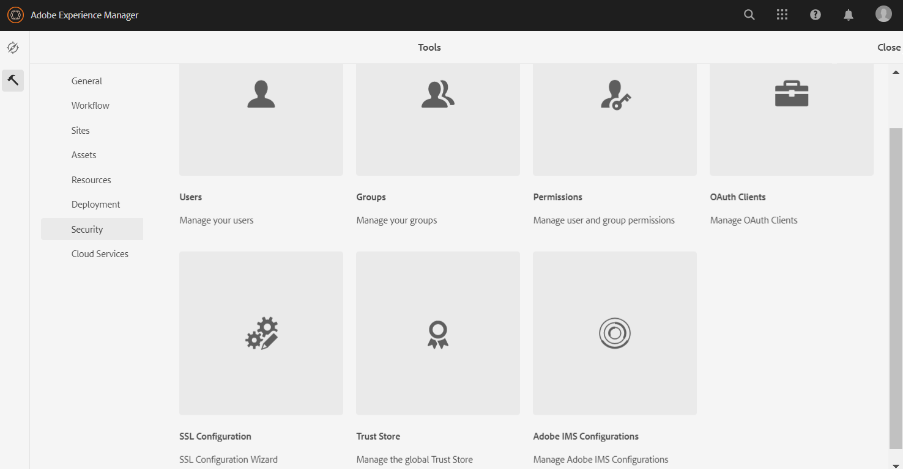
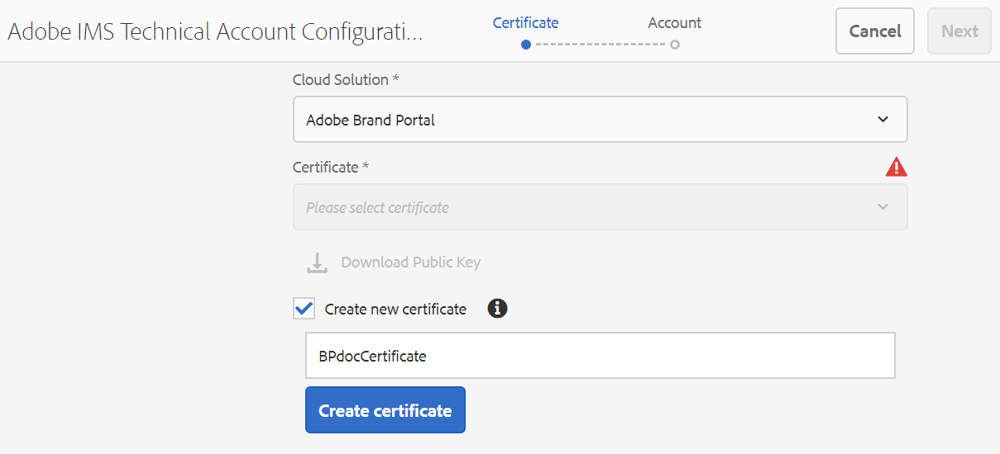

# Configurar AEM Assets con Brand Portal {#configure-aem-assets-with-brand-portal}

Los recursos de Adobe Experience Manager (AEM) se configuran con Brand Portal a través de Adobe I/O, que proporciona un distintivo IMS para la autorización del inquilino de Brand Portal.

## Requisitos previos {#prerequisites}

Para configurar AEM Assets con Brand Portal, es necesario lo siguiente:

* Una instancia de nube de AEM Assets en ejecución.
* URL del inquilino de Brand Portal.
* Un usuario con privilegios de administrador del sistema en la organización IMS del inquilino de Brand Portal.

**Póngase en contacto con soporte técnico** para obtener más consultas.

## Crear configuración {#create-new-configuration}

Puede crear una configuración en Adobe I/O para configurar la instancia de nube de AEM Assets con Brand Portal.

Siga estos pasos en la secuencia indicada:
1. [Obtener un certificado público](#public-certificate)
1. [Crear la integración de Adobe I/O](#createnewintegration)
1. [Crear la configuración de cuenta IMS](#create-ims-account-configuration)
1. [Configurar el servicio en la nube](#configure-the-cloud-service)
1. [Probar la configuración](#test-configuration)

### Crear la configuración de IMS {#create-ims-configuration}

La configuración de IMS autentica el inquilino de Brand Portal con la instancia de creación de AEM Assets.

La configuración de IMS incluye dos pasos:

* [Obtener un certificado público](#public-certificate)
* [Crear la configuración de cuenta IMS](#create-ims-account-configuration)

### Obtener un certificado público {#public-certificate}

El certificado público permite autenticar el perfil en Adobe I/O.

1. Inicie sesión en la instancia de nube de AEM Assets.

1. En el panel **** , vaya a **[!UICONTROL Seguridad]** > **[!UICONTROL Configuraciones de Adobe IMS]**.

   

1. Se abre la página Configuraciones de IMS de Adobe.

   Haga clic en **[!UICONTROL Crear]**.

   Esto lo llevará a la página **[!UICONTROL Configuración de cuenta técnica de Adobe IMS]**.

1. De forma predeterminada, se abre la pestaña **Certificado** .

   En **Cloud Solution**, seleccione **[!UICONTROL Adobe Brand Portal]**.

1. Marque la casilla de verificación **[!UICONTROL Crear nuevo certificado]** y especifique un **alias** para el certificado. El alias sirve como nombre del cuadro de diálogo.

1. Haga clic en **[!UICONTROL Crear certificado]**. Aparece un cuadro de diálogo. Haga clic en **[!UICONTROL Aceptar]** para generar el certificado público.

   

1. Haga clic en **[!UICONTROL Descargar clave pública]** y guarde el archivo de certificado *AEM-Adobe-IMS.crt* en el equipo. El archivo de certificado se utiliza para [crear la integración](#createnewintegration) de Adobe I/O.

   

1. Haga clic en **[!UICONTROL Siguiente]**. 

   En la pestaña **Cuenta**, cree la cuenta de Adobe IMS, pero para ello necesitará los detalles de integración. Mantenga esta página abierta por ahora.

   Abra una pestaña nueva y [cree la integración](#createnewintegration) de Adobe I/O para obtener los detalles de integración de las configuraciones de cuenta de IMS.

### Crear la integración de Adobe I/O {#createnewintegration}

La integración de Adobe I/O genera la clave de API, el secreto del cliente y la carga útil (JWT), que es necesaria para configurar las configuraciones de cuenta de IMS.

1. Inicie sesión en la consola de Adobe I/O con privilegios de administrador del sistema en la organización IMS del inquilino de Brand Portal.

   Dirección URL predeterminada: [https://console.adobe.io/](https://console.adobe.io/)

1. Haga clic en **[!UICONTROL Crear integración]**.

1. Seleccione **[!UICONTROL Acceso a una API]** y haga clic en **[!UICONTROL Continuar]**.

   

1. Se abre una nueva página de integración.

   Seleccione su organización en la lista desplegable.

   En **[!UICONTROL Experience Cloud]**, seleccione **[!UICONTROL AEM Brand Portal]** y haga clic en **[!UICONTROL Continuar]**.

   Si la opción de Brand Portal está deshabilitada para usted, asegúrese de que ha seleccionado la organización correcta en el cuadro desplegable situado encima de la opción Servicios **[!UICONTROL de]** Adobe. Si no conoce su organización, póngase en contacto con su administrador.

   

1. Especifique un nombre y una descripción para la integración. Haga clic en **[!UICONTROL Seleccionar un archivo del equipo]** y cargue el `AEM-Adobe-IMS.crt` archivo descargado en la sección [Obtener certificados públicos](#public-certificate).

1. Seleccione el perfil de su organización.

   O bien, seleccione el perfil predeterminado **[!UICONTROL Assets Brand Portal]** y haga clic en **[!UICONTROL Crear integración]**. Se crea la integración.

1. Haga clic en **[!UICONTROL Continuar a los detalles de la integración]** para visualizar la información de integración.

   Copiar la **[!UICONTROL clave de API]**

   Haga clic en **[!UICONTROL Recuperar secreto del cliente]** y copie la clave del Secreto del cliente.

   

1. Vaya a la pestaña **[!UICONTROL JWT]** y copie la carga útil **[!UICONTROL JWT]**.

   La clave de API, la clave secreta del cliente y la información de carga útil de JWT se utilizarán para crear la configuración de la cuenta de IMS.

### Crear la configuración de cuenta IMS {#create-ims-account-configuration}

Asegúrese de haber realizado los siguientes pasos:

* [Obtener un certificado público](#public-certificate)
* [Crear la integración de Adobe I/O](#createnewintegration)

**Pasos para crear la configuración de cuenta de IMS:**

1. Abra la página Configuración de IMS, pestaña **[!UICONTROL Cuentas]** . La página se ha mantenido abierta al final de la sección, [Obtener un certificado público](#public-certificate).

1. Especifique un **[!UICONTROL Título]** para la cuenta de IMS.

   En **[!UICONTROL Servidor de autorización]**, introduzca la dirección URL: [https://ims-na1.adobelogin.com/](https://ims-na1.adobelogin.com/)

   Pegue la clave de API, el Secreto del cliente y la carga útil JWT que ha copiado al final de [Crear integración de Adobe I/O](#createnewintegration).

   Haga clic en **[!UICONTROL Crear]**.

   Se crea la integración.

   

1. Seleccione la configuración de IMS y haga clic en **[!UICONTROL Comprobar estado]**. Aparecerá un cuadro de diálogo.

   Haga clic en **[!UICONTROL Comprobar]**. Cuando la conexión se realiza correctamente, aparece el mensaje *Token recuperado correctamente* .

   

>[!CAUTION]
>
>Sólo debe tener una configuración de IMS. No cree varias configuraciones de IMS.
>
>Asegúrese de que la configuración de IMS pase la comprobación de estado. Si la configuración no pasa la comprobación de estado, no es válida. Debe eliminarla y crear una configuración nueva y válida.

### Configurar el servicio en la nube {#configure-the-cloud-service}

Siga estos pasos para crear la configuración del servicio en la nube de Brand Portal:

1. Inicie sesión en la instancia de nube de AEM Assets.

1. En el panel **** , vaya a **[!UICONTROL Cloud Services**[!UICONTROL  > ]**AEM Brand Portal]**.

   Se abre la página Configuraciones de Brand Portal.

1. Haga clic en **[!UICONTROL Crear]**.

1. Especifique un **[!UICONTROL Título]** para la configuración.

   Seleccione la configuración de IMS que creó en el paso, [cree la configuración](#create-ims-account-configuration) de la cuenta de IMS.

   En la URL **** del servicio, introduzca la URL del inquilino de Brand Portal.

   

1. Haga clic en **[!UICONTROL Guardar y cerrar]**. Se crea la configuración de nube. La instancia de nube de AEM Assets ahora está configurada con el inquilino de Brand Portal.

### Probar la configuración{#test-configuration}

1. Inicie sesión en la instancia de nube de AEM Assets.

1. En el panel **** , vaya a **[!UICONTROL Implementación]** > **[!UICONTROL Distribución]**.

   

1. Se abre la página Distribución.

   Se crea un agente de distribución de Brand Portal `bpdistributionagent0` en **[!UICONTROL Publicar en Brand Portal]**.

   Haga clic en **[!UICONTROL Publicar en Brand Portal.]**

   

   >[!NOTE]
   >
   >De forma predeterminada, se crea un agente de distribución para un inquilino de Brand Portal.

1. Se abre la página del agente de distribución. De forma predeterminada, se abre la pestaña **[!UICONTROL Estado]**, que rellena las colas de distribución.

   Un agente de distribución contiene dos colas:
   * **processing-queue**: para la distribución de recursos a Brand Portal.

   * **error-queue**: para los recursos en los que la distribución ha fallado.
   >[!NOTE]
   >
   >Se recomienda revisar los errores y borrar la **cola de errores** periódicamente.

   

1. Para comprobar la conexión entre AEM Assets y Brand Portal, haga clic en **[!UICONTROL Probar conexión]**.

   

   Aparece un mensaje en la parte inferior de la página que indica que el paquete de prueba se entregó correctamente.

   >[!NOTE]
   >
   >Evite desactivar el agente de distribución, ya que puede provocar errores en la distribución de los recursos (que se ejecutan en la cola).

La instancia de nube de AEM Assets se ha configurado correctamente con Brand Portal y ahora puede:

* [Publicar recursos desde AEM Assets en Brand Portal](publish-to-brand-portal.md)
* [Publicar carpetas desde AEM Assets en Brand Portal](publish-to-brand-portal.md#publish-folders-to-brand-portal)
* [Publicar colecciones desde AEM Assets en Brand Portal](publish-to-brand-portal.md#publish-collections-to-brand-portal)

Además de lo anterior, también puede publicar esquemas de metadatos, ajustes preestablecidos de imagen, facetas de búsqueda y etiquetas de AEM Assets en Brand Portal.

* [Publicar ajustes preestablecidos, esquemas y facetas en Brand Portal](https://docs.adobe.com/content/help/en/experience-manager-brand-portal/using/publish/publish-schema-search-facets-presets.html)
* [Publicar etiquetas en Brand Portal](https://docs.adobe.com/content/help/en/experience-manager-brand-portal/using/publish/brand-portal-publish-tags.html)

Consulte la [documentación de Brand Portal](https://docs.adobe.com/content/help/en/experience-manager-brand-portal/using/home.html) para obtener más información.

## Registros de distribución {#distribution-logs}

Puede consultar los registros para obtener información detallada sobre las acciones realizadas en el agente de distribución.

Por ejemplo, publicamos un recurso desde AEM Assets en Brand Portal para comprobar la configuración.

1. Siga los pasos (paso 1 a 4) que se muestran en **[!UICONTROL Comprobar conexión]** y vaya a la página del agente de distribución.

1. Haga clic en **[!UICONTROL Registros]** para ver los registros de distribución. Aquí puede ver los registros de procesamiento y de errores.

   

El agente de distribución genera los siguientes registros:

* INFORMACIÓN: Es un registro generado por el sistema que se activa en una configuración correcta que habilita el agente de distribución.
* DSTRQ1 (Solicitud 1): Se activa en comprobar la conexión.

Al publicar el recurso, se generan los siguientes registros de solicitud y respuesta:

**Solicitud del agente de distribución**:
* DSTRQ2 (Solicitud 2): Se activa la solicitud de publicación de recursos.
* DSTRQ3 (Solicitud 3): El sistema activa otra solicitud para publicar la carpeta en la que existe el recurso y replica la carpeta en Brand Portal.

**Respuesta del agente de distribución**:
* queue-bpdistributionagent0 (DSTRQ2): El recurso se publica en Brand Portal.
* queue-bpdistributionagent0 (DSTRQ3): El sistema replica la carpeta con el recurso en Brand Portal.

En el ejemplo anterior, se activa una solicitud y una respuesta adicionales. El sistema no pudo encontrar la carpeta principal (denominada Agregar ruta) en Brand Portal porque el recurso se publicó por primera vez, por lo tanto se activa una solicitud adicional para crear una carpeta principal con el mismo nombre en Brand Portal en la que se publica el recurso.

>[!NOTE]
>
>Se genera una solicitud adicional si la carpeta principal no existe en Brand Portal (en el ejemplo anterior) o si la carpeta principal se ha modificado en AEM Assets.

<!--

## Additional information {#additional-information}

Go to `/system/console/slingmetrics` for statistics related to the distributed content:

1. **Counter metrics**
   * sling: `mac_sync_request_failure`
   * sling: `mac_sync_request_received`
   * sling: `mac_sync_request_success`

1. **Time metrics**
   * sling: `mac_sync_distribution_duration`
   * sling: `mac_sync_enqueue_package_duration`
   * sling: `mac_sync_setup_request_duration`

-->

<!--
   Comment Type: draft

   <li> </li>
   -->

<!--
   Comment Type: draft

   <li>Step text</li>
   -->
