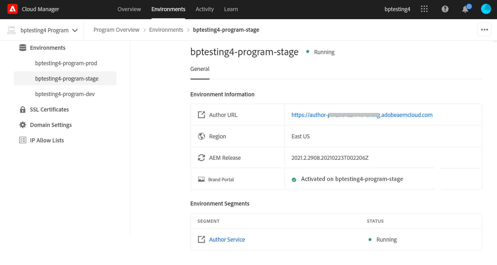

# Configurar Experience Manager Assets con Brand Portal {#configure-aem-assets-with-brand-portal}

<table>
    <tr>
        <td>
            <i>Nuevo</i> <a href="/help/assets/dynamic-media/dm-prime-ultimate.md"><b>Dynamic Media Prime y Ultimate</b></a>
        </td>
        <td>
            <i>Nuevo</i> <a href="/help/assets/assets-ultimate-overview.md"><b>AEM Assets Ultimate</b></a>
        </td>
        <td>
            <i>Nueva</i> integración de <a href="/help/assets/integrate-aem-assets-edge-delivery-services.md"><b>AEM Assets con Edge Delivery Services</b></a>
        </td>
        <td>
            <i>Nueva</i> <a href="/help/assets/aem-assets-view-ui-extensibility.md"><b>extensibilidad de la interfaz de usuario</b></a>
        </td>
          <td>
            <i>Nuevo</i> <a href="/help/assets/dynamic-media/enable-dynamic-media-prime-and-ultimate.md"><b>Habilitar Dynamic Media Prime y Ultimate</b></a>
        </td>
    </tr>
    <tr>
        <td>
            <a href="/help/assets/search-best-practices.md"><b>Prácticas recomendadas de búsqueda</b></a>
        </td>
        <td>
            <a href="/help/assets/metadata-best-practices.md"><b>Prácticas recomendadas de metadatos</b></a>
        </td>
        <td>
            <a href="/help/assets/product-overview.md"><b>Centro de contenido</b></a>
        </td>
        <td>
            <a href="/help/assets/dynamic-media-open-apis-overview.md"><b>Dynamic Media con funciones de OpenAPI</b></a>
        </td>
        <td>
            <a href="https://developer.adobe.com/experience-cloud/experience-manager-apis/"><b>Documentación de desarrollador de AEM Assets</b></a>
        </td>
    </tr>
</table>

| Versión | Vínculo del artículo |
| -------- | ---------------------------- |
| AEM 6.5 | [Haga clic aquí](https://experienceleague.adobe.com/docs/experience-manager-65/assets/brandportal/configure-aem-assets-with-brand-portal.html?lang=es) |
| AEM as a Cloud Service | Este artículo |

La configuración de Adobe Experience Manager Assets Brand Portal permite publicar recursos de marca aprobados de Adobe Experience Manager Assets como una instancia de [!DNL Cloud Service] en Brand Portal y distribuirlos a los usuarios de Brand Portal.

## Activación de Brand Portal mediante Cloud Manager {#activate-brand-portal}

El usuario de Cloud Manager activa Brand Portal para una instancia de Experience Manager Assets como [!DNL Cloud Service]. El flujo de trabajo de activación crea las configuraciones necesarias (token de autorización, configuración de IMS y servicio en la nube de Brand Portal) en el back-end y refleja el estado del inquilino de Brand Portal en Cloud Manager. La activación de Brand Portal permite a los usuarios de Experience Manager Assets publicar recursos en Brand Portal y distribuirlos a los usuarios de Brand Portal.

**Requisitos previos**

Necesita lo siguiente para activar Brand Portal en su Experience Manager Assets como instancia de [!DNL Cloud Service]:

* Una instancia de Experience Manager Assets como [!DNL Cloud Service] en ejecución.
* Un usuario con acceso a Cloud Manager asignado a Perfiles del producto de Cloud Manager. Consulte [acceso a Cloud Manager](https://experienceleague.adobe.com/docs/experience-manager-cloud-service/security/ims-support.html?lang=es#accessing-cloud-manager) para obtener más información.

>[!NOTE]
>
>Se requiere un entorno de producción configurado para crear una instancia de Experience Manager Assets as a [!DNL Cloud Service] con el fin de conectar con el inquilino de Brand Portal.

**Pasos para activar Brand Portal**

Puede activar Brand Portal al crear los entornos de producción para su Experience Manager Assets como instancia de [!DNL Cloud Service] o por separado. Supongamos que el entorno ya se ha creado y que ahora es necesario activar Brand Portal.

1. Inicie sesión en Adobe Cloud Manager y vaya a **[!UICONTROL Entornos]**.

   La página **[!UICONTROL Entornos]** muestra la lista de todos los entornos existentes.

1. Seleccione los entornos (uno a uno) de la lista para ver los detalles del entorno.

   Brand Portal tiene derecho a uno de los entornos disponibles y se refleja en la **[!UICONTROL Información del entorno]**.

   Cuando encuentre el entorno asociado a Brand Portal, haga clic en el botón **[!UICONTROL Activar Brand Portal]** para iniciar el flujo de trabajo de activación.

   

1. Se tarda unos minutos en activar el inquilino de Brand Portal, ya que el flujo de trabajo de activación crea las configuraciones necesarias en el back-end. Una vez activado el inquilino de Brand Portal, el estado cambia a Activado.

   

>[!NOTE]
>
>Brand Portal debe activarse en la misma organización de IMS que en Experience Manager Assets como instancia de [!DNL Cloud Service].
>
>Si tiene una configuración de nube de Brand Portal existente ([configurada manualmente con Adobe Developer Console](#manual-configuration)) para una organización de IMS (org1-existing) y su instancia de Experience Manager Assets as a [!DNL Cloud Service] está configurada para otra organización de IMS (org2-new), al activar Brand Portal desde Cloud Manager se restablece la organización de IMS de Brand Portal a `org2-new`. Aunque la configuración de nube configurada manualmente en `org1-existing` está visible en la instancia de autor de Experience Manager Assets, ya no estará en uso después de activar Brand Portal desde Cloud Manager.
>
>Si la configuración de nube de Brand Portal existente y Experience Manager Assets as a [!DNL Cloud Service] emplean la misma organización de IMS (org1), solo deberá activar Brand Portal desde Cloud Manager.
>
>No modifique ninguna configuración generada automáticamente.

**Ver también**:

* [Agregar usuarios y funciones en Experience Manager Assets as a Cloud Service](https://experienceleague.adobe.com/docs/experience-manager-cloud-manager/using/requirements/setting-up-users-and-roles.html?lang=es)

* [Administrar entornos en Cloud Manager](https://experienceleague.adobe.com/docs/experience-manager-cloud-service/implementing/using-cloud-manager/manage-environments.html?lang=es#adding-environments)

**Inicie sesión en su inquilino de Brand Portal**:

Después de activar el inquilino de Brand Portal en Cloud Manager, puede iniciar sesión en Brand Portal desde Admin Console o directamente mediante la URL del inquilino.

La dirección URL predeterminada del inquilino de Brand Portal es: `https://<tenant-id>.brand-portal.adobe.com/`.

Donde, el ID de inquilino es la organización de IMS.

Realice los siguientes pasos si no está seguro de la dirección URL de Brand Portal:

1. Inicie sesión en [Admin Console](https://adminconsole.adobe.com/) y navegue hasta **[!UICONTROL Productos]**.
1. En el panel izquierdo, seleccione **[!UICONTROL Adobe Experience Manager Brand Portal - Brand Portal]**.
1. Haga clic en **[!UICONTROL Ir a Brand Portal]** para abrir directamente Brand Portal en el explorador.

   O bien, copie la URL del inquilino de Brand Portal del vínculo **[!UICONTROL Ir a Brand Portal]** y péguela en el explorador para abrir la interfaz de Brand Portal.

   

**Probar conexión**

Realice los siguientes pasos para validar la conexión entre su instancia de Experience Manager Assets as a [!DNL Cloud Service] y el inquilino de Brand Portal:

1. Inicie sesión en Experience Manager Assets.

1. En el panel **Herramientas**, vaya a **[!UICONTROL Implementación]** > **[!UICONTROL Distribución]**.

   

   Se crea un agente de distribución de Brand Portal (**[!UICONTROL bpdistributionagent0]**) en **[!UICONTROL Publicar en Brand Portal]**.

   

1. Haga clic en **[!UICONTROL Publicar en Brand Portal]** para abrir el agente de distribución.

   Puede ver las colas de distribución en la ficha **[!UICONTROL Estado]**.

   Un agente de distribución contiene dos colas:
   * **processing-queue**: para la distribución de recursos a Brand Portal.

   * **error-queue**: para los recursos en los que la distribución ha fallado.

   >[!NOTE]
   >
   >Se recomienda revisar los errores y borrar la **cola de errores** periódicamente.

   

1. Para comprobar la conexión entre Experience Manager Assets as a [!DNL Cloud Service] y Brand Portal, haga clic en el icono **[!UICONTROL Probar conexión]**.

   

   Aparece un mensaje que indica que el paquete de prueba *se entregó correctamente*.

   >[!NOTE]
   >
   >Evite desactivar el agente de distribución, ya que puede provocar errores en la distribución de los recursos (que se ejecutan en la cola).

Para comprobar la conexión entre su instancia de Experience Manager Assets as a [!DNL Cloud Service] y el inquilino de Brand Portal, publique un recurso de Experience Manager Assets en Brand Portal. Si la conexión se realiza correctamente, el recurso publicado se podrá ver en la interfaz de Brand Portal.

Ahora puede:

* [Publicación de recursos de Experience Manager Assets en Brand Portal](publish-to-brand-portal.md)
* [Publicar carpetas desde Experience Manager Assets en Brand Portal](publish-to-brand-portal.md#publish-folders-to-brand-portal)
* [Publicar colecciones desde Experience Manager Assets en Brand Portal](publish-to-brand-portal.md#publish-collections-to-brand-portal)
* [Publicar recursos de Brand Portal en Experience Manager Assets](https://experienceleague.adobe.com/docs/experience-manager-brand-portal/using/asset-sourcing-in-brand-portal/brand-portal-asset-sourcing.html?lang=es): obtención de recursos en Brand Portal
* [Publicar ajustes preestablecidos, esquemas y facetas en Brand Portal](https://experienceleague.adobe.com/docs/experience-manager-brand-portal/using/publish/publish-schema-search-facets-presets.html?lang=es)
* [Publicar etiquetas en Brand Portal](https://experienceleague.adobe.com/docs/experience-manager-brand-portal/using/publish/brand-portal-publish-tags.html?lang=es)

Consulte [Documentación de Brand Portal](https://experienceleague.adobe.com/docs/experience-manager-brand-portal/using/home.html?lang=es) para obtener más información.

**Registros de distribución**

Puede monitorizar los registros del agente de distribución para el flujo de trabajo de publicación de recursos.

Ahora vamos a publicar un recurso de Experience Manager Assets en Brand Portal y ver los registros.

1. Siga los pasos (de 1 a 4) que se muestran en la sección **Probar conexión** y vaya a la página del agente de distribución.
1. Haga clic en **[!UICONTROL Registros]** para ver los registros de procesamiento y error.

   

El agente de distribución ha generado los siguientes registros:

* INFORMACIÓN: Es un registro generado por el sistema que está en déclencheur con la configuración correcta del agente de distribución.
* DSTRQ1 (Solicitud 1): Se activa en comprobar la conexión.

Al publicar el recurso, se generan los siguientes registros de solicitud y respuesta:

**Solicitud del agente de distribución**:

* DSTRQ2 (Solicitud 2): Se activa la solicitud de publicación de recursos.
* DSTRQ3 (Solicitud 3): El sistema déclencheur otra solicitud para publicar la carpeta Experience Manager Assets (en la que existe el recurso) y replica la carpeta en Brand Portal.

**Respuesta del agente de distribución**:

* queue-bpdistributionagent0 (DSTRQ2): El recurso se publica en Brand Portal.
* queue-bpdistributionagent0 (DSTRQ3): El sistema replica la carpeta Experience Manager Assets (que contiene el recurso) en Brand Portal.

En el ejemplo anterior, se activa una solicitud y una respuesta adicionales. El sistema no pudo encontrar la carpeta principal (Agregar ruta) en Brand Portal porque el recurso se publicó por primera vez, por lo tanto se activó una solicitud adicional para crear una carpeta principal con el mismo nombre en Brand Portal en la que se publica el recurso.

>[!NOTE]
>
>Se genera una solicitud adicional si la carpeta principal no existe en Brand Portal o si se ha modificado en Experience Manager Assets.

Junto con el flujo de trabajo de automatización para activar Brand Portal en Experience Manager Assets as a [!DNL Cloud Service], existe otro método para configurar Experience Manager Assets as a [!DNL Cloud Service] manualmente con Brand Portal mediante Adobe Developer Console que ya no se recomienda.

>[!NOTE]
>
>Póngase en contacto con Asistencia al cliente si tiene algún problema al activar el inquilino de Brand Portal.

## Configuración manual con Adobe Developer Console {#manual-configuration}

>[!NOTE]
>
> No puede crear nuevas credenciales de JWT a partir de junio de 2024. A partir de ahora, solo se crean credenciales de OAuth.
> Ver más [creando una configuración de OAuth](https://experienceleague.adobe.com/es/docs/experience-manager-cloud-service/content/security/setting-up-ims-integrations-for-aem-as-a-cloud-service#creating-oauth-configuration:~:text=For%20example%3A-,Creating%20an%20OAuth%20configuration,-To%20create%20a).

En la siguiente sección se describe cómo configurar manualmente Experience Manager Assets as a [!DNL Cloud Service] con Brand Portal mediante Adobe Developer Console.

Anteriormente, Experience Manager Assets as a [!DNL Cloud Service] se configuraba manualmente con Brand Portal a través de Adobe Developer Console, que obtiene un token de cuenta de Adobe Identity Management Services (IMS) para la autorización del inquilino de Brand Portal. Requiere configuraciones tanto en Experience Manager Assets como en Adobe Developer Console.

<!--1. In Experience Manager Assets, create an IMS account and generate a public key (certificate).-->
<!--1. Under the project, configure an API using the public key to create a service account connection.
1. Get the service account credentials and JSON Web Token (JWT) payload information.
1. In Experience Manager Assets, configure the IMS account using the service account credentials and JWT payload.-->
1. En Adobe Developer Console, cree un proyecto para el inquilino (organización) de Brand Portal.
1. En Experience Manager Assets, configure el servicio en la nube de Brand Portal con la cuenta de IMS y el punto final de Brand Portal (URL de la organización).
1. Pruebe la configuración publicando un recurso de Experience Manager Assets en Brand Portal.

>[!NOTE]
>
>Una instancia de Experience Manager Assets as a [!DNL Cloud Service] solo se debe configurar con un usuario de Brand Portal.

**Requisitos previos**

Para configurar Experience Manager Assets con Brand Portal, es necesario lo siguiente:

* Una instancia de Experience Manager Assets como [!DNL Cloud Service] en ejecución
* Una URL de inquilino de Brand Portal
* Un usuario con privilegios de administrador del sistema en la organización IMS del inquilino de Brand Portal

## Crear configuración {#create-new-configuration}

Siga estos pasos en la secuencia especificada para configurar Experience Manager Assets con Brand Portal.

1. [Configuración de las credenciales de OAuth en Adobe Developer Console](#config-oauth)
1. [Creación de una nueva integración de Adobe IMS mediante OAuth](#create-ims-account-configuration)
1. [Configurar el servicio en la nube](#configure-cloud-service)
   <!--1. [Obtain public certificate](#public-certificate)-->
<!--1. [Create service account (JWT) connection](#createnewintegration) 
1. [Configure IMS account](#create-ims-account-configuration)-->

<!--
### Create IMS configuration {#create-ims-configuration}

The IMS configuration authenticates your Experience Manager Assets as a [!DNL Cloud Service] instance with the Brand Portal tenant. 

IMS configuration includes two steps:

* [Obtain public certificate](#public-certificate) 
* [Configure IMS account](#create-ims-account-configuration)
-->
<!--

### Obtain public certificate {#public-certificate}

The public key (certificate) authenticates your profile on Adobe Developer Console.

1. Login to Experience Manager Assets.
1. From the **Tools** panel, navigate to **[!UICONTROL Security]** > **[!UICONTROL Adobe IMS Configurations]**.
1. In Adobe IMS Configurations page, click **[!UICONTROL Create]**. It will redirect to the **[!UICONTROL Adobe IMS Technical Account Configuration]** page. By default, the **Certificate** tab opens.
1. Select **[!UICONTROL Adobe Brand Portal]** in the **[!UICONTROL Cloud Solution]** drop-down list.  
1. Select the **[!UICONTROL Create new certificate]** check box and specify an **alias** for the public key. The alias serves as name of the public key. 
1. Click **[!UICONTROL Create certificate]**. Then, click **[!UICONTROL OK]** to generate the public key.

   

1. Click the **[!UICONTROL Download Public Key]** icon and save the public key (CRT) file on your machine.

   The public key is used later to configure API for your Brand Portal tenant and generate service account credentials in Adobe Developer Console.  

   

1. Click **[!UICONTROL Next]**.

    In the **Account** tab, Adobe IMS account is created which requires the service account credentials that are generated in Adobe Developer Console. Keep this page open for now.

    Open a new tab and [create a service account (JWT) connection in Adobe Developer Console](#createnewintegration) to get the credentials and JWT payload for configuring the IMS account. 
-->
<!--

### Create service account (JWT) connection {#createnewintegration}

In Adobe Developer Console, projects and APIs are configured at Brand Portal tenant (organization) level. Configuring an API creates a service account (JWT) connection. There are two methods to configure API, by generating a key pair (private and public keys) or by uploading a public key. To configure Experience Manager Assets with Brand Portal, you must generate a public key (certificate) in Experience Manager Assets and create credentials in Adobe Developer Console by uploading the public key. These credentials are required to configure the IMS account in Experience Manager Assets. Once the IMS account is configured, you can configure the Brand Portal cloud service in Experience Manager Assets.

Perform the following steps to generate the service account credentials and JWT payload:

1. Login to Adobe Developer Console with system administrator privileges on the IMS organization (Brand Portal tenant). The default URL is [https://www.adobe.com/go/devs_console_ui](https://www.adobe.com/go/devs_console_ui).

   >[!NOTE]
   >
   >Ensure that you have selected the correct IMS organization (Brand Portal tenant) from the drop-down (organization) list located at the upper-right corner.

1. Click **[!UICONTROL Create new project]**. A blank project with a system-generated name is created for your organization. 

   Click **[!UICONTROL Edit project]** to update the **[!UICONTROL Project Title]** and **[!UICONTROL Description]**, and click **[!UICONTROL Save]**.
   
1. In the **[!UICONTROL Project overview]** tab, click **[!UICONTROL Add API]**.

1. In the **[!UICONTROL Add an API window]**, select **[!UICONTROL AEM Brand Portal]** and click **[!UICONTROL Next]**. 

   Ensure that you have access to the Experience Manager Brand Portal service.

1. In the **[!UICONTROL Configure API]** window, click **[!UICONTROL Upload your public key]**. Then, click **[!UICONTROL Select a File]** and upload the public key (.crt file) that you have downloaded in the [obtain public certificate](#public-certificate) section. 

   Click **[!UICONTROL Next]**.

   

1. Verify the public key and click **[!UICONTROL Next]**.

1. Select **[!UICONTROL Assets Brand Portal]** as the default product profile and click **[!UICONTROL Save configured API]**. 

   

1. Once the API is configured, you are redirected to the API overview page. From the left navigation under **[!UICONTROL Credentials]**, click the **[!UICONTROL Service Account (JWT)]** option.

   >[!NOTE] 
   >
   >* You can view the credentials and perform actions such as generate JWT tokens, copy credential details, retrieve client secret, and so on.
   >* Currently, only the Adobe's Developer Console Service Account (JWT) credential type is supported. Do not use the `OAuth Server-to-Server` credential type until it is supported in mid-April. Read more at [JWT Credentials Deprecation in Adobe Developer Console](https://experienceleague.adobe.com/docs/experience-manager-cloud-service/content/security/jwt-credentials-deprecation-in-adobe-developer-console.html?lang=es).

1. From the **[!UICONTROL Client Credentials]** tab, copy the **[!UICONTROL client ID]**. 

   Click **[!UICONTROL Retrieve Client Secret]** and copy the **[!UICONTROL client secret]**.

   

1. Navigate to the **[!UICONTROL Generate JWT]** tab and copy the **[!UICONTROL JWT Payload]** information. 

You can now use the client ID (API key), client secret, and JWT payload to [configure the IMS account](#create-ims-account-configuration) in Experience Manager Assets.
-->
<!--
1. Click **[!UICONTROL Create Integration]**.

1. Select **[!UICONTROL Access an API]**, and click **[!UICONTROL Continue]**.

   

1. Create an integration page. 
   
   Select your organization from the drop-down list.

   In **[!UICONTROL Experience Cloud]**, Select **[!UICONTROL AEM Brand Portal]** and click **[!UICONTROL Continue]**. 

   If the Brand Portal option is disabled for you, ensure that you have selected correct organization from the drop-down box above the **[!UICONTROL Adobe Services]** option. If you do not know your organization, contact your administrator.

   

1. Specify a name and description for the integration. Click **[!UICONTROL Select a File from your computer]** and upload the `AEM-Adobe-IMS.crt` file downloaded in the [obtain public certificates](#public-certificate) section.

1. Select the profile of your organization. 

   Or, select the default profile **[!UICONTROL Assets Brand Portal]** and click **[!UICONTROL Create Integration]**. The integration is created.

1. Click **[!UICONTROL Continue to integration details]** to view the integration information. 

   Copy the **[!UICONTROL API Key]** 
   
   Click **[!UICONTROL Retrieve Client Secret]** and copy the Client Secret key.

   

1. Navigate to **[!UICONTROL JWT]** tab, and copy the **[!UICONTROL JWT payload]**.

   The API Key, Client Secret key, and JWT payload information is used to create IMS account configuration.

-->

### Configuración de las credenciales de OAuth en Adobe Developer Console {#config-oauth}

[Configure las credenciales de OAuth en Adobe Developer Console](https://experienceleague.adobe.com/es/docs/experience-manager-cloud-service/content/security/setting-up-ims-integrations-for-aem-as-a-cloud-service#credentials-in-the-developer-console) y seleccione la API de Brand Portal.

### Creación de una nueva integración de Adobe IMS con OAuth {#create-ims-account-configuration}

[Cree una nueva integración de IMS de Adobe con OAuth](https://experienceleague.adobe.com/es/docs/experience-manager-cloud-service/content/security/setting-up-ims-integrations-for-aem-as-a-cloud-service#creating-oauth-configuration) y seleccione Brand Portal en el menú desplegable en Solución de nube.

<!--
Ensure that you have performed the following steps:

* [Obtain public certificate](#public-certificate)
* [Create service account (JWT) connection](#createnewintegration)
-->

<!--1. Open the IMS Configuration and navigate to the **[!UICONTROL Account]** tab. Keep the page open while [obtaining the public certificate](#public-certificate).

1. Specify a **[!UICONTROL Title]** for the IMS account.

   In the **[!UICONTROL Authorization Server]** field, specify the URL: [https://ims-na1.adobelogin.com/](https://ims-na1.adobelogin.com/)  
-->
<!--
1. Complete the configuration based on details from the [Developer Console](https://developer.adobe.com/developer-console/docs/guides/authentication/ServerToServerAuthentication/implementation/). Click **[!UICONTROL Create]**.
-->
<!--Specify client ID in the **[!UICONTROL API key]** field, **[!UICONTROL Client Secret]**, and **[!UICONTROL Payload]** (JWT payload) that you have copied while [creating the service account (JWT) connection](#createnewintegration).

   The IMS account is configured. 

   

 <!--  
1. Select the IMS account configuration and click **[!UICONTROL Check Health]**.

   Click **[!UICONTROL Check]** in the dialog box. On successful configuration, a message appears that the *Token is retrieved successfully*.

   
-->
<!--
>[!CAUTION]
>
>You must have only one IMS configuration.
>
>Ensure that the IMS configuration passes the health check. If the configuration does not pass the health check, it is invalid. You must delete it and create another valid configuration.
-->

### Configurar servicio en la nube {#configure-cloud-service}

Siga estos pasos para configurar el servicio en la nube de Brand Portal:

1. Inicie sesión en Experience Manager Assets.

1. En el panel **Herramientas**, vaya a **[!UICONTROL Cloud Services]** > **[!UICONTROL AEM Brand Portal]**.

1. En la página Configuraciones de Brand Portal, haga clic en **[!UICONTROL Crear]**.

1. Especifique un **[!UICONTROL Título]** para la configuración.

   Seleccione la configuración de IMS que creó al [configurar la cuenta de IMS](#create-ims-account-configuration).

   En el campo **[!UICONTROL URL de servicio]**, especifique la URL del inquilino (organización) de Brand Portal.

   

1. Haga clic en **[!UICONTROL Guardar y cerrar]**. Se crea la configuración de nube.

   Su instancia de Experience Manager Assets as a [!DNL Cloud Service] ahora está configurada con el inquilino de Brand Portal.

Ahora puede probar la configuración comprobando el agente de distribución y publicando los recursos en Brand Portal.

**IP de salida de Lista de permitidos en SPS si la vista previa segura está habilitada**
Si utiliza Dynamic Media-Scene7 con [vista previa segura habilitada](#https://experienceleague.adobe.com/docs/dynamic-media-classic/using/upload-publish/testing-assets-making-them-public.html?lang=es) para una empresa, se recomienda que el administrador de la empresa de Scene7 [lista de permitidos las IP de salida públicas](#https://experienceleague.adobe.com/docs/dynamic-media-classic/using/upload-publish/testing-assets-making-them-public.html?lang=es#testing-the-secure-testing-service) para las regiones respectivas mediante la interfaz de usuario Flash de SPS (Scene7 Publishing System).
Las direcciones IP de salida son las siguientes:

| **Región** | **IP de salida** |
|--- |--- |
| ND | 130.248.160.68, 20.94.203.130 |
| EMEA | 51.132.146.75, 130.248.244.202, 130.248.244.203, 130.248.244.204, 130.248.244.210, 130.248.244.211, 130.248.244.212 |
| APAC | 63.140.44.54 |

<!--
### Test configuration {#test-configuration}

Perform the following steps to validate the configuration:

1. Login to AEM Assets.

1. From the **Tools** panel, navigate to **[!UICONTROL Deployment]** > **[!UICONTROL Distribution]**.

    

   A Brand Portal distribution agent (**[!UICONTROL bpdistributionagent0]**) is created under **[!UICONTROL Publish to Brand Portal]**.

   

1. Click **[!UICONTROL Publish to Brand Portal]** to open the distribution agent. 

   You can see the distribution queues under the **[!UICONTROL Status]** tab. 
   
   A distribution agent contains two queues: 
   * **processing-queue**: for the distribution of assets to Brand Portal. 

   * **error-queue**: for the assets where distribution has failed. 
   
   >[!NOTE]
   >
   >It is recommended to review the failures and  clear the **error-queue** periodically.  

   

1. To verify the connection between AEM Assets as a [!DNL Cloud Service] and Brand Portal, click the **[!UICONTROL Test Connection]** icon.

   

   A message appears that your *test package is successfully delivered*.

   >[!NOTE]
   >
   >Avoid disabling the distribution agent, as it can cause the distribution of the assets (running-in-queue) to fail.

You can now:

* [Publish assets from AEM Assets to Brand Portal](publish-to-brand-portal.md)
* [Publish folders from AEM Assets to Brand Portal](publish-to-brand-portal.md#publish-folders-to-brand-portal)
* [Publish collections from AEM Assets to Brand Portal](publish-to-brand-portal.md#publish-collections-to-brand-portal)
* [Publish assets from Brand Portal to AEM Assets](https://experienceleague.adobe.com/docs/experience-manager-brand-portal/using/asset-sourcing-in-brand-portal/brand-portal-asset-sourcing.html?lang=es) - Asset Sourcing in Brand Portal
* [Publish presets, schemas, and facets to Brand Portal](https://experienceleague.adobe.com/docs/experience-manager-brand-portal/using/publish/publish-schema-search-facets-presets.html?lang=es)
* [Publish tags to Brand Portal](https://experienceleague.adobe.com/docs/experience-manager-brand-portal/using/publish/brand-portal-publish-tags.html?lang=es)

See [Brand Portal documentation](https://experienceleague.adobe.com/docs/experience-manager-brand-portal/using/home.html?lang=es) for more information.

## Distribution logs {#distribution-logs}

You can monitor the distribution agent logs for the asset publishing workflow. 

For example, we have published an asset from AEM Assets to Brand Portal to validate the configuration. 

1. Follow the steps (from 1 to 4) as shown in the [Test Configuration](#test-configuration) section and navigate to the distribution agent page.
1. Click **[!UICONTROL Logs]** to view the processing and error logs.

   

The distribution agent has generated the following logs:

* INFO: This is a system-generated log that triggers on successful configuration of the distribution agent. 
* DSTRQ1 (Request 1): Triggers on test connection.

On publishing the asset, the following request and response logs are generated:

**Distribution agent request**:

* DSTRQ2 (Request 2): The asset publishing request is triggered.
* DSTRQ3 (Request 3): The system triggers another request to publish the AEM Assets folder (in which the asset exists) and replicates the folder in Brand Portal.

**Distribution agent response**:

* queue-bpdistributionagent0 (DSTRQ2): The asset is published to Brand Portal.
* queue-bpdistributionagent0 (DSTRQ3): The system replicates the AEM Assets folder (containing the asset) in Brand Portal.

In the above example, an additional request and response is triggered. The system could not find the parent folder (Add Path) in Brand Portal because the asset was published for the first time, therefore, it triggered an additional request to create a parent folder with the same name in Brand Portal where the asset is published.  

>[!NOTE]
>
>Additional request is generated in case the parent folder does not exist in Brand Portal or has been modified in AEM Assets. 
-->

<!--

## Additional information {#additional-information}

Go to `/system/console/slingmetrics` for statistics related to the distributed content:

1. **Counter metrics**
   * sling: `mac_sync_request_failure`
   * sling: `mac_sync_request_received`
   * sling: `mac_sync_request_success`

1. **Time metrics**
   * sling: `mac_sync_distribution_duration`
   * sling: `mac_sync_enqueue_package_duration`
   * sling: `mac_sync_setup_request_duration`

-->

<!--
   Comment Type: draft

   <li> </li>
   -->

<!--
   Comment Type: draft

   <li>Step text</li>
-->

**Consulte también**

* [Traducir recursos](translate-assets.md)
* [API HTTP de recursos](mac-api-assets.md)
* [Formatos de archivo compatibles con recursos](file-format-support.md)
* [Buscar recursos](search-assets.md)
* [Recursos de red](use-assets-across-connected-assets-instances.md)
* [Informes de recurso](asset-reports.md)
* [Esquemas de metadatos](metadata-schemas.md)
* [Descarga de recursos](download-assets-from-aem.md)
* [Administración de metadatos](manage-metadata.md)
* [Facetas de búsqueda](search-facets.md)
* [Administrar colecciones](manage-collections.md)
* [Importación masiva de metadatos](metadata-import-export.md)
* [Publicación de recursos en AEM y Dynamic Media](/help/assets/publish-assets-to-aem-and-dm.md)
