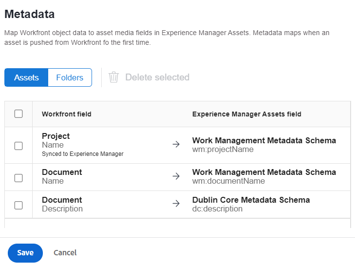

# Configuración de la asignación de metadatos de recursos entre Adobe Workfront y Experience Manager Assets {#asset-metadata-mapping-workfront-aem-assets}

Puede asignar los campos de metadatos de recursos entre las aplicaciones de Adobe Workfront y Experience Manager as a Cloud Service. Como resultado de la asignación de campos de metadatos, cuando envía un recurso de Workfront a Experience Manager Assets, puede ver los metadatos del recurso asignado en Experience Manager Assets.

Por ejemplo, si necesita conservar los campos de metadatos de una imagen, como el nombre, la descripción y el proyecto al que pertenece en Workfront al enviar la imagen a Experience Manager Assets, configure y asigne estos campos a las propiedades de Experience Manager Assets.

**Caso práctico**

Existe una imagen `add-users-workfront.png` en el proyecto `Metadata Syncs` en la aplicación Adobe Workfront. Debe enviar esa imagen a Experience Manager Assets as a Cloud Service con los siguientes metadatos:

* Nombre del proyecto

* Nombre de documento

* Descripción del documento

## Requisitos previos {#prerequisites}

* Un administrador puede acceder a las aplicaciones de Workfront y Experience Manager Assets as a Cloud Service.

* Integración entre [aplicaciones de Workfront y Experience Manager Assets as a Cloud Service](https://one.workfront.com/s/document-item?bundleId=the-new-workfront-experience&topicId=Content%2FDocuments%2FAdobe_Workfront_for_Experience_Manager_Assets_Essentials%2Fsetup-asset-essentials.htm&_LANG=enus).

## Configuración de la asignación de metadatos en Workfront {#set-up-metadata-mapping}

Para establecer la asignación de metadatos para los campos Nombre del proyecto, Nombre del documento y Descripción del documento en Workfront:

1. Haga clic en el icono del menú principal  disponible en la esquina superior derecha de la aplicación Adobe Workfront y, a continuación, haga clic en **[!UICONTROL Configurar]**.

1. Seleccione **[!UICONTROL Documentos]** en el panel izquierdo, luego seleccione **[!UICONTROL Experience Manager Assets]**.

1. Seleccione la integración de Experience Manager Assets y haga clic en **[!UICONTROL Editar]**.

1. Haga clic en **[!UICONTROL Metadatos]**. En la ficha **[!UICONTROL Assets]**, asigne el campo de Workfront [!UICONTROL Proyecto] > [!UICONTROL Nombre] al campo de Experience Manager Assets `wm:projectName`. Si no encuentra la coincidencia exacta, Adobe recomienda buscar la mejor coincidencia para asignar el campo Workfront y Experience Manager Assets. Puede evitar asignar campos de diferentes tipos de datos. Por ejemplo, asignar un campo de Workfront de fecha a un campo de Assets de descripción.
1. Asigne el campo de Workfront [!UICONTROL Documento] > [!UICONTROL Nombre] al campo de Experience Manager Assets `wm:documentName`.

   

1. Asigne el campo de Workfront [!UICONTROL Documento] > [!UICONTROL Descripción] al campo de Experience Manager Assets `dc:description`.

   >[!VIDEO](https://video.tv.adobe.com/v/344255)

## Envío de la imagen de Workfront a Experience Manager Assets {#send-image-workfront-assets}

Para enviar la imagen de Workfront a Experience Manager Assets:

1. Haga clic en el icono del menú principal  disponible en la esquina superior derecha de la aplicación Adobe Workfront y, a continuación, haga clic en **[!UICONTROL Proyectos]**.

1. Haga clic en **[!UICONTROL Nuevo proyecto]** para crear un proyecto.

1. Haga clic en la opción **[!UICONTROL Documentos]** disponible en el panel izquierdo, arrastre y, a continuación, seleccione la imagen que necesita enviar a Experience Manager Assets.

1. Haga clic en **[!UICONTROL Enviar a]** y, a continuación, elija el nombre de la integración de Experience Manager Assets Essentials.

   

1. Elija la carpeta de destino del recurso y haga clic en **[!UICONTROL Seleccionar carpeta]**.

1. Haga clic en **[!UICONTROL Guardar]**.

## Configuración de la asignación de metadatos de recursos en Experience Manager as a Cloud Service {#metadata-mapping-aem}

Después de [configurar la asignación de metadatos de recursos en Adobe Workfront](#set-up-metadata-mapping), debe usar la misma asignación en la aplicación Experience Manager Assets as a Cloud Service para mostrar los resultados de metadatos apropiados para la imagen.

La asignación de metadatos se realiza mediante esquemas de metadatos en Experience Manager Assets. Puede editar un formulario de esquema de metadatos recién agregado o existente. El formulario de esquema de metadatos incluye pestañas y elementos de formulario en pestañas. Puede asignar o configurar estos elementos de formulario a un campo dentro de un nodo de metadatos en el repositorio de CRX. Puede agregar pestañas o elementos de formulario al formulario de esquema de metadatos. Para obtener más información, consulte [Esquemas de metadatos](metadata-schemas.md).

Para configurar la asignación de metadatos mediante un nuevo formulario de metadatos en Experience Manager Assets as a Cloud Service:

1. Vaya a **[!UICONTROL Herramientas]** > **[!UICONTROL Assets]** > **[!UICONTROL Esquemas de metadatos]**.

1. Haga clic en **[!UICONTROL Crear]** en la barra de herramientas. En el cuadro de diálogo, proporcione el título del formulario de esquema y haga clic en **[!UICONTROL Crear]** para completar el proceso de creación del formulario.

1. Seleccione el formulario de esquema y haga clic en **[!UICONTROL Editar]**.

1. (Opcional) En el Editor de formularios de esquemas de metadatos, haga clic en `+` para crear una pestaña para los campos de Workfront.

1. Haga clic en la ficha **[!UICONTROL Generar formulario]** y arrastre el componente **[!UICONTROL Texto de una sola línea]** al formulario. Haga clic en el componente en el formulario. En la ficha **[!UICONTROL Generar formulario]**:

   1. Especifique `Project Name` en el campo **[!UICONTROL Etiqueta de campo]**.

   1. Especifique `./jcr:content/metadata/wm:projectName` en el campo **[!UICONTROL Asignar a propiedad]**. Como guía, utilice la siguiente plantilla para definir las asignaciones de campos en Experience Manager Assets:
      `./jcr:content/metadata/<mapping defined for the field in workfront>`.

      Al configurar asignaciones en Workfront, ha asignado el campo `wm:projectName` de Experience Manager Assets al campo Proyecto > Nombre de Workfront.

      `wm` hace referencia al nombre del área de nombres y `projectName` hace referencia al título de la propiedad. Utilice el formato `namespace:propertyTitle` para definir asignaciones de campos de metadatos.

      

1. Haga clic en la ficha **[!UICONTROL Generar formulario]** y arrastre el componente **[!UICONTROL Texto de una sola línea]** al formulario. Haga clic en el componente en el formulario. En la ficha **[!UICONTROL Generar formulario]**:

   1. Especifique `Document Name` en el campo **[!UICONTROL Etiqueta de campo]**.

   1. Especifique `./jcr:content/metadata/wm:documentName` en el campo **[!UICONTROL Asignar a propiedad]**.
Al configurar asignaciones en Workfront, ha asignado el campo `wm:documentName` de Experience Manager Assets al campo Documento > Nombre de Workfront.

1. Haga clic en la ficha **[!UICONTROL Generar formulario]** y arrastre el componente **[!UICONTROL Texto multilínea]** al formulario. Haga clic en el componente en el formulario. En la ficha **[!UICONTROL Generar formulario]**:

   1. Especifique `Document Description` en el campo **[!UICONTROL Etiqueta de campo]**.

   1. Especifique `./jcr:content/metadata/dc:description` en el campo **[!UICONTROL Asignar a propiedad]**.
Al configurar asignaciones en Workfront, ha asignado el campo `dc:description` de Experience Manager Assets al campo Documento > Descripción de Workfront.

1. Haga clic en **[!UICONTROL Guardar]** para guardar los cambios.

   >[!VIDEO](https://video.tv.adobe.com/v/344314)

## Aplicar configuración de metadatos a la carpeta de imágenes {#apply-metadata-settings-image-folder}

Después de establecer la configuración de metadatos en la aplicación Experience Manager as a Cloud Service, aplique esa configuración a la carpeta [folder que contiene la imagen que se envía desde la aplicación Workfront](#send-image-workfront-assets).

Para aplicar la configuración de metadatos a la carpeta de imágenes:

1. Vaya a **[!UICONTROL Herramientas]** > **[!UICONTROL Assets]** > **[!UICONTROL Esquemas de metadatos]**.

1. Seleccione el esquema de metadatos de la lista disponible y haga clic en **[!UICONTROL Aplicar a las carpetas]**.

1. Seleccione la carpeta de destino a la que [se envía la imagen desde la aplicación Adobe Workfront](#send-image-workfront-assets) y haga clic en **[!UICONTROL Aplicar]**.

Puede navegar a la imagen en Experience Manager Assets y ver los metadatos asociados a la imagen. Seleccione la imagen y haga clic en **[!UICONTROL Propiedades]** para ver sus metadatos.

**Consulte también**

* [Traducir recursos](translate-assets.md)
* [API HTTP de recursos](mac-api-assets.md)
* [Formatos de archivo compatibles con recursos](file-format-support.md)
* [Buscar recursos](search-assets.md)
* [Recursos de red](use-assets-across-connected-assets-instances.md)
* [Informes de recurso](asset-reports.md)
* [Esquemas de metadatos](metadata-schemas.md)
* [Descarga de recursos](download-assets-from-aem.md)
* [Administración de metadatos](manage-metadata.md)
* [Facetas de búsqueda](search-facets.md)
* [Administrar colecciones](manage-collections.md)
* [Importación masiva de metadatos](metadata-import-export.md)
* [Publicación de recursos en AEM y Dynamic Media](/help/assets/publish-assets-to-aem-and-dm.md)
