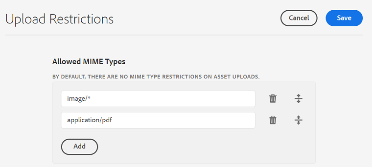

# Configurar restricciones de carga de recursos {#configure-asset-upload-restrictions}

Puede configurar Adobe Experience Manager Assets para restringir el tipo de recursos que los usuarios pueden cargar en función del tipo MIME.

>[!IMPORTANT]
>
>De forma predeterminada, Experience Manager Assets permite a los usuarios cargar recursos de todos los tipos MIME. Sin embargo, puede configurar los ajustes para restringir a los usuarios la carga de archivos de tipos MIME específicos únicamente.

## Requisitos previos {#prerequisites-asset-upload-restrictions}

Debe tener privilegios de administrador para configurar las restricciones de carga de recursos.

## Aplicar restricciones para cargas de recursos {#apply-restrictions-asset-uploadsssssss}

Para configurar [!DNL Experience Manager] para restringir el acceso de los usuarios a la carga de archivos de tipos MIME específicos:

1. Vaya a **[!UICONTROL Herramientas > Assets > Configuraciones de Assets]**.

1. Haga clic en **[!UICONTROL Restricciones de carga]**.

1. Haga clic en **[!UICONTROL Agregar]** para definir los tipos MIME permitidos.

1. Especifique el tipo MIME en el cuadro de texto. Puede hacer clic de nuevo en **[!UICONTROL Agregar]** para especificar más tipos MIME permitidos. También puede hacer clic en  para eliminar cualquier tipo MIME de la lista.

1. Haga clic en **[!UICONTROL Guardar]**.

**Ejemplo 1: permitir la carga de todas las imágenes y archivos PDF en Experience Manager Assets**

Para permitir la carga de imágenes en todos los formatos y archivos PDF en Experience Manager Assets, haga la siguiente configuración:

`image/*`, ya que el tipo MIME permite la carga de imágenes en todos los formatos. `application/pdf`, ya que el tipo MIME permite la carga de archivos PDF en Experience Manager Assets.

Si intenta cargar un archivo que no está incluido en la lista de tipos MIME permitidos, Experience Manager Assets muestra el siguiente mensaje de error:

`Screen Recording 2022-08-31 at 3.36.09 PM.mov` hace referencia a un nombre de archivo que no está incluido en los tipos MIME permitidos.

**Ejemplo 2: permitir la carga de formatos de imagen específicos en Experience Manager Assets**

Para agregar formatos de imagen específicos a los tipos MIME permitidos y restringir la carga de todos los demás formatos de recurso, haga la siguiente configuración:

En función de la configuración que se muestra en la imagen, puede cargar imágenes en los formatos .JPG, .PNG y .GIF a Experience Manager Assets.

**Consulte también**

* [Traducir recursos](/help/assets/translate-assets.md)
* [API HTTP de recursos](/help/assets/mac-api-assets.md)
* [Formatos de archivo compatibles con recursos](/help/assets/file-format-support.md)
* [Buscar recursos](/help/assets/search-assets.md)
* [Recursos de red](/help/assets/use-assets-across-connected-assets-instances.md)
* [Informes de recurso](/help/assets/asset-reports.md)
* [Esquemas de metadatos](/help/assets/metadata-schemas.md)
* [Descarga de recursos](/help/assets/download-assets-from-aem.md)
* [Administración de metadatos](/help/assets/manage-metadata.md)
* [Administración de plantillas de Dynamic Media](/help/assets/dynamic-media/manage-dynamic-media-templates.md)
* [Administrar informes](/help/assets/manage-reports-assets-view.md)
* [Facetas de búsqueda](/help/assets/search-facets.md)
* [Administrar colecciones](/help/assets/manage-collections.md)
* [Importación masiva de metadatos](/help/assets/metadata-import-export.md)
* [Publicación de recursos en AEM y Dynamic Media](/help/assets/publish-assets-to-aem-and-dm.md)

