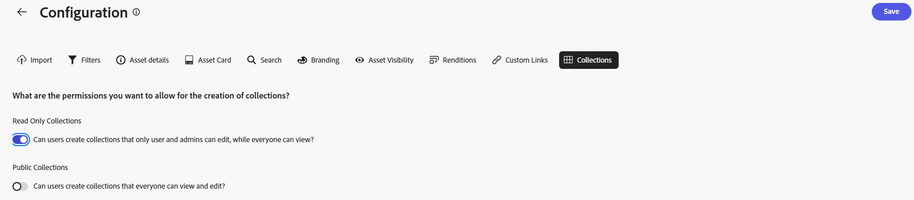

# Configuración de la interfaz de usuario de Content Hub {#configure-content-hub-user-interface}

<table>
    <tr>
        <td>
            <i>Nuevo</i> <a href="/help/assets/dynamic-media/dm-prime-ultimate.md"><b>Dynamic Media Prime y Ultimate</b></a>
        </td>
        <td>
            <i>Nuevo</i> <a href="/help/assets/assets-ultimate-overview.md"><b>AEM Assets Ultimate</b></a>
        </td>
        <td>
            <i>Nuevo</i> <a href="/help/assets/integrate-aem-assets-edge-delivery-services.md"><b>Integración de AEM Assets con Edge Delivery Services</b></a>
        </td>
        <td>
            <i>New</i> <a href="/help/assets/aem-assets-view-ui-extensibility.md"><b>Extensibilidad de la IU</b></a>
        </td>
          <td>
            <i>Nuevo</i> <a href="/help/assets/dynamic-media/enable-dynamic-media-prime-and-ultimate.md"><b>Habilitar Dynamic Media Prime y Ultimate</b></a>
        </td>
    </tr>
    <tr>
        <td>
            <a href="/help/assets/search-best-practices.md"><b>Prácticas recomendadas de búsqueda</b></a>
        </td>
        <td>
            <a href="/help/assets/metadata-best-practices.md"><b>Prácticas recomendadas de metadatos</b></a>
        </td>
        <td>
            <a href="/help/assets/product-overview.md"><b>Centro de contenido</b></a>
        </td>
        <td>
            <a href="/help/assets/dynamic-media-open-apis-overview.md"><b>Dynamic Media con funciones de OpenAPI</b></a>
        </td>
        <td>
            <a href="https://developer.adobe.com/experience-cloud/experience-manager-apis/"><b>Documentación de desarrollador de AEM Assets</b></a>
        </td>
    </tr>
</table>

>[!CONTEXTUALHELP]
>id="configure_content_hub"
>title="Configuración de la interfaz de usuario de Content Hub"
>abstract="Experience Manager Assets permite a los administradores configurar las opciones disponibles en la interfaz de usuario de Content Hub. En función de las opciones de configuración seleccionadas por los administradores, los usuarios de Content Hub pueden ver los campos en Content Hub. Las opciones de configuración incluyen metadatos al importar recursos, filtros, propiedades de recursos, metadatos al buscar recursos, promoción de la marca personalizada y cualquier vínculo personalizado."
>additional-url="https://images-tv.adobe.com/mpcv3/4477/74a81d1c-0cfe-41f4-8a06-18ff70604e45_1732023385.854x480at800_h264.mp4" text="Ver vídeo"

<!--  -->

>[!AVAILABILITY]
>
>La guía del centro de contenido ya está disponible en formato de PDF. Descargue la guía completa y utilice el Asistente de IA de Adobe Acrobat para responder sus consultas.
>
>[!BADGE Guía del centro de contenido en PDF]{type=Informative url="https://helpx.adobe.com/content/dam/help/en/experience-manager/aem-assets/content-hub.pdf"}

Experience Manager Assets permite a los administradores configurar las opciones disponibles en la interfaz de usuario de Content Hub. En función de las opciones de configuración seleccionadas por los administradores, los usuarios de Content Hub pueden ver los campos en Content Hub. Las opciones de configuración incluyen:

* Filtros disponibles para los usuarios al buscar recursos.

* Detalles o propiedades del recurso disponibles para cada recurso.

* Campos de metadatos disponibles para los usuarios al añadir recursos a Content Hub.

* Campos de metadatos de recursos que están disponibles para la búsqueda en Content Hub.

* Contenido de marca que debe mostrar para su organización.

* Cualquier vínculo personalizado que necesite incluir en Content Hub, además de los recursos, las colecciones y las perspectivas.

## Requisitos previos {#prerequisites-configuration-ui}

[Los administradores de Content Hub](/help/assets/deploy-content-hub.md#step-3-onboard-content-hub-administrator) pueden establecer las opciones de configuración para otros usuarios de su organización.

## Acceso a las opciones de configuración en Content Hub {#access-configuration-options-content-hub}

Para acceder a las opciones de configuración de Content Hub:

1. Haga clic en el icono de usuario en el panel derecho.

1. En la sección **[!UICONTROL Configuración del producto]**, seleccione **[!UICONTROL Configuraciones]**.

   

## Administrar las opciones de configuración en Content Hub {#manage-configuration-options}

Como administrador, administre las siguientes opciones de configuración para los usuarios:

* [Importar](#configure-import-options-content-hub)

* [Filtros](#configure-filters-content-hub)

* [Detalles del recurso](#configure-asset-details-content-hub)
* [Tarjeta de recursos](#asset-card)

* [Búsqueda](#configure-metadata-search-content-hub)

* [Personalización de marca](#configure-branding-content-hub)

* [Recursos caducados](#expired-assets-content-hub)

* [Representaciones](#renditions-content-hub)

* [Vínculos personalizados](#configure-custom-links-content-hub)

* [Gobernanza de colecciones](#configure-collections-content-hub)

* [Habilitar el uso compartido de vínculos públicos](#enable-public-link-sharing)

### Importar {#configure-import-options-content-hub}

Puede configurar los campos de metadatos que se muestran a los usuarios al cargar o importar recursos en el portal de Content Hub como, por ejemplo, Nombre de campaña, Palabras clave, Canales, Periodo de tiempo, Región, etc. Para ello, ejecute los siguientes pasos:

1. En la interfaz de usuario de [Configuraciones](#access-configuration-options-content-hub), haga clic en **[!UICONTROL Importar]**.

1. Haga clic en **[!UICONTROL Agregar metadatos]**.

1. Especifique una etiqueta para la propiedad, asígnela a una propiedad mediante el campo **[!UICONTROL Metadatos]** y seleccione el tipo de entrada para los nuevos metadatos del recurso.

1. Haga clic en el botón de alternancia **[!UICONTROL Campo obligatorio]** para que el nuevo campo de metadatos sea obligatorio para especificar usuarios mientras se cargan nuevos recursos.

1. Haga clic en **[!UICONTROL Confirmar]**. Los nuevos metadatos se muestran en la lista de las propiedades de recursos existentes.

1. Haga clic en **[!UICONTROL Guardar]** para aplicar los cambios.

Del mismo modo, puede hacer clic en el , disponible junto a cada propiedad disponible, para editar las etiquetas, hacer que estos campos sean obligatorios o no obligatorios para los usuarios al cargar recursos mediante la opción **[!UICONTROL Campo obligatorio]**, o hacer clic en el icono Eliminar para eliminar cualquier propiedad de metadatos.

Haga clic en el botón de alternancia **[!UICONTROL Aprobación automática]** si necesita que todos los recursos que agregue al repositorio de Experience Manager Assets se aprueben automáticamente para que estén disponibles en Content Hub inmediatamente. De lo contrario, los autores o administradores de DAM deben aprobar manualmente los recursos para que estén disponibles en Content Hub. De forma predeterminada, la opción está desactivada.

Haga clic en **[!UICONTROL Guardar]** después de realizar todas las modificaciones para aplicar los cambios.

Los metadatos activados en la interfaz de usuario de configuración se muestran en la página de carga de recursos:

### Filtros {#configure-filters-content-hub}

Content Hub permite a los administradores configurar filtros que se muestran al buscar recursos. Siga estos pasos para agregar un nuevo filtro:

1. En la interfaz de usuario de [Configuraciones](#access-configuration-options-content-hub), haga clic en **[!UICONTROL Filtros]**.

1. Haga clic en **[!UICONTROL Agregar filtros]**.

1. Especifique una etiqueta para el filtro, asígnelo a una propiedad mediante el campo **[!UICONTROL Metadatos]** y seleccione el tipo de entrada para el nuevo filtro.
1. Haga clic en **[!UICONTROL Confirmar]**. El nuevo filtro se muestra en la lista de los filtros existentes.

1. Haga clic en **[!UICONTROL Guardar]** para aplicar los cambios y que el nuevo filtro se muestre en la página Buscar mientras filtra los recursos.

   >[!NOTE]
   >
   >El nuevo filtro se muestra en la página Buscar solo si hay al menos un recurso en el repositorio que coincida con los criterios de filtro.

Del mismo modo, puede hacer clic en , disponible junto a cada filtro disponible, para editar las etiquetas o hacer clic en el icono Eliminar para eliminar cualquier filtro existente. Haga clic en **[!UICONTROL Guardar]** después de realizar todas las modificaciones para aplicar los cambios.

Los filtros activados en la interfaz de usuario de configuración se muestran en la página Buscar:

### Detalles del recurso {#configure-asset-details-content-hub}

También puede configurar las propiedades del recurso que se muestran para cada recurso, como el nombre de archivo, el título, el formato, el tamaño, etc. Para ello, ejecute los siguientes pasos:

1. En la interfaz de usuario de [Configuraciones](#access-configuration-options-content-hub), haga clic en **[!UICONTROL Detalles del recurso]**.

1. Haga clic en **[!UICONTROL Agregar metadatos]**.

1. Especifique una etiqueta para la propiedad, asígnela a una propiedad mediante el campo **[!UICONTROL Metadatos]** y seleccione el tipo de entrada para los nuevos metadatos del recurso.
1. Haga clic en **[!UICONTROL Confirmar]**. Los nuevos metadatos se muestran en la lista de las propiedades de recursos existentes.

1. Haga clic en **[!UICONTROL Guardar]** para aplicar los cambios y que la nueva propiedad se muestre en la página de detalles del recurso.

Del mismo modo, puede hacer clic en , disponible junto a cada propiedad disponible, para editar las etiquetas o hacer clic en el icono Eliminar para eliminar cualquier detalle del recurso existente. Haga clic en **[!UICONTROL Guardar]** después de realizar todas las modificaciones para aplicar los cambios.

Las propiedades activadas en la interfaz de usuario de configuración se muestran en la página Detalles del recurso:

### Tarjeta de recursos {#asset-card}

También puede configurar los campos de metadatos clave que necesita mostrar en la **tarjeta de recursos** hasta un máximo de 6 campos. Para ello, ejecute los siguientes pasos:

1. En la interfaz de usuario de [Configuraciones](#access-configuration-options-content-hub), haga clic en **Tarjeta de recursos**.
2. Haga clic en **Agregar metadatos**. Se muestra el cuadro de diálogo **Agregar metadatos de tarjeta de recursos**.
3. Especifique el nombre de los metadatos en el campo **Etiqueta** y seleccione una propiedad de metadatos en el campo **Metadatos**.
4. Haga clic en **Confirmar** y, a continuación, haga clic en **Guardar** para aplicar los cambios y que la nueva propiedad se muestre en la página de detalles del recurso.
   

Del mismo modo, haga clic en , que está disponible junto a cada propiedad disponible, para realizar las modificaciones necesarias, o haga clic en  para eliminar cualquier propiedad de metadatos existente. Haga clic en **Guardar** después de realizar todas las modificaciones para aplicar los cambios.

### Búsqueda {#configure-metadata-search-content-hub}

Los administradores pueden definir los campos de metadatos que se buscan cuando un usuario especifica criterios de búsqueda en Content Hub. Ejecute los siguientes pasos:

1. En la interfaz de usuario de [Configuraciones](#access-configuration-options-content-hub), haga clic en **[!UICONTROL Agregar metadatos]**.

1. Especifique el campo de metadatos y haga clic en **[!UICONTROL Confirmar]**.

1. Haga clic en **[!UICONTROL Guardar]** para aplicar los cambios y que la nueva propiedad de metadatos se muestre en la lista de campos de metadatos.

Del mismo modo, puede hacer clic en , disponible junto a cada propiedad de metadatos disponible, para editar la propiedad o hacer clic en el icono Eliminar para eliminar cualquier propiedad existente. Haga clic en **[!UICONTROL Guardar]** después de realizar todas las modificaciones para aplicar los cambios.

### Personalización de marca {#configure-branding-content-hub}

Como administrador, personalice el portal [!DNL Content Hub] para que cumpla con los requisitos de marca. En la página  **[!UICONTROL Promoción de marca]**, use las secciones **[!UICONTROL Banner]**, **[!UICONTROL Colores]** y **[!UICONTROL Imagen de banner]** para ejecutar las siguientes personalizaciones:

1. [Cambiar la imagen del titular de la sección [!UICONTROL Imagen del titular]](#Change-the-banner-image)
1. [Actualice el título y el texto del cuerpo del titular y cambie el color del texto de la sección [!UICONTROL Titular]](#Add-title-and-body-text-to-your-banner-and-change-the-text-color)
1. [Cambie el color principal y secundario de la sección [!UICONTROL Colores] para aplicar un esquema de colores que se ajuste al tema de su marca](#Change-the-primary-and-secondary-color)

Seleccione la opción **[!UICONTROL Restablecer valores predeterminados]** para revertir los cambios y restaurar el tema predeterminado.

#### Cambiar la imagen del titular{#Change-the-banner-image}

En la página  **[!UICONTROL Promoción de marca]**, ejecute los siguientes pasos para cambiar la imagen del titular de su implementación de [!DNL Content Hub]:

1. Haga clic en  **[!UICONTROL Seleccionar de la galería]** para seleccionar una imagen de titular mediante el cuadro de diálogo del selector de recursos. El selector de recursos solo muestra las imágenes aprobadas.
1. Seleccione la imagen, haga clic en **[!UICONTROL Seleccionar]** y, a continuación, haga clic en **[!UICONTROL Guardar]** para mostrarla como la imagen de titular de su implementación de [!DNL Content Hub].

#### Añada un título y texto independiente al titular y cambie el color del texto{#Add-title-and-body-text-to-your-banner-and-change-the-text-color}

En la página  **[!UICONTROL Promoción de marca]**, use los campos respectivos en la sección **[!UICONTROL Banner]** para agregar títulos y textos del cuerpo al banner.
Haga clic en el cuadro cuadrado situado junto al **[!UICONTROL Color del texto del titular]** para seleccionar un color de texto del selector de color para el texto del titular o especifique el código hexadecimal del color en el campo situado junto al cuadro cuadrado del selector de color.

#### Cambio del color principal y secundario{#Change-the-primary-and-secondary-color}

En la página  **[!UICONTROL Promoción de marca]**, use la sección **[!UICONTROL Colores]** para establecer los colores primarios y secundarios seleccionándolos con el selector de color o definiendo el código hexadecimal del color. Estos colores establecen los colores de fondo, texto e icono de los elementos de la interfaz de usuario para alinear la interfaz de usuario de [!DNL Content Hub] con el tema de la marca.

**[!UICONTROL Color principal]:** El esquema de colores principal se aplica a acciones de selección, elementos interactivos como casillas de verificación, barras de búsqueda y modificadores de alternancia en [!DNL Content Hub], incluida la página principal de [!DNL Content Hub] y la página de [!UICONTROL Configuración]. También se aplica a las opciones de acción disponibles en las interfaces principales [!DNL Content Hub], como las opciones disponibles en **[!UICONTROL Todas las páginas de Assets]** y **[!UICONTROL Colecciones]**.

**[!UICONTROL Color secundario]:** En la página de inicio de [!DNL Content Hub], el esquema de colores secundario se aplica a las opciones de la interfaz de usuario y a los campos de entrada disponibles en los cuadros de diálogo. Se aplica a todas las opciones de menú de configuración disponibles en la página [!UICONTROL Configuración], excepto a las acciones de selección, las casillas de verificación, las barras de búsqueda y los modificadores de alternancia.

### Recursos caducados{#expired-assets-content-hub}

Los administradores pueden controlar si necesitan recursos caducados para que sean visibles en Content Hub. Si los activos caducados están visibles, también se puede definir si los usuarios pueden descargarlos.

Los recursos caducados no se muestran en Content Hub de forma predeterminada.

Para ello, ejecute los siguientes pasos:

1. En la interfaz de usuario de [Configuraciones](#access-configuration-options-content-hub), haga clic en **[!UICONTROL Assets caducado]**.

1. En la sección **[!UICONTROL Visible]**, habilite la opción **[!UICONTROL Permitir que los usuarios vean los recursos caducados]** para que todos los recursos caducados estén visibles en Content Hub.

1. Después de habilitar la visibilidad de los recursos, puede habilitar o deshabilitar la capacidad de descargar recursos caducados mediante la opción **[!UICONTROL Permitir que los usuarios descarguen recursos caducados]**.

1. Haga clic en **[!UICONTROL Guardar]** para aplicar los cambios.

   

Después de habilitar la visibilidad de los recursos, puede ver los recursos caducados en Content Hub, como se muestra en la siguiente imagen:

Si el administrador ha activado la descarga, los usuarios de Content Hub también pueden descargarlos, tal como se indica en la imagen.

Si la visibilidad de los recursos caducados está habilitada, Content Hub también resalta los recursos que caducan en los próximos 15 días mediante el mensaje `Expiring in n days` de la tarjeta de recursos.

### Representaciones {#renditions-content-hub}

Las representaciones son versiones personalizadas de recursos digitales, como imágenes, documentos, etc., diseñadas para diferentes dispositivos y plataformas a fin de garantizar un rendimiento óptimo. Ver más sobre [representaciones en Adobe Experience Manager Assets](https://experienceleague.adobe.com/es/docs/experience-manager-cloud-service/content/assets/assets-view/renditions).

Para ello, ejecute los siguientes pasos:

En la interfaz de usuario de [Configurations](#access-configuration-options-content-hub), haga clic en **[!UICONTROL Renditions]**. Las opciones disponibles son las siguientes:

* Habilite la opción [!UICONTROL Habilitar disponibilidad de representaciones] para que todas las representaciones estén visibles en Content Hub.

* Habilite o deshabilite **[!UICONTROL Permitir que los usuarios descarguen los recursos originales]** para controlar la disponibilidad para descargar los recursos originales.

  

Para obtener información sobre cómo ver y descargar representaciones en Content Hub, consulte [descargar recursos en Content Hub](/help/assets/download-assets-content-hub.md).

### Vínculos personalizados {#configure-custom-links-content-hub}

También puede agregar fichas personalizadas además de las fichas estándar de **[!UICONTROL Todos los Assets]**, **[!UICONTROL Colecciones]** y **[!UICONTROL Información]** en el portal de Content Hub, justo debajo del titular. Para ello, ejecute los siguientes pasos:

1. En la interfaz de usuario de [Configuraciones](#access-configuration-options-content-hub), haga clic en **[!UICONTROL Vínculos personalizados]**.

1. Haga clic en **[!UICONTROL Agregar vínculo]**.

1. Especifique texto en los campos **[!UICONTROL Etiqueta]** y **[!UICONTROL URL]**. La etiqueta que defina se mostrará como una pestaña y, al hacer clic en la etiqueta, navegará a la URL definida en el campo **[!UICONTROL URL]**.

1. Haga clic en **[!UICONTROL Confirmar]**.

1. Haga clic en **[!UICONTROL Guardar]** para aplicar los cambios.

Del mismo modo, puede hacer clic en , disponible junto a cada dirección URL, para editar los vínculos o hacer clic en el icono Eliminar para eliminar cualquier dirección URL existente. Haga clic en **[!UICONTROL Guardar]** después de realizar todas las modificaciones para aplicar los cambios.

El vínculo personalizado se muestra como una nueva pestaña junto a la pestaña Información en la página de inicio de Content Hub.

### Gobernanza de colecciones {#configure-collections-content-hub}

Los administradores pueden definir permisos de usuario al crear colecciones. Para habilitar esta configuración, siga estos pasos:

1. En la interfaz de usuario de [Configurations](#access-configuration-options-content-hub), haga clic en **[!UICONTROL Colecciones y uso compartido]**.

1. Habilite la opción **[!UICONTROL Colecciones de solo lectura]** para permitir colecciones que sean accesibles para todos pero que solo puedan editar el creador y el administrador.

1. Habilite la opción **[!UICONTROL Colecciones públicas]** para permitir colecciones que sean accesibles y editables para todos.

1. Haga clic en **[!UICONTROL Guardar]** para aplicar los cambios.

   

### Habilitar el uso compartido de vínculos públicos {#enable-public-link-sharing}

Habilite la siguiente configuración en la interfaz de usuario de configuraciones para permitir que los usuarios de Content Hub generen un vínculo público:

1. En la interfaz de usuario de [Configuraciones](#access-configuration-options-content-hub), haga clic en **[!UICONTROL Colecciones y uso compartido]**.

1. Habilite la opción **[!UICONTROL Habilitar vínculo público]** y haga clic en **[!UICONTROL Guardar]** para aplicar los cambios.

   

Más información sobre [compartir recursos en [!DNL Content Hub]](share-assets-content-hub.md).
