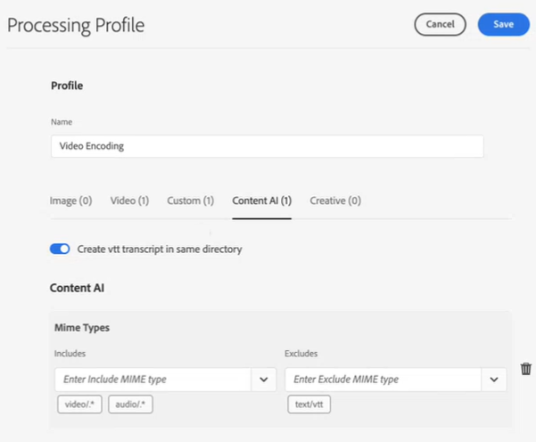

# Configuración de la transcripción en [!DNL Experience Manager Assets] {#configure-transcription-service}

La transcripción es el proceso de pasar el audio de un archivo de audio o vídeo a texto (voz a texto) utilizando la tecnología de reconocimiento de voz.
[!DNL Adobe Experience Manager Assets] está configurado con [!DNL Azure Media Services], que genera automáticamente la transcripción textual del idioma hablado en un archivo de audio o vídeo compatible en formato WebVTT (.vtt). Cuando se procesa un recurso de audio o vídeo en [!DNL Experience Manager Assets], el servicio de transcripción genera automáticamente la representación de transcripción de texto del recurso de audio o vídeo y la almacena en la misma ubicación del repositorio de Assets en la que reside el recurso original. El servicio de transcripción [!DNL Experience Manager Assets] permite a los especialistas en marketing administrar de forma eficaz el contenido de audio y vídeo con una mayor capacidad de detección del contenido de texto y aumentar el retorno de la inversión de estos recursos al admitir la accesibilidad y la localización.

Las transcripciones son versiones textuales de contenido hablado; un ejemplo es una película que ve en cualquier plataforma OTT y que a menudo incluye subtítulos para facilitar la accesibilidad o el consumo del contenido en otros idiomas. O cualquier archivo de audio o vídeo que se utilice con fines de marketing, aprendizaje o entretenimiento. Estas experiencias comienzan con una transcripción a la que luego se le aplica formato o se traduce según corresponda. La transcripción de audio o vídeo es un proceso que lleva tiempo y es fácil que dé lugar a errores cuando se realiza manualmente. También es un desafío escalar el proceso manual, dada la necesidad cada vez mayor de contenido de audio-vídeo. [!DNL Experience Manager Assets] utiliza la transcripción basada en IA de Azure, que permite un procesamiento a gran escala de los recursos de audio y vídeo y genera las transcripciones de texto (archivos .vtt) junto con los detalles de la marca de tiempo. Junto con Assets, la función de transcripción también es compatible con Dynamic Media.

La función de transcripción está disponible sin ningún coste en [!DNL Experience Manager Assets]. Sin embargo, los administradores necesitan las credenciales de Azure del usuario para configurar el servicio de transcripción en [!DNL Experience Manager Assets]. También puede [obtener las credenciales de prueba](https://azure.microsoft.com/en-us/pricing/details/media-services/) directamente desde Microsoft® para probar la función de transcripción de audio o vídeo en Assets.

## Requisitos previos de transcripción {#prerequisites}

1. Una instancia de [!DNL Experience Manager Assets as a Cloud Service] puesta en marcha.
1. Se requieren las siguientes credenciales de Azure para la configuración en [!DNL Experience Manager Assets]:

   * ID de cliente (clave de API)
   * Clave secreta del cliente
   * Punto de conexión del inquilino (dominio)
   * Cuenta de medios
   * Grupo de recursos
   * ID de suscripción

   Consulte la [Documentación de Azure](https://docs.microsoft.com/es-es/azure/media-services/latest/access-api-howto?tabs=portal) para obtener credenciales y poder acceder a la API de Azure Media Services.

1. Asegúrese de que la cuenta de Azure tenga suficiente crédito para procesar nuevas solicitudes.

## Configuración de la transcripción en [!DNL Experience Manager Assets] {#configure-transcription}

A continuación, se indican las configuraciones necesarias para habilitar la función de transcripción en [!DNL Experience Manager Assets]:

1. [Configurar Azure Media Services](#configure-azure-media-service)
1. [Configuración del perfil de procesamiento para la transcripción de audio/vídeo](#configure-processing-profile-for-transcription)

### Configurar Azure Media Services {#configure-azure-media-services}

[!DNL Experience Manager Assets] utiliza [!DNL Azure Media Services], que genera automáticamente la transcripción textual del idioma hablado en un [archivo de audio o vídeo compatible](#supported-file-formats-for-transcription) en formato WebVTT (.vtt). Los administradores pueden configurar [!DNL Azure Media Services] en [!DNL Experience Manager Assets] usando las credenciales de Azure. Los [Requisitos previos de transcripción](#transcription-prerequisites) enumeran las credenciales de [!DNL Azure] necesarias para la configuración. Si no tiene cuenta y credenciales de [!DNL Azure], consulte la [Documentación de Azure Media Services](https://azure.microsoft.com/en-us/pricing/details/media-services/) para obtener unas credenciales de prueba.

Vaya a **[!UICONTROL Herramientas]** > **[!UICONTROL Cloud Services]** > **[!UICONTROL Configuración de Azure Media Services]**. Seleccione una carpeta (ubicación) en el carril izquierdo y haga clic en el botón [!UICONTROL Crear] para configurar la conexión con su cuenta de [!DNL Azure]. Esta carpeta es la ubicación donde se almacena su configuración de la nube de [!DNL Azure] en Experience Manager Assets. Introduzca las credenciales de [!DNL Azure] y haga clic en **[!UICONTROL Guardar y cerrar]**.

### Configuración del perfil de procesamiento para la transcripción {#configure-processing-profile}

Una vez que [!DNL Azure Media Services] esté configurado en Experience Manager Assets, el siguiente paso es crear un perfil de procesamiento de recursos para generar una transcripción basada en IA de los recursos de audio y vídeo. El perfil de procesamiento basado en IA genera transcripciones de los [recursos de audio o vídeo admitidos](#supported-file-formats-for-transcription) como una representación en Experience Manager Assets y almacena la transcripción (archivo .vtt) en la misma carpeta en la que reside el recurso original. Por lo tanto, es más fácil para los usuarios buscar y localizar el recurso y su representación de transcripción.

Vaya a **[!UICONTROL Herramientas]** > **[!UICONTROL Assets]** > **[!UICONTROL Perfiles de procesamiento]** y haga clic en el botón **[!UICONTROL Crear]** para crear un perfil de procesamiento basado en IA que genere la transcripción de sus archivos de audio y vídeo. De forma predeterminada, la página de procesamiento de perfiles refleja solo tres pestañas (Imagen, Vídeo y Personalizado). Sin embargo, hay una pestaña **[!UICONTROL Inteligencia artificial aplicada al contenido]** visible si ha configurado [!DNL Azure Media Services] en su instancia de [!DNL Experience Manager Assets]. Compruebe sus credenciales de [!DNL Azure] si no ve la pestaña **[!UICONTROL Inteligencia artificial aplicada al contenido]** al crear un perfil de procesamiento.

En la ficha **[!UICONTROL Inteligencia artificial aplicada al contenido]**, haga clic en el botón **[!UICONTROL Agregar nuevo]** para configurar la transcripción. Aquí puede incluir y excluir los formatos de archivo (tipos MIME) para generar transcripciones seleccionando tipos de archivo en la lista desplegable. En la siguiente ilustración, se incluyen todos los archivos de audio y vídeo compatibles y se excluyen los archivos de texto.

Active **[!UICONTROL Crear transcripción VTT en el mismo directorio]** para crear y almacenar la representación de la transcripción (archivo .vtt) en la misma carpeta en la que reside el recurso original. Las demás representaciones también se generan mediante el flujo de trabajo predeterminado de procesamiento de recursos DAM, independientemente de esta configuración.

La siguiente ilustración detalla un perfil de vídeo personalizado que se crea en Experience Manager Assets.

El perfil de vídeo también contiene las siguientes configuraciones personalizadas. Consulte la [documentación del perfil de procesamiento](/help/assets/asset-microservices-configure-and-use.md) para obtener más información sobre cómo crear un perfil de procesamiento personalizado.

Ahora vamos a configurar la transcripción en este perfil de vídeo. Vaya a la pestaña **[!UICONTROL Inteligencia artificial aplicada al contenido]** y haga clic en el botón **[!UICONTROL Agregar nuevo]**. Incluya todos los archivos de audio y vídeo, y excluya los de imagen y aplicación. Active **[!UICONTROL Crear transcripción VTT en el mismo directorio]** y guarde la configuración.

Una vez configurado el perfil de procesamiento para la transcripción de archivos de audio y vídeo, puede aplicar este perfil de procesamiento a las carpetas mediante uno de los métodos siguientes:

* Seleccione una definición de perfil de procesamiento en **[!UICONTROL Herramientas]** > **[!UICONTROL Assets]** > **[!UICONTROL Perfiles de procesamiento]** y use la acción **[!UICONTROL Aplicar perfil a las carpetas]**. El explorador de contenido le permite desplazarse a una carpeta específica, seleccionarla y confirmar la aplicación del perfil.
* Seleccione una carpeta en la interfaz de usuario de Assets y haga clic en **[!UICONTROL Propiedades]** para abrir las propiedades de la carpeta. Haga clic en la pestaña **[!UICONTROL Procesamiento de recursos]** y seleccione el perfil de procesamiento adecuado para la carpeta en la lista **[!UICONTROL Perfil de procesamiento]**. Para guardar los cambios, haga clic en **[!UICONTROL Guardar y cerrar]**.

  

* Los usuarios pueden seleccionar carpetas o recursos específicos en la interfaz de usuario de Assets para aplicar un perfil de procesamiento y, a continuación, seleccionar **[!UICONTROL Reprocesar recursos]** en las opciones disponibles de la parte superior.

>[!TIP]
>Solo se puede aplicar un perfil de procesamiento a una carpeta.
>
>Después de aplicar un perfil de procesamiento a una carpeta, todos los recursos nuevos cargados (o actualizados) en esta o en cualquiera de sus subcarpetas se procesan con el perfil de procesamiento adicional configurado. Este procesamiento se suma al perfil predeterminado estándar.

>[!NOTE]
>
>Un perfil de procesamiento aplicado a una carpeta funciona para todo el árbol, sin embargo, se puede sobrescribir con otro perfil aplicado a una subcarpeta.
>
>Cuando los recursos se cargan en una carpeta, Experience Manager se comunica con las propiedades de la carpeta contenedora para identificar el perfil de procesamiento. Si no se aplica ninguno, se comprueba la existencia de un perfil de procesamiento en una carpeta principal de la jerarquía.

## Generación de transcripciones de recursos de audio o vídeo {#generate-transcription}

Al procesar un recurso de vídeo, el [perfil de procesamiento basado en IA](#configure-processing-profile-for-transcription) genera automáticamente la transcripción (archivo .vtt) como una representación junto con el recurso original en la misma carpeta.

También puede ver la representación de la transcripción accediendo a las representaciones del recurso de vídeo original. Para acceder al panel **[!UICONTROL Representaciones]**, seleccione el recurso de vídeo original y abra el carril izquierdo. Puede ver que la representación de la transcripción (archivo .vtt) está visible en el encabezado **[!UICONTROL TRANSCRIPTVTT]**.

Puede descargar la transcripción (archivo de texto .vtt) directamente desde la carpeta como una representación de recursos independiente, o desde el panel **[!UICONTROL Representaciones]** del recurso original descargando todas las representaciones del recurso.

Actualmente, Experience Manager no admite la edición o la vista previa de texto completo de archivos VTT de forma nativa. Sin embargo, puede descargar la representación de la transcripción y utilizar cualquier editor de texto para editar o verificar la transcripción. La transcripción refleja el idioma hablado como texto en la marca de tiempo determinada en el vídeo con la puntuación de confianza (precisión) de la transcripción.

## Uso de transcripción en Dynamic Media {#using-transcription-in-dynamic-media}

Si tiene [Dynamic Media configurado](/help/assets/dynamic-media/config-dm.md) en la instancia de Experience Manager Assets, puede publicar el recurso (archivo de audio o vídeo) y su transcripción (archivo .vtt) en Dynamic Media. Al hacerlo, el recurso original (archivo de audio o vídeo) y su representación transcrita (archivo .vtt) se publican en Dynamic Media en la misma carpeta. El administrador de Dynamic Media puede [activar la experiencia CC (Closed Caption o subtítulos ocultos)](/help/assets/dynamic-media/video.md#adding-captions-to-video) para el archivo de audio o vídeo que utiliza la representación de transcripción (archivo .vtt).

Consulte también lo siguiente:

* [Tutorial de vídeo sobre cómo añadir subtítulos CC a vídeos de Dynamic Media](https://experienceleague.adobe.com/docs/experience-manager-learn/assets/dynamic-media/dynamic-media-overview-feature-video-use.html?lang=es#add-cc-closed-captioning-to-dynamic-media-video)
* [Publicación de vídeos de Dynamic Media en YouTube](/help/assets/dynamic-media/video.md#publishing-videos-to-youtube)

En la siguiente ilustración, la URL refleja la parte del subtítulo que hace referencia a la transcripción (archivo .vtt). El vídeo refleja el idioma hablado (texto transcrito) como **[!UICONTROL subtítulos ocultos]** en la marca de tiempo determinada del vídeo. El usuario puede habilitar o deshabilitar los subtítulos utilizando el botón **[!UICONTROL CC]**.

## Formatos de archivo admitidos para transcripción {#supported-file-format}

Se admiten los siguientes formatos de archivo de audio y vídeo para la transcripción:

| Formatos de audio y vídeo compatibles | Extensiones  |
|----|----|
| FLV (con códecs H.264 y AAC) | (.flv) |
| MXF | (.mxf) |
| MPEG2-PS, MPEG2-TS, 3GP | (.ts, .ps, .3gp, .3gpp, .mpg) |
| Windows Media Video (WMV)/ASF | (.wmv, .asf) |
| AVI (sin comprimir 8/10 bits) | (.avi) |
| MP4 | (.mp4, .m4a, .m4v) |
| Microsoft® Digital Video Recording (DVR-MS) | (.dvr-ms) |
| Matroska/WebM | (.mkv) |
| WAVE/WAV | (.wav) |
| QuickTime | (.mov) |

>[!NOTE]
>
>Los recursos (archivos de audio o vídeo) del tipo aplicación no son compatibles con la transcripción.

## Limitaciones conocidas {#known-limitations}

* La función de transcripción puede usarse con vídeos de hasta 10 minutos de duración.
* El título del vídeo debe tener 80 caracteres o menos.
* El tamaño de archivo admitido es de hasta 15 GB.
* La duración máxima de procesamiento admitida es de 60 minutos.
* En una cuenta de [!DNL Azure] de pago, puede cargar hasta 50 películas por minuto. Sin embargo, en una cuenta de prueba, hasta cinco por minuto.

## Sugerencias de resolución de problemas {#troubleshooting}

Inicie sesión en su cuenta de [!DNL Azure Media Services] con las mismas credenciales (utilizadas para la configuración) para verificar el estado de la solicitud. Contacte con el soporte de [!DNL Azure] si la solicitud no se ha procesado correctamente.

**Consulte también**

* [Traducir recursos](translate-assets.md)
* [API HTTP de recursos](mac-api-assets.md)
* [Formatos de archivo compatibles con recursos](file-format-support.md)
* [Buscar recursos](search-assets.md)
* [Recursos de red](use-assets-across-connected-assets-instances.md)
* [Informes de recurso](asset-reports.md)
* [Esquemas de metadatos](metadata-schemas.md)
* [Descarga de recursos](download-assets-from-aem.md)
* [Administración de metadatos](manage-metadata.md)
* [Facetas de búsqueda](search-facets.md)
* [Administrar colecciones](manage-collections.md)
* [Importación masiva de metadatos](metadata-import-export.md)
* [Publicación de recursos en AEM y Dynamic Media](/help/assets/publish-assets-to-aem-and-dm.md)
