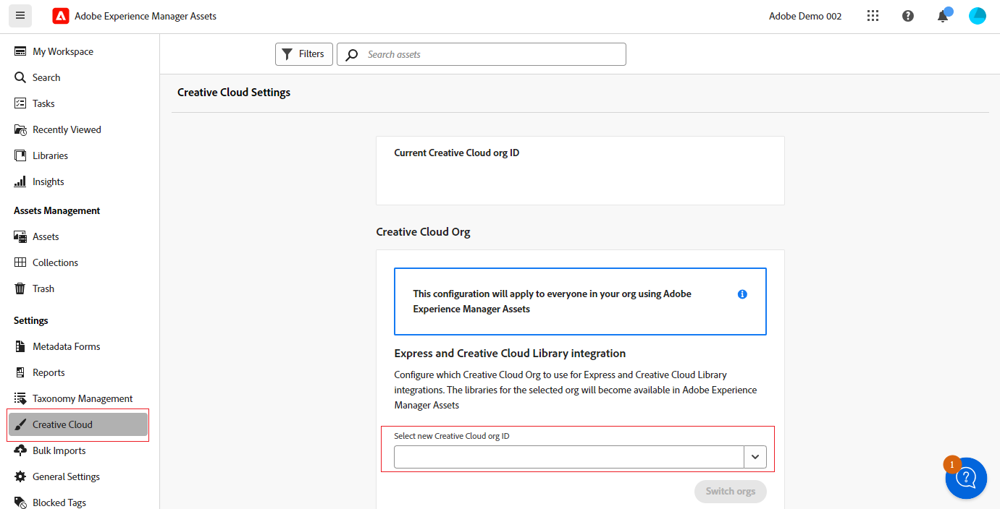

# Conectar AEM Assets a Creative Cloud  {#cross-org-entitlements}

Experience Manager Assets tiene la capacidad de conectarse a una asignación de derechos de Creative Cloud que se proporciona a una organización IMS diferente para utilizar fácilmente las últimas integraciones de Creative Cloud en AEM Assets, incluidas Express y Creative Cloud Libraries.

Si los productos de Creative Cloud y AEM Assets se suministran a organizaciones IMS independientes, puede conectarse a una organización de Creative Cloud diferente para poder ejecutar flujos de trabajo integrados entre las dos soluciones.

## Requisitos previos {#prerequisites}

* Derechos de administrador en Experience Manager Assets

* Derecho activo al Creative Cloud para el mismo ID de usuario utilizado en Creative Cloud y Experience Manager. Los derechos sobre los ID personales y federados con la misma dirección de correo electrónico se manejan como ID de usuario diferentes.

## Conexión a una nueva organización de Creative Cloud {#connect-to-creative-cloud-org}

Para conectarse a una nueva organización de Creative Cloud, ejecute los siguientes pasos:

1. Vaya a **[!UICONTROL Configuración]** > **[!UICONTROL Creative Cloud]**.

1. Seleccione la nueva organización de Creative Cloud mediante la lista desplegable **[!UICONTROL Seleccione el nuevo ID de organización de Creative Cloud]**. La lista muestra todas las organizaciones a las que tiene acceso. Seleccione la organización con derechos de Creative Cloud activos.

1. Haga clic en **[!UICONTROL Cambiar organizaciones]** para cambiar a la nueva organización.

   

## Restricciones {#limitations}

* Puede conectar AEM Assets a una organización de Creative Cloud a la vez. No se admite la conexión a varias organizaciones de Creative Cloud a la vez.

* La organización de Creative Cloud a la que se conecta en AEM Assets se aplica a todos los usuarios de su organización.
