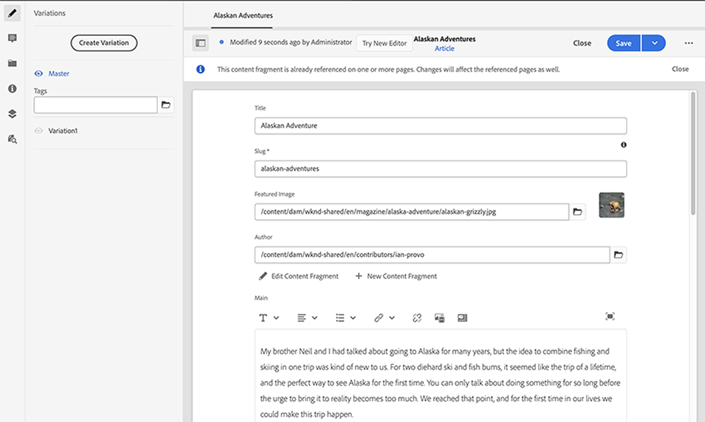

# Administración de fragmentos de contenido{#managing-content-fragments}

Los fragmentos de contenido se almacenan como **recursos**, por lo que se administran principalmente desde la consola **Recursos** .

>[!NOTE]
>
>A continuación, los fragmentos de contenido se utilizan con las páginas de creación; consulte Creación [de páginas con fragmentos](/help/sites-cloud/authoring/fundamentals/content-fragments.md)de contenido.

## Creación de fragmentos de contenido {#creating-content-fragments}

### Creación de un modelo de contenido {#creating-a-content-model}

[Los modelos](/help/assets/content-fragments/content-fragments-models.md) de fragmentos de contenido se pueden habilitar y crear antes de crear fragmentos de contenido con contenido estructurado.

>[!NOTE]
>
>Consulte Desarrollo de fragmentos de contenido para obtener más información sobre plantillas. se utiliza para fragmentos de contenido sencillos.

<!--
>[!NOTE]
>
>See [Developing Content Fragments](/help/sites-developing/customizing-content-fragments.md) for further information on templates; used for simple content fragments.
-->

### Creación de un fragmento de contenido {#creating-a-content-fragment}

El método para crear un fragmento de contenido es (básicamente) el mismo para fragmentos simples y estructurados:

1. Vaya a la carpeta **Recursos** en la que desea crear el fragmento.
2. Seleccione **Crear** y, a continuación, Fragmento **de contenido** para abrir el asistente.
3. El primer paso del asistente requiere que especifique la base del nuevo fragmento.

   * Puede ser:

      * Plantilla: por ejemplo, Fragmento **** simple <!-- [Template](/help/sites-developing/content-fragment-templates.md) - for example **Simple Fragment** -->

      * [Modelo](/help/assets/content-fragments/content-fragments-models.md) : se utiliza para crear un fragmento que requiere contenido estructurado; por ejemplo, el modelo **Aeroports**
   * Se muestran todas las plantillas y modelos disponibles.
   Después de la selección, utilice **Siguiente** para continuar.

   

4. En el paso **Propiedades** , especifique:

   * **Básico**

      * **Título**

         El título del fragmento.

         Obligatorio.

      * **Descripción**

      * **Etiquetas**
   * **Avanzado**

      * **Nombre**

         El nombre; se utilizará para formar la dirección URL.

         Obligatorio; se derivará automáticamente del título, pero se puede actualizar.

5. Seleccione **Crear** para completar la acción y, a continuación, **Abra** el fragmento para editarlo o vuelva a la consola con **Finalizado**.

## Acciones para un fragmento de contenido {#actions-for-a-content-fragment}

En la consola **Recursos** hay una serie de acciones disponibles para los fragmentos de contenido, ya sea:

* Desde la barra de herramientas; después de seleccionar el fragmento, todas las acciones correspondientes estarán disponibles.
* Como acciones [rápidas](/help/sites-cloud/authoring/getting-started/basic-handling.md#quick-actions); un subconjunto de acciones disponible para las tarjetas de fragmento individuales.

Seleccione el fragmento para mostrar la barra de herramientas con las acciones correspondientes:

* **Crear**
* **Descargar**

   * Guarde el fragmento como archivo ZIP; puede definir si desea incluir elementos, variaciones y metadatos.

* **Cierre de compra**
* **Propiedades**

   * Permite ver o editar los metadatos del fragmento.

* **Editar**

   * Permite [abrir el fragmento para editar contenido](/help/assets/content-fragments/content-fragments-variations.md) junto con sus elementos, variaciones, contenido asociado y metadatos.

* **Administrar etiquetas**
* **A la colección**

   * Agregue el fragmento a una colección.
   * Esto también se puede hacer al [asociar una colección con el fragmento](/help/assets/content-fragments/content-fragments-assoc-content.md#adding-associated-content).

* **Copiar**/**Pegar**

* **Mover**
* **Publicación rápida**
* **Administrar publicación**
* **Eliminar**

>[!NOTE]
>
>Muchas de ellas son acciones [estándar para Recursos](/help/assets/manage-digital-assets.md) y/o la aplicación [de escritorio de](https://helpx.adobe.com/experience-manager/desktop-app/aem-desktop-app.html)AEM.

## Apertura del Editor de fragmentos {#opening-the-fragment-editor}

Para abrir el fragmento y editarlo:

<!--
>[!CAUTION]
>
>To edit a content fragment you need [the appropriate permissions](/help/sites-developing/customizing-content-fragments.md#asset-permissions). Please contact your system administrator if you are experiencing issues.
-->

>[!CAUTION]
>
>Para editar un fragmento de contenido, necesita los permisos correspondientes. Póngase en contacto con el administrador del sistema si tiene problemas.

1. Utilice la consola **Recursos** para desplazarse a la ubicación del fragmento de contenido.
2. Abra el fragmento para editarlo mediante una de las acciones siguientes:

   * Al tocar o hacer clic en el vínculo de fragmento o fragmento (esto depende de la vista de la consola).
   * Seleccione el fragmento y, a continuación, **edite** desde la barra de herramientas.
   Se abrirá el editor de fragmentos:

   

   >[!NOTE]
   >
   >1. Se mostrará un mensaje cuando ya se haga referencia al fragmento en una página de contenido.
      >
      >
      >

   2. El panel lateral puede ocultarse o mostrarse mediante el icono **Alternar panel** lateral.

3. Navegue por los tres modos utilizando los iconos del panel lateral:

   * Variaciones: [Edición del contenido](#editing-the-content-of-your-fragment) y [administración de las variaciones](#creating-and-managing-variations-within-your-fragment)

   * [Anotaciones](/help/assets/content-fragments/content-fragments-variations.md#annotating-a-content-fragment)
   * [Contenido asociado](#associating-content-with-your-fragment)
   * [Metadatos](#viewing-and-editing-the-metadata-properties-of-your-fragment)
   

4. Después de realizar los cambios, utilice **Guardar** o **Cancelar** según sea necesario.

   >[!NOTE]
   >
   >Tanto **Guardar** como **Cancelar** abandonarán el editor; consulte [Guardar, Cancelar y Versiones](#save-cancel-and-versions) para obtener información completa sobre cómo funcionan ambas opciones para los fragmentos de contenido.

## Guardar, cancelar y versiones {#save-cancel-and-versions}

>[!NOTE]
>
>Las versiones también se pueden [crear, comparar y revertir desde la línea de tiempo](/help/assets/content-fragments/content-fragments-managing.md#timeline-for-content-fragments).

El editor tiene dos opciones:

* **Guardar**

   Guardará los cambios más recientes y saldrá del editor.

   >[!CAUTION]
   >
   >Para editar un fragmento de contenido, necesita los permisos correspondientes. Póngase en contacto con el administrador del sistema si tiene problemas.

   <!-- 
  >[!CAUTION]
  >
  >To edit a content fragment you need [the appropriate permissions](/help/sites-developing/customizing-content-fragments.md#asset-permissions). Please contact your system administrator if you are experiencing issues. 
  -->

   >[!NOTE]
   >
   >Es posible permanecer en el editor, realizando una serie de cambios, antes de seleccionar **Guardar**.

   >[!CAUTION]
   >
   >Además de simplemente guardar los cambios, **Guardar** también actualiza todas las referencias y garantiza que el despachante se borre según sea necesario. Estos cambios pueden llevar tiempo para procesarse. Debido a esto, puede haber un impacto en el rendimiento de un sistema grande/complejo/sobrecargado.
   >
   >
   >Tenga esto en cuenta cuando utilice **Guardar** y luego vuelva a introducir rápidamente el editor de fragmentos para realizar y guardar más cambios.

* **Cancelar**

   Saldrá del editor sin guardar los cambios más recientes.

Al editar el fragmento de contenido, AEM crea automáticamente versiones para garantizar que el contenido anterior se pueda restaurar si **cancela** los cambios:

1. Cuando se abre un fragmento de contenido para editarlo, AEM comprueba la existencia del token basado en cookies que indica si existe una sesión *de* edición:

   1. Si se encuentra el token, el fragmento se considera parte de la sesión de edición existente.
   2. Si el token *no está* disponible y el usuario comienza a editar contenido, se crea una versión y se envía un token para esta nueva sesión de edición al cliente, donde se guarda en una cookie.

2. Aunque hay una sesión de edición *activa* , el contenido que se está editando se guarda automáticamente cada 600 segundos (valor predeterminado).

   >[!NOTE]
   >
   >El intervalo de guardado automático se puede configurar mediante el `/conf` mecanismo .
   >
   >Valor predeterminado, consulte:
   >  `/libs/settings/dam/cfm/jcr:content/autoSaveInterval`

3. Si el usuario selecciona **Cancelar** la edición, se restaura la versión creada al inicio de la sesión de edición y se elimina el token para finalizar la sesión de edición.
4. Si el usuario selecciona **Guardar** las ediciones, los elementos/variaciones actualizados se conservan y se elimina el token para finalizar la sesión de edición.

## Edición del contenido del fragmento {#editing-the-content-of-your-fragment}

Una vez abierto el fragmento, puede utilizar la ficha [Variaciones](/help/assets/content-fragments/content-fragments-variations.md) para crear el contenido.

## Creación y administración de variaciones dentro del fragmento {#creating-and-managing-variations-within-your-fragment}

Una vez creado el contenido principal, puede crear y administrar [variaciones](/help/assets/content-fragments/content-fragments-variations.md) de dicho contenido.

## Asociación de contenido con el fragmento {#associating-content-with-your-fragment}

También puede [asociar contenido](/help/assets/content-fragments/content-fragments-assoc-content.md) con un fragmento. Esto proporciona una conexión para que los recursos (es decir, las imágenes) se puedan utilizar (opcionalmente) con el fragmento cuando se agregan a una página de contenido.

## Visualización y edición de los metadatos (propiedades) del fragmento {#viewing-and-editing-the-metadata-properties-of-your-fragment}

Puede ver y editar las propiedades de un fragmento mediante la ficha [Metadatos](/help/assets/content-fragments/content-fragments-metadata.md) .

## Cronología de los fragmentos de contenido {#timeline-for-content-fragments}

Además de las opciones estándar, la [línea de tiempo](/help/assets/manage-digital-assets.md#timeline) proporciona información y acciones específicas de los fragmentos de contenido:

* Ver información sobre versiones, comentarios y anotaciones
* Acciones para versiones

   * **[Revertir a esta versión](#reverting-to-a-version)**(seleccione un fragmento existente y, a continuación, una versión específica)

   * **[Comparar con actual](#comparing-fragment-versions)**(seleccione un fragmento existente y, a continuación, una versión específica)

   * Agregar una **etiqueta** o un **comentario** (seleccione un fragmento existente y, a continuación, una versión específica)

   * **Guardar como versión** (seleccione un fragmento existente y, a continuación, la flecha hacia arriba en la parte inferior de la línea de tiempo)

* Acciones para anotaciones

   * **Eliminar**

>[!NOTE]
Los comentarios son:
* Funcionalidad estándar para todos los recursos
* Realizado en la línea de tiempo
* Relacionado con el recurso de fragmento

Las anotaciones (para fragmentos de contenido) son:
* Introducido en el editor de fragmentos
* Específico para un segmento seleccionado de texto dentro del fragmento

Por ejemplo:

## Comparación de versiones de fragmento {#comparing-fragment-versions}

La acción **Comparar con actual** está disponible en la [línea de tiempo](/help/assets/content-fragments/content-fragments-managing.md#timeline-for-content-fragments) después de seleccionar una versión específica.

Se abrirá:

* la versión **actual** (más reciente) (izquierda)

* la versión seleccionada **v&lt;*x.y*>** (derecha)

Se mostrarán en paralelo, donde:

* Se resaltan todas las diferencias

   * Texto eliminado: rojo
   * Texto insertado: verde
   * Texto reemplazado - azul

* El icono de pantalla completa le permite abrir cualquiera de las versiones por su cuenta; a continuación, vuelva a la vista paralela
* Puede **revertir** a la versión específica
* **Listo** le devolverá a la consola

>[!NOTE]
No se puede editar el contenido del fragmento al comparar fragmentos.

## Reverting to a Version  {#reverting-to-a-version}

Puede volver a una versión específica del fragmento:

* Directamente desde la [línea de tiempo](/help/assets/content-fragments/content-fragments-managing.md#timeline-for-content-fragments).

   Seleccione la versión requerida y, a continuación, la acción **Revertir a esta versión** .

* Al [comparar una versión con la versión](/help/assets/content-fragments/content-fragments-managing.md#comparing-fragment-versions) actual, puede **revertir** a la versión seleccionada.

## Publicación y referencia de un fragmento {#publishing-and-referencing-a-fragment}

>[!CAUTION]
Si el fragmento se basa en un modelo, debe asegurarse de que el [modelo se ha publicado](/help/assets/content-fragments/content-fragments-models.md#publishing-a-content-fragment-model).
Si publica un fragmento de contenido para el que el modelo aún no se ha publicado, una lista de selección lo indicará y el modelo se publicará con el fragmento.

Los fragmentos de contenido deben publicarse para su uso en el entorno de publicación. Pueden publicarse:

* Después de la creación; desde la consola **Recursos** .
* Al [publicar una página que utilice el fragmento](/help/sites-cloud/authoring/fundamentals/content-fragments.md#publishing); el fragmento se enumerará en las referencias de página.

>[!CAUTION]
Una vez publicado o referenciado un fragmento, AEM mostrará una advertencia cuando un autor abra el fragmento para editarlo de nuevo. Esto sirve para advertir que los cambios en el fragmento también afectarán a las páginas a las que se hace referencia.

## Eliminación de un fragmento {#deleting-a-fragment}

Para eliminar un fragmento:

1. En la consola **Recursos** , navegue a la ubicación del fragmento de contenido.
2. Seleccione el fragmento.

   >[!NOTE]
   The **Delete** action is not available as a quick action.

3. Select **Delete** from the toolbar.
4. Confirme la acción **Eliminar** .

   >[!CAUTION]
   Si ya se hace referencia al fragmento en una página, verá un mensaje de advertencia y será necesario para confirmar que desea continuar con la eliminación **forzada**. El fragmento, junto con su componente de fragmento de contenido, se eliminará de cualquier página de contenido.
