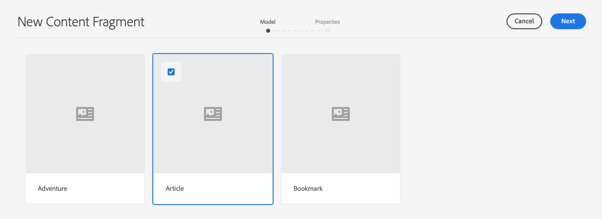

# Administrar fragmentos de contenido{#managing-content-fragments}

Los fragmentos de contenido se almacenan como **Assets**, por lo que se administran principalmente desde la consola **Assets**.

>[!NOTE]
>
>Se pueden utilizar fragmentos de contenido:
>
>* al crear páginas; consulte [Creación de páginas con fragmentos de contenido](/help/sites-cloud/authoring/fundamentals/content-fragments.md).
>* para [Entrega de contenido sin encabezado mediante fragmentos de contenido con GraphQL](/help/assets/content-fragments/content-fragments-graphql.md).

## Creación de fragmentos de contenido {#creating-content-fragments}

### Creación de un modelo de contenido {#creating-a-content-model}

[Los ](/help/assets/content-fragments/content-fragments-models.md) modelos de fragmentos de contenido se pueden habilitar y crear antes de crear fragmentos de contenido con contenido estructurado.

### Creación de un fragmento de contenido {#creating-a-content-fragment}

El método para crear un fragmento de contenido es:

1. Vaya a la carpeta **Assets** en la que desea crear el fragmento.
1. Seleccione **Crear** y, a continuación, **Fragmento de contenido** para abrir el asistente.
1. El primer paso del asistente requiere que especifique la base del nuevo fragmento.

   * [Modelo](/help/assets/content-fragments/content-fragments-models.md) : se utiliza para crear un fragmento que requiere contenido estructurado; por ejemplo,  **** Adventuremodel

      * Se muestran todos los modelos disponibles.

   Después de la selección, utilice **Next** para continuar.

   

1. En el paso **Propiedades**, especifique:

   * **Básico**

      * **Título**

         El título del fragmento.

         Obligatorio.

      * **Descripción**

      * **Etiquetas**
   * **Avanzado**

      * **Nombre**

         El nombre; se utilizará para formar la dirección URL.

         Obligatorio; se derivan automáticamente del título, pero se pueden actualizar.

1. Seleccione **Crear** para completar la acción y, a continuación, **Abra** el fragmento para editarlo o vuelva a la consola pulsando **Listo**.

   >[!NOTE]
   >En el modo **List** de la consola, puede actualizar la **View Settings** para habilitar la columna **Content Fragment Model**.

## Acciones para un fragmento de contenido en la consola Recursos {#actions-for-a-content-fragment-assets-console}

En la consola **Assets** hay una serie de acciones disponibles para los fragmentos de contenido:

* Desde la barra de herramientas; después de seleccionar el fragmento, están disponibles todas las acciones adecuadas.
* Como [acciones rápidas](/help/sites-cloud/authoring/getting-started/basic-handling.md#quick-actions); un subconjunto de acciones disponibles para las tarjetas de fragmento individuales.

Seleccione el fragmento para mostrar la barra de herramientas con las acciones aplicables:

* **Volver a procesar los recursos**
* **Crear**
* **Descargar**

   * Guarde el fragmento como archivo ZIP; puede definir si desea incluir elementos, variables y metadatos.

* **Cierre de compra**
* **Propiedades**

   * Permite ver o editar los metadatos del fragmento.

* **Editar**

   * Le permite [abrir el fragmento para editar contenido](/help/assets/content-fragments/content-fragments-variations.md) junto con sus elementos, variaciones, contenido asociado y metadatos.

* **Publicación rápida**
* **Administrar publicación**
* **Administrar etiquetas**
* **A la colección**
* **Copiar**  (y  **pegar**)
* **Mover**
* **Eliminar**

>[!NOTE]
>
>Muchas de ellas son [acciones estándar para Assets](/help/assets/manage-digital-assets.md) o [AEM aplicación de escritorio](https://experienceleague.adobe.com/docs/experience-manager-desktop-app/using/using.html?lang=es).

## Apertura del Editor de fragmentos {#opening-the-fragment-editor}

Para abrir el fragmento para editarlo:

>[!CAUTION]
>
>Para editar un fragmento de contenido necesita [los permisos adecuados](/help/implementing/developing/extending/content-fragments-customizing.md#asset-permissions). Póngase en contacto con el administrador del sistema si tiene problemas.

>[!CAUTION]
>
>Para editar un fragmento de contenido, necesita los permisos adecuados. Póngase en contacto con el administrador del sistema si tiene problemas.

1. Utilice la consola **Assets** para desplazarse a la ubicación del fragmento de contenido.
1. Abra el fragmento para editarlo mediante:

   * Tocando o haciendo clic en el fragmento o vínculo de fragmento (depende de la vista de la consola).
   * Seleccione el fragmento y, a continuación, **Edit** en la barra de herramientas.

1. Se abrirá el editor de fragmentos. Realice los cambios según sea necesario:

   

1. Después de realizar los cambios, utilice **Guardar y cerrar** o **Cancelar** según sea necesario.

   >[!NOTE]
   >
   >Tanto **Guardar y cerrar** como **Cancelar** abandonarán el editor; consulte [Guardar, Cancelar y Versiones](#save-cancel-and-versions) para obtener información completa sobre cómo funcionan ambas opciones para los fragmentos de contenido.

## Modos y acciones en el editor de fragmentos de contenido {#modes-actions-content-fragment-editor}

Hay varios modos y acciones disponibles en el Editor de fragmentos de contenido.

### Modos en el editor de fragmentos de contenido {#modes-in-the-content-fragment-editor}

Desplácese por los distintos modos utilizando los iconos del panel lateral:

* Variaciones: [Edición del contenido](#editing-the-content-of-your-fragment) y [Administración de las variaciones](#creating-and-managing-variations-within-your-fragment)

* [Anotaciones](/help/assets/content-fragments/content-fragments-variations.md#annotating-a-content-fragment)
* [Contenido asociado](#associating-content-with-your-fragment)
* [Metadatos](#viewing-and-editing-the-metadata-properties-of-your-fragment)
* [Árbol de estructura](/help/assets/content-fragments/content-fragments-structure-tree.md)
* [Vista previa](/help/assets/content-fragments/content-fragments-json-preview.md)

### Acciones de la barra de herramientas en el editor de fragmentos de contenido {#toolbar-actions-in-the-content-fragment-editor}

Algunas funciones de la barra de herramientas superior están disponibles en varios modos:

* Se mostrará un mensaje cuando ya se haga referencia al fragmento en una página de contenido. Puede **Cerrar** el mensaje.

* El panel lateral se puede ocultar o mostrar mediante el icono **Alternar panel lateral**.

* Debajo del nombre del fragmento puede ver el nombre del [Modelo de fragmento de contenido](/help/assets/content-fragments/content-fragments-models.md) utilizado para crear el fragmento actual:

   * El nombre también es un vínculo que abrirá el editor de modelos.

* Ver el estado del fragmento; por ejemplo, información sobre cuándo se creó, modificó o publicó. El estado también está codificado por colores:

   * **Nuevo**: gris
   * **Borrador**: azul
   * **Publicado**: green
   * **Modificado**: naranja
   * **Desactivado**: rojo

* Los tres puntos (**...**) proporciona acceso a acciones adicionales:
   * **[Publicación rápida](#publishing-and-referencing-a-fragment)**
   * **[Administrar publicación](#publishing-and-referencing-a-fragment)**

## Guardar, cancelar y versiones {#save-cancel-and-versions}

>[!NOTE]
>
>Las versiones también se pueden [crear, comparar y revertir desde la línea de tiempo](/help/assets/content-fragments/content-fragments-managing.md#timeline-for-content-fragments).

El editor tiene dos opciones:

* **Guardar**

   Guardará los cambios más recientes y cerrará el editor.

   >[!CAUTION]
   >
   >Para editar un fragmento de contenido necesita [los permisos adecuados](/help/implementing/developing/extending/content-fragments-customizing.md#asset-permissions). Póngase en contacto con el administrador del sistema si tiene problemas.

   >[!NOTE]
   >
   >Es posible permanecer en el editor haciendo una serie de cambios antes de seleccionar **Guardar**.

   >[!CAUTION]
   >
   >Además de guardar los cambios simplemente, **Save** también actualiza las referencias y garantiza que Dispatcher se vacíe según sea necesario. Estos cambios pueden tardar un tiempo en procesarse. Debido a esto, puede haber un impacto en el rendimiento de un sistema grande/complejo/con gran carga.
   >
   >
   >Tenga esto en cuenta al utilizar **Guardar** y luego volver a introducir rápidamente el editor de fragmentos para realizar y guardar más cambios.

* **Cancelar**

   Saldrá del editor sin guardar los cambios más recientes.

Al editar el fragmento de contenido AEM crea automáticamente versiones para garantizar que el contenido anterior se pueda restaurar si **Cancelar** los cambios:

1. Cuando se abre un fragmento de contenido para editarlo AEM comprueba la existencia del token basado en cookies que indica si existe una *sesión de edición*:

   1. Si se encuentra el token, el fragmento se considera parte de la sesión de edición existente.
   2. Si el token *no* está disponible y el usuario comienza a editar contenido, se crea una versión y se envía un token para esta nueva sesión de edición al cliente, donde se guarda en una cookie.

2. Aunque hay una sesión de edición *activa*, el contenido que se está editando se guarda automáticamente cada 600 segundos (valor predeterminado).

   >[!NOTE]
   >
   >El intervalo de guardado automático se puede configurar mediante el mecanismo `/conf` .
   >
   >Valor predeterminado, consulte:
   >  `/libs/settings/dam/cfm/jcr:content/autoSaveInterval`

3. Si el usuario selecciona **Cancelar** la edición, la versión creada al principio de la sesión de edición se restaura y se elimina el token para finalizar la sesión de edición.
4. Si el usuario selecciona **Guardar** las ediciones, los elementos/variaciones actualizados se mantienen y el token se elimina para finalizar la sesión de edición.

## Edición del contenido del fragmento {#editing-the-content-of-your-fragment}

Una vez abierto el fragmento, puede utilizar la pestaña [Variations](/help/assets/content-fragments/content-fragments-variations.md) para crear el contenido.

## Creación y administración de variaciones dentro del fragmento {#creating-and-managing-variations-within-your-fragment}

Una vez creado el contenido principal, puede crear y administrar [Variaciones](/help/assets/content-fragments/content-fragments-variations.md) de dicho contenido.

## Asociación del contenido con el fragmento {#associating-content-with-your-fragment}

También puede [asociar contenido](/help/assets/content-fragments/content-fragments-assoc-content.md) con un fragmento. Esto proporciona una conexión para que los recursos (es decir, las imágenes) se puedan utilizar (opcionalmente) con el fragmento cuando se añada a una página de contenido.

## Visualización y edición de los metadatos (propiedades) del fragmento {#viewing-and-editing-the-metadata-properties-of-your-fragment}

Puede ver y editar las propiedades de un fragmento mediante la pestaña [Metadata](/help/assets/content-fragments/content-fragments-metadata.md).

## Cronología de los fragmentos de contenido {#timeline-for-content-fragments}

Además de las opciones estándar, [Línea de tiempo](/help/assets/manage-digital-assets.md#timeline) proporciona información y acciones específicas para los fragmentos de contenido:

* Ver información sobre versiones, comentarios y anotaciones
* Acciones para las versiones

   * **[Revertir a esta versión](#reverting-to-a-version)**  (seleccione un fragmento existente y, a continuación, una versión específica)

   * **[Comparar con actual](#comparing-fragment-versions)**  (seleccione un fragmento existente y luego una versión específica)

   * Agregue una **Etiqueta** o **Comentario** (seleccione un fragmento existente y luego una versión específica)

   * **Guardar como versión**  (seleccione un fragmento existente y luego la flecha hacia arriba en la parte inferior de la línea de tiempo)

* Acciones para anotaciones

   * **Eliminar**

>[!NOTE]
Los comentarios son:
* Funcionalidad estándar para todos los recursos
* Se ha realizado en la línea de tiempo
* Relacionado con el recurso de fragmento

Las anotaciones (para fragmentos de contenido) son:
* Introducido en el editor de fragmentos
* Específico para un segmento seleccionado de texto dentro del fragmento

Por ejemplo:

## Comparación de versiones de fragmento {#comparing-fragment-versions}

La acción **Comparar con actual** está disponible en la [Línea de tiempo](/help/assets/content-fragments/content-fragments-managing.md#timeline-for-content-fragments) después de seleccionar una versión específica.

Se abrirá:

* la versión **actual** (más reciente) (izquierda)

* la versión seleccionada **v&lt;*x.y*** (derecha)

Se mostrarán en paralelo, donde:

* Se resaltan todas las diferencias

   * Texto eliminado: rojo
   * Texto insertado - verde
   * Texto reemplazado - azul

* El icono de pantalla completa le permite abrir cualquiera de las versiones por su cuenta; a continuación, vuelva a la vista paralela
* Puede **Revertir** a la versión específica
* **** Donewill le devolverá a la consola

>[!NOTE]
No se puede editar el contenido del fragmento al comparar fragmentos.

## Revertir a una versión {#reverting-to-a-version}

Puede volver a una versión específica del fragmento:

* Directamente desde la [línea de tiempo](/help/assets/content-fragments/content-fragments-managing.md#timeline-for-content-fragments).

   Seleccione la versión requerida y luego la acción **Revertir a esta versión**.

* Mientras [compara una versión con la versión actual](/help/assets/content-fragments/content-fragments-managing.md#comparing-fragment-versions) puede **Revertir** a la versión seleccionada.

## Publicación y referencia de un fragmento {#publishing-and-referencing-a-fragment}

>[!CAUTION]
Si el fragmento se basa en un modelo, debe asegurarse de que el modelo [se ha publicado](/help/assets/content-fragments/content-fragments-models.md#publishing-a-content-fragment-model).
Si publica un fragmento de contenido para el que el modelo aún no se ha publicado, una lista de selección lo indicará y el modelo se publicará con el fragmento.

Los fragmentos de contenido deben publicarse para su uso en el entorno de publicación. Se pueden publicar:

* Después de la creación; uso de [acciones disponibles en la consola de Assets](#actions-for-a-content-fragment-assets-console).
* Desde el [Editor de fragmentos de contenido](#toolbar-actions-in-the-content-fragment-editor).
* Cuando [publica una página que utiliza el fragmento](/help/sites-cloud/authoring/fundamentals/content-fragments.md#publishing); el fragmento se enumerará en las referencias de página.

>[!CAUTION]
Después de publicar un fragmento o de hacer referencia a él, AEM mostrará una advertencia cuando un autor abra el fragmento para editarlo de nuevo. Esto sirve para advertir que los cambios en el fragmento también afectarán a las páginas a las que se hace referencia.

## Eliminación de un fragmento {#deleting-a-fragment}

Para eliminar un fragmento:

1. En la consola **Assets** vaya a la ubicación del fragmento de contenido.
2. Seleccione el fragmento.

   >[!NOTE]
   La acción **Delete** no está disponible como acción rápida.

3. Seleccione **Delete** en la barra de herramientas.
4. Confirme la acción **Delete**.

   >[!CAUTION]
   Si ya se hace referencia al fragmento en una página, verá un mensaje de advertencia y será necesario para confirmar que desea continuar con la **eliminación forzada**. El fragmento, junto con su componente de fragmento de contenido, se eliminará de cualquier página de contenido.
