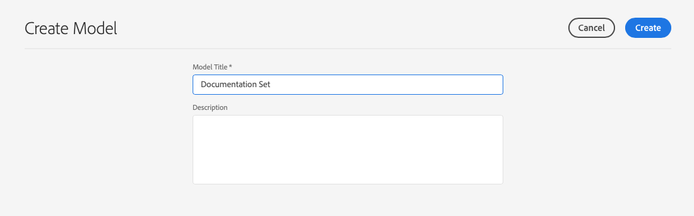

# Modelos de fragmento de contenido {#content-fragment-models}

Los modelos de fragmento de contenido de AEM definen la estructura de contenido para los fragmentos de contenido [y](/help/assets/content-fragments/content-fragments.md) que sirven como base del contenido sin encabezado.

Para usar modelos de fragmento de contenido:

1. [Habilitar la funcionalidad del modelo de fragmento de contenido para la instancia](/help/assets/content-fragments/content-fragments-configuration-browser.md)
1. [Cree](#creating-a-content-fragment-model) y  [configure](#defining-your-content-fragment-model) los modelos de fragmento de contenido
1. [Habilite los ](#enabling-disabling-a-content-fragment-model) modelos de fragmento de contenido para utilizarlos al crear fragmentos de contenido para utilizarlos al crear fragmentos de contenido
1. [Permita los modelos de fragmento de contenido en las carpetas de recursos necesarias ](#allowing-content-fragment-models-assets-folder) mediante la configuración de  **directivas**.

## Creación de un modelo de fragmento de contenido {#creating-a-content-fragment-model}

1. Vaya a **Herramientas**, **Recursos** y, a continuación, abra **Modelos de fragmento de contenido**.
1. Vaya a la carpeta correspondiente a su [configuración](/help/assets/content-fragments/content-fragments-configuration-browser.md).
1. Utilice **Crear** para abrir el asistente.

   >[!CAUTION]
   >
   >Si el [uso de modelos de fragmento de contenido no se ha habilitado](/help/assets/content-fragments/content-fragments-configuration-browser.md), la opción **Crear** no estará disponible.

1. Especifique el **Título del modelo**. También puede agregar **Etiquetas**, una **Descripción** y seleccionar **Habilitar modelo** para [habilitar el modelo](#enabling-disabling-a-content-fragment-model) si es necesario.

   

1. Utilice **Crear** para guardar el modelo vacío. Un mensaje indicará el éxito de la acción, puede seleccionar **Abrir** para editar inmediatamente el modelo o **Listo** para volver a la consola.

## Definición del modelo de fragmento de contenido {#defining-your-content-fragment-model}

El modelo de fragmento de contenido define efectivamente la estructura de los fragmentos de contenido resultantes mediante una selección de **[Tipos de datos](#data-types)**. Con el editor de modelos puede añadir instancias de los tipos de datos y, a continuación, configurarlas para crear los campos obligatorios:

>[!CAUTION]
>
>Editar un modelo de fragmento de contenido existente puede afectar a los fragmentos dependientes.

1. Vaya a **Herramientas**, **Recursos** y, a continuación, abra **Modelos de fragmento de contenido**.

1. Vaya a la carpeta que contiene el modelo de fragmento de contenido.
1. Abra el modelo necesario para **Edit**; utilice la acción rápida o seleccione el modelo y, a continuación, la acción en la barra de herramientas.

   Una vez abierto, el editor de modelos muestra:

   * a la izquierda: campos ya definidos
   * right: **Tipos de datos** disponibles para crear campos (y **Propiedades** para su uso una vez creados los campos)

   >[!NOTE]
   >
   >Cuando un campo es **obligatorio**, la **etiqueta** indicada en el panel izquierdo se marca con un asterisco (*****).


1. **Adición de un campo**

   * Arrastre un tipo de datos requerido a la ubicación requerida para un campo:

      

   * Una vez agregado un campo al modelo, el panel derecho mostrará las **Propiedades** que se pueden definir para ese tipo de datos en particular. Aquí puede definir lo que se requiere para ese campo.

      * Muchas propiedades se explican por sí mismas; para obtener más información, consulte [Propiedades](#properties).
      * Si se escribe una **Etiqueta de campo** se completará automáticamente el **Nombre de propiedad** (si está vacío) y se podrá actualizar manualmente posteriormente.

      Por ejemplo:

      


1. **Eliminación de un campo**

   Seleccione el campo requerido y, a continuación, toque o haga clic en el icono de la papelera. Se le solicitará que confirme la acción.

   

1. Agregue todos los campos obligatorios y defina las propiedades relacionadas, según sea necesario. Por ejemplo:

   

1. Seleccione **Save** para mantener la definición.

## Tipos de datos {#data-types}

Hay disponible una selección de tipos de datos para definir el modelo:

* **Texto de línea única**
   * Añada uno o más campos de una sola línea de texto; se puede definir la longitud máxima
* **Texto multilínea**
   * Área de texto que puede ser Texto enriquecido, Texto sin formato o Marcado
* **Número**
   * Agregar uno o más campos numéricos
* **Booleano**
   * Agregar una casilla de verificación booleana
* **Fecha y hora**
   * Agregar una fecha y/o hora
* **Enumeración**
   * Agregar un conjunto de casillas de verificación, botones de opción o campos desplegables
* **Etiquetas**
   * Permite a los autores de fragmentos acceder y seleccionar áreas de etiquetas
* **Referencia de contenido**
   * Referencias a otros contenidos, de cualquier tipo; se puede usar para [crear contenido anidado](#using-references-to-form-nested-content)
   * Si se hace referencia a una imagen, puede optar por mostrar una miniatura
* **Referencia al fragmento**
   * Referencias a otros fragmentos de contenido; se puede usar para [crear contenido anidado](#using-references-to-form-nested-content)
   * El tipo de datos se puede configurar para que los autores de fragmentos puedan:
      * Edite directamente el fragmento al que se hace referencia.
      * Cree un nuevo fragmento de contenido basado en el modelo apropiado
* **Objeto JSON**
   * Permite al autor del fragmento de contenido introducir la sintaxis JSON en los elementos correspondientes de un fragmento.
      * Para permitir que AEM almacene el JSON directo que ha copiado/pegado desde otro servicio.
      * El JSON se pasará y se emitirá como JSON en GraphQL.
      * Incluye resaltado de sintaxis JSON, autocompletado y resaltado de errores en el editor de fragmentos de contenido.
* **Marcador de posición de pestaña**
   * Permite la introducción de fichas para utilizarlas al editar el contenido del fragmento de contenido.
Esto se mostrará como un divisor en el editor de modelos, separando secciones de la lista de tipos de datos de contenido. Cada instancia representa el inicio de una nueva pestaña.
En el editor de fragmentos, cada instancia aparecerá como una pestaña.

      >[!NOTE]
      Este tipo de datos se utiliza exclusivamente para dar formato; el esquema AEM GraphQL lo ignora.

## Propiedades {#properties}

Muchas propiedades se explican por sí mismas; para determinadas propiedades, a continuación se proporcionan detalles adicionales:

* **Representar**
comoLas distintas opciones para realizar/procesar el campo en un fragmento. A menudo, esto le permite definir si el autor verá una sola instancia del campo o si se le permitirá crear varias instancias.

* **Etiqueta de**
campoIntroducción de un 
**La** etiqueta de campo genera automáticamente un  **nombre de propiedad**, que se puede actualizar manualmente si es necesario.

* ****
La validación de ValidationBasic está disponible mediante mecanismos como la  **** propiedad Requiredproperty. Algunos tipos de datos tienen campos de validación adicionales. Consulte [Validación](#validation) para obtener más información.

* Para el tipo de datos **Texto multilínea** es posible definir el **tipo predeterminado** como:

   * **Texto enriquecido**
   * **Markdown**
   * **Texto sin formato**

   Si no se especifica, el valor predeterminado **Texto enriquecido** se utiliza para este campo.

   Cambiar el **tipo predeterminado** en un modelo de fragmento de contenido solo surtirá efecto en un fragmento de contenido existente relacionado después de que dicho fragmento se abra en el editor y se guarde.

* ****
UniqueContent (para el campo específico) debe ser único en todos los fragmentos de contenido creados a partir del modelo actual.

   Se utiliza para garantizar que los autores de contenido no puedan repetir el contenido ya añadido en otro fragmento del mismo modelo.

   Por ejemplo, un campo **Texto de una sola línea** llamado `Country` en el Modelo de fragmento de contenido no puede tener el valor `Japan` en dos fragmentos de contenido dependientes. Se emitirá una advertencia cuando se intente la segunda instancia.

   >[!NOTE]
   La unicidad se garantiza por cada raíz de idioma.

   >[!NOTE]
   Las variaciones pueden tener el mismo valor *único* que las variaciones del mismo fragmento, pero no el mismo valor que se utiliza en cualquier variación de otros fragmentos.

* ****
TranslatableComprobación de la variable 
**** Translatablecheckbox de un campo en el editor del Modelo de fragmento de contenido:

   * Asegúrese de que el nombre de propiedad del campo se agrega a la configuración de traducción, contexto `/content/dam/<sites-configuration>`, si no está presente.
   * Para GraphQL: establezca una propiedad `<translatable>` en el campo Fragmento de contenido en `yes` para permitir que el filtro de consulta de GraphQL para la salida JSON con solo contenido traducible.

* Consulte **[Content Reference](#content-reference)** para obtener más información sobre ese tipo de datos específico y sus propiedades.

* Consulte **[Referencia de fragmento (fragmentos anidados)](#fragment-reference-nested-fragments)** para obtener más información sobre ese tipo de datos específico y sus propiedades.

## Validación {#validation}

Varios tipos de datos ahora incluyen la posibilidad de definir los requisitos de validación para cuando el contenido se introduce en el fragmento resultante:

* **Texto de línea única**
   * Compare con un regex predefinido.
* **Número**
   * Compruebe si hay valores específicos.
* **Referencia de contenido**
   * Pruebe tipos de contenido específicos.
   * Solo se puede hacer referencia a los recursos con un tamaño de archivo especificado o más pequeño.
   * Solo se puede hacer referencia a las imágenes con un intervalo predefinido de anchura y/o altura (en píxeles).
* **Referencia al fragmento**
   * Pruebe un modelo de fragmento de contenido específico.

## Uso de referencias para formar contenido anidado {#using-references-to-form-nested-content}

Los fragmentos de contenido pueden formar contenido anidado mediante cualquiera de los siguientes tipos de datos:

* **[Referencia de contenido](#content-reference)**
   * Proporciona una sencilla referencia a otro contenido; de cualquier tipo.
   * Se puede configurar para una o varias referencias (en el fragmento resultante).

* **[Referencia de fragmento](#fragment-reference-nested-fragments)**  (fragmentos anidados)
   * Hace referencia a otros fragmentos, según los modelos específicos especificados.
   * Permite incluir o recuperar datos estructurados.

      >[!NOTE]
      Este método es de particular interés en conjunto con [Entrega de contenido sin encabezado mediante fragmentos de contenido con GraphQL](/help/assets/content-fragments/content-fragments-graphql.md).
   * Se puede configurar para una o varias referencias (en el fragmento resultante).

>[!NOTE]
AEM tiene una protección contra recurrencias para:
* Referencias de contenido
Esto evita que el usuario agregue una referencia al fragmento actual. Esto puede dar lugar a un cuadro de diálogo vacío del selector de referencia de fragmento.

* Referencias de fragmento en GraphQL
Si crea una consulta profunda que devuelve varios fragmentos de contenido a los que se hace referencia entre sí, devolverá un valor nulo en la primera incidencia.


### Referencia de contenido {#content-reference}

La referencia de contenido le permite procesar contenido de otra fuente; por ejemplo, imagen o fragmento de contenido.

Además de las propiedades estándar, puede especificar:

* La **Ruta raíz** para cualquier contenido al que se hace referencia
* Tipos de contenido a los que se puede hacer referencia
* Limitaciones de los tamaños de archivo
* Si se hace referencia a una imagen:
   * Mostrar miniatura
   * Restricciones de imagen de altura y anchura


### Referencia de fragmento (fragmentos anidados) {#fragment-reference-nested-fragments}

La Referencia de fragmento hace referencia a uno o más fragmentos de contenido. Esta función es de especial interés cuando se recupera contenido para utilizarlo en la aplicación, ya que le permite recuperar datos estructurados con varias capas.

Por ejemplo:

* Un modelo que define los detalles de un empleado; entre ellos se incluyen:
   * Referencia al modelo que define al empleador (empresa)

```xml
type EmployeeModel {
    name: String
    firstName: String
    company: CompanyModel
}

type CompanyModel {
    name: String
    street: String
    city: String
}
```

>[!NOTE]
Esto es de particular interés en conjunto con [Entrega de contenido sin encabezado mediante fragmentos de contenido con GraphQL](/help/assets/content-fragments/content-fragments-graphql.md).

Además de las propiedades estándar, puede definir:

* **Procesar como**:

   * **multicampo** : el autor del fragmento puede crear varias referencias, individuales

   * **referencia de fragmento** : permite al autor del fragmento seleccionar una única referencia a un fragmento

* **Modelo**
TipoSe pueden seleccionar varios modelos. Al crear el fragmento de contenido, se debe crear cualquier fragmento referenciado mediante estos modelos.

* **Ruta**
raízEspecifica una ruta raíz para los fragmentos a los que se hace referencia.

* **Permitir creación de fragmentos**

   Esto permitirá al autor del fragmento crear un nuevo fragmento basado en el modelo adecuado.

   * **fragmentreferencecomposite** : permite al autor del fragmento crear una composición, seleccionando varios fragmentos

   

>[!NOTE]
Existe un mecanismo de protección contra la recurrencia. Prohíbe que el usuario seleccione el fragmento de contenido actual en la Referencia de fragmento. Esto puede dar lugar a un cuadro de diálogo vacío del selector de referencia de fragmento.
También existe una protección contra las recurrencias para las referencias de fragmento en GraphQL. Si crea una consulta profunda en dos fragmentos de contenido que se hacen referencia entre sí, devolverá un valor nulo.

## Activación o desactivación de un modelo de fragmento de contenido {#enabling-disabling-a-content-fragment-model}

Para obtener un control total sobre el uso de los modelos de fragmento de contenido, estos tienen un estado que puede establecer.

### Activación de un modelo de fragmento de contenido {#enabling-a-content-fragment-model}

Una vez creado un modelo, debe activarse para que:

* Está disponible para selección al crear un nuevo fragmento de contenido.
* Se puede hacer referencia desde un modelo de fragmento de contenido.
* Está disponible para GraphQL; por lo tanto, se genera el esquema .

Para habilitar un modelo marcado como:

* **Borrador** : mew (nunca habilitado).
* **Deshabilitado** : se ha deshabilitado específicamente.

Utilice la opción **Enable** desde:

* La barra de herramientas superior, cuando se selecciona el Modelo requerido.
* La Acción rápida correspondiente (pase el ratón sobre el Modelo requerido).


### Desactivación de un modelo de fragmento de contenido {#disabling-a-content-fragment-model}

Un modelo también se puede desactivar para que:

* El modelo ya no está disponible como base para crear *nuevos* fragmentos de contenido.
* However:
   * El esquema de GraphQL se sigue generando y aún se puede consultar (para evitar afectar a la API de JSON).
   * Cualquier fragmento de contenido basado en el modelo se puede consultar y devolver desde el extremo de GraphQL.
* Ya no se puede hacer referencia al modelo, pero las referencias existentes no se tocan y aún se pueden consultar y devolver desde el extremo GraphQL.

Para desactivar un modelo marcado como **Enabled**, utilice la opción **Disable** desde:

* La barra de herramientas superior, cuando se selecciona el Modelo requerido.
* La Acción rápida correspondiente (pase el ratón sobre el Modelo requerido).


## Permitir modelos de fragmento de contenido en la carpeta de recursos {#allowing-content-fragment-models-assets-folder}

Para implementar el control de contenido, puede configurar **Directivas** en la carpeta Assets para controlar qué modelos de fragmento de contenido están permitidos para la creación de fragmentos en esa carpeta.

>[!NOTE]
El mecanismo es similar a [permitir plantillas de página](/help/sites-cloud/authoring/features/templates.md#allowing-a-template-author) para una página, y sus elementos secundarios, en las propiedades avanzadas de una página.

Para configurar las **Directivas** para los **Modelos de fragmento de contenido permitidos**:

1. Desplácese y abra **Properties** para la carpeta de recursos necesaria.

1. Abra la pestaña **Directivas**, donde puede configurar:

   * **Heredado de`<folder>`**

      Las directivas se heredan automáticamente al crear nuevas carpetas secundarias; la directiva se puede reconfigurar (y la herencia se rompe) si las subcarpetas necesitan permitir modelos diferentes de la carpeta principal.

   * **Modelos de fragmento de contenido permitidos por ruta**

      Se pueden permitir varios modelos.

   * **Modelos de fragmento de contenido permitidos por etiqueta**

      Se pueden permitir varios modelos.
   

1. **** Guarde los cambios.

Los modelos de fragmento de contenido permitidos para una carpeta se resuelven de la siguiente manera:
* **Directivas** para **Modelos de fragmento de contenido permitidos**.
* Si está vacío, intente determinar la directiva utilizando las reglas de herencia.
* Si la cadena de herencia no proporciona un resultado, consulte la configuración **Cloud Services** para esa carpeta (también primero directamente y luego a través de la herencia).
* Si ninguno de los anteriores proporciona ningún resultado, no hay modelos permitidos para esa carpeta.

## Eliminación de un modelo de fragmento de contenido {#deleting-a-content-fragment-model}

>[!CAUTION]
La eliminación de un modelo de fragmento de contenido puede afectar a los fragmentos dependientes.

Para eliminar un modelo de fragmento de contenido:

1. Vaya a **Herramientas**, **Recursos** y, a continuación, abra **Modelos de fragmento de contenido**.

1. Vaya a la carpeta que contiene el modelo de fragmento de contenido.
1. Seleccione el modelo, seguido de **Delete** en la barra de herramientas.

   >[!NOTE]
   Si se hace referencia al modelo, se envía una advertencia. Tome las medidas adecuadas.

## Publicación de un modelo de fragmento de contenido {#publishing-a-content-fragment-model}

Los modelos de fragmento de contenido deben publicarse cuando se publican fragmentos de contenido dependientes, o antes de hacerlo.

Para publicar un modelo de fragmento de contenido:

1. Vaya a **Herramientas**, **Recursos** y, a continuación, abra **Modelos de fragmento de contenido**.

1. Vaya a la carpeta que contiene el modelo de fragmento de contenido.
1. Seleccione el modelo, seguido de **Publish** en la barra de herramientas.
El estado publicado se indica en la consola.

   >[!NOTE]
   Si publica un fragmento de contenido para el que el modelo aún no se ha publicado, una lista de selección lo indicará y el modelo se publicará con el fragmento.

## Cancelación de la publicación de un modelo de fragmento de contenido {#unpublishing-a-content-fragment-model}

Los modelos de fragmento de contenido se pueden cancelar si ningún fragmento hace referencia a ellos.

Para cancelar la publicación de un modelo de fragmento de contenido:

1. Vaya a **Herramientas**, **Recursos** y, a continuación, abra **Modelos de fragmento de contenido**.

1. Vaya a la carpeta que contiene el modelo de fragmento de contenido.
1. Seleccione el modelo, seguido de **Cancelar publicación** en la barra de herramientas.
El estado publicado se indica en la consola.

## Modelo de fragmento de contenido: propiedades {#content-fragment-model-properties}

Puede editar las **Propiedades** de un modelo de fragmento de contenido:

* **Básico**
   * **Título de modelo**
   * **Etiquetas**
   * **Descripción**
   * **Cargar imagen**
