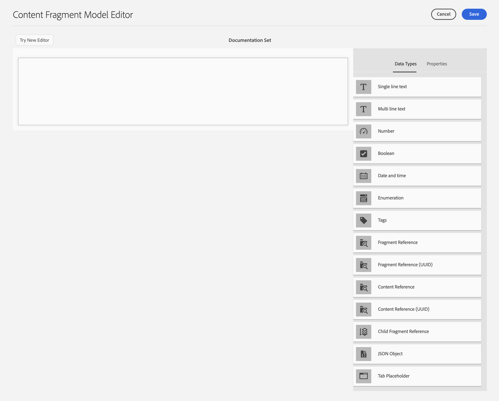
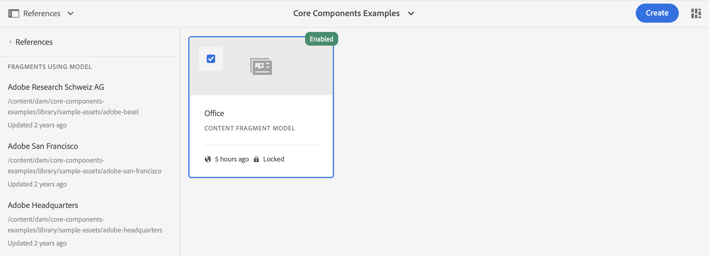

# Modelos de fragmento de contenido {#content-fragment-models}

Los modelos de fragmentos de contenido de AEM definen la estructura del contenido de sus [fragmentos de contenido](/help/assets/content-fragments/content-fragments.md), y sirven como base del contenido sin encabezado.

Para usar modelos de fragmentos de contenido, haga lo siguiente:

1. [Habilite la funcionalidad de modelos de fragmentos de contenido para la instancia.](/help/assets/content-fragments/content-fragments-configuration-browser.md)
1. [Cree](#creating-a-content-fragment-model) y [configure](#defining-your-content-fragment-model) sus modelos de fragmentos de contenido.
1. [Habilite los modelos de fragmento de contenido](#enabling-disabling-a-content-fragment-model) para usar al crear fragmentos de contenido
1. [Permita los modelos de fragmentos de contenido en las carpetas de recursos necesarias](#allowing-content-fragment-models-assets-folder) configurando **Políticas**.

>[!NOTE]
>
>Los fragmentos de contenido son una función de Sites, pero se almacenan como **Assets**.
>
>Los fragmentos de contenido y los modelos de fragmentos de contenido ahora se administran principalmente con la consola **[Fragmentos de contenido](/help/sites-cloud/administering/content-fragments/overview.md#content-fragments-console)**, aunque los fragmentos de contenido se pueden administrar desde la consola **Assets** y los modelos de fragmentos de contenido desde la consola **Herramientas**. Esta sección cubre la administración desde las consolas **Assets** y **Herramientas**.

>[!NOTE]
>
>Si se creó un modelo con el [nuevo editor de modelos](/help/sites-cloud/administering/content-fragments/content-fragment-models.md), siempre debe usar ese editor para el modelo.
>
>Si a continuación abre el modelo con este editor de modelos (original), verá el mensaje:
>
>* &quot;Este modelo tiene configurado un esquema de IU personalizado. Es posible que el orden de los campos mostrados en esta interfaz de usuario no coincida con el esquema de la interfaz de usuario. Para ver los campos alineados con el esquema de la interfaz de usuario, debe cambiar al nuevo Editor de fragmentos de contenido&quot;.

## Creación de un modelo de fragmento de contenido {#creating-a-content-fragment-model}

1. Vaya a **Herramientas**, **General** y, a continuación, abra **Modelos de fragmentos de contenido**.
1. Vaya a la carpeta adecuada para su [configuración o subconfiguración](/help/assets/content-fragments/content-fragments-configuration-browser.md).
1. Use **Crear** para abrir el asistente.

   >[!CAUTION]
   >
   >Si [no se ha habilitado el uso de modelos de fragmentos de contenido](/help/assets/content-fragments/content-fragments-configuration-browser.md), la opción **Crear** no estará disponible.

1. Especifique **Título de modelo**.
También puede definir varias propiedades; por ejemplo, agregar **Etiquetas**, una **Descripción** y seleccionar **Habilitar modelo** para [habilitar el modelo](#enabling-disabling-a-content-fragment-model) si es necesario.

   >[!NOTE]
   >
   >Para obtener más información acerca del **Patrón de URL de vista previa predeterminado**, consulte [Modelo de fragmento de contenido: propiedades](#content-fragment-model-properties).

   

1. Use **Crear** para guardar el modelo vacío. Un mensaje indica el éxito de la acción. Puede seleccionar **Abrir** para editar de inmediato el modelo o **Listo** para volver a la consola.

## Definición del modelo de fragmento de contenido {#defining-your-content-fragment-model}

El modelo de fragmento de contenido define de manera efectiva la estructura de los fragmentos de contenido resultantes mediante una selección de **[Tipos de datos](#data-types)**. Con el editor de modelos puede añadir instancias de los tipos de datos y, a continuación, configurarlos para crear los campos obligatorios.

>[!CAUTION]
>
>Editar un modelo de fragmento de contenido existente puede afectar a los fragmentos dependientes.

1. Vaya a **Herramientas**, **General** y, a continuación, abra **Modelos de fragmentos de contenido**.

1. Vaya a la carpeta que contiene el modelo de fragmento de contenido.
1. Abra el modelo necesario para **Editar**; utilice la acción rápida o seleccione el modelo y, después, la acción en la barra de herramientas.

   Una vez abierto, el editor de modelos muestra lo siguiente:

   * A la izquierda: los campos ya definidos.
   * A la derecha: los **Tipos de datos** disponibles para crear campos (y **Propiedades** para su uso una vez creados los campos)
   * superior: una opción para probar [el nuevo editor](/help/sites-cloud/administering/content-fragments/content-fragment-models.md)

   >[!NOTE]
   >
   >Cuando un campo es **Obligatorio**, la **Etiqueta** indicada en el panel izquierdo se marca con un asterisco (**&#42;**).



1. **Adición de un campo**

   * Arrastre un tipo de datos requerido a la ubicación requerida para un campo.

     

   * Una vez añadido un campo al modelo, el panel derecho mostrará las **Propiedades** que se pueden definir para ese tipo de datos en particular. Aquí puede definir lo que se requiere para ese campo.

      * Muchas propiedades se explican por sí mismas; para obtener más información, consulte [Propiedades](#properties).
      * Escribir una **Etiqueta de campo** autocompletará el **Nombre de propiedad** si está vacío, y se puede actualizar de forma manual más tarde.

        >[!CAUTION]
        >
        >Al actualizar de forma manual la propiedad **Nombre de propiedad** para un tipo de datos, tenga en cuenta que los nombres solo deben contener caracteres latinos, dígitos numéricos y guiones bajos “_” como carácter especial.
        >
        >Si los modelos creados en versiones anteriores de AEM contienen caracteres no permitidos, elimínelos o actualícelos.

     Por ejemplo:

     

1. **Eliminación de un campo**

   Seleccione el campo requerido y, a continuación, seleccione el icono de la papelera. Se le solicitará que confirme la acción.

   

1. Añada todos los campos obligatorios y defina las propiedades relacionadas, según sea necesario. Por ejemplo:

   

1. Seleccione **Guardar** para mantener la definición.

## Tipos de datos {#data-types}

Hay disponible una selección de tipos de datos para definir el modelo:

* **Texto de línea única**
   * Agregue un campo para una sola línea de texto; se puede definir la longitud máxima
   * El campo se puede configurar para permitir que los autores de fragmentos creen nuevas instancias del campo

* **Texto multilínea**
   * Un área de texto que puede ser Texto enriquecido, Texto sin formato o Markdown
   * El campo se puede configurar para permitir que los autores de fragmentos creen nuevas instancias del campo

  >[!NOTE]
  >
  >Si el área de texto es Texto enriquecido, Texto sin formato o Markdown, se define en el modelo mediante la propiedad **Tipo predeterminado**.
  >
  >Este formato no se puede cambiar desde el [editor de fragmentos de contenido](/help/sites-cloud/administering/content-fragments/authoring.md), sino solamente desde el modelo.

* **Número**
   * Añadir un campo numérico
   * El campo se puede configurar para permitir que los autores de fragmentos creen nuevas instancias del campo

* **Booleana**
   * Adición de una casilla de verificación booleana

* **Fecha y hora**
   * Adición de un campo de fecha u hora

* **Enumeración**
   * Agregar un conjunto de campos de casilla de verificación, botones de opción o desplegables
      * Puede especificar las opciones disponibles para el autor del fragmento

* **Etiquetas**
   * Permite a los autores de fragmentos acceder y seleccionar áreas de etiquetas

* **Referencia al fragmento**
   * Referencias a otros fragmentos de contenido; se pueden usar para [crear contenido anidado](#using-references-to-form-nested-content)
   * El tipo de datos se puede configurar para que los autores de fragmentos puedan hacer lo siguiente:
      * Editar directamente el fragmento al que se hace referencia.
      * Crear un nuevo fragmento de contenido basado en el modelo adecuado
      * Crear nuevas instancias del campo
   * La referencia especifica la ruta al recurso al que se hace referencia; por ejemplo `/content/dam/path/to/resource`

* **Referencia de fragmento (UUID)**
   * Referencias a otros fragmentos de contenido; se pueden usar para [crear contenido anidado](#using-references-to-form-nested-content)
   * El tipo de datos se puede configurar para que los autores de fragmentos puedan hacer lo siguiente:
      * Editar directamente el fragmento al que se hace referencia.
      * Crear un nuevo fragmento de contenido basado en el modelo adecuado
      * Crear nuevas instancias del campo
   * En el editor, las referencia especifica la ruta al recurso al que se hace referencia; internamente, la referencia se mantiene como ID único universal (UUID) que hace referencia al recurso
      * No es necesario conocer el UUID; en el editor de fragmentos puede buscar el fragmento requerido

  >[!NOTE]
  >
  >Los UUID son específicos del repositorio. Si usa la [herramienta de copia de contenido](/help/implementing/developing/tools/content-copy.md) para copiar fragmentos de contenido, los UUID se recalcularán en el entorno de destino.

* **Referencia de contenido**
   * Referencias a otros contenidos, de cualquier tipo; se pueden usar para [crear contenido anidado](#using-references-to-form-nested-content)
   * Si se hace referencia a una imagen, puede optar por mostrar una miniatura
   * El campo se puede configurar para permitir que los autores de fragmentos creen nuevas instancias del campo
   * La referencia especifica la ruta al recurso al que se hace referencia; por ejemplo `/content/dam/path/to/resource`

* **Referencia de contenido (UUID)**
   * Referencias a otros contenidos, de cualquier tipo; se pueden usar para [crear contenido anidado](#using-references-to-form-nested-content)
   * Si se hace referencia a una imagen, puede optar por mostrar una miniatura
   * El campo se puede configurar para permitir que los autores de fragmentos creen nuevas instancias del campo
   * En el editor, las referencia especifica la ruta al recurso al que se hace referencia; internamente, la referencia se mantiene como ID único universal (UUID) que hace referencia al recurso
      * No necesita conocer el UUID; en el editor de fragmentos puede navegar hasta el recurso de recurso requerido

  >[!NOTE]
  >
  >Los UUID son específicos del repositorio. Si usa la [herramienta de copia de contenido](/help/implementing/developing/tools/content-copy.md) para copiar fragmentos de contenido, los UUID se recalcularán en el entorno de destino.

* **Objeto JSON**
   * Permite al autor del fragmento de contenido introducir la sintaxis JSON en los elementos correspondientes de un fragmento.
      * Para permitir que AEM almacene el JSON directo que ha copiado/pegado desde otro servicio.
      * El JSON se pasará y se emitirá como JSON en GraphQL.
      * Incluye resaltado de sintaxis JSON, autocompletado y resaltado de errores en el editor de fragmentos de contenido.

* **Marcador de posición de pestaña**
   * Permite la introducción de pestañas para utilizarlas al editar el contenido del fragmento de contenido.
      * Se muestran como divisores en el editor de modelos, que separan las secciones de la lista de tipos de datos de contenido. Cada instancia representa el inicio de una nueva pestaña.
      * En el editor de fragmentos, cada instancia aparece como una pestaña.

     >[!NOTE]
     >
     >Este tipo de datos se utiliza exclusivamente para dar formato; el esquema AEM GraphQL lo ignora.

## Propiedades {#properties}

Muchas propiedades se explican por sí mismas; para otras, a continuación se proporcionan detalles adicionales:

* **Nombre de propiedad**

  Cuando actualice manualmente esta propiedad para un tipo de datos, tenga en cuenta que los nombres **deben** contener *solo* caracteres latinos, dígitos numéricos y guiones bajos “_” como carácter especial.

  >[!CAUTION]
  >
  >Si los modelos creados en versiones anteriores de AEM contienen caracteres no permitidos, elimínelos o actualícelos.

* **Representar como**
Las distintas opciones para realizar/procesar el campo en un fragmento. A menudo, esta propiedad permite definir si el autor ve una sola instancia del campo o si se le permite crear varias instancias. Cuando se usa **Campo múltiple**, puede definir el número mínimo y máximo de elementos; consulte [Validación](#validation) para obtener más información.

* **Etiqueta de campo**
Si se introduce una **Etiqueta de campo**, se generará automáticamente un **Nombre de propiedad**, que se puede actualizar de forma manual si es necesario.

* **Validación**
La validación básica está disponible mediante mecanismos como la propiedad **Requerido**. Algunos tipos de datos tienen campos de validación adicionales. Consulte [Validación](#validation) para obtener más información.

* Para el tipo de datos **Texto multilínea** es posible definir el **tipo predeterminado** como el siguiente:

   * **Texto enriquecido**
   * **Markdown**
   * **Texto sin formato**

  Si no se especifica, el valor predeterminado **Texto enriquecido** es el empleado para este campo.

  Cambiar el **tipo predeterminado** en un modelo de fragmento de contenido solo surtirá efecto en un fragmento de contenido existente relacionado después de que dicho fragmento se abra en el editor y se guarde.

* **Único**
El contenido (para el campo específico) debe ser único en todos los fragmentos de contenido creados a partir del modelo actual.

  Se utiliza para garantizar que los autores de contenido no puedan repetir el contenido ya añadido en otro fragmento del mismo modelo.

  Por ejemplo, un campo de **Texto de una sola línea** llamado `Country` en el modelo de fragmentos de contenido no puede tener el valor `Japan` en dos fragmentos de contenido dependientes. Se emitirá una advertencia cuando se intente la segunda instancia.

  >[!NOTE]
  >
  >La unicidad se garantiza por cada raíz de idioma.

  >[!NOTE]
  >
  >Las variaciones pueden tener el mismo valor *único* como variaciones del mismo fragmento, pero no del mismo valor que se utiliza en cualquier variación de otros fragmentos.

  >[!CAUTION]
  >
  >Si desea utilizar MSM (que crea copias de fragmentos de contenido), cualquier restricción **Unique** debe eliminarse de cualquier tipo de datos utilizado en los respectivos modelos de fragmentos de contenido.

* Consulte **[Referencia de contenido](#content-reference)** para obtener más información acerca de ese tipo de datos específico y sus propiedades.

* Consulte **[Referencia a fragmento (fragmentos anidados)](#fragment-reference-nested-fragments)** para obtener más información acerca de ese tipo de datos específico y sus propiedades.

* **Traducible**

  Marcar la casilla de verificación **Traducible** en un campo del editor de modelos de fragmentos de contenido provocará lo siguiente:

   * Asegurará que el nombre de propiedad del campo se añade a la configuración de traducción y contexto `/content/dam/<sites-configuration>`, si no están presentes.
   * Para GraphQL: establecerá una propiedad `<translatable>` en el campo Fragmento de contenido en `yes`, para permitir que la consulta GraphQL filtre la salida JSON solo con contenido traducible.

## Validación {#validation}

Varios tipos de datos ahora incluyen la posibilidad de definir los requisitos de validación cuando el contenido se introduce en el fragmento resultante:

* **Texto de línea única**
   * Compare con un regex predefinido.
* **Número**
   * Compruebe si hay valores específicos.
* **Referencia de contenido**
   * Pruebe tipos de contenido específicos.
   * Solo se puede hacer referencia a los recursos con un tamaño de archivo especificado o más pequeño.
   * Solo se puede hacer referencia a las imágenes con un intervalo predefinido de anchura o altura (en píxeles).
* **Referencia a fragmento**
   * Pruebe un modelo de fragmento de contenido específico.
* **Número mínimo de elementos** / **Número máximo de elementos**

  Los campos que se han definido como un **campo múltiple** (configurado con **Procesar como**) tienen las opciones:

   * **Número mínimo de elementos**
   * **Número máximo de elementos**

  Estos se validan:

   * El valor máximo se valida en el [editor de fragmentos de contenido original](/help/assets/content-fragments/content-fragments-variations.md).
   * Ambos se validan en el [Editor de fragmentos de contenido](/help/sites-cloud/administering/content-fragments/authoring.md).

## Uso de referencias para formar contenido anidado {#using-references-to-form-nested-content}

Los fragmentos de contenido pueden formar contenido anidado mediante cualquiera de los siguientes tipos de datos:

* [Referencia de contenido](#content-reference)
   * Proporciona una sencilla referencia a otro contenido; de cualquier tipo.
   * Proporcionado por los tipos de datos:
      * **Referencia de contenido** - basado en ruta
      * **Referencia de contenido (UUID)** - basada en UUID
   * Se puede configurar para una o varias referencias (en el fragmento resultante).

* [Referencia a fragmento](#fragment-reference-nested-fragments) (fragmentos anidados)
   * Hace referencia a otros fragmentos, según los modelos específicos definidos.
   * Proporcionado por los tipos de datos:
      * **Referencia de fragmento** - basado en ruta
      * **Referencia de fragmento (UUID)** - basado en UUID
   * Permite incluir o recuperar datos estructurados.

     >[!NOTE]
     >
     >Este método es de particular interés cuando se usa [Entrega de contenido sin encabezado mediante fragmentos de contenido con GraphQL](/help/sites-cloud/administering/content-fragments/content-delivery-with-graphql.md).

   * Se puede configurar para una o varias referencias (en el fragmento resultante).

>[!NOTE]
>
>Consulte [Actualizar los fragmentos de contenido para referencias de UUID](/help/headless/graphql-api/uuid-reference-upgrade.md) para obtener más información sobre las referencias de contenido/fragmento y las referencias de contenido/fragmento (UUID), y actualizar a los tipos de datos basados en UUID.

>[!NOTE]
>
>AEM tiene una protección contra la periodicidad para lo siguiente:
>
>* Referencias de contenido
>  &#x200B;>  Esto evita que el usuario agregue una referencia al fragmento actual. Esto puede dar lugar a un cuadro de diálogo vacío del selector de referencia a fragmento.
>
>* Referencias a fragmento en GraphQL
>  &#x200B;>  Si crea una consulta profunda que devuelve varios fragmentos de contenido referenciados entre sí, devolverá un valor nulo en la primera ocurrencia.

### Referencia de contenido {#content-reference}

Los tipos de datos **Referencia de contenido** y **Referencia de contenido (UUID)** le permiten procesar contenido de otra fuente; por ejemplo, imagen, página o Fragmento de experiencia.

Además de las propiedades estándar, puede especificar las siguentes:

* La **Ruta raíz** para cualquier contenido referenciado
* Los tipos de contenido a los que se puede hacer referencia
* Las limitaciones de los tamaños de archivo
* Si se hace referencia a una imagen:
   * Mostrar miniatura
   * Restricciones de imagen de altura y anchura


### Referencia a fragmento (fragmentos anidados) {#fragment-reference-nested-fragments}

Los tipos de datos **Referencia de fragmento** y **Referencia de fragmento (UUID)** pueden hacer referencia a uno o más fragmentos de contenido. Esta función es de especial interés cuando se recupera contenido para utilizarlo en la aplicación, ya que le permite recuperar datos estructurados con varias capas.

Por ejemplo:

* Un modelo que define los detalles de un empleado, entre los que se incluyen:
   * Una referencia al modelo que define al empleador (compañía).

```xml
type EmployeeModel {
    name: String
    firstName: String
    company: CompanyModel
}

type CompanyModel {
    name: String
    street: String
    city: String
}
```

>[!NOTE]
>
>Esto reviste especial interés en conjunción con la [Entrega de contenido sin encabezado mediante fragmentos de contenido con GraphQL](/help/assets/content-fragments/content-fragments-graphql.md).

Además de las propiedades estándar, puede definir las siguientes:

* **Procesar como**:

   * **Multicampo**: el autor del fragmento puede crear varias referencias individuales.

   * **fragmentreference**: permite al autor del fragmento seleccionar una sola referencia a un fragmento.

* **Tipo de modelo:**
sueden seleccionar varios modelos. Al crear el fragmento de contenido, se debe haber creado cualquier fragmento referenciado mediante estos modelos.

* **Ruta raíz:**
Esto especifica una ruta raíz para los fragmentos a los que se hace referencia.

* **Permitir creación de fragmentos**

  Esto permite al autor del fragmento crear un fragmento basado en el modelo adecuado.

   * **fragmentreferencecomposite**: permite al autor del fragmento crear un compuesto seleccionando varios fragmentos.

  

>[!NOTE]
>
>Existe un mecanismo de protección contra la periodicidad. Prohíbe que el usuario seleccione el fragmento de contenido actual en la Referencia a fragmento. Esto puede dar lugar a un cuadro de diálogo vacío del selector de referencia a fragmento.
>
>También existe una protección contra la periodicidad para las referencias a fragmento en GraphQL. Si crea una consulta profunda en dos fragmentos de contenido que se hacen referencia entre sí, devolverá un valor nulo.

## Modelo de fragmento de contenido: propiedades {#content-fragment-model-properties}

Puede editar las **Propiedades** de un modelo de fragmento de contenido:

* **Básico**
   * **Título de modelo**
   * **Etiquetas**
   * **Descripción**
   * **Cargar imagen**
   * **Patrón de URL de vista previa predeterminado**

     >[!NOTE]
     >
     >Esto solo lo usa el *nuevo* editor de fragmentos de contenido. Consulte [Modelos de fragmento de contenido](/help/sites-cloud/administering/content-fragments/content-fragment-models.md#content-fragment-model-properties) para obtener más información.


## Habilitación o deshabilitación de un modelo de fragmento de contenido {#enabling-disabling-a-content-fragment-model}

Para tener un control total sobre el uso de los modelos de fragmentos de contenido, estos tienen un estado que puede configurar.

### Habilitación de un modelo de fragmento de contenido {#enabling-a-content-fragment-model}

Cuando se crea un modelo, debe habilitarse para que:

* Está disponible para su selección al crear un fragmento de contenido.
* Se pueda hacer referencia a él desde un modelo de fragmento de contenido.
* Esté disponible para GraphQL y por lo tanto, se genere el esquema.

Para habilitar un modelo marcado como lo siguiente:

* **Borrador**: nuevo (nunca habilitado).
* **Desactivado**: se ha deshabilitado específicamente.

Utilice la opción **Habilitar** desde:

* La barra de herramientas superior, cuando se selecciona el Modelo requerido.
* La Acción rápida correspondiente (pase el ratón sobre el Modelo requerido).


### Desactivación de un modelo de fragmento de contenido {#disabling-a-content-fragment-model}

Un modelo también se puede desactivar para que:

* El modelo ya no esté disponible como base para la creación de *nuevos* fragmentos de contenido.
* Sin embargo:
   * El esquema de GraphQL se siga generando y aún se pueda consultar (para evitar afectar a la API de JSON).
   * Cualquier fragmento de contenido basado en el modelo se puede consultar y devolver desde el extremo de GraphQL.
* Ya no se puede hacer referencia al modelo, pero las referencias existentes no se tocan y aún se pueden consultar y devolver desde el extremo GraphQL.

Para desactivar un modelo marcado como **Habilitado** utilice la opción **Deshabilitar** desde:

* La barra de herramientas superior, cuando se selecciona el Modelo requerido.
* La Acción rápida correspondiente (pase el ratón sobre el Modelo requerido).


## Permitir modelos de fragmento de contenido en la carpeta de recursos {#allowing-content-fragment-models-assets-folder}

Para implementar el control de contenido, puede configurar las **Directivas** en la carpeta Recursos para controlar qué modelos de fragmento de contenido están permitidos para la creación de fragmentos en esa carpeta.

>[!NOTE]
>
>El mecanismo es similar a [permitir plantillas de página](/help/sites-cloud/authoring/page-editor/templates.md#allowing-a-template-author) para una página, y sus elementos secundarios, en propiedades avanzadas de una página.

Para configurar las **Directivas** para **Modelos de fragmento de contenido permitidos**:

1. Navegar y abrir **Propiedades** para la carpeta de recursos necesaria.

1. Abra la pestaña **Directivas**, donde puede configurar lo siguiente:

   * **Heredado de`<folder>`**

     Las directivas se heredan automáticamente al crear nuevas carpetas secundarias; la directiva se puede reconfigurar (y la herencia se rompe) si las subcarpetas necesitan permitir modelos diferentes de la carpeta principal.

   * **Modelos de fragmento de contenido permitidos por ruta**

     Se pueden permitir varios modelos.

   * **Modelos de fragmento de contenido permitidos por etiquetas**

     Se pueden permitir varios modelos.

   

1. **Guardar** cualquier cambio.

Los modelos de fragmento de contenido permitidos para una carpeta se resuelven de la siguiente manera:

* Las **Directivas** para los **Modelos de fragmento de contenido permitidos**.
* Si está vacío, intente determinar la directiva utilizando las reglas de herencia.
* Si la cadena de herencia no proporciona un resultado, consulte la configuración de **Cloud Services** para esa carpeta (primero directamente y luego mediante herencia).
* Si ninguno de los anteriores proporciona ningún resultado, no hay modelos permitidos para esa carpeta.

## Eliminación de un modelo de fragmento de contenido {#deleting-a-content-fragment-model}

>[!CAUTION]
>
>La eliminación de un modelo de fragmento de contenido puede afectar a los fragmentos dependientes.

Para eliminar un modelo de fragmento de contenido, haga lo siguiente:

1. Vaya a **Herramientas**, **General** y, a continuación, abra **Modelos de fragmento de contenido**.

1. Vaya a la carpeta que contiene el modelo de fragmento de contenido.
1. Seleccione el modelo, seguido de **Eliminar** en la barra de herramientas.

   >[!NOTE]
   >
   >Si se hace referencia al modelo, se envía una advertencia. Tome las medidas adecuadas.

## Publicación de un modelo de fragmento de contenido {#publishing-a-content-fragment-model}

Los modelos de fragmento de contenido deben publicarse cuando se publican fragmentos de contenido dependientes, o antes de hacerlo.

Para publicar un modelo de fragmento de contenido, haga lo siguiente:

1. Vaya a **Herramientas**, **General** y, a continuación, abra **Modelos de fragmento de contenido**.

1. Vaya a la carpeta que contiene el modelo de fragmento de contenido.
1. Seleccione el modelo, seguido de **Publicación** en la barra de herramientas.
El estado publicado se indica en la consola.

   >[!NOTE]
   >
   >Si publica un fragmento de contenido para el que el modelo aún no se ha publicado, la lista de selección lo indica y el modelo se publica con el fragmento.

## Cancelación de la publicación de un modelo de fragmento de contenido {#unpublishing-a-content-fragment-model}

Los modelos de fragmento de contenido se pueden cancelar si ningún fragmento hace referencia a ellos.

Para cancelar la publicación de un modelo de fragmento de contenido:

1. Vaya a **Herramientas**, **General** y, a continuación, abra **Modelos de fragmento de contenido**.

1. Vaya a la carpeta que contiene el modelo de fragmento de contenido.
1. Seleccione el modelo, seguido de **Cancelar la publicación** en la barra de herramientas.
El estado publicado se indica en la consola.

Si intenta cancelar la publicación de un modelo que actualmente utiliza uno o varios fragmentos, una advertencia de error le informará de lo siguiente:


El mensaje le sugerirá que compruebe el panel [Referencias](/help/sites-cloud/authoring/basic-handling.md#references) para investigar más a fondo:



## Modelos de fragmento de contenido bloqueados (publicados) {#locked-published-content-fragment-models}

Esta funcionalidad proporciona control para los modelos de fragmento de contenido que se han publicado.

### Desafíos {#the-challenge}

* Los modelos de fragmentos de contenido determinan el esquema de las consultas de GraphQL en AEM.

   * Los esquemas de GraphQL de AEM se crean en cuanto se genera un modelo de fragmento de contenido y pueden existir en entornos de creación y publicación.

   * Los esquemas en la publicación son los más críticos, ya que proporcionan la base para la entrega en directo de contenido de fragmento de contenido en formato JSON.

* Pueden producirse problemas cuando se modifican los modelos de fragmento de contenido o, dicho de otro modo, se editan. Esto significa que el esquema cambia, lo que a su vez puede afectar a las consultas de GraphQL existentes.

* La adición de nuevos campos a un modelo de fragmento de contenido no debería (normalmente) tener ningún efecto perjudicial. Sin embargo, si se modifican los campos de datos existentes (por ejemplo, su nombre) o se eliminan las definiciones de campos, las consultas de GraphQL existentes se romperán al solicitar estos campos.

### Requisitos {#the-requirements}

* Para concienciar a los usuarios sobre los riesgos que se plantean al editar modelos que ya se utilizan para la entrega de contenido en directo; es decir, modelos que se han publicado.

* Además, para evitar cambios no deseados.

Cualquiera de estos factores podría generar consultas si se vuelven a publicar los modelos modificados.

### Solución {#the-solution}

Para solucionar estos problemas, los modelos de fragmentos de contenido son *bloqueados* en modo de SOLO LECTURA en el autor, tan pronto como se hayan publicado. Esto se indica mediante **Bloqueado**:


Cuando el modelo es **Bloqueado** (en modo de SOLO LECTURA), puede ver el contenido y la estructura de los modelos, pero no puede editarlos.

Puede administrar modelos **Bloqueados** desde la consola o desde el editor de modelos:

* Consola

  Desde la consola, puede administrar el modo de SOLO LECTURA con las acciones **Desbloquear** y **Bloqueo** de la barra de herramientas:

  

   * Puede **Desbloquear** un modelo para habilitar las ediciones.

     Si selecciona **Desbloquear**, se mostrará una advertencia, y debe confirmar la acción **Desbloquear**:
     

     A continuación, puede abrir el modelo para editarlo.

   * También puede **Bloquear** el modelo después.
   * Volver a publicar el modelo inmediatamente lo volverá a poner en modo **Bloqueado** (SOLO LECTURA).

* Editor de modelo

   * Al abrir un modelo bloqueado, se le avisará y se le presentarán tres acciones: **Cancelar**, **Ver solo lectura**, **Editar**:

     

   * Si selecciona **Ver solo lectura** puede ver el contenido y la estructura del modelo.

     

   * Si selecciona **Editar** puede editar y guardar las actualizaciones:

     

     >[!NOTE]
     >
     >Puede que todavía haya una advertencia en la parte superior, pero es cuando el modelo ya está siendo utilizado por fragmentos de contenido existentes.

   * **Cancelar** lo lleva nuevamente a la consola.
