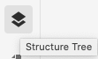
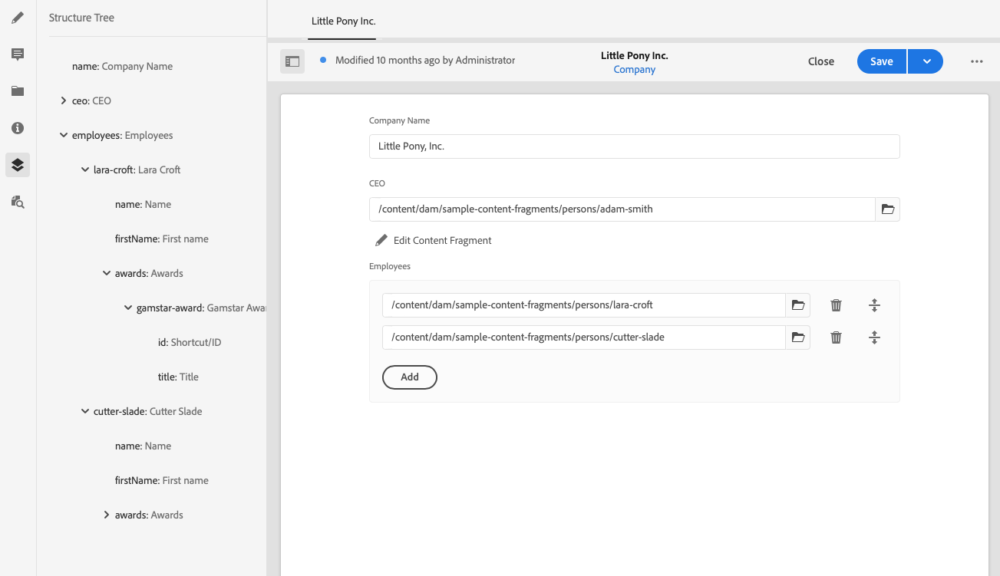

# Árbol de estructura de fragmento de contenido {#content-fragment-structure-tree}

Utilice la función Árbol de estructura del Editor de fragmentos de contenido en AEM para comprender mejor el contenido, especialmente para la entrega sin encabezado.

>[!NOTE]
>
>Los fragmentos de contenido son una función de Sites, pero se almacenan como **Assets**.
>
>Existen dos editores para crear fragmentos de contenido; aunque la funcionalidad básica es la misma, existen algunas diferencias. Esta sección trata sobre el editor original, al que se accede principalmente desde la consola **Assets**. Consulte la documentación de Sites, [Fragmentos de contenido: creación](/help/sites-cloud/administering/content-fragments/authoring.md), para obtener detalles del nuevo editor (al que se accede principalmente desde la consola **Fragmentos de contenido**).

En el Editor de fragmentos de contenido puede seleccionar el icono Árbol de estructura:

Esto abre una representación de la estructura del fragmento en el panel izquierdo. Con esta opción puede navegar hasta los fragmentos a los que se hace referencia y acceder a ellos. Al seleccionar una referencia, se abre ese fragmento para editarlo.

>[!NOTE]
>
>Con las rutas de exploración del panel principal, puede volver al punto de inicio.

