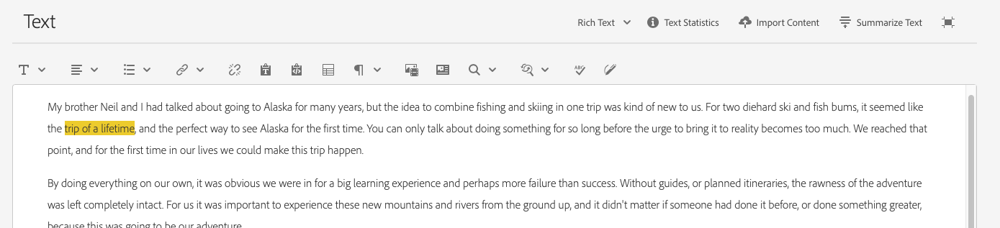

# Variaciones: Crear contenido de fragmentos{#variations-authoring-fragment-content}

<!--
>[!CAUTION]
>
>Certain features for Content Fragments will be released in early 2021.
>
>The related documentation is already available for preview purposes.
>
>Please see the [Release Notes](/help/release-notes/release-notes-cloud/release-notes-current.md) for further details.
-->

[Las ](/help/assets/content-fragments/content-fragments.md#constituent-parts-of-a-content-fragment) variaciones son una característica importante de los fragmentos de contenido, ya que permiten crear y editar copias del contenido principal para utilizarlas en canales o escenarios específicos.

Desde la ficha **Variaciones** puede:

* [Introduzca el ](#authoring-your-content) contenido del fragmento,
* [Cree y gestione ](#managing-variations) variaciones del  **** contenido principal,
* Consulte el nombre del [Modelo de fragmento de contenido](/help/assets/content-fragments/content-fragments-models.md) que se utilizó para crear el fragmento; se muestra en la barra de herramientas superior, bajo el nombre del fragmento.

Realizar una serie de otras acciones en función del tipo de datos que se esté editando; por ejemplo:

* [Insertar recursos visuales en el fragmento](#inserting-assets-into-your-fragment)  (imágenes)

* Seleccione entre [Texto enriquecido](#rich-text), [Texto sin formato](#plain-text) y [Markdown](#markdown) para editarlo

* [Cargar contenido](#uploading-content)

* [Estadísticas](#viewing-key-statistics)  de clave de vista (acerca de texto multilínea)

* [Resumir texto](#summarizing-text)

* [Sincronizar variaciones con contenido principal](#synchronizing-with-master)

>[!CAUTION]
>
>Después de publicar un fragmento o de hacer referencia a él, AEM mostrará una advertencia cuando un autor abra el fragmento para editarlo de nuevo. Esto sirve para advertir que los cambios en el fragmento también afectarán a las páginas a las que se hace referencia.

## Creación de contenido {#authoring-your-content}

Cuando abra el fragmento de contenido para editarlo, la ficha **Variaciones** se abrirá de forma predeterminada. Aquí puede crear el contenido, para el formato principal o cualquier variación que tenga. El fragmento estructurado contiene varios campos, de varios tipos de datos, que se definieron en el modelo de contenido.

Puede hacer lo siguiente:

* realice ediciones directamente en la ficha **Variaciones**

   * cada tipo de datos ofrece diferentes opciones de edición

* para los campos **Texto de varias líneas** también puede abrir el [editor de pantalla completa](#full-screen-editor) para:

   * seleccione el [Formato](#formats)
   * consulte más opciones de edición (para formato [Texto enriquecido](#rich-text))
   * acceder a un rango de [acciones](#actions)

<!--
For example:

-->

### Editor de pantalla completa {#full-screen-editor}

Al editar un campo de texto de varias líneas, puede abrir el editor de pantalla completa; toque o haga clic en el texto real y, a continuación, seleccione el siguiente icono de acción:

<!--
This will open the full screen text editor:

-->

El editor de texto de pantalla completa proporciona:

* Acceso a varias [acciones](#actions)
* Según el [formato](#formats), opciones de formato adicionales ([Texto enriquecido](#rich-text))

### Acciones {#actions}

También están disponibles las siguientes acciones (para todos los formatos ) cuando está abierto el editor de pantalla completa (es decir, texto multilínea):

* Seleccione el [formato](#formats) ([texto enriquecido](#rich-text), [texto sin formato,](#plain-text) [Markdown](#markdown))

* [Cargar contenido](#uploading-content)

* [Mostrar estadísticas de texto](#viewing-key-statistics)

* [Sincronizar con formato principal](#synchronizing-with-master)  (al editar una variación)

* [Resumir texto](#summarizing-text)

### Formatos {#formats}

Las opciones para editar texto multilínea dependen del formato seleccionado:

* [Texto enriquecido](#rich-text)
* [Texto sin formato](#plain-text)
* [Markdown](#markdown)

El formato se puede seleccionar cuando el editor de pantalla completa.

### Texto enriquecido {#rich-text}

La edición de texto enriquecido le permite dar formato:

* Negrita
* Cursiva
* Subrayado
* Alineación: izquierda, centro, derecha
* Lista con viñetas
* Lista numerada
* Sangría: aumentar, disminuir
* Crear/romper hipervínculos
* Pegar texto/desde Word
* Insertar una tabla
* Estilo de párrafo: Párrafo, Encabezado 1/2/3
* [Insertar recurso](#inserting-assets-into-your-fragment)
* Abra el editor de pantalla completa, donde están disponibles las siguientes opciones de formato:
   * Búsqueda  
   * Buscar/Reemplazar
   * Corrector ortográfico
   * [Anotaciones](/help/assets/content-fragments/content-fragments-variations.md#annotating-a-content-fragment)

<!--
* [Insert Content Fragment](#inserting-content-fragment-into-your-fragment)
-->

También se puede acceder a las [acciones](#actions) desde el editor de pantalla completa.

### Texto sin formato {#plain-text}

El texto sin formato permite una rápida entrada de contenido sin formato ni información de marcas. También puede abrir el editor en pantalla completa para más [acciones](#actions).

>[!CAUTION]
>
>Si selecciona **Texto sin formato**, puede perder cualquier formato, marca o recurso que haya insertado en **Texto enriquecido** o **Marcado**.

### Markdown {#markdown}

>[!NOTE]
>
>Para obtener más información, consulte la documentación de [Markdown](/help/assets/content-fragments/content-fragments-markdown.md).

Esto le permite dar formato al texto mediante el uso de la marca. Puede definir:

* Encabezados
* Párrafos y saltos de línea
* Vínculos
* Imágenes
* Bloquear cotizaciones
* Listas
* Énfasis
* Bloques de código
* Escapes de barra invertida

También puede abrir el editor en pantalla completa para más [acciones](#actions).

>[!CAUTION]
>
>Si cambia entre **Texto enriquecido** y **Marcado**, puede que se produzcan efectos inesperados con Comillas de bloque y Bloques de código, ya que estos dos formatos pueden tener diferencias en la forma en que se gestionan.

<!--
### Fragment References {#fragment-references}

If the Content Fragment Model contains Fragment References, your fragment authors may have additional options:

* [Edit Content Fragment](#fragment-references-edit-content-fragment)
* [New Content Fragment](#fragment-references-new-content-fragment)

#### Edit Content Fragment {#fragment-references-edit-content-fragment}

The option **Edit Content Fragment** will open
a new browser tab, with the content fragment open in the content fragment editor.

#### New Content Fragment {#fragment-references-new-content-fragment}

The option **New Content Fragment** will allow you to create a completely new fragment. To achieve this a variation of the create content fragment wizard will open in the editor. 

You will then be able to create a new fragment by:

1. Navigating to, and selecting the required folder.
1. Selecting **Next**.
1. Specifying properties; for example **Title**.
1. Selecting **Create**.
1. Finally:
   1. **Done** will return (to the original fragment) and reference the new fragment.
   1. **Open** will reference the new fragment as well as opening the new fragment, for editing, in a new browser tab.
-->

### Visualización de estadísticas clave {#viewing-key-statistics}

Cuando el editor de pantalla completa está abierto, la acción **Estadísticas de texto** mostrará un rango de información sobre el texto.

Por ejemplo:

### Carga de contenido {#uploading-content}

Para facilitar el proceso de creación de fragmentos de contenido, puede cargar texto, preparado en un editor externo y agregarlo directamente al fragmento.

### Resumiendo texto {#summarizing-text}

El texto de resumen está diseñado para ayudar a los usuarios a reducir la longitud del texto a un número predefinido de palabras, manteniendo al mismo tiempo los puntos clave y el significado general.

>[!NOTE]
>
>A un nivel más técnico, el sistema mantiene las frases que califica como la *mejor relación de densidad de información y singularidad* según algoritmos específicos.

>[!CAUTION]
>
>El fragmento de contenido debe tener una carpeta de idioma válida (código ISO) como antecesor; se utiliza para determinar el modelo de idioma que se va a utilizar.
>
>Por ejemplo, `en/` como en la siguiente ruta:
>
>  `/content/dam/my-brand/en/path-down/my-content-fragment`

>[!CAUTION]
El inglés está disponible de forma predeterminada.
Otros idiomas están disponibles como Paquetes de modelo de idioma en Uso compartido de paquetes:
* [Francés(fr)](https://www.adobeaemcloud.com/content/marketplace/marketplaceProxy.html?packagePath=/content/companies/public/adobe/packages/cq630/product/smartcontent-model-fr)
* [Alemán(de)](https://www.adobeaemcloud.com/content/marketplace/marketplaceProxy.html?packagePath=/content/companies/public/adobe/packages/cq630/product/smartcontent-model-de)
* [Italiano(it)](https://www.adobeaemcloud.com/content/marketplace/marketplaceProxy.html?packagePath=/content/companies/public/adobe/packages/cq630/product/smartcontent-model-it)
* [Español(es)](https://www.adobeaemcloud.com/content/marketplace/marketplaceProxy.html?packagePath=/content/companies/public/adobe/packages/cq630/product/smartcontent-model-es)

1. Seleccione **Maestro** o la variación requerida.
1. Abra el editor de pantalla completa.

1. Seleccione **Resumir texto** en la barra de herramientas.

   

1. Especifique el número de palabras del destinatario y seleccione **Inicio**:
1. El texto original se muestra junto con el resumen propuesto:

   * Las oraciones que se van a eliminar se resaltan en rojo, con huelga.
   * Haga clic en cualquier frase resaltada para mantenerla en el contenido resumido.
   * Haga clic en cualquier frase no resaltada para eliminarla.

1. Seleccione **Resumir** para confirmar los cambios.

<!--
1. The original text is displayed side-by-side with the proposed summarization:

    * Any sentences to be eliminated are highlighted in red, with strike-through.
    * Click on any highlighted sentence to keep it in the summarized content.
    * Click on any non-highlighted sentence to have it eliminated.

   
-->

### Anotación de un fragmento de contenido {#annotating-a-content-fragment}

Para realizar anotaciones en un fragmento:

1. Seleccione **Maestro** o la variación requerida.
1. Abra el editor de pantalla completa.
1. El icono **Anotar** está disponible en la barra de herramientas superior. Puede seleccionar texto si es necesario.

1. Se abrirá un cuadro de diálogo: Aquí puede introducir la anotación.

   

1. Seleccione **Aplicar** en el cuadro de diálogo.

   

   Si la anotación se aplicó al texto seleccionado, el texto permanecerá resaltado.

   

1. Cierre el editor en pantalla completa y las anotaciones se seguirán resaltando. Si se selecciona, se abrirá un cuadro de diálogo para que pueda editar la anotación más adelante.

1. Seleccione **Guardar**.

<!--
1. The **Annotate** icon is available in the top toolbar. You can seelect some text if required.

   
-->

<!--
1. Close the full-screen editor, annotations are still highlighted. If selected, a dialog will open so that you can edit the annotation further.

   

-->

### Visualización, edición y eliminación de anotaciones {#viewing-editing-deleting-annotations}

Anotaciones:

* Se indican mediante el resaltado en el texto, tanto en pantalla completa como en modo normal del editor. Los detalles completos de una anotación se pueden ver, editar y/o eliminar haciendo clic en el texto resaltado, lo que permitirá volver a abrir el cuadro de diálogo.

   >[!NOTE]
   Se proporciona un selector desplegable si se han aplicado varias anotaciones a un fragmento de texto.

* Al eliminar todo el texto al que se aplicó la anotación, ésta también se elimina.

* Puede enumerarse y eliminarse seleccionando la ficha **Anotaciones** en el editor de fragmentos.

* Se puede ver y eliminar en [Línea de tiempo](/help/assets/content-fragments/content-fragments-managing.md#timeline-for-content-fragments) para el fragmento seleccionado.

<!--
* Can be listed, and deleted, by selecting the **Annotations** tab in the fragment editor.

  
-->

### Inserción de recursos en el fragmento {#inserting-assets-into-your-fragment}

Para facilitar el proceso de creación de fragmentos de contenido, puede agregar [Recursos](/help/assets/manage-digital-assets.md) (imágenes) directamente al fragmento.

Se añadirán a la secuencia de párrafos del fragmento sin ningún formato; el formato se puede realizar cuando se utiliza o hace referencia al fragmento [en una página](/help/sites-cloud/authoring/fundamentals/content-fragments.md).

>[!CAUTION]
Estos recursos no se pueden mover ni eliminar en una página de referencia; esto debe realizarse en el editor de fragmentos.
Sin embargo, el formato del recurso (por ejemplo, el tamaño) debe realizarse en el [editor de páginas](/help/sites-cloud/authoring/fundamentals/content-fragments.md). La representación del recurso en el editor de fragmentos se realiza únicamente para crear el flujo de contenido.

>[!NOTE]
Existen varios métodos para agregar [imágenes](/help/assets/content-fragments/content-fragments.md#fragments-with-visual-assets) al fragmento o a la página.

1. Coloque el cursor en la posición en la que desee agregar la imagen.
1. Utilice el icono **Insertar recurso** para abrir el cuadro de diálogo de búsqueda.

   

1. En el cuadro de diálogo puede:

   * desplazarse al recurso necesario en DAM
   * buscar el recurso en DAM

   Una vez localizado, seleccione el recurso requerido haciendo clic en la miniatura.

1. Utilice **Seleccionar** para agregar el recurso al sistema de párrafos del fragmento de contenido en la ubicación actual.

   >[!CAUTION]
   Si, después de agregar un recurso, cambia el formato a:
   * **Texto sin formato**: El recurso se perderá completamente del fragmento.
   * **Marcado**: El recurso no estará visible, pero permanecerá allí cuando vuelva a **Texto enriquecido**.

<!--
### Inserting a Content Fragment into your Fragment {#inserting-content-fragment-into-your-fragment}

To ease the process of authoring content fragments you can also add another Content Fragment to your fragment.

They will be added as a reference, in your current location in your fragment.
-->

<!--
>[!CAUTION]
>
>These assets cannot be moved or deleted on a referencing page, this must be done in the fragment editor.
>
>However, formatting of the asset (e.g. size) must be done in the [page editor](/help/sites-cloud/authoring/fundamentals/content-fragments.md). The representation of the asset in the fragment editor is purely for authoring the content flow.

>[!NOTE]
>
>There are various methods of adding [images](/help/assets/content-fragments/content-fragments.md#fragments-with-visual-assets) to the fragment and/or page.
-->

<!--
1. Position the cursor at the position you want to add the fragment.
1. Use the **Insert Content Fragment** icon to open the search dialog.

   

1. In the dialog you can either:

    * navigate to the required fragment in the Assets folder
    * search for the fragment

   Once located, select the required fragment by clicking on the thumbnail.

1. Use **Select** to add a reference to the selected Content Fragment to your current content fragment (at the current location).

   >[!CAUTION]
   >
   >If, after adding an reference to another fragment, you change format to:
   >* **Plain Text**: the reference will be completely lost from the fragment.
   >* **Markdown**: the reference will remain.
-->

## Administración de variaciones {#managing-variations}

### Creación de una variación {#creating-a-variation}

Las variaciones permiten tomar el contenido **principal** y variarlo según el propósito (si es necesario).

Para crear una nueva variación:

1. Abra el fragmento y asegúrese de que el panel lateral está visible.
1. Seleccione **Variaciones** en la barra de iconos del panel lateral.
1. Seleccione **Crear variación**.
1. Se abrirá un cuadro de diálogo, especifique el **Título** y la **Descripción** de la nueva variación.
1. Seleccione **Agregar**; el fragmento **principal** se copiará en la nueva variación, que ahora estará abierta para [edición](#editing-a-variation).

   >[!NOTE]
   Cuando se crea una nueva variación, siempre se copia **Master**, no la variación que está abierta actualmente.

### Edición de una variación {#editing-a-variation}

Puede realizar cambios en el contenido de la variación después de:

* [Creación de la variación](#creating-a-variation).
* Abra un fragmento existente y, a continuación, seleccione la variación necesaria en el panel lateral.

### Cambio del nombre de una variación {#renaming-a-variation}

Para cambiar el nombre de una variación existente:

1. Abra el fragmento y seleccione **Variaciones** en el panel lateral.
1. Seleccione la variación requerida.
1. Seleccione **Cambiar nombre** en la lista desplegable **Acciones**.

1. Introduzca el nuevo **Título** o **Descripción** en el cuadro de diálogo resultante.

1. Confirme la acción **Cambiar nombre**.

>[!NOTE]
Esto solo afecta a la variación **Título**.

### Eliminación de una variación {#deleting-a-variation}

Para eliminar una variación existente:

1. Abra el fragmento y seleccione **Variaciones** en el panel lateral.
1. Seleccione la variación requerida.
1. Seleccione **Eliminar** en la lista desplegable **Acciones**.

1. Confirme la acción **Eliminar** en el cuadro de diálogo.

>[!NOTE]
No puede eliminar **Master**.

### Sincronizando con el maestro {#synchronizing-with-master}

**** Masteris es una parte integral de un fragmento de contenido y, por definición, contiene la copia maestra del contenido, mientras que las variaciones contienen las versiones individuales actualizadas y adaptadas de dicho contenido. Cuando Master se actualiza, es posible que estos cambios también sean relevantes para las variaciones y, por lo tanto, tengan que propagarse a ellas.

Al editar una variación, tiene acceso a la acción para sincronizar el elemento actual de la variación con Master. Esto le permite copiar automáticamente los cambios realizados en Master en la variación requerida.

>[!CAUTION]
La sincronización solo está disponible para copiar cambios *de **Principal**a la variación*.
Solo se sincronizará el elemento actual de la variación.
La sincronización solo funciona en el tipo de datos de **texto de varias líneas**.
No está disponible como opción la transferencia de cambios *de una variación **a Principal***.

1. Abra el fragmento de contenido en el editor de fragmentos. Asegúrese de que **Master** se ha editado.
1. Seleccione una variación específica y, a continuación, la acción de sincronización adecuada desde:

   * el selector desplegable **Acciones** - **Sincronizar el elemento actual con master**

   * la barra de herramientas del editor de pantalla completa: **Sincronizar con master**

      

1. El patrón y la variación se mostrarán en paralelo:

   * verde indica el contenido agregado (a la variación)
   * rojo indica que el contenido se ha eliminado (de la variación)
   * azul indica texto reemplazado

   

1. Seleccione **Sincronizar**, la variación se actualizará y se mostrará.

<!--
1. Select a specific variation, then the appropriate synchronization action from either:

   * the **Actions** drop down selector - **Sync current element with master**

      

   * the toolbar of the full-screen editor - **Sync with master**

      

1. Master and the variation will be shown side-by-side:

   * green indicates content added (to the variation)
   * red indicates content removed (from the variation)
   * blue indicates replaced text

   

1. Select **Synchronize**, the variation will updated and shown.

-->