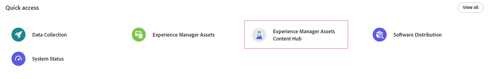
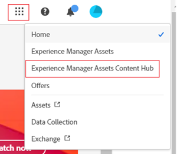
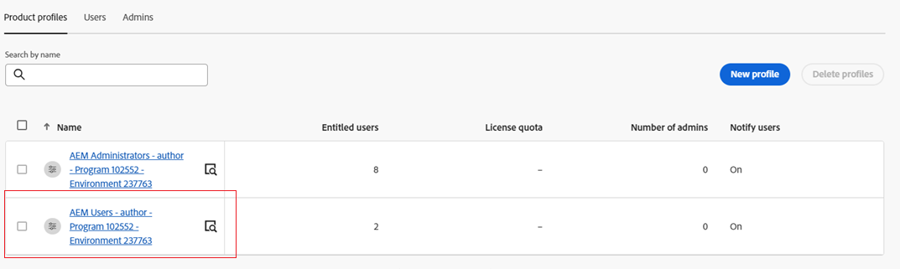

# Implementación de Content Hub {#deploy-content-hub}

Content Hub está disponible como parte de Experience Manager Assets as a Cloud Service para democratizar el acceso al contenido en la marca para las organizaciones y sus socios comerciales.

Los recursos marcados como Aprobado en Experience Manager Assets as a Cloud Service están disponibles para la distribución de recursos en Content Hub.

Este artículo proporciona un flujo de trabajo completo para proporcionar acceso a Content Hub a los usuarios, incluidas las variaciones de privilegios según sus necesidades.

Consulte este vídeo para aprender a habilitar Content Hub para Experience Manager Assets:

>[!VIDEO](https://video.tv.adobe.com/v/3469851)

Las variaciones de privilegios en Content Hub incluyen:

* [Usuarios de Content Hub](#onboard-content-hub-users): Acceda a los recursos aprobados por la marca en el portal de Content Hub.

* [Administradores de Content Hub](#onboard-content-hub-administrator): acceso a la [interfaz de usuario de configuración](/help/assets/configure-content-hub-ui-options.md) en Content Hub, además de acceder a recursos aprobados por la marca, cargar recursos en Content Hub, integración de Adobe Express para editar imágenes (si tiene derechos de Adobe Express).

* [Usuarios de Content Hub con derechos para agregar recursos](#onboard-content-hub-users-add-assets): capacidad para [cargar recursos en Content Hub](/help/assets/upload-brand-approved-assets.md), además de acceder a recursos aprobados por la marca en el portal de Content Hub.

* [Usuarios de Content Hub con derechos para remezclar recursos con nuevas variaciones](#onboard-content-hub-users-remix-assets): [Integración de Adobe Express](/help/assets/edit-images-content-hub.md) (si tiene derechos de Adobe Express) además de acceder a recursos aprobados por la marca en el portal de Content Hub.

* [Usuarios de Experience Manager Assets](#experience-manager-assets-users): capacidad para aprobar recursos en Experience Manager Assets as a Cloud Service para que estén disponibles en Content Hub.

La siguiente tabla resume los tipos de usuarios de Content Hub disponibles, los privilegios que tienen y los perfiles de producto necesarios para obtener esos privilegios:

| Función de usuario | Usuarios de Content Hub | Usuarios de Content Hub con derechos para añadir recursos | Usuarios de Content Hub con derechos para remezclar recursos | Administradores de Content Hub |
|---------------|----------|----------|-------------------------|---|
| **Capacidades** |
| Acceso a los recursos de marca aprobados en el portal de Content Hub | ✓ | ✓ | ✓ | ✓ |
| Cargar recursos desde el portal de Content Hub | − | ✓ | ✓ | ✓ |
| Uso de la integración de Adobe Express para editar imágenes | − | − | ✓ | − |
| Acceso a la IU de configuración de Content Hub | − | − | − | ✓ |
| **El usuario debe estar en estos perfiles de producto (Admin Console)** |
| AEM > Instancia de entrega > Usuarios limitados de AEM Assets | ✓ | ✓ | ✓ | ✓ |
| AEM > Instancia de autor de producción > Usuarios de AEM | − | ✓ | ✓ | − |
| AEM > Instancia de autor de producción > Administradores de AEM | − | − | − | ✓ |
| Adobe Express | − | − | ✓ | − |
| **Más información** | Ver [usuarios de Content Hub](#onboard-content-hub-users) | Ver [usuarios de Content Hub con derechos para agregar recursos](#onboard-content-hub-users-add-assets) | Vea [usuarios de Content Hub con derechos para remezclar recursos con nuevas variaciones](#onboard-content-hub-users-remix-assets) | Ver [administradores de Content Hub](#onboard-content-hub-administrator) |

>[!NOTE]
>
>[Los usuarios de Experience Manager Assets](#experience-manager-assets-users) pueden aprobar recursos en un entorno de Experience Manager Assets as a Cloud Service para que estén disponibles en Content Hub. Estos usuarios deben añadirse al perfil de producto AEM > Production Author instance > AEM Users mediante Admin Console.

## Paso 1: Habilitar Content Hub para Experience Manager Assets con Cloud Manager {#enable-content-hub}

Para acceder al portal de Content Hub, los administradores primero deben habilitar Content Hub para Experience Manager Assets as a Cloud Service con Cloud Manager.

### Permisos {#permissions-edit-program}

Debe tener la función Propietario empresarial para editar programas en Cloud Manager. Para obtener más información, consulte [Editar programas](/help/implementing/cloud-manager/getting-access-to-aem-in-cloud/editing-programs.md).

Para habilitar Content Hub para Experience Manager Assets:

1. Inicie sesión en Cloud Manager. Asegúrese de seleccionar la organización correcta al iniciar sesión. Cloud Manager enumera todos los programas.

1. Vaya al programa Experience Manager Assets as a Cloud Service, haga clic en el icono Más opciones (...) y seleccione **[!UICONTROL Editar programa]**.

   

1. En el cuadro de diálogo [!UICONTROL Editar programa], seleccione la pestaña **[!UICONTROL Soluciones y complementos]**.

1. Expanda **[!UICONTROL Assets]** y seleccione **[!UICONTROL Content Hub]**.
   

   >[!NOTE]
   >
   >Si **[!UICONTROL Actualización]** no está habilitada después de seleccionar Content Hub, asegúrate de haber especificado la configuración de Go-Live para el programa.

1. Haga clic en **[!UICONTROL Actualizar]**.

Content Hub ahora está habilitado para Experience Manager Assets as a Cloud Service. Después de habilitar Content Hub en un entorno de producción, no puede deshabilitarlo en modo de autoservicio.

>[!NOTE]
>
>Puede acceder a Content Hub y utilizarlo con hasta 250 usuarios de Content Hub. Si tiene más preguntas, póngase en contacto con su representante de Adobe.

Si no tiene experiencia previa en Experience Manager Assets, haga clic en **[!UICONTROL Agregar programa]**, proporcione detalles del programa (Nombre del programa, configurado para producción) y haga clic en **[!UICONTROL Continuar]**. A continuación, puede seleccionar **[!UICONTROL Assets]** y **[!UICONTROL Content Hub]** en la ficha **[!UICONTROL Soluciones y complementos]**.

### Instancia de Content Hub y perfil de producto en Admin Console{#content-hub-instance-product-profile}

Después de [habilitar Content Hub para Assets as a Cloud Service mediante Cloud Manager](#enable-content-hub), se crea una nueva instancia en AEM Assets as a Cloud Service en Admin Console con `delivery` como sufijo:

>[!NOTE]
>
>Si ha aprovisionado Content Hub antes del 14 de agosto de 2024, la nueva instancia se creará con `contenthub` como sufijo.

Tenga en cuenta que no hay `author` ni `publish` en el nombre de instancia de Content Hub.

Haga clic en el nombre de la instancia para ver el perfil de producto de Content Hub.

>[!NOTE]
>
>Si ha aprovisionado Content Hub antes del 14 de agosto de 2024, el perfil de producto de Content Hub tiene `contenthub` mencionado después de `Limited Users` en lugar de `delivery`.

## Paso 2: Incorporar un administrador de Content Hub {#onboard-content-hub-administrator}

Los administradores de Content Hub pueden acceder a la [interfaz de usuario de configuración](/help/assets/configure-content-hub-ui-options.md) en Content Hub, además de acceder a recursos aprobados por la marca, cargar recursos a Content Hub e integrar Adobe Express para editar imágenes (si tiene derechos de Adobe Express).

Para incorporar al administrador de Content Hub:

1. [Acceda y haga clic en el perfil de producto de usuario de Content Hub](#content-hub-instance-product-profile).

1. Haga clic en **[!UICONTROL Agregar usuarios]** para agregar usuarios o grupos de usuarios al perfil del producto.

1. Haga clic en **[!UICONTROL Guardar]** para guardar los cambios.

1. Después de agregar el usuario al perfil de producto de Content Hub, acceda a los perfiles de producto de Experience Manager Assets haciendo clic en el nombre del producto de AEM as a Cloud Service en la lista de productos de Admin Console.

1. Haga clic en la instancia de autor de producción para AEM as a Cloud Service:
   

   Admin Console muestra dos perfiles de producto para AEM as a Cloud Service: administradores y usuarios.
1. Haga clic en el perfil de producto Administradores y luego en **[!UICONTROL Agregar usuarios]** para agregar el usuario al perfil de producto.
   

1. Haga clic en **[!UICONTROL Guardar]** para guardar los cambios.

## Paso 3: Incorporar usuarios de Content Hub {#onboard-content-hub-users}

Los usuarios de Content Hub pueden acceder a los recursos disponibles en el portal, pero no pueden añadir nuevos recursos ni modificar los existentes.

Para incorporar usuarios de Content Hub:

1. [Acceda y haga clic en el perfil de producto de usuario de Content Hub](#content-hub-instance-product-profile).

1. Haga clic en **[!UICONTROL Agregar usuarios]** para agregar usuarios o grupos de usuarios al perfil del producto.

1. Haga clic en **[!UICONTROL Guardar]** para guardar los cambios.

Estos usuarios ahora pueden acceder a los recursos disponibles en el portal de Content Hub.

>[!NOTE]
>
>Puede utilizar todas las funciones empresariales avanzadas, como la sincronización con proveedores de identidad externos.

### ¿Cómo acceder a Content Hub? {#access-content-hub}

Se puede acceder a Content Hub de las siguientes maneras:

* Acceda a Content Hub a través del siguiente vínculo:

  `https://experience.adobe.com/#/assets/contenthub`

* Inicie sesión en `experience.adobe com` y haga clic en **[!UICONTROL Experience Manager Assets Content Hub]**, disponible en la sección **[!UICONTROL Acceso rápido]**:
  

* Inicie sesión en `experience.adobe com` y haga clic en **[!UICONTROL Experience Manager Assets Content Hub]**, disponible en el conmutador de productos:
  

### Deshabilitar notificaciones por correo electrónico a usuarios {#disable-email-notifications}

Si los administradores necesitan deshabilitar las notificaciones por correo electrónico enviadas a los usuarios cuando se añaden al perfil de producto de Content Hub:

Haga clic en el icono de búsqueda junto al nombre del perfil de producto y deshabilite la opción **[!UICONTROL Notificar a los usuarios por correo electrónico]**.

## Paso 4: Incorporar usuarios de Content Hub con derechos para agregar recursos (opcional) {#onboard-content-hub-users-add-assets}

Los usuarios de Content Hub con derechos para agregar recursos pueden [cargar nuevos recursos aprobados por la marca en Content Hub](/help/assets/upload-brand-approved-assets.md).

Para incorporar usuarios de Content Hub con derechos para agregar usuarios:

1. [Después de agregar el usuario al perfil de producto de Content Hub](#onboard-content-hub-users), acceda a los perfiles de producto de Experience Manager Assets haciendo clic en el nombre del producto de AEM as a Cloud Service en la lista de productos de Admin Console.

1. Haga clic en la instancia de autor de producción para AEM as a Cloud Service:
   

   Admin Console muestra dos perfiles de producto para AEM as a Cloud Service: administradores y usuarios.
1. Haga clic en el perfil de producto Usuarios y luego en **[!UICONTROL Agregar usuarios]** para agregar el usuario al perfil de producto.
   

1. Haga clic en **[!UICONTROL Guardar]** para guardar los cambios.

## Paso 4: Incorporar usuarios de Content Hub con derechos para remezclar recursos con nuevas variaciones (opcional) {#onboard-content-hub-users-remix-assets}

Los usuarios de Content Hub con derechos para remezclar recursos con nuevas variaciones pueden [modificar los recursos existentes mediante Adobe Express y guardar el recurso en el repositorio](/help/assets/edit-images-content-hub.md). La edición de recursos mediante Adobe Express solo está disponible si el usuario tiene derechos de Adobe Express.

Para incorporar usuarios de Content Hub con derechos para remezclar recursos con nuevas variaciones:

1. [Después de agregar el usuario al perfil de producto de Content Hub](#onboard-content-hub-users), acceda a los perfiles de producto de Experience Manager Assets haciendo clic en el nombre del producto de AEM as a Cloud Service en la lista de productos de Admin Console.

1. Haga clic en la instancia de autor de producción para AEM as a Cloud Service:
   

   Admin Console muestra dos perfiles de producto para AEM as a Cloud Service: administradores y usuarios.
1. Haga clic en el perfil de producto Usuarios y luego en **[!UICONTROL Agregar usuarios]** para agregar el usuario al perfil de producto.
   

1. Haga clic en **[!UICONTROL Guardar]** para guardar los cambios.

## Usuarios de Experience Manager Assets {#experience-manager-assets-users}

Los usuarios de Experience Manager Assets pueden aprobar los recursos en AEM as a Cloud Service para que estén disponibles en Content Hub.

Para configurar usuarios de Experience Manager Assets:

1. Para acceder a los perfiles de producto de Experience Manager Assets, haga clic en el nombre del producto de AEM as a Cloud Service en la lista de productos en Admin Console.

1. Haga clic en la instancia de autor de producción para AEM as a Cloud Service:
   

   Admin Console muestra dos perfiles de producto para AEM as a Cloud Service: administradores y usuarios.
1. Haga clic en el perfil de producto Usuarios y luego en **[!UICONTROL Agregar usuarios]** para agregar el usuario al perfil de producto.
   

1. Haga clic en **[!UICONTROL Guardar]** para guardar los cambios.

   >[!NOTE]
   >
   > No es necesario que se le agregue al [perfil de producto de Content Hub](#onboard-content-hub-users) para los usuarios de Experience Manager Assets.
