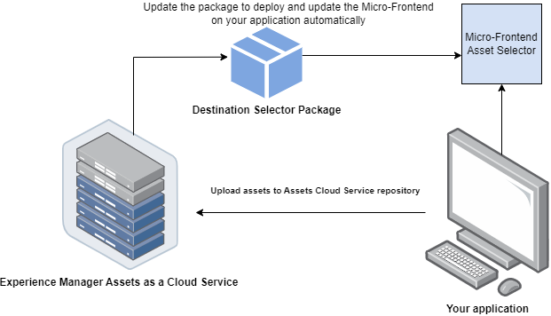

# Selector de destino de Micro-Frontend {#Overview}

El Selector de destino de Micro-FrontEnd proporciona una interfaz de usuario dentro de su aplicación que se integra fácilmente con el repositorio [!DNL Experience Manager Assets as a Cloud Service]. Puede buscar o examinar la carpeta adecuada dentro del repositorio de [!DNL Experience Manager Assets as a Cloud Service] y cargar recursos desde su aplicación.

La interfaz de usuario de Micro-Frontend está disponible en la experiencia de su aplicación mediante el paquete Selector de destino. Las actualizaciones del paquete se importan automáticamente y el último Selector de destino implementado se carga automáticamente en la aplicación.



El Selector de destino ofrece muchas ventajas, como las siguientes:

* Facilidad de integración con cualquiera de las aplicaciones de Adobe o que no sean de Adobe mediante la biblioteca JavaScript de Vanilla.
* Son fáciles de mantener, ya que las actualizaciones del paquete Selector de destino se implementan automáticamente en el Selector de destino disponible para su aplicación. No se requieren actualizaciones dentro de la aplicación para cargar las modificaciones más recientes.
* Facilidad de personalización, ya que hay propiedades disponibles que controlan la visualización del Selector de destino dentro de la aplicación.
* Búsqueda de texto completo para desplazarse rápidamente a las carpetas y cargar recursos desde la aplicación.
* Capacidad para crear carpetas, ordenar carpetas en orden ascendente o descendente y verlas en las vistas Lista, Cuadrícula, Galería o Cascada.

El ámbito de este artículo es demostrar cómo utilizar el Selector de destino con una aplicación [!DNL Adobe] bajo Unified Shell o cuando ya tiene un imsToken generado para la autenticación. Estos flujos de trabajo se denominan flujo no SUSI en este artículo.

Realice las siguientes tareas para integrar y utilizar el Selector de destino con su repositorio [!DNL Experience Manager Assets as a Cloud Service]:

* [Integración del selector de destino mediante Vanilla JS](#integration-with-vanilla-js)
* [Definir propiedades de visualización del Selector de destino](#destination-selector-properties)
* [Uso del selector de destino](#using-destination-selector)

## Integración del selector de destino mediante Vanilla JS {#integration-with-vanilla-js}

Puede integrar cualquier [!DNL Adobe] o aplicación sin Adobe con [!DNL Experience Manager Assets] como un repositorio de [!DNL Cloud Service] y seleccione recursos desde la aplicación.

La integración se realiza importando el paquete Selector de destino y conectándose a Assets as a Cloud Service mediante la biblioteca de JavaScript de vainilla. Debe editar un `index.html` o cualquier archivo apropiado dentro de su aplicación para:

* Definición de los detalles de autenticación
* Acceso al repositorio Assets as a Cloud Service
* Configuración de las propiedades de visualización del Selector de destino

Puede realizar la autenticación sin definir algunas de las propiedades de IMS, si:

* Está integrando una aplicación de [!DNL Adobe] en [Unified Shell](https://experienceleague.adobe.com/docs/experience-manager-cloud-service/content/overview/aem-cloud-service-on-unified-shell.html?lang=es).
* Ya ha generado un token de IMS para la autenticación.

## Requisitos previos {#prerequisites}

Defina los requisitos previos en el archivo de `index.html` o un archivo similar dentro de la implementación de la aplicación para definir los detalles de la autenticación para acceder al repositorio de [!DNL Experience Manager Assets] as a [!DNL Cloud Service]. Los requisitos previos incluyen:

* imsOrg
* imsToken
* apikey

## Instalación {#installation}

El selector de destino está disponible a través de la CDN de ESM (por ejemplo, [esm.sh](https://esm.sh/)/[skypack](https://www.skypack.dev/)) y la versión [UMD](https://github.com/umdjs/umd).

En navegadores que utilizan la **Versión de UMD** (recomendado):

En navegadores que utilizan la **Versión de UMD** (recomendado):

```
<script src="https://experience.adobe.com/solutions/CQ-assets-selectors/static-assets/resources/assets-selectors.js"></script>

<script>
  const { renderAssetSelector } = PureJSSelectors;
</script>
```

En navegadores con compatibilidad con `import maps` con **Versión de CDN de ESM**:

```
<script type="module">
  import { AssetSelector } from 'https://experience.adobe.com/solutions/CQ-assets-selectors/static-assets/resources/@assets/selectors/index.js'
</script>
```

En la federación de módulos Deno/Webpack mediante **Versión de CDN de ESM**:

```
import { AssetSelector } from 'https://experience.adobe.com/solutions/CQ-assets-selectors/static-assets/resources/@assets/selectors/index.js'
```

### Destino seleccionado {#selected-destination}

El Selector de destino recibe una llamada de retorno de `onItemSelect`, `onTreeToggleItem` o `onTreeSelectionChange` con el directorio seleccionado que contiene el objeto (directorio, imagen, etc.).

**Sintaxis de esquema**

```
interface SelectedDestination {
  id: string;
  children: SelectedDestination[];
  'repo:repositoryId': string;
  'dc:format': string;
  'repo:assetClass': string;
  'storage:directoryType': string;
  'storage:region': string;
  'repo:name': string;
  'repo:path': string;
  'repo:ancestors': string[];
  'repo:createDate': string;
  'storage:assignee':

  { type: string; id: string; }
  ;
  'repo:assetId': string;
  'aem:published': boolean;
  'repo:createdBy': string;
  'repo:state': string;
  'repo:id': string;
  'repo:modifyDate': string;
  _page:

  { orderBy: string; count: number; };
}
```

En la tabla siguiente se describen algunas de las propiedades importantes del destino seleccionado.

| Propiedad | Tipo | Explicación |
|---|---|---|
| *repo:repositoryId* | cadena | Identificador único del repositorio en el que se almacena el recurso. |
| *repo:id* | cadena | Identificador único del recurso. |
| *repo:assetClass* | cadena | La clasificación del recurso (por ejemplo, imagen o vídeo, documento). |
| *repo:name* | cadena | Nombre del recurso, incluida la extensión de archivo. |
| *repo:size* | número | El tamaño del recurso en bytes. |
| *repo:path* | cadena | La ubicación del recurso dentro del repositorio. |
| *repo:ancestors* | `Array<string>` | Matriz de elementos antecesores del recurso en el repositorio. |
| *repo:state* | cadena | Estado actual del recurso en el repositorio (por ejemplo, activo, eliminado, etc.). |
| *repo:createdBy* | cadena | El usuario o sistema que creó el recurso. |
| *repo:createDate* | cadena | La fecha y la hora en que se creó el recurso. |
| *repo:modifiedBy* | cadena | Usuario o sistema que modificó el recurso por última vez. |
| *repo:modifyDate* | cadena | La fecha y la hora en que se modificó el recurso por última vez. |
| *dc:format* | cadena | El formato del recurso. |
| *_página* | orderBy: string; count: number; | Incluye el número de página del documento. |

Para obtener una lista completa de propiedades y un ejemplo detallado, visite [Ejemplo de código de selector de destino](https://github.com/adobe/aem-assets-selectors-mfe-examples).

### Ejemplo de flujo no SUSI {#non-ims-vanilla}

En este ejemplo se muestra cómo utilizar el Selector de destino con un flujo que no sea SUSI al ejecutar una aplicación [!DNL Adobe] en Unified Shell o cuando ya se ha generado `imsToken` para la autenticación.

Incluya el paquete Selector de destino en su código usando la etiqueta `script`, como se muestra en las _líneas 6-15_ del ejemplo siguiente. Una vez cargado el script, la variable global `PureJSSelectors` estará disponible para su uso. Defina el Selector de destino [properties](#destination-selector-properties) como se muestra en _líneas 16-23_. Las propiedades de `imsOrg` y `imsToken` son necesarias para la autenticación en un flujo que no es SUSI. La propiedad de `handleSelection` se utiliza para gestionar los recursos seleccionados. Para procesar el Selector de destino, llame a la función `renderDestinationSelector` como se menciona en la _línea 17_. El Selector de destino se muestra en el elemento contenedor `<div>`, como se muestra en _las líneas 21 y 22_.

Siguiendo estos pasos, puede utilizar el Selector de destino con un flujo que no sea SUSI en la aplicación [!DNL Adobe].

```html {line-numbers="true"}
<!DOCTYPE html>
<html>
<head>
    <title>Destination Selector</title>
    <script src="https://experience.adobe.com/solutions/CQ-assets-selectors/assets/resources/assets-selectors.js"></script>
    <script>
        // get the container element in which we want to render the DestinationSelector component
        const container = document.getElementById('destination-selector-container');
        // imsOrg and imsToken are required for authentication in non-SUSI flow
        const destinationSelectorProps = {
            imsOrg: 'example-ims@AdobeOrg',
            imsToken: "example-imsToken",
            apiKey: "example-apiKey-associated-with-imsOrg",
            handleSelection: (assets: SelectedAssetType[]) => {},
        };
        // Call the `renderDestinationSelector` available in PureJSSelectors globals to render DestinationSelector
        PureJSSelectors.renderDestinationSelector(container, destinationselectorprops);
    </script>
</head>

<body>
    <div id="destination-selector-container" style="height: calc(100vh - 80px); width: calc(100vw - 60px); margin: -20px;">
    </div>
</body>

</html>
```

Para ver un ejemplo detallado, visite [Ejemplo de código de selector de destino](https://github.com/adobe/aem-assets-selectors-mfe-examples).

## Usar propiedades del Selector de destino {#destination-selector-properties}

Puede utilizar las propiedades del Selector de destino para personalizar la forma en que se representa el Selector de destino. En la tabla siguiente se enumeran las propiedades que puede utilizar para personalizar y utilizar el Selector de destino:

| Propiedad | Tipo | Requerido | Predeterminado | Descripción |
|---|---|---|---|---|
| *imsOrg* | cadena | Sí | | ID del sistema Identity Management de Adobe (IMS) asignado durante el aprovisionamiento [!DNL Adobe Experience Manager] as a [!DNL Cloud Service] para su organización. La clave `imsOrg` es necesaria para autenticar si la organización a la que accede se encuentra en Adobe IMS o no. |
| *imsToken* | cadena | No | | Token de portador de IMS utilizado para la autenticación. `imsToken` no es necesario si utiliza el flujo SUSI. Sin embargo, es obligatorio si utiliza el flujo que no es SUSI. |
| *apiKey* | cadena | No | | Clave de API utilizada para acceder al servicio AEM Discovery. `apiKey` no es necesario si utiliza el flujo SUSI. Sin embargo, es obligatorio en flujos que no sean de SUSI. |
| *rootPath* | cadena | No | /content/dam/ | Ruta de la carpeta desde la que el Selector de destino muestra los recursos. `rootPath` también se puede utilizar en forma de encapsulación. Por ejemplo, dada la siguiente ruta de acceso, `/content/dam/marketing/subfolder/`, el Selector de destino no le permite atravesar ninguna carpeta principal, sino que sólo muestra las carpetas secundarias. |
| *hasMore* | booleano | No | | Cuando la aplicación tiene más contenido para mostrar, puede utilizar esta propiedad para agregar un cargador que cargue el contenido para que sea visible en la aplicación. Es un indicador que indica que la carga de contenido está en curso. |
| *orgName* | booleano | No | | Es el nombre de la organización (probablemente orgID) asociada a AEM |
| *initRepoID* | cadena | No | | Es la ruta del repositorio de recursos que desea utilizar en una vista inicial predeterminada |
| *onCreateFolder* | cadena | No | | La propiedad `onCreateFolder` le permite agregar un icono que agrega una carpeta nueva en la aplicación. |
| *onConfirm* | cadena | No | | Se trata de una llamada de retorno cuando pulsa el botón de confirmación. |
| *confirmDisabled* | cadena | No | | Esta propiedad controla el conmutador del botón de confirmación. |
| *viewType* | cadena | No | | La propiedad `viewType` se usa para especificar las vistas que se usan para mostrar los recursos. |
| *viewTypeOptions* | cadena | No | | Esta propiedad está relacionada con la propiedad `viewType`. puede especificar una o varias vistas para mostrar los recursos. Las opciones de viewType disponibles son: vista de lista, vista de cuadrícula, vista de galería, vista de cascada y vista de árbol. |
| *itemNameFormatter* | cadena | No | | Esta propiedad permite dar formato al nombre del elemento |
| *i18nSymbols* | `Object<{ id?: string, defaultMessage?: string, description?: string}>` | No |  | Si las traducciones de OOTB no son suficientes para las necesidades de la aplicación, puede exponer una interfaz a través de la cual puede pasar sus propios valores localizados personalizados a través del prop `i18nSymbols`. Al pasar un valor a través de esta interfaz, se anulan las traducciones predeterminadas proporcionadas y, en su lugar, se utilizan las suyas.  Para realizar la anulación, debe pasar un objeto [Descriptor del mensaje](https://formatjs.io/docs/react-intl/api/#message-descriptor) válido a la clave de `i18nSymbols` que desee anular. |
| *inlineAlertSetup* | cadena | No | | Agrega un mensaje de alerta que desea pasar en la aplicación. Por ejemplo, agregar un mensaje de alerta que indique que no tiene permiso para acceder a esta carpeta. |
| *intl* | Objeto | No | | El selector de destino proporciona traducciones OOTB predeterminadas. Puede seleccionar el idioma de traducción proporcionando una cadena de configuración regional válida a través del prop `intl.locale`. Por ejemplo: `intl={{ locale: "es-es" }}` </br></br> Las cadenas de configuración regional admitidas siguen los [Códigos ISO 639](https://www.iso.org/iso-639-language-codes.html) para la representación de los estándares de nombres de idiomas. </br></br> Lista de configuraciones regionales admitidas: Inglés - &#39;en-us&#39; (predeterminado) Español - &#39;es-es&#39; Alemán - &#39;de-de&#39; Francés - &#39;fr-fr&#39; Italiano - &#39;it-it&#39; Japonés - &#39;ja-jp&#39; Coreano - &#39;ko-kr&#39; Portugués - &#39;pt-br&#39; Chino (tradicional) - &#39;zh-cn&#39; Chino (Taiwán) - &#39;zh-tw&#39; |

## Ejemplos de uso de las propiedades del Selector de destino {#usage-examples}

Puede definir el Selector de destino [properties](#destination-selector-properties) en el archivo `index.html` para personalizar la visualización del Selector de destino en su aplicación.

### Ejemplo 1: Crear una carpeta en el Selector de destino

El selector de destino permite crear una carpeta para cargar, mover o copiar recursos en una ubicación concreta.


### Ejemplo 2: Especificar tipo de vista del Selector de destino

El Selector de destino muestra una amplia matriz de recursos en cuatro vistas diferentes, incluidas la Vista de lista, la Vista de cuadrícula, la Vista de galería y la Vista de cascada. Para especificar el tipo de vista predeterminado, puede utilizar la propiedad `viewType`. La propiedad `viewTypeOptions` se usa junto con la propiedad `viewType` para estipular otros tipos de vista de modo que se puedan mostrar otras opciones de tipo de vista en una lista desplegable. Se puede utilizar un solo argumento en caso de que desee mostrar solo una opción.


### Ejemplo 3: Inicializar la ruta de la carpeta Assets

Utilice la propiedad `path` para definir el nombre de carpeta que se mostrará automáticamente cuando se represente el Selector de destino.


## Uso del selector de destino {#using-destination-selector}

Una vez configurado el Selector de destino y autenticado para usar el Selector de destino con su [!DNL Adobe Experience Manager] como aplicación de [!DNL Cloud Service], puede seleccionar recursos o realizar otras operaciones para buscar los recursos dentro del repositorio.


* **A**: [Barra de búsqueda](#search-bar)
* **B**: [Ordenando](#sorting)
* **C**: [Recursos](#assets-repo)
* **D**: [Agregar sufijo o prefijo](#add-suffix-or-prefix)
* **E**: [Crear nueva carpeta](#create-new-folder)
* **F**: [Vista](#types-of-view)
* **G**: [Información](#info)
* **H**: [Seleccionar carpeta](#select-folder)

### Barra de búsqueda {#search-bar}

El Selector de destino permite realizar una búsqueda de texto completo de los recursos dentro del repositorio seleccionado. Por ejemplo, si escribe la palabra clave `wave` en la barra de búsqueda, se muestran todos los recursos con la palabra clave `wave` mencionada en cualquiera de las propiedades de metadatos.

### Ordenación {#sorting}

Puede ordenar los recursos en el Selector de destino por nombre, dimensión o tamaño de un recurso. También puede ordenar los recursos en orden ascendente o descendente.

### Repositorio de Assets {#assets-repo}

El Selector de destino también permite ver los datos del repositorio que elija disponibles en la aplicación de AEM. Puede usar la propiedad `repositoryID` para inicializar la ruta de la carpeta de destino que desea ver en la primera instancia del Selector de destino.

### Agregar sufijo o prefijo {#add-suffix-or-prefix}

Es un ejemplo de la propiedad `optionsFormSetup`. Puede usar esto para confirmar la selección; se pasa en el evento `onConfirm`.

### Crear una carpeta. {#create-new-folder}

Le permite crear una carpeta en la carpeta de destino de su [!DNL Adobe Experience Manager] como [!DNL Cloud Service].

### Tipos de vista {#types-of-view}

El Selector de destino permite ver el recurso en cuatro vistas diferentes:

*  [!UICONTROL **Vista de lista**]: la vista de lista muestra los archivos y carpetas desplazables en una sola columna.
*  [!UICONTROL **Vista de cuadrícula**]: la vista de cuadrícula muestra archivos y carpetas desplazables en una cuadrícula de filas y columnas.
*  [!UICONTROL **Vista de galería**]: la vista de galería muestra los archivos o carpetas en una lista horizontal bloqueada en el centro.
*  [!UICONTROL **Vista de cascada**]: la vista de cascada muestra los archivos o carpetas en forma de puente.

### Información {#info}

El icono de información permite ver los metadatos del recurso seleccionado. Incluye varios detalles, como dimensiones, tamaño, descripción, ruta, fecha de modificación y fecha de creación. La información de los metadatos se proporciona al cargar, copiar o crear un recurso.

### Seleccionar carpeta {#select-folder}

El botón Seleccionar carpeta le permite seleccionar recursos para realizar diversas operaciones asociadas a [propiedades](#destination-selector-properties) en el selector de destino.
