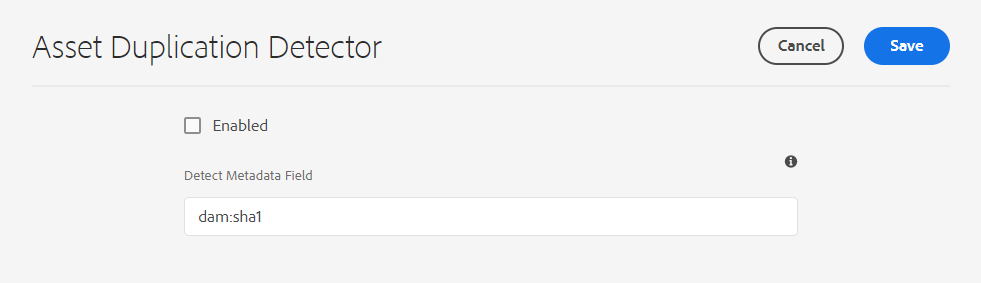
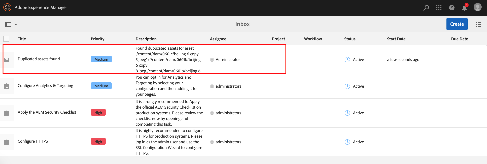

# Detección de recursos duplicados {#detect-duplicate-assets}

| Versión | Vínculo del artículo |
| -------- | ---------------------------- |
| AEM 6.5 | [Haga clic aquí](https://experienceleague.adobe.com/docs/experience-manager-65/assets/managing/duplicate-detection.html?lang=en) |
| AEM as a Cloud Service | Este artículo |

Si un usuario de DAM carga uno o más recursos que ya existen en el repositorio, [!DNL Experience Manager] detecta la duplicación y se lo comunica al usuario. La detección de duplicados está desactivada de forma predeterminada, ya que puede afectar al rendimiento según el tamaño del repositorio y el número de recursos cargados.

Para habilitar la función:

1. Vaya a **[!UICONTROL Herramientas > Assets > Configuraciones de Assets]**.

1. Haga clic en **[!UICONTROL Detector de duplicación de recursos]**.

1. En la [!UICONTROL página Detector de duplicación de recursos], haga clic en **[!UICONTROL Habilitado]**.

   El valor `dam:sha1` del campo Detectar metadatos garantiza que se detecten recursos duplicados aunque los nombres de archivo sean diferentes.

1. Haga clic en **[!UICONTROL Guardar]**.

   

>[!NOTE]
>
>Si ha configurado el detector de duplicación usando el archivo de configuración `/apps/example/config.author/com.adobe.cq.assetcompute.impl.assetprocessor.AssetDuplicationDetector.cfg.json` (configuración OSGi), puede seguir usándolo. Sin embargo, Adobe recomienda utilizar el nuevo método.

Una vez activado, Experience Manager envía notificaciones de recursos duplicados a la bandeja de entrada de Experience Manager. Es un resultado agregado para varios duplicados. Los usuarios pueden optar por eliminar los recursos en función de los resultados.

>[!NOTE]
>
>Al cargar recursos en el repositorio, Experience Manager detecta la duplicación y le notifica sobre los 100 primeros recursos duplicados.

**Consulte también**

* [Traducir recursos](/help/assets/translate-assets.md)
* [API HTTP de recursos](/help/assets/mac-api-assets.md)
* [Formatos de archivo compatibles con recursos](/help/assets/file-format-support.md)
* [Buscar recursos](/help/assets/search-assets.md)
* [Recursos de red](/help/assets/use-assets-across-connected-assets-instances.md)
* [Informes de recurso](/help/assets/asset-reports.md)
* [Esquemas de metadatos](/help/assets/metadata-schemas.md)
* [Descarga de recursos](/help/assets/download-assets-from-aem.md)
* [Administración de metadatos](/help/assets/manage-metadata.md)
* [Administración de plantillas de Dynamic Media](/help/assets/dynamic-media/manage-dynamic-media-templates.md)
* [Administrar informes](/help/assets/manage-reports-assets-view.md)
* [Facetas de búsqueda](/help/assets/search-facets.md)
* [Administrar colecciones](/help/assets/manage-collections.md)
* [Importación masiva de metadatos](/help/assets/metadata-import-export.md)
* [Publicación de recursos en AEM y Dynamic Media](/help/assets/publish-assets-to-aem-and-dm.md)

