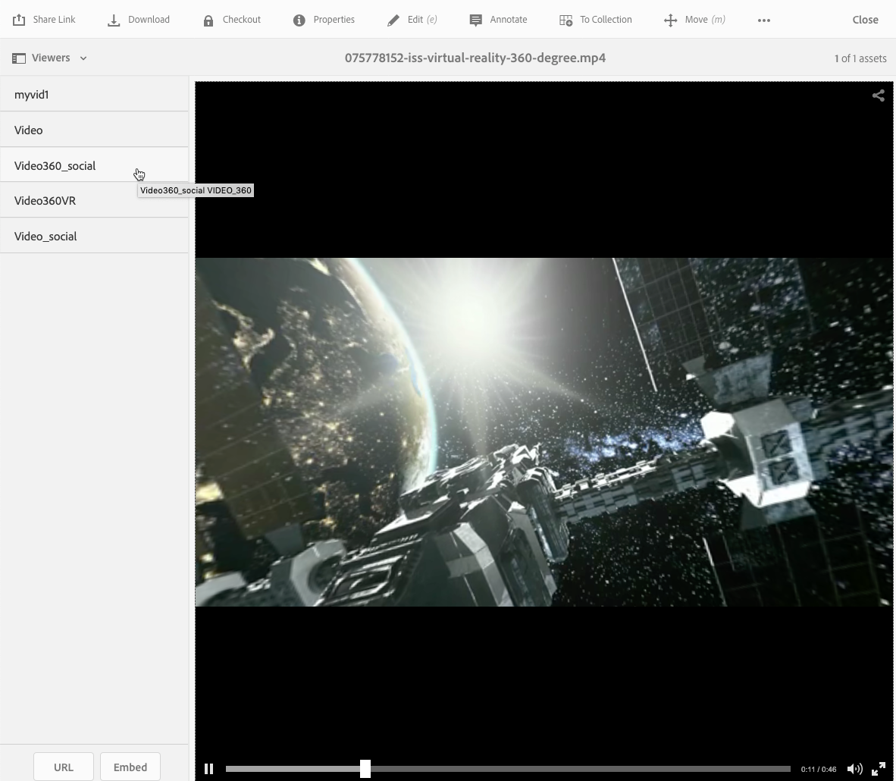

# Vídeo 360/VR {#vr-video}

Los vídeos de 360° graban una vista en todas las direcciones al mismo tiempo. Se filman con una cámara omnidireccional o una colección de cámaras. Durante la reproducción, en una pantalla plana, el usuario tiene control del ángulo de visión; la reproducción en dispositivos móviles suele aplicar sus controles giroscópicos integrados.

Dynamic Media incluye compatibilidad nativa para la entrega de recursos de vídeo 360. De forma predeterminada, no es necesaria ninguna configuración adicional para la visualización o reproducción. Puede entregar vídeo 360 con extensiones de vídeo estándar como .mp4, .mkv y .mov. El códec más común es H.264.

Puede utilizar el visualizador de vídeo 360/VR para procesar vídeo equirectangular. El resultado es una experiencia de visualización inmersiva de una habitación, propiedad, ubicación, paisaje, procedimiento médico, etc.

Actualmente no se admite audio espacial; si el audio se mezcla en estéreo, el equilibrio (I/D) no cambia a medida que el cliente cambia el ángulo de visión de la cámara.

Ver [Uso de vídeos de Dynamic Media 360 y miniaturas de vídeo personalizadas con AEM Assets](https://experienceleague.adobe.com/docs/experience-manager-learn/assets/dynamic-media/dynamic-media-360-video-custom-thumbnail-feature-video-use.html?lang=es#dynamic-media).

Consulte también [Administración de ajustes preestablecidos de visor](/help/assets/dynamic-media/managing-viewer-presets.md).

## Vídeo 360 en acción {#video-in-action}

Seleccione [Estación espacial 360](https://s7d1.scene7.com/s7viewers/html5/Video360Viewer.html?asset=Viewers/space_station_360-AVS) para abrir una ventana del explorador y ver un vídeo de 360°. Durante la reproducción de vídeo, arrastre el puntero a una nueva ubicación para cambiar el ángulo de visualización.

*Fotograma de vídeo de la Estación Espacial 360*

## Vídeo 360/VR y Adobe Premiere Pro {#vr-video-and-adobe-premiere-pro}

Puede utilizar Adobe Premier Pro para ver y editar material de archivo de 360/VR. Por ejemplo, puede colocar logotipos y texto correctamente en una escena y aplicar efectos y transiciones diseñados específicamente para medios equirectangulares.

Ver [Editar vídeo de 360/VR](https://helpx.adobe.com/es/premiere-pro/how-to/edit-360-vr-video.html).

## Carga de recursos para utilizarlos con el visualizador de vídeo 360 {#uploading-assets-for-use-with-the-video-viewer}

360 recursos de vídeo que se han cargado en [!DNL Experience Manager] están etiquetados como **Multimedia** en una página de recursos, de manera similar al recurso de vídeo normal.

*Se ha cargado un recurso de vídeo de 360 visualizado en la vista de tarjeta. El recurso está etiquetado como Multimedia.*

**Cargar recursos para usarlos con el visor de vídeo 360:**

1. Se ha creado una carpeta dedicada a su recurso de vídeo 360.
1. [Aplicar un perfil de vídeo adaptable a la carpeta](/help/assets/dynamic-media/video-profiles.md#applying-a-video-profile-to-folders).

   La representación de contenido de vídeo de 360 bits exige mayores requisitos para la resolución de vídeo de origen y para la resolución de representaciones codificadas que el contenido de vídeo estándar que no es de 360 bits.

   Puede utilizar el perfil de vídeo adaptable incorporado que ya viene con Dynamic Media. Sin embargo, resulta en una calidad de vídeo 360 perceptiblemente menor que la que obtendría con un vídeo no 360 codificado con los mismos ajustes procesados con un visor no 360. Por lo tanto, si se requiere vídeo 360 de alta calidad, haga lo siguiente:

   * Lo ideal es que el contenido original de vídeo de 360 bits tenga una de las siguientes resoluciones:

      * 1080p - 1920 x 1080, conocida como resolución Full HD o FHD o,
      * 2160p: 3840 x 2160, conocida como resolución 4k, UHD o Ultra HD. Esta resolución de pantalla grande se encuentra más a menudo en televisores y monitores de ordenador de primera calidad. La resolución de 2160p se denomina a menudo &quot;4k&quot; porque la anchura está cerca de los 4000 píxeles. En otras palabras, ofrece cuatro veces los píxeles de 1080p.

   * [Crear un perfil de vídeo adaptable personalizado](/help/assets/dynamic-media/video-profiles.md#creating-a-video-encoding-profile-for-adaptive-streaming) con representaciones de mayor calidad. Por ejemplo, puede crear un perfil de vídeo adaptable que contenga las tres configuraciones siguientes:

      * Anchura=automática; Altura=720; Velocidad de bits=2500 kbps
      * Anchura=auto; Altura=1080; Velocidad de bits=5000 kbps
      * Anchura=automática; Altura=1440; Velocidad de bits=6600 kbps

   * Procesar contenido de vídeo de 360 en una carpeta dedicada exclusivamente a recursos de vídeo de 360.

   Este enfoque impone mayores exigencias a la red y al CPU del usuario.

1. [Cargue el vídeo en la carpeta](/help/assets/manage-video-assets.md#upload-and-preview-video-assets).

<!--

## Overriding the default aspect ratio of 360 videos  {#overriding-the-default-aspect-ratio-of-videos}

For an uploaded asset to qualify as a 360 video that you intend to use with the 360 Video viewer, the asset must have an aspect ratio of 2.

By default, AEM detects video as "360" if its aspect ratio (width/height) is 2.0. If you are an Administrator, you can override the default aspect ratio setting of 2 by setting the optional `s7video360AR` property in CRXDE Lite at the following:

* `/conf/global/settings/cloudconfigs/dmscene7/jcr:content`

  * **Property type**: Double
  * **Value**: floating-point aspect ratio, default 2.0.

After you set this property, it takes effect immediately on both existing videos and newly uploaded videos.

The aspect ratio applies to 360 video assets for the asset details page and the [Video 360 Media WCM component](/help/assets/dynamic-media/adding-dynamic-media-assets-to-pages.md#dynamic-media-components).

Start by uploading 360 Videos.

-->

## Vista previa del vídeo 360 {#previewing-video}

Puede usar Vista previa para ver cómo aparece el vídeo 360 para los clientes y asegurarse de que se comporta según lo esperado.

Consulte también [Edición de ajustes preestablecidos de visor](/help/assets/dynamic-media/managing-viewer-presets.md#editing-viewer-presets).

Cuando esté satisfecho con el vídeo 360, puede publicarlo.

Ver [Incrustación del visor de vídeo o de imágenes en una página web](/help/assets/dynamic-media/embed-code.md).
Ver [URL de vinculación a su aplicación web](/help/assets/dynamic-media/linking-urls-to-yourwebapplication.md). El método de vinculación basado en URL no es posible si el contenido interactivo tiene vínculos con direcciones URL relativas, en particular vínculos a páginas de [!DNL Experience Manager Sites].
Consulte [Agregar Dynamic Media Assets a las páginas](/help/assets/dynamic-media/adding-dynamic-media-assets-to-pages.md).

**Para obtener una vista previa de 360 vídeos:**

1. En **[!UICONTROL Assets]**, desplácese hasta un vídeo 360 existente que haya creado. Para abrirlo en modo de vista previa, seleccione el recurso de vídeo 360.

   

   Para obtener una vista previa del vídeo, seleccione el recurso de vídeo 360.

1. En la página de vista previa, cerca de la esquina superior izquierda de la página, selecciona la lista desplegable y luego selecciona **[!UICONTROL Visualizadores]**.

   

   En la lista Visualizadores, seleccione **[!UICONTROL Video360_social]** y, a continuación, siga uno de estos procedimientos:

   * Para modificar el ángulo de visualización de la escena estática, arrastre el puntero por el vídeo.
   * Para comenzar la reproducción, selecciona el botón **[!UICONTROL Reproducir]** del vídeo. A medida que se reproduce el vídeo, arrastre el puntero por el vídeo para modificar el ángulo de visualización.

   *Captura de pantalla de 360 vídeos.*

   * En la lista Visualizadores, seleccione **[!UICONTROL Video360VR]**.

     El vídeo de realidad virtual (VR) es contenido de vídeo envolvente al que se accede mediante auriculares de realidad virtual. Al igual que con los vídeos normales, puede crear vídeos de realidad virtual al principio cuando se graba o captura un vídeo con cámaras de vídeo de 360°.

   
   *Captura de pantalla de un vídeo de RV de 360.*

1. Cerca de la parte superior derecha de la página de vista previa, seleccione **[!UICONTROL Cerrar]**.

## Publicación de vídeo 360 {#publishing-video}

Para utilizar el vídeo 360, debe publicarlo. La publicación de un vídeo 360 activa la URL y el código de incrustación. También publica el vídeo 360 en la nube de Dynamic Media, que está integrada con una CDN para una entrega escalable y con buen rendimiento.

Consulte [Publicación de Dynamic Media Assets](/help/assets/dynamic-media/publishing-dynamicmedia-assets.md) para obtener más información sobre cómo publicar vídeo 360.
Vea también [Incrustación del visor de vídeo o de imágenes en una página web](/help/assets/dynamic-media/embed-code.md).
Consulte también [Vinculación de direcciones URL a su aplicación web](/help/assets/dynamic-media/linking-urls-to-yourwebapplication.md). El método de vinculación basado en URL no es posible si el contenido interactivo tiene vínculos con direcciones URL relativas, en particular vínculos a páginas de [!DNL Experience Manager Sites].
Consulte también [Agregar Dynamic Media Assets a las páginas](/help/assets/dynamic-media/adding-dynamic-media-assets-to-pages.md).
