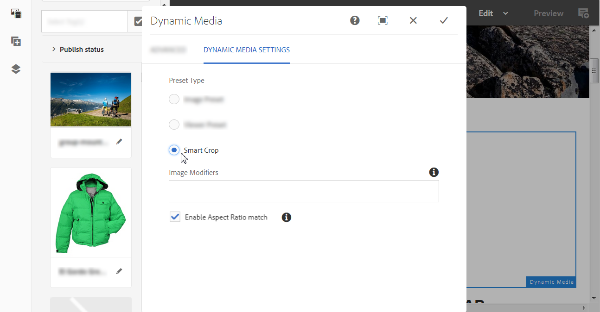

# Añadir Dynamic Media Assets a las páginas{#adding-dynamic-media-assets-to-pages}

Para agregar la funcionalidad Dynamic Media a los recursos que usa en sus sitios web, puede agregar directamente en la página el componente **Dynamic Media**, **Interactive Media**, **Panoramic Media** o **Video 360 Media**. Accederá al modo Diseño y habilitará los componentes de Dynamic Media. A continuación, agregue estos componentes a la página y agregue recursos al componente. Los componentes de Dynamic Media son inteligentes: saben si va a añadir una imagen o un vídeo y las opciones de configuración disponibles cambian en consecuencia.

Agregue recursos de Dynamic Media directamente a la página si utiliza [!DNL Adobe Experience Manager] como WCM. Si utiliza un tercero para su WCM, [vincule](/help/assets/dynamic-media/linking-urls-to-yourwebapplication.md) o [incruste](/help/assets/dynamic-media/embed-code.md) los recursos. Para ver un sitio web interactivo de terceros, consulte [distribución de imágenes optimizadas en un sitio interactivo](/help/assets/dynamic-media/responsive-site.md).

>[!NOTE]
>
>Asegúrese de publicar los recursos antes de agregarlos a las páginas de [!DNL Experience Manager]. Consulte [Publicación de Dynamic Media Assets](/help/assets/dynamic-media/publishing-dynamicmedia-assets.md).

## Añadir un componente de Dynamic Media a una página {#adding-a-dynamic-media-component-to-a-page}

Añadir un componente multimedia en 3D, Dynamic Media, Interactive Media, Panoramic Media, Smart Crop Video o Video 360 Media a una página es lo mismo que añadir un componente a cualquier página.

**Para agregar un componente de Dynamic Media a una página:**

1. En [!DNL Experience Manager], abra la página donde desee agregar el componente Dynamic Media.
1. En el panel izquierdo, seleccione el icono **[!UICONTROL Componentes]** y, a continuación, filtre por Dynamic Media.

   Si no hay ninguna lista de componentes de Dynamic Media disponible, es probable que deba habilitar los componentes de Dynamic Media que desee utilizar. Consulte [Habilitar componentes de Dynamic Media](#enabling-dynamic-media-components).

   

1. Arrastre un componente **[!UICONTROL Dynamic Media]** y suéltelo en la ubicación deseada de la página.

1. Pase el puntero directamente sobre el componente. Cuando el componente esté rodeado por un cuadro azul, seleccione una vez para mostrar la barra de herramientas del componente. Seleccione el icono **[!UICONTROL Configuración (llave inglesa)]**.

   

1. Según el componente Dynamic Media que haya colocado en la página, se abrirá un cuadro de diálogo de configuración. [Establezca las opciones del componente](/help/assets/dynamic-media/adding-dynamic-media-assets-to-pages.md#dynamic-media-components) según sea necesario.

   El ejemplo siguiente muestra el cuadro de diálogo del componente Dynamic Media **[!UICONTROL Video 360 Media]** y las opciones disponibles en la lista desplegable Ajuste preestablecido de visor.

   

   El componente multimedia Dynamic Media Video 360.

1. Cuando haya terminado, en la esquina superior derecha del cuadro de diálogo, active la marca de verificación para guardar los cambios.

### Habilitar componentes de Dynamic Media {#enabling-dynamic-media-components}

Si no hay componentes de Dynamic Media disponibles para agregar a una página, probablemente significa que debe habilitar los componentes que desea utilizar.

1. En [!DNL Experience Manager], abra la página donde desee agregar el componente Dynamic Media.
1. A la izquierda de la barra de herramientas, cerca de la parte superior de la página, selecciona el icono Información de página y, a continuación, selecciona **[!UICONTROL Editar plantilla]** en la lista desplegable.

   

1. En el lado derecho de la barra de herramientas cerca de la parte superior de la página, en la lista desplegable, seleccione **[!UICONTROL Estructura]**.

   

1. Cerca de la parte inferior de la página, seleccione **[!UICONTROL Contenedor de diseño]** para abrir su barra de herramientas y, a continuación, seleccione el icono Directiva.
1. En la página **[!UICONTROL Contenedor de diseño]**, bajo el encabezado **[!UICONTROL Propiedades]**, asegúrese de que la ficha **[!UICONTROL Componentes permitidos]** esté seleccionada.

   

1. Desplácese hasta que vea **[!UICONTROL Dynamic Media]**.
1. Seleccione el icono > a la izquierda de **[!UICONTROL Dynamic Media]** y, a continuación, seleccione los componentes de Dynamic Media que desee habilitar.

   

1. Cerca de la esquina superior derecha de la página **[!UICONTROL Contenedor de diseño]**, seleccione el icono Listo (marca de verificación).

1. En el lado derecho de la barra de herramientas cerca de la parte superior de la página, en la lista desplegable, seleccione **[!UICONTROL Contenido inicial]**.
1. [Agregue un componente Dynamic Media a una página](#adding-a-dynamic-media-component-to-a-page) como de costumbre.

## Localizar componentes de Dynamic Media {#localizing-dynamic-media-components}

Puede localizar componentes de Dynamic Media de una de las dos maneras siguientes:

* En una página web de Sites, abra **[!UICONTROL Propiedades]** y seleccione la pestaña **[!UICONTROL Avanzadas]**. Seleccione el idioma que desee para la localización.

  

* En el selector de sitio, seleccione la página o el grupo de páginas que desee. Seleccione **[!UICONTROL Propiedades]** y seleccione la ficha **[!UICONTROL Avanzadas]**. Seleccione el idioma que desee para la localización.

  >[!NOTE]
  >
  >No todos los idiomas que están disponibles en el menú **[!UICONTROL Idioma]** tienen tokens asignados actualmente.

## Componentes de Dynamic Media disponibles {#dynamic-media-components}

Los componentes de Dynamic Media están disponibles cuando selecciona el icono **[!UICONTROL Componentes]** y luego filtra **[!UICONTROL Dynamic Media]**.

Entre los componentes de Dynamic Media disponibles se incluyen los siguientes:

* **[!UICONTROL Dynamic Media:]** Se utiliza para recursos como imágenes, vídeos, catálogos electrónicos y conjuntos de giros.
* **[!UICONTROL Medios interactivos]**: utilícelo para cualquier recurso interactivo, como vídeo interactivo, imágenes interactivas o conjuntos de carrusel.
* **[!UICONTROL Medios panorámicos]**: se utiliza para recursos de imagen panorámica o de realidad virtual panorámica.
* **[!UICONTROL Vídeo 360 multimedia]**: se utiliza para recursos de vídeo 360 y vídeo de RV 360.

>[!NOTE]
>
>Estos componentes no están disponibles de forma predeterminada y deben estar disponibles mediante el editor de plantillas antes de utilizar. Una vez que estén disponibles en el editor de plantillas, puede agregar los componentes a su página como lo haría con cualquier otro componente [!DNL Experience Manager].

### Componente: Dynamic Media {#dynamic-media-component}

El componente Dynamic Media es inteligente. Tanto si añade una imagen como si añade un vídeo, tiene varias opciones. El componente admite ajustes preestablecidos de imagen, visores basados en imágenes como conjuntos de imágenes, conjuntos de giros, conjuntos de medios mixtos y vídeo. Además, el visor es adaptable: el tamaño de la pantalla cambia automáticamente en función del tamaño de la pantalla. Todos los visores son visores de HTML5.

>[!NOTE]
>
>Si su página web tiene lo siguiente:
>
>* Se están utilizando varias instancias del componente Dynamic Media en la misma página.
>* Cada instancia utiliza el mismo tipo de recurso.
>
>No se admite la asignación de un ajuste preestablecido de visualizador diferente a cada componente de Dynamic Media en esa página.
>
>Sin embargo, puede utilizar el mismo ajuste preestablecido de visualizador para todos los componentes de Dynamic Media que utilicen recursos del mismo tipo, dentro de la página.

Cuando agregue el componente Dynamic Media y **[!UICONTROL Configuración de Dynamic Media]** esté en blanco o no pueda agregar un recurso correctamente, compruebe lo siguiente:

* La imagen tiene un archivo tiff piramidal. Las imágenes que se importan antes de habilitar Dynamic Media no tienen un archivo tiff piramidal.

#### Al trabajar con imágenes {#when-working-with-images}

El componente Dynamic Media permite agregar imágenes dinámicas, incluidos conjuntos de imágenes, conjuntos de giros y conjuntos de medios mixtos. Puede acercar y alejar la imagen y, si procede, girar una imagen dentro de un conjunto de giros o seleccionar una imagen de otro tipo de conjunto.

También puede configurar el ajuste preestablecido de visualizador, el ajuste preestablecido de imagen o el formato de imagen directamente en el componente. Para que una imagen sea adaptable, puede establecer los puntos de interrupción o aplicar un ajuste preestablecido de imagen adaptable.

Puede editar la siguiente configuración de Dynamic Media seleccionando el icono **[!UICONTROL Editar]** en el componente y, a continuación, **[!UICONTROL Configuración de Dynamic Media]**.

>[!NOTE]
>
>De forma predeterminada, el componente de imagen Dynamic Media es adaptable. Si desea que tenga un tamaño fijo, configúrelo en el componente de la pestaña **[!UICONTROL Avanzado]** con la **[!UICONTROL anchura]** y la **[!UICONTROL altura]** apropiadas.

* **[!UICONTROL Ajuste preestablecido de visor]**: seleccione un ajuste preestablecido de visor existente en la lista desplegable. Si el ajuste preestablecido de visualizador que busca no está visible, debe hacerlo visible. Consulte Administración de ajustes preestablecidos de visor. No puede seleccionar un ajuste preestablecido de visualizador si utiliza un ajuste preestablecido de imagen y a la inversa.

  Esta opción es la única disponible si está viendo conjuntos de imágenes, conjuntos de giros o conjuntos de medios mixtos. Los ajustes preestablecidos de visualizador mostrados también son ajustes preestablecidos de visualizador relevantes de solo inteligente.

* **[!UICONTROL Modificadores de visor]**: los modificadores de visor toman la forma de par nombre=valor con delimitador &amp; y le permiten cambiar visores como se describe en la Guía de referencia de visores. Un ejemplo de modificador de visor es `posterimage=img.jpg&caption=text.vtt,1`, que establece una imagen diferente para la miniatura de vídeo y asocia un archivo de subtítulos con el vídeo.

* **[!UICONTROL Ajuste preestablecido de imagen]**: seleccione un ajuste preestablecido de imagen existente en la lista desplegable. Si el ajuste preestablecido de imagen que está buscando no está visible, debe hacerlo visible. Consulte [Administrar ajustes preestablecidos de imagen](/help/assets/dynamic-media/managing-image-presets.md). No puede seleccionar un ajuste preestablecido de visualizador si utiliza un ajuste preestablecido de imagen y a la inversa.

  Esta opción no está disponible si está viendo conjuntos de imágenes, conjuntos de giros o conjuntos de medios mixtos.

* **[!UICONTROL Modificadores de imagen]**: puede aplicar efectos de imagen suministrando más comandos de imagen. Estos comandos se describen en Ajustes preestablecidos de imagen y en la Referencia del comando del servicio de imágenes.

  Esta opción no está disponible si está viendo conjuntos de imágenes, conjuntos de giros o conjuntos de medios mixtos.

* **[!UICONTROL Puntos de interrupción]**: si utiliza este recurso en un sitio adaptable, debe agregar los puntos de interrupción de la imagen. Los puntos de interrupción de imagen deben estar separados por comas (,). Esta opción funciona cuando no hay altura o anchura definida en un ajuste preestablecido de imagen.

  Esta opción no está disponible si está viendo conjuntos de imágenes, conjuntos de giros o conjuntos de medios mixtos.

  Puede editar la siguiente Configuración avanzada seleccionando **[!UICONTROL Editar]** en el componente.

* **[!UICONTROL Optimizar para dispositivos de mayor resolución]** - Seleccione (predeterminada) la casilla de verificación para permitir la optimización de la RGPD (proporción de píxeles del dispositivo).

  La opción **[!UICONTROL Optimizar para dispositivos de mayor resolución]** solo se muestra cuando se cumple lo siguiente:
   * En Tipo de ajuste preestablecido, **[!UICONTROL Ajuste preestablecido de imagen]** está seleccionado, y **[!UICONTROL RESS_IP]** está seleccionado en la lista desplegable **[!UICONTROL Ajuste preestablecido de imagen]**.

  

  Consulte también [Acerca de la optimización de la proporción de píxeles del dispositivo](/help/assets/dynamic-media/imaging-faq.md#dpr).

  Se ignora cualquier valor de DPR de imagen inteligente de Dynamic Media [!DNL Experience Manager].

* **[!UICONTROL Título]**: cambie el título de la imagen.

* **[!UICONTROL Texto alternativo]**: agregue un título a la imagen para los usuarios que tengan los gráficos desactivados.

  Esta opción no está disponible si está viendo conjuntos de imágenes, conjuntos de giros o conjuntos de medios mixtos.

* **[!UICONTROL URL, Abrir en]**: puede configurar un recurso para abrir un vínculo. Configure la dirección URL y, en Abrir en, indique si desea que se abra en la misma ventana o en una nueva.

  Esta opción no está disponible si está viendo conjuntos de imágenes, conjuntos de giros o conjuntos de medios mixtos.

* **[!UICONTROL Anchura]**: escriba un valor en píxeles si desea que la imagen tenga un tamaño fijo. Si se deja este valor en blanco, el recurso se adaptará.

* **[!UICONTROL Altura]**: escriba un valor en píxeles si desea que la imagen tenga un tamaño fijo. Si se deja este valor en blanco, el recurso se adaptará.

#### Al trabajar con vídeo {#when-working-with-video}

Utilice el componente Dynamic Media para añadir vídeo dinámico a las páginas web. Al editar el componente, puede elegir utilizar un ajuste preestablecido de visualizador de vídeo para reproducir el vídeo en la página.

Puede editar la siguiente configuración de Dynamic Media seleccionando **[!UICONTROL Editar]** en el componente.

>[!NOTE]
>
>De forma predeterminada, el componente de vídeo de Dynamic Media es adaptable. Si desea que tenga un tamaño fijo, configúrelo en el componente con **[!UICONTROL Anchura]** y **[!UICONTROL Altura]** en la ficha **[!UICONTROL Avanzada]**.

* **[!UICONTROL Ajuste preestablecido de visor]**: seleccione un ajuste preestablecido de visor de vídeo existente en la lista desplegable. Si el ajuste preestablecido de visualizador que busca no está visible, debe hacerlo visible. Consulte Administración de ajustes preestablecidos de visor.

* **[!UICONTROL Modificadores de visor]**: los modificadores de visor toman la forma de un par `name=value` con un delimitador `&`. Permiten cambiar los visores tal como se describe en la Guía de referencia de visores de Adobe. Un ejemplo de modificador de visor es `posterimage=img.jpg&caption=text.vtt,1`

  Con los modificadores de visor puede, por ejemplo, hacer lo siguiente:

   * Asocie un archivo de subtítulos con un vídeo: [subtítulos](https://experienceleague.adobe.com/docs/dynamic-media-developer-resources/library/viewers-aem-assets-dmc/video/command-reference-url-video/r-html5-video-viewer-url-caption.html?lang=es)
   * Asociar un archivo de navegación con un vídeo: [navegación](https://experienceleague.adobe.com/docs/dynamic-media-developer-resources/library/viewers-aem-assets-dmc/video/command-reference-url-video/r-html5-video-viewer-url-navigation.html?lang=es)

     Puede editar la siguiente Configuración avanzada seleccionando **[!UICONTROL Editar]** en el componente.

* **[!UICONTROL Título]**: cambie el título del vídeo.

* **[!UICONTROL Anchura]**: escriba un valor en píxeles si desea que la imagen tenga un tamaño fijo. Si se deja este valor en blanco, el recurso se adaptará.

* **[!UICONTROL Altura]**: escriba un valor en píxeles si desea que la imagen tenga un tamaño fijo. Si se deja este valor en blanco, el recurso se adaptará.

#### Al trabajar con Recorte inteligente {#when-working-with-smart-crop}

Utilice el componente Dynamic Media para agregar recursos de imagen de recorte inteligente a las páginas web. Al editar el componente, puede elegir utilizar un ajuste preestablecido de visualizador de vídeo para reproducir el vídeo en la página.

Ver [Usar recorte inteligente con Experience Manager Assets Dynamic Media](https://experienceleague.adobe.com/docs/experience-manager-learn/assets/dynamic-media/images/smart-crop-feature-video-use.html?lang=es)

Consulte también [Perfiles de imagen](/help/assets/dynamic-media/image-profiles.md).

Puede editar la siguiente configuración de Dynamic Media seleccionando **[!UICONTROL Editar]** en el componente.

>[!NOTE]
>
>De forma predeterminada, el componente de imagen Dynamic Media es adaptable. Si desea que tenga un tamaño fijo, configúrelo en el componente de la pestaña **[!UICONTROL Avanzado]** con la **[!UICONTROL anchura]** y la **[!UICONTROL altura]** apropiadas.

* **[!UICONTROL Modificadores de imagen]**: puede aplicar efectos de imagen suministrando más comandos de imagen. Estos comandos se describen en Ajustes preestablecidos de imagen y en la Referencia del comando del servicio de imágenes.

  Esta opción no está disponible si está viendo conjuntos de imágenes, conjuntos de giros o conjuntos de medios mixtos.

  Puede editar la siguiente Configuración avanzada seleccionando **[!UICONTROL Editar]** en el componente.

* **[!UICONTROL Habilitar coincidencia de relación de aspecto]**: para permitir que Dynamic Media elija una representación de recorte inteligente con una relación de aspecto que mejor se ajuste a la proporción de aspecto de la imagen original, seleccione esta opción.

* **[!UICONTROL Optimizar para dispositivos de mayor resolución]** - Seleccione (predeterminada) la casilla de verificación para permitir la optimización de la RGPD (proporción de píxeles del dispositivo).

  La opción **[!UICONTROL Optimizar para dispositivos de mayor resolución]** solo se muestra cuando se cumple lo siguiente:

   * En Tipo de ajuste preestablecido, la opción **[!UICONTROL Recorte inteligente]** está seleccionada.

  

  Consulte también [Acerca de la optimización de la proporción de píxeles del dispositivo](/help/assets/dynamic-media/imaging-faq.md#dpr).

  Se ignora cualquier valor de DPR de imagen inteligente de Dynamic Media [!DNL Experience Manager].

* **[!UICONTROL Título]**: cambie el título de la imagen de recorte inteligente.

* **[!UICONTROL Texto alternativo]**: agregue un título a la imagen de recorte inteligente para los usuarios que tengan los gráficos desactivados.

  Esta opción no está disponible si está viendo conjuntos de imágenes, conjuntos de giros o conjuntos de medios mixtos.

* **[!UICONTROL URL, Abrir en]**: puede configurar un recurso para abrir un vínculo. Configure la dirección URL y, en Abrir en, indique si desea que se abra en la misma ventana o en una nueva.

  Esta opción no está disponible si está viendo conjuntos de imágenes, conjuntos de giros o conjuntos de medios mixtos.

* **[!UICONTROL Anchura]**: escriba un valor en píxeles si desea que la imagen tenga un tamaño fijo. Si se deja este valor en blanco, el recurso se adaptará.

* **[!UICONTROL Altura]**: escriba un valor en píxeles si desea que la imagen tenga un tamaño fijo. Si se deja este valor en blanco, el recurso se adaptará.

### Componente: Medios interactivos {#interactive-media-component}

El componente de medios interactivos es para aquellos recursos que tienen interactividad en ellos, como zonas interactivas o mapas de imagen. Si tiene una imagen interactiva, un vídeo interactivo o un banner de carrusel, use el componente **[!UICONTROL Medios interactivos]**.

El componente multimedia interactivo es inteligente. Tanto si añade una imagen como si añade un vídeo, tiene varias opciones. Además, el visor es adaptable: el tamaño de la pantalla cambia automáticamente en función del tamaño de la pantalla. Todos los visores son visores de HTML5.

>[!NOTE]
>
>Si su página web tiene lo siguiente:
>
>* Varias instancias del componente de medios interactivos que se utilizan en la misma página.
>* Cada instancia utiliza el mismo tipo de recurso.
>
>No se admite la asignación de un ajuste preestablecido de visualizador diferente a cada componente de medios interactivos de esa página.
>
>Sin embargo, puede utilizar el mismo ajuste preestablecido de visualizador para todos los componentes de medios interactivos que utilicen recursos del mismo tipo, dentro de la página.

Puede editar la siguiente configuración de **[!UICONTROL General]** seleccionando **[!UICONTROL Editar]** en el componente.

* **[!UICONTROL Ajuste preestablecido de visor]**: seleccione un ajuste preestablecido de visor existente en la lista desplegable. Si el ajuste preestablecido de visualizador que busca no está visible, debe hacerlo visible. Los ajustes preestablecidos del visor deben publicarse para poder utilizarse. Consulte Administración de ajustes preestablecidos de visor.

* **[!UICONTROL Título]**: cambie el título del vídeo.

* **[!UICONTROL Anchura]**: escriba un valor en píxeles si desea que la imagen tenga un tamaño fijo. Si se deja este valor en blanco, el recurso se adaptará.

* **[!UICONTROL Altura]**: escriba un valor en píxeles si desea que la imagen tenga un tamaño fijo. Si se deja este valor en blanco, el recurso se adaptará.

  Puede editar la siguiente configuración de **[!UICONTROL Agregar al carro]** seleccionando **[!UICONTROL Editar]** en el componente.

* **[!UICONTROL Mostrar recurso del producto]**: este valor está seleccionado de forma predeterminada. El recurso de producto muestra una imagen del producto tal como se define en el módulo de Commerce. Desactive la marca de verificación para no mostrar el recurso del producto.

* **[!UICONTROL Mostrar precio del producto]**: este valor está seleccionado de forma predeterminada. El precio del producto muestra el precio del artículo tal como se define en el módulo Commerce. Desactive la marca de verificación para no mostrar el precio del producto.

* **[!UICONTROL Mostrar formulario de productos]**: de forma predeterminada, este valor no está seleccionado. El formulario de producto incluye cualquier variante de producto, como tamaño y color. Desactive la marca de verificación para no mostrar las variantes del producto.

### Componente: Medios panorámicos {#panoramic-media-component}

El componente de medios panorámicos es para aquellos recursos que son imágenes panorámicas esféricas. Estas imágenes proporcionan una experiencia de visualización de 360° de una habitación, propiedad, ubicación u paisaje. Para que una imagen se califique como panorama esférico, debe tener uno O ambos de los siguientes elementos:

* Una relación de aspecto de 2:1.
* Etiquetado con las palabras clave `equirectangular` o (`spherical` + `panorama`) o (`spherical` + `panoramic`). Consulte [Uso de etiquetas](/help/sites-cloud/authoring/sites-console/tags.md).

Tanto la proporción de aspecto como los criterios de palabra clave se aplican a los recursos panorámicos para la página de detalles de recursos y el componente WCM de **[!UICONTROL medios panorámicas]**.

>[!NOTE]
>
>Si su página web tiene lo siguiente:
>
>* Se están utilizando varias instancias del componente **[!UICONTROL medios panorámicos]** en la misma página.
>* Cada instancia utiliza el mismo tipo de recurso.
>
>No se admite la asignación de un ajuste preestablecido de visor diferente a cada componente **[!UICONTROL Medios panorámicos]** de esa página.
>
>Sin embargo, puede utilizar el mismo ajuste preestablecido de visualizador para todos los componentes de medios panorámicos que utilicen recursos del mismo tipo, dentro de la página.

Puede editar la siguiente configuración seleccionando **[!UICONTROL Configurar]** en el componente.

* **[!UICONTROL Ajuste preestablecido de visor]**: seleccione un visor existente de la lista desplegable Ajuste preestablecido de visor.

Si el ajuste preestablecido de visualizador que busca no está visible, compruebe que se ha publicado. Publique los ajustes preestablecidos del visor antes de utilizarlos. Consulte [Administrar ajustes preestablecidos de visor](/help/assets/dynamic-media/managing-viewer-presets.md).

### Componente: Vídeo 360 multimedia {#video-media-component}

Utilice el componente **[!UICONTROL Vídeo 360 multimedia]** para procesar vídeo equirectangular en la página web. Al hacerlo, se asegura una experiencia de visualización inmersiva de una habitación, propiedad, ubicación, paisaje o procedimiento médico.

Durante la reproducción en una pantalla plana, el usuario tiene control del ángulo de visión; la reproducción en dispositivos móviles suele utilizar sus controles giroscópicos integrados.

El visor incluye compatibilidad nativa para la entrega de 360 recursos de vídeo. De forma predeterminada, no es necesaria ninguna configuración adicional para la visualización o reproducción. Puede entregar vídeo 360 con extensiones de vídeo estándar como .mp4, .mkv y .mov. El códec más común es H.264.

Puede editar la siguiente configuración seleccionando **[!UICONTROL Configurar]** en el componente.

* **[!UICONTROL Ajuste preestablecido de visor]**: seleccione un visor existente de la lista desplegable Ajuste preestablecido de visor. Utilice Video360VR para usuarios finales que utilizan gafas de realidad virtual. Incluye controles básicos de reproducción de vídeo y funciones de medios sociales. Utilice Video360_social, que incluye controles básicos de reproducción de vídeo. El procesamiento de vídeo se realiza en modo estéreo. El control manual del punto de vista está desactivado, pero el control giroscópico está activado. No hay funciones de medios sociales.

Si el ajuste preestablecido de visualizador que busca no está visible, compruebe que se ha publicado. Publique los ajustes preestablecidos del visor antes de utilizarlos. Consulte [Administrar ajustes preestablecidos de visor](/help/assets/dynamic-media/managing-viewer-presets.md).

### Utilice HTTP/2 para enviar recursos de Dynamic Media {#using-http-to-delivery-dynamic-media-assets}

HTTP/2 es el nuevo protocolo web actualizado que mejora la forma en que los exploradores y servidores se comunican. Proporciona una transferencia de información más rápida y reduce la cantidad de potencia de procesamiento necesaria. La entrega de recursos de Dynamic Media ahora se puede realizar a través de HTTP/2, que proporciona mejores tiempos de respuesta y carga.

Consulte [Entrega HTTP2 de contenido](/help/assets/dynamic-media/http2faq.md) para obtener información detallada sobre cómo empezar a usar HTTP/2 con su cuenta de Dynamic Media.

>[!MORELIKETHIS]
>
>* [Usar el reproductor de vídeo en Experience Manager Dynamic Media](https://experienceleague.adobe.com/docs/experience-manager-learn/assets/dynamic-media/video/dynamic-media-video-player-feature-video-use.html?lang=es)
>* [Usar vídeo interactivo con Dynamic Media de Experience Manager](https://experienceleague.adobe.com/docs/experience-manager-learn/assets/dynamic-media/video/dynamic-media-interactive-video-feature-video-use.html?lang=es)
>* [Comprender el visor de recursos con Experience Manager Dynamic Media](https://experienceleague.adobe.com/docs/experience-manager-learn/assets/dynamic-media/viewers/dynamic-media-viewer-feature-video-understand.html?lang=es)
>* [Usar miniatura de vídeo personalizada con Dynamic Media de Experience Manager](https://experienceleague.adobe.com/docs/experience-manager-learn/assets/dynamic-media/video/dynamic-media-video-thumbnails-feature-video-use.html?lang=es)
>* [Comprender la administración de color con Experience Manager Dynamic Media](https://experienceleague.adobe.com/docs/experience-manager-learn/assets/dynamic-media/images/dynamic-media-color-management-technical-video-setup.html?lang=es#dynamic-media)
>* [Usar enfoque de imagen con Experience Manager Dynamic Media](https://experienceleague.adobe.com/docs/experience-manager-learn/assets/dynamic-media/images/dynamic-media-image-sharpening-feature-video-use.html?lang=es)
