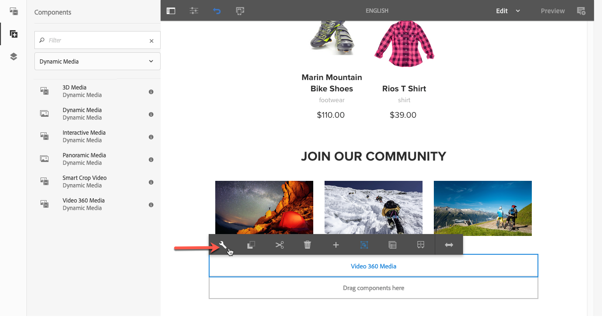

# Adición de recursos de Dynamic Media a las páginas{#adding-dynamic-media-assets-to-pages}

To add the Dynamic Media functionality to assets you use on your websites, you can add the **Dynamic Media**, **Interactive Media**, **Panoramic Media**, or **Video 360 Media** component directly on the page. Para ello, introduzca el modo Diseño y active los componentes de Dynamic Media. A continuación, puede añadir estos componentes a la página y añadir recursos al componente. Los componentes de Dynamic Media son inteligentes: saben si va a añadir una imagen o un vídeo y las opciones de configuración disponibles cambian en consecuencia.

Puede añadir recursos de Dynamic Media directamente a la página si utiliza AEM como WCM. Si utiliza un tercero para WCM, [vincule](/help/assets/dynamic-media/linking-urls-to-yourwebapplication.md) o [incruste](/help/assets/dynamic-media/embed-code.md) los recursos. Para ver un sitio web interactivo de terceros, consulte [Distribución de imágenes optimizadas en un sitio](/help/assets/dynamic-media/responsive-site.md)interactivo.

>[!NOTE]
>
>Debe publicar recursos antes de agregarlos a páginas en AEM. See [Publishing Dynamic Media Assets](/help/assets/dynamic-media/publishing-dynamicmedia-assets.md).

## Adding a Dynamic Media component to a page {#adding-a-dynamic-media-component-to-a-page}

Agregar un componente de Dynamic Media, Interactive Media, Panoramic Media o Video 360 Media a una página es lo mismo que agregar un componente a cualquier página. Los componentes de Dynamic Media se describen en las secciones siguientes.

**Adición de un componente de Dynamic Media a una página**

1. En AEM, abra la página a la que desea añadir el componente de Dynamic Media.
1. En el panel izquierdo, toque el icono **[!UICONTROL Componentes]** y, a continuación, filtre para Medios dinámicos.

   Si no hay componentes de Dynamic Media disponibles, debe activar o activar los componentes de Dynamic Media. Consulte [Edición de plantillas - Autores](/help/sites-cloud/authoring/features/templates.md) de plantillas para obtener más información.

   

1. Arrastre un componente de **[!UICONTROL Dynamic Media]** y colóquelo en la ubicación deseada de la página.

   En el ejemplo siguiente, se utiliza el componente **[!UICONTROL Vídeo 360 Medios]** .

   

1. Sitúe el puntero del ratón directamente sobre el componente. Cuando el componente esté rodeado por un cuadro azul, toque una vez para mostrar la barra de herramientas del componente. Toque el icono **[!UICONTROL Configuración (llave)]** .

   

1. Según el componente Dynamic Media que haya colocado en la página, se abre un cuadro de diálogo de configuración. [Configure las opciones](/help/assets/dynamic-media/adding-dynamic-media-assets-to-pages.md#dynamic-media-components) del componente según sea necesario.

   El ejemplo siguiente muestra el cuadro de diálogo del componente Dynamic Media **[!UICONTROL Video 360 Media]** y las opciones disponibles en la lista desplegable Ajustes preestablecidos de visor.

   

   Componente Dynamic Media Video 360 Media.

1. Cuando haya terminado, toque la marca de verificación para guardar los cambios cerca de la esquina superior derecha del cuadro de diálogo.

## Localización de componentes de Dynamic Media {#localizing-dynamic-media-components}

Puede localizar los componentes de Dynamic Media de una de las dos formas siguientes:

* En una página web de Sitios, abra **[!UICONTROL Propiedades]** y seleccione la ficha **[!UICONTROL Avanzadas]** . Seleccione el idioma que desee para la localización.

   

* En el selector de sitios, seleccione la página o el grupo de páginas que desee. Toque **[!UICONTROL Propiedades]** y seleccione la ficha **[!UICONTROL Avanzadas]** . Seleccione el idioma que desee para la localización.

   >[!NOTE]
   >
   >Tenga en cuenta que actualmente no todos los idiomas disponibles en el menú **[!UICONTROL Idioma]** tienen tokens asignados.

## Componentes de Dynamic Media disponibles {#dynamic-media-components}

Los componentes de Dynamic Media están disponibles cuando toca el icono **[!UICONTROL Componentes]** y, a continuación, se filtran en Medios **[!UICONTROL dinámicos]**.

Los componentes de Dynamic Media disponibles son los siguientes:

* **[!UICONTROL Medios]** dinámicos: se utiliza para recursos como imágenes, vídeos, catálogos electrónicos y conjuntos de giros.
* **[!UICONTROL Medios]** interactivos: se utiliza para cualquier recurso interactivo, como vídeo interactivo, imágenes interactivas o conjuntos de carrusel.
* **[!UICONTROL Medios]** panorámicos: utiliza para imágenes panorámicas o imágenes panorámicas VR.
* **[!UICONTROL Medios]** de vídeo 360: se utilizan para recursos de vídeo de 360 y 360 VR.

>[!NOTE]
>
>Estos componentes no están disponibles de forma predeterminada y deben estar disponibles mediante el editor de plantillas antes de su uso. Una vez que estén disponibles en el editor de plantillas, puede añadir los componentes a la página como lo haría con cualquier otro componente de AEM.

### Componente: Medios dinámicos {#dynamic-media-component}

El componente Dynamic Media es inteligente. Según si agrega una imagen o un vídeo, tiene varias opciones. El componente admite ajustes preestablecidos de imagen, visores basados en imágenes, como conjuntos de imágenes, conjuntos de giros, conjuntos de medios mixtos y vídeo. Además, el visor responde: el tamaño de la pantalla cambia automáticamente en función del tamaño de la pantalla. Todos los visores son visores HTML5.

>[!NOTE]
>
>Si la página web tiene lo siguiente:
>
>* Varias instancias del componente Dynamic Media que se están utilizando en la misma página.
>* Cada instancia utiliza el mismo tipo de recurso.
>
>
Tenga en cuenta que no se admite la asignación de un ajuste preestablecido de visor diferente a cada componente de Dynamic Media en esa página.
>
>Sin embargo, puede utilizar el mismo ajuste preestablecido de visor para todos los componentes de Dynamic Media que utilicen recursos del mismo tipo en la página.

Cuando se añade el componente de Dynamic Media y la opción **[!UICONTROL Configuración de Dynamic Media]** está vacía o no puede añadir un recurso correctamente, compruebe lo siguiente:

* La imagen tiene un archivo TIFF piramidal. Las imágenes importadas antes de la activación de Dynamic Media no tienen un archivo TIFF piramidal.

#### Uso de imágenes {#when-working-with-images}

El componente de Dynamic Media permite añadir imágenes dinámicas, como conjuntos de imágenes, conjuntos de giros y conjuntos de medios mixtos. Puede acercar, alejar y, si procede, girar una imagen en un conjunto de giros o seleccionar una imagen de otro tipo de conjunto.

También puede configurar el ajuste preestablecido de visor, el ajuste preestablecido de imagen o el formato de imagen directamente en el componente. Para hacer que en una imagen sea interactiva, puede establecer puntos de interrupción o aplicar un ajuste preestablecido de imagen interactiva.

You can edit the following Dynamic Media Settings by tapping the **[!UICONTROL Edit]** icon in the component and then **[!UICONTROL Dynamic Media Settings]**.

>[!NOTE]
>
>De forma predeterminada, el componente de imagen de Dynamic Media es adaptable. Si desea convertirlo en un tamaño fijo, configúrelo en el componente en la ficha **[!UICONTROL Avanzado]** con los valores de **[!UICONTROL Anchura]** y **[!UICONTROL Altura]**.

* **[!UICONTROL Ajuste preestablecido]** de visor: seleccione un ajuste preestablecido de visor existente en el menú desplegable. Si el ajuste preestablecido de visor que busca no está visible, es posible que tenga que hacerlo visible. Consulte Administración de ajustes preestablecidos de visor. No es posible seleccionar un ajuste preestablecido de visor si utiliza un ajuste preestablecido de imagen, y viceversa.

   Esta es la única opción disponible al visualizar conjuntos de imágenes, conjuntos de giros o conjuntos de medios mixtos. Los ajustes preestablecidos de visor que se muestran también son inteligentes: solo aparecen los ajustes preestablecidos del visor pertinente.

* **[!UICONTROL Modificadores]** de visor: los modificadores de visor adoptan la forma de par nombre=valor con un delimitador &amp; y permiten cambiar los visores como se describe en la Guía de referencia de visores. Un ejemplo de modificador de visor es `posterimage=img.jpg&caption=text.vtt,1` el que establece una imagen diferente para la miniatura de vídeo y asocia un archivo de subtítulos o subtítulos opcionales al vídeo.

* **[!UICONTROL Ajuste preestablecido]** de imagen: seleccione un ajuste preestablecido de imagen existente en el menú desplegable. Si el ajuste preestablecido de imagen que busca no está visible, es posible que tenga que hacerlo visible. Consulte Administración de ajustes preestablecidos de imagen. No es posible seleccionar un ajuste preestablecido de visor si utiliza un ajuste preestablecido de imagen, y viceversa.

   Esta opción no está disponible si visualiza conjuntos de imágenes, conjuntos de giros o conjuntos de medios mixtos.

* **[!UICONTROL Modificadores]** de imagen: se pueden aplicar efectos de imagen mediante comandos de imagen adicionales. Estos se describen en Ajustes preestablecidos de imagen y en la referencia de comandos de servicio de imágenes.

   Esta opción no está disponible si visualiza conjuntos de imágenes, conjuntos de giros o conjuntos de medios mixtos.

* **[!UICONTROL Puntos de interrupción]**: si utiliza este recurso en un sitio interactivo, debe agregar los puntos de interrupción de la imagen. Los puntos de interrupción de imagen deben separarse por comas (,). Esta opción funciona cuando no se ha definido ninguna altura o anchura en el ajuste preestablecido de una imagen.

   Esta opción no está disponible si visualiza conjuntos de imágenes, conjuntos de giros o conjuntos de medios mixtos.

   You can edit the following Advanced Settings by tapping **[!UICONTROL Edit]** in the component.

* **[!UICONTROL Título]**: permite cambiar el título de la imagen.

* **[!UICONTROL Texto]** alternativo: Agregue un título a la imagen para los usuarios que tienen gráficos desactivados.

   Esta opción no está disponible si visualiza conjuntos de imágenes, conjuntos de giros o conjuntos de medios mixtos.

* **[!UICONTROL URL, Abrir en]**: puede definir un recurso para abrir un vínculo. Defina la dirección URL y, en Abrir en, indique si quiere que se abra en la misma ventana o en una nueva.

   Esta opción no está disponible si visualiza conjuntos de imágenes, conjuntos de giros o conjuntos de medios mixtos.

* **[!UICONTROL Anchura]**: introduzca el valor en píxeles si desea que la imagen tenga un tamaño fijo. Al dejar este valor en blanco, el recurso se adapta.

* **[!UICONTROL Altura]**: introduzca el valor en píxeles si desea que la imagen tenga un tamaño fijo. Al dejar este valor en blanco, el recurso se adapta.

#### Uso de vídeos {#when-working-with-video}

Utilice el componente Dynamic Media para añadir vídeo dinámico a las páginas web. Cuando edita el componente, tiene la opción de usar un ajuste preestablecido de visor de vídeo predefinido para reproducir el vídeo en la página.

You can edit the following Dynamic Media Settings by clicking **[!UICONTROL Edit]** in the component.

>[!NOTE]
>
>De forma predeterminada, el componente de vídeo de Dynamic Media es adaptable. If you want to make it a fixed size, set it in the component with the **[!UICONTROL Width]** and **[!UICONTROL Height]** in the **[!UICONTROL Advanced]** tab.

* **[!Ajuste preestablecido** de visor UICONTROL: seleccione un ajuste preestablecido de visor de vídeo existente en el menú desplegable. Si el ajuste preestablecido de visor que busca no está visible, es posible que tenga que hacerlo visible. Consulte Administración de ajustes preestablecidos de visor. 

* **[!Modificadores** del visor UICONTROL: los modificadores del visor adoptan la forma de par nombre=valor con delimitador &amp; y permiten cambiar los visores como se describe en la Guía de referencia de visores de Adobe. Un ejemplo de modificador de visor es `posterimage=img.jpg&caption=text.vtt,1`

   Con los modificadores de visor, por ejemplo, puede hacer lo siguiente:

   * Asocie un archivo de subtítulos con un vídeo: [rótulo](https://docs.adobe.com/content/help/en/dynamic-media-developer-resources/library/viewers-aem-assets-dmc/video/command-reference-url-video/r-html5-video-viewer-url-caption.html)
   * Asociación de un archivo de navegación con un vídeo: [navegación](https://docs.adobe.com/content/help/en/dynamic-media-developer-resources/library/viewers-aem-assets-dmc/video/command-reference-url-video/r-html5-video-viewer-url-navigation.html)
   You can edit the following Advanced Settings by clicking **[!UICONTROL Edit]** in the component.

* **[!Título** UICONTROL: cambie el título del vídeo.

* **[!UICONTROL Anchura]**: introduzca el valor en píxeles si desea que la imagen tenga un tamaño fijo. Al dejar este valor en blanco, el recurso se adapta.

* **[!UICONTROL Altura]**: introduzca el valor en píxeles si desea que la imagen tenga un tamaño fijo. Al dejar este valor en blanco, el recurso se adapta.

#### Al trabajar con recorte inteligente {#when-working-with-smart-crop}

Utilice el componente Dynamic Media para añadir recursos de imagen de recorte inteligente a sus páginas web. Cuando edita el componente, tiene la opción de usar un ajuste preestablecido de visor de vídeo predefinido para reproducir el vídeo en la página.

Consulte [Uso de Smart Crop con AEM Assets Dynamic Media](https://docs.adobe.com/content/help/en/experience-manager-learn/assets/dynamic-media/smart-crop-feature-video-use.html)

Consulte también Perfiles [de imagen](/help/assets/dynamic-media/image-profiles.md).

You can edit the following Dynamic Media Setting by clicking **[!UICONTROL Edit]** in the component.

>[!NOTE]
>
>De forma predeterminada, el componente de imagen de Dynamic Media es adaptable. Si desea convertirlo en un tamaño fijo, configúrelo en el componente en la ficha **[!UICONTROL Avanzado]** con los valores de **[!UICONTROL Anchura]** y **[!UICONTROL Altura]**.

* **[!UICONTROL Modificadores]** de imagen: se pueden aplicar efectos de imagen mediante comandos de imagen adicionales. Estos se describen en Ajustes preestablecidos de imagen y en la referencia de comandos de servicio de imágenes.

   Esta opción no está disponible si visualiza conjuntos de imágenes, conjuntos de giros o conjuntos de medios mixtos.

   You can edit the following Advanced Settings by clicking **[!UICONTROL Edit]** in the component.

* **[!UICONTROL Habilitar coincidencia]** de relación de aspecto: coincide con la proporción de aspecto de la imagen original al seleccionar una representación de recorte inteligente.

* **[!UICONTROL Título]**: cambie el título de la imagen de recorte inteligente.

* **[!UICONTROL Texto]** alternativo: Agregue un título a la imagen de recorte inteligente para los usuarios que tienen gráficos desactivados.

   Esta opción no está disponible si visualiza conjuntos de imágenes, conjuntos de giros o conjuntos de medios mixtos.

* **[!UICONTROL URL, Abrir en]**: puede definir un recurso para abrir un vínculo. Defina la dirección URL y, en Abrir en, indique si quiere que se abra en la misma ventana o en una nueva.

   Esta opción no está disponible si visualiza conjuntos de imágenes, conjuntos de giros o conjuntos de medios mixtos.

* **[!UICONTROL Anchura]**: introduzca el valor en píxeles si desea que la imagen tenga un tamaño fijo. Al dejar este valor en blanco, el recurso se adapta.

* **[!UICONTROL Altura]**: introduzca el valor en píxeles si desea que la imagen tenga un tamaño fijo. Al dejar este valor en blanco, el recurso se adapta.

### Componente: Medios interactivos {#interactive-media-component}

El componente de Medios interactivos es para los recursos que tienen elementos interactivos integrados en ellos, como puntos interactivos o mapas de imágenes. Si tiene una imagen interactiva, un vídeo interactivo o un titular de carrusel, utilice el componente de **[!UICONTROL Medios interactivos]**.

El componente Medios interactivos es inteligente. Según si agrega una imagen o un vídeo, tiene varias opciones. Además, el visor responde: el tamaño de la pantalla cambia automáticamente en función del tamaño de la pantalla. Todos los visores son visores HTML5.

>[!NOTE]
>
>Si la página web tiene lo siguiente:
>
>* Varias instancias del componente Medios interactivos que se están utilizando en la misma página.
>* Cada instancia utiliza el mismo tipo de recurso.
>
>
Tenga en cuenta que no se admite la asignación de un ajuste preestablecido de visor diferente a cada componente de medios interactivos de esa página.
>
>Sin embargo, puede utilizar el mismo ajuste preestablecido de visor para todos los componentes de medios interactivos que utilicen recursos del mismo tipo en la página.

You can edit the following **[!UICONTROL General]** settings by tapping **[!UICONTROL Edit]** in the component.

* **[!UICONTROL Ajuste preestablecido]** de visor: seleccione un ajuste preestablecido de visor existente en el menú desplegable. Si el ajuste preestablecido de visor que busca no está visible, es posible que tenga que hacerlo visible. Los ajustes preestablecidos de visor se deben publicar para que se puedan usar. Consulte Administración de ajustes preestablecidos de visor. 

* **[!UICONTROL Título]**: cambie el título del vídeo.

* **[!UICONTROL Anchura]**: introduzca el valor en píxeles si desea que la imagen tenga un tamaño fijo. Al dejar este valor en blanco, el recurso se adapta.

* **[!UICONTROL Altura]**: introduzca el valor en píxeles si desea que la imagen tenga un tamaño fijo. Al dejar este valor en blanco, el recurso se adapta.

   Puede editar las siguientes opciones de configuración **[!UICONTROL Añadir a carro]** al hacer clic en **[!UICONTROL Editar]** en el componente.

* **[!UICONTROL Mostrar recurso]** de producto: este valor está seleccionado de forma predeterminada. El recurso del producto muestra una imagen del producto, según se ha definido en el módulo Commerce. Desactive la casilla para no mostrar el recurso del producto.

* **[!UICONTROL Mostrar precio]** del producto: este valor está seleccionado de forma predeterminada. El precio del producto muestra el precio del artículo, según se ha definido en el módulo Commerce. Desactive la casilla para no mostrar el precio del producto.

* **[!UICONTROL Mostrar formulario]** de producto: de forma predeterminada, este valor no está seleccionado. En el formulario del producto se incluye las variantes de producto, como talla y color. Desactive la casilla para no mostrar las variantes del producto.

### Componente: Medios panorámicos {#panoramic-media-component}

El componente de medios panorámicos es para aquellos recursos que son imágenes panorámicas esféricas. Estas imágenes proporcionan una experiencia de visualización de 360° de una habitación, propiedad, ubicación o paisaje. Para que una imagen se considere panorámica esférica, debe tener una O ambas de las opciones siguientes:

* Proporción de aspecto de 2:1.
* Se etiqueta con las palabras clave `equirectangular` o (`spherical` + `panorama`) o (`spherical` + `panoramic`). Consulte [Uso de etiquetas](/help/sites-cloud/authoring/features/tags.md).

Tanto la proporción de aspecto como los criterios de palabra clave se aplican a los recursos panorámicos para la página de detalles de recursos y el componente WCM de medios **[!UICONTROL panorámicas]** .

>[!NOTE]
>
>Si la página web tiene lo siguiente:
>
>* Varias instancias del componente Medios **[!UICONTROL panorámicas]** que se utilizan en la misma página.
>* Cada instancia utiliza el mismo tipo de recurso.
>
>
Tenga en cuenta que no se admite la asignación de un ajuste preestablecido de visor diferente a cada componente de medios **** panorámicas de esa página.
>
>Sin embargo, puede utilizar el mismo ajuste preestablecido de visor para todos los componentes de medios panorámicas que utilicen recursos del mismo tipo en la página.

Puede editar la siguiente configuración tocando **[!UICONTROL Configurar]** en el componente.

* **[!UICONTROL Ajuste preestablecido]** de visor: seleccione un visor existente en el menú desplegable Ajustes preestablecidos de visor.

Si el ajuste preestablecido de visor que está buscando no está visible, asegúrese de que se ha publicado. Debe publicar ajustes preestablecidos de visor para poder utilizarlos. Consulte [Administración de ajustes preestablecidos de visor](/help/assets/dynamic-media/managing-viewer-presets.md). 

### Componente: Medios de vídeo 360 {#video-media-component}

Utilice el componente **[!UICONTROL Vídeo de medios]** 360 para procesar vídeos equirectangulares en la página web para una experiencia de visualización envolvente de una sala, propiedad, ubicación, paisaje o procedimiento médico.

Durante la reproducción en una pantalla plana, el usuario controla el ángulo de visualización; la reproducción en dispositivos móviles suele aprovechar los controles giroscópicos integrados.

El visor incluye compatibilidad nativa con la entrega de 360 recursos de vídeo. De forma predeterminada, no es necesaria ninguna configuración adicional para la visualización o reproducción. El vídeo 360 se distribuye con extensiones de vídeo estándar como .mp4, .mkv y .mov. El códec más común es H.264.

Puede editar la siguiente configuración tocando **[!UICONTROL Configurar]** en el componente.

* **[!UICONTROL Ajuste preestablecido]** de visor: seleccione un visor existente en el menú desplegable Ajustes preestablecidos de visor. Utilice Video360VR para los usuarios finales que utilicen gafas de realidad virtual. Incluye controles básicos de reproducción de vídeo y funciones de medios sociales. Utilice Video360_social, que incluye controles básicos de reproducción de vídeo. La representación de vídeo se realiza en modo estéreo. El control manual del punto de vista está desactivado, pero el control giroscópico está activado. No hay características de medios sociales.

Si el ajuste preestablecido de visor que está buscando no está visible, asegúrese de que se ha publicado. Debe publicar ajustes preestablecidos de visor para poder utilizarlos. Consulte [Administración de ajustes preestablecidos de visor](/help/assets/dynamic-media/managing-viewer-presets.md). 

### Uso de HTTP/2 para enviar recursos de Dynamic Media {#using-http-to-delivery-dynamic-media-assets}

HTTP/2 es el nuevo protocolo web actualizado que mejora la forma en que se comunican los exploradores y los servidores. Proporciona una transferencia de información más rápida y reduce la cantidad de potencia de procesamiento necesaria. La entrega de recursos de Dynamic Media ahora puede realizarse a través de HTTP/2, lo que proporciona mejores tiempos de respuesta y carga.

Consulte Envío de contenido  HTTP2 para obtener información detallada sobre cómo empezar a utilizar HTTP/2 con su cuenta de Dynamic Media.

>[!MORELIKETHIS]
>
>* [Uso del reproductor de vídeo en AEM Dynamic Media](https://docs.adobe.com/content/help/en/experience-manager-learn/assets/dynamic-media/dynamic-media-video-player-feature-video-use.html)
>* [Uso de vídeo interactivo con Dynamic Media de AEM](https://docs.adobe.com/content/help/en/experience-manager-learn/assets/dynamic-media/dynamic-media-interactive-video-feature-video-use.html)
>* [Información sobre Asset Viewer con AEM Dynamic Media](https://docs.adobe.com/content/help/en/experience-manager-learn/assets/dynamic-media/dynamic-media-viewer-feature-video-understand.html)
>* [Uso de miniaturas de vídeo personalizadas con AEM Dynamic Media](https://docs.adobe.com/content/help/en/experience-manager-learn/assets/dynamic-media/dynamic-media-video-thumbnails-feature-video-use.html)
>* [Explicación de la administración de color con los medios dinámicos de AEM](https://docs.adobe.com/content/help/en/experience-manager-learn/assets/dynamic-media/dynamic-media-color-management-technical-video-setup.html)
>* [Uso del enfoque de imágenes con AEM Dynamic Media](https://docs.adobe.com/content/help/en/experience-manager-learn/assets/dynamic-media/dynamic-media-image-sharpening-feature-video-use.html)

