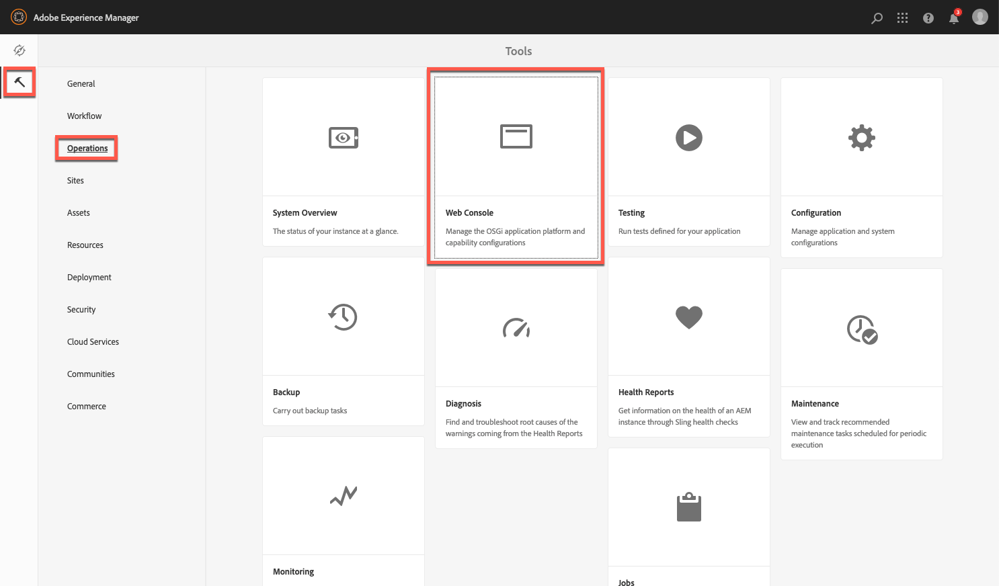

# Acerca de la configuración de Dynamic Media Cloud Service {#configuring-dynamic-media}

{{work-with-dynamic-media}}

Si utiliza Adobe Experience Manager as a Cloud Service para diferentes entornos, como desarrollo, ensayo y producción en directo, configure Dynamic Media Cloud Services para cada uno de esos entornos.

Consulte también [Configurar una cuenta de alias de compañía de Dynamic Media](/help/assets/dynamic-media/dm-alias-account.md)

>[!IMPORTANT]
>
>**Dynamic Media (Scene7) no se admite en entornos de seguridad mejorada**
>
>Dynamic Media (Scene7) en AEM as a Cloud Service no está preparado para HIPAA y no se puede utilizar en entornos de AEM en los que la seguridad mejorada esté habilitada.
>
>A partir de la versión de abril de 2025 de AEM as a Cloud Service, una restricción técnica impide que Dynamic Media (Scene7) se configure en entornos con seguridad mejorada. Como resultado, la tarjeta de **Configuración de Dynamic Media** en **Herramientas** > **Cloud Services** ya no es visible en estos entornos.
>
>Además, los clientes que utilizan AEM 6.5 deben tener en cuenta que la pila de Dynamic Media (Scene7) no está preparada para HIPAA.

## Diagrama de arquitectura de Dynamic Media {#architecture-diagram-of-dynamic-media}

El siguiente diagrama de arquitectura describe cómo funciona Dynamic Media.

Con la nueva arquitectura, Experience Manager es responsable de los recursos de origen principales y se sincroniza con Dynamic Media para el procesamiento y la publicación de recursos:

1. Cuando el recurso de origen principal se carga en Adobe Experience Manager as a Cloud Service, se replica en Dynamic Media. En este punto, Dynamic Media gestiona todo el procesamiento de recursos y la generación de representaciones, como la codificación de vídeo y las variantes dinámicas de una imagen.
1. Una vez generadas las representaciones, Experience Manager as a Cloud Service puede acceder de forma segura a las representaciones remotas de Dynamic Media y previsualizarlas (no se envían binarios a la instancia de Experience Manager as a Cloud Service).
1. Una vez que el contenido está listo para publicar y aprobar, el servicio Dynamic Media déclencheur el contenido push en los servidores de entrega y el contenido de caché en la CDN (red de distribución de contenido).

>[!NOTE]
>
>La siguiente lista de funciones requiere que utilice la CDN predeterminada que está incluida con Adobe Experience Manager - Dynamic Media. Estas funciones no admiten ninguna otra CDN personalizada.
>
>* [Imágenes inteligentes](/help/assets/dynamic-media/imaging-faq.md)
>* [Invalidación de caché](/help/assets/dynamic-media/invalidate-cdn-cache-dynamic-media.md)
>* [Protección de vínculos interactivos](/help/assets/dynamic-media/hotlink-protection.md)
>* [Envío de contenido HTTP/2](/help/assets/dynamic-media/http2faq.md)
>* Redireccionamiento de URL en el nivel de CDN
>* Akamai ChinaCDN (para una entrega óptima en China)

<!-- OBSOLETE CONTENT

## (Optional) Migrating Dynamic Media presets and configurations from 6.3 to 6.5 Zero Downtime {#optional-migrating-dynamic-media-presets-and-configurations-from-to-zero-downtime}

If you are upgrading Experience Manager as a Cloud Service Dynamic Media from 6.3 to 6.4 or 6.5 (which now includes the ability for zero downtime deployments), you are required to run the following curl command to migrate all your presets and configurations from `/etc` to `/conf` in CRXDE Lite.

>[!NOTE]
>
>If you run your Experience Manager as a Cloud Service instance in compatibility mode--that is, you have the compatibility packaged installed--you do not need to run these commands.

For all upgrades, either with or without the compatibility package, you can copy the default, out-of-the-box viewer presets that originally came with Dynamic Media by running the following Linux curl command:

`curl -u admin:admin -X POST https://<server_address>:<server_port>/libs/settings/dam/dm/presets/viewer.pushviewerpresets.json`

To migrate any custom viewer presets and configurations that you have created from `/etc` to `/conf`, run the following Linux curl command:

`curl -u admin:admin -X POST https://<server_address>:<server_port>/libs/settings/dam/dm/presets.migratedmcontent.json`

-->

## Crear una configuración de Dynamic Media en Cloud Services {#configuring-dynamic-media-cloud-services}

<!-- **Before you creating a Dynamic Media Configuration in Cloud Services**: After you receive your provisioning email with Dynamic Media credentials, you must open the [Dynamic Media Classic desktop application](https://experienceleague.adobe.com/docs/dynamic-media-classic/using/getting-started/signing-out.html?lang=es#getting-started), then sign in to your account to change your password. The password provided in the provisioning email is system-generated and intended to be a temporary password only. It is important that you update the password so that Dynamic Media Cloud Service is set up with the correct credentials. -->

1. En Experience Manager as a Cloud Service, seleccione el logotipo de Experience Manager as a Cloud Service para acceder a la consola de navegación global.
1. A la izquierda de la consola, selecciona el icono Herramientas y luego ve a **[!UICONTROL Cloud Services > Configuración de Dynamic Media]**.
1. En la página Explorador de configuración de Dynamic Media, en el panel izquierdo, seleccione **[!UICONTROL global]** (no seleccione el icono de carpeta a la izquierda de **[!UICONTROL global]**). Luego selecciona **[!UICONTROL Crear]**.
1. En la página **[!UICONTROL Crear configuración de Dynamic Media]**, escriba el título, la dirección de correo electrónico y la contraseña de la cuenta de Dynamic Media del administrador de empresa de la cuenta de Dynamic Media y, a continuación, seleccione su región. Adobe proporciona esta información en el correo electrónico de aprovisionamiento. Póngase en contacto con Asistencia al cliente de Adobe si no recibió este correo electrónico.
1. Seleccione **[!UICONTROL Conectarse a Dynamic Media]**.
1. En el cuadro de diálogo **[!UICONTROL Cambiar contraseña]**, en el campo **[!UICONTROL Nueva contraseña]**, escriba una nueva contraseña que contenga de 8 a 25 caracteres. La contraseña debe contener al menos una de las siguientes opciones:

   * Letra mayúscula
   * Letra minúscula
   * Número
   * Carácter especial: `# $ & . - _ : { }`

   El campo **[!UICONTROL Contraseña actual]** se ha rellenado previamente de forma intencionada y se ha ocultado de la interacción.

   Si es necesario, puede revisar la ortografía de una contraseña que haya escrito o vuelto a escribir seleccionando el icono ojo de contraseña para revelar la contraseña. Vuelva a seleccionar el icono para ocultar la contraseña.

1. En el campo **[!UICONTROL Repetir contraseña]**, vuelva a escribir la nueva contraseña y, a continuación, seleccione **[!UICONTROL Listo]**.

   La nueva contraseña se guarda al seleccionar **[!UICONTROL Guardar]** en la esquina superior derecha de la página **[!UICONTROL Crear configuración de Dynamic Media]**.

   Si seleccionó **[!UICONTROL Cancelar]** en el cuadro de diálogo **[!UICONTROL Cambiar contraseña]**, debe escribir una nueva contraseña cuando guarde la configuración de Dynamic Media creada.

   Vea también [Cambiar la contraseña a Dynamic Media](#change-dm-password).

1. Cuando la conexión se realiza correctamente, puede establecer lo siguiente:

   | Propiedad | Descripción |
   |---|---|
   | Compañía | Nombre de la cuenta de Dynamic Media. **Importante**: solo se admite una configuración de Dynamic Media en Cloud Services en una instancia de Experience Manager; no agregue más de una configuración. Adobe *no* admite o recomienda configurar varias configuraciones de Dynamic Media en una sola instancia de Experience Manager.<!-- CQDOC-19579 and CQDOC-19612 --> Consulte también [Configurar una cuenta de alias de compañía de Dynamic Media](/help/assets/dynamic-media/dm-alias-account.md). |
   | Ruta de carpeta raíz de la empresa | Ruta de la carpeta raíz de su empresa. |
   | Publicación de recursos | Puede elegir entre las tres opciones siguientes: **[!UICONTROL Inmediatamente &#x200B;]**: cuando se cargan los recursos, el sistema los ingiere y proporciona la dirección URL o incrustación al instante. No es necesaria la intervención del usuario para publicar los recursos. **[!UICONTROL En la activación]**: primero debe publicar explícitamente el recurso antes de que se proporcione un vínculo URL/incrustado. **[!UICONTROL Publicación selectiva &#x200B;]**: Assets se publica automáticamente solo para vista previa segura. También se pueden publicar explícitamente en Experience Manager as a Cloud Service sin publicar en DMS7 para envío de dominio público. En el futuro, esta opción pretende publicar recursos en Experience Manager as a Cloud Service y publicarlos en Dynamic Media, mutuamente excluyentes entre sí. Es decir, puede publicar recursos en DMS7 para poder utilizar funciones como Recorte inteligente o representaciones dinámicas. O bien, puede publicar recursos exclusivamente en Experience Manager as a Cloud Service para previsualizarlos. Estos mismos recursos no se publican en DMS7 para su envío de dominio público. |
   | Servidor de previsualización segura | Permite especificar la ruta de URL al servidor de previsualización de representaciones seguras. Es decir, una vez generadas las representaciones, AEM as a Cloud Service puede acceder de forma segura a las representaciones remotas de Dynamic Media y previsualizarlas (no se envían binarios de vuelta a la instancia de as a Cloud Service de Experience Manager). A menos que tenga un arreglo especial para utilizar el servidor de su propia compañía o un servidor especial, Adobe recomienda dejar este ajuste como se ha especificado. |
   | Sincronizar todo el contenido | Seleccionado de forma predeterminada. Anule la selección de esta opción si desea incluir o excluir recursos de forma selectiva de la sincronización con Dynamic Media. Al anular la selección de esta opción, puede elegir entre los dos modos de sincronización de Dynamic Media siguientes:  **[!UICONTROL Modo de sincronización de Dynamic Media]** **[!UICONTROL Habilitar de forma predeterminada &#x200B;]**: la configuración se aplica a todas las carpetas de forma predeterminada a menos que marque una carpeta específicamente para la exclusión. <!-- you can then deselect the folders that you do not want the configuration applied to.--> **[!UICONTROL Deshabilitado de forma predeterminada]**: la configuración no se aplicará a ninguna carpeta hasta que marque explícitamente una carpeta seleccionada para sincronizar con Dynamic Media. Para marcar una carpeta seleccionada para sincronizar con Dynamic Media, seleccione una carpeta de recursos y, a continuación, en la barra de herramientas, seleccione **[!UICONTROL Propiedades]**. En la ficha **[!UICONTROL Detalles]**, en la lista desplegable **[!UICONTROL Modo de sincronización de Dynamic Media]**, elija una de las tres opciones siguientes. Cuando haya terminado, seleccione **[!UICONTROL Guardar]**. _Recuerde: estas tres opciones no están disponibles si seleccionó&#x200B;**Sincronizar todo el contenido**&#x200B;anteriormente._ Vea también [Trabajar con publicación selectiva a nivel de carpeta en Dynamic Media](/help/assets/dynamic-media/selective-publishing.md). **[!UICONTROL Heredado &#x200B;]**: no hay ningún valor de sincronización explícito en la carpeta. En su lugar, la carpeta hereda el valor de sincronización de una de sus carpetas antecesoras o el modo predeterminado en la configuración de la nube. Estado detallado de los programas heredados mediante información sobre herramientas. **[!UICONTROL Habilitar para subcarpetas]**: incluya todo en este subárbol para sincronizar con Dynamic Media. La configuración específica de la carpeta anula el modo predeterminado en la configuración de la nube. **[!UICONTROL Deshabilitado para subcarpetas &#x200B;]**- Excluye todo en este subárbol de la sincronización con Dynamic Media. |

   >[!NOTE]
   >
   >No se admite el control de versiones en Dynamic Media. Además, la activación retrasada solo se aplica si **[!UICONTROL Publicar Assets]** en la página Editar configuración de Dynamic Media está establecida en **[!UICONTROL Tras la activación]**. Y, a continuación, solo hasta la primera vez que se activa el recurso.
   >
   >
   >Una vez activado un recurso, las actualizaciones se publican inmediatamente en la entrega de S7.

   

1. Seleccione **[!UICONTROL Guardar]**. Se guardarán la nueva contraseña y configuración de Dynamic Media. Si seleccionó **[!UICONTROL Cancelar]** en su lugar, no se actualizará la contraseña.
1. En el cuadro de diálogo **[!UICONTROL Configurar Dynamic Media]**, seleccione **[!UICONTROL Aceptar]** para comenzar la configuración.

   >[!IMPORTANT]
   >
   >Cuando la nueva configuración de Dynamic Media finalice, recibirá una notificación de estado en la bandeja de entrada de Experience Manager as a Cloud Service.
   >
   >Esta notificación de la bandeja de entrada le informa si la configuración se ha realizado correctamente o no.
   > Consulte [Solucionar problemas de una nueva configuración de Dynamic Media](#troubleshoot-dm-config) y [Su bandeja de entrada](/help/sites-cloud/authoring/inbox.md) para obtener más información.

1. Para obtener una vista previa del contenido de Dynamic Media de forma segura antes de publicarlo, Experience Manager as a Cloud Service utiliza la validación basada en tokens y, por lo tanto, Experience Manager Author obtiene una vista previa del contenido de Dynamic Media de forma predeterminada. Sin embargo, puede *lista de permitidos* IP más para proporcionar a los usuarios acceso seguro a la vista previa del contenido. Para configurar esta acción en Experience Manager as a Cloud Service, consulte [Configurar la configuración de publicación de Dynamic Media para el servidor de imágenes: ficha Seguridad](/help/assets/dynamic-media/dm-publish-settings.md#security-tab). <!-- To securely preview Dynamic Media content before it gets published, you must "allowlist" the Experience Manager as a Cloud Service author instance to connect to Dynamic Media. To set up this action, do the following: -->

<!--
    * Open the [Dynamic Media Classic desktop application](https://experienceleague.adobe.com/docs/dynamic-media-classic/using/getting-started/signing-out.html?lang=es#getting-started), then sign in to your account. Your credentials and sign-in details were provided by Adobe at the time of provisioning. If you do not have this information, contact Adobe Customer Support.
    * On the navigation bar near the upper right corner of the page, go to **[!UICONTROL Setup]** > **[!UICONTROL Application Setup]** > **[!UICONTROL Publish Setup]** > **[!UICONTROL Image Server]**.
    * On the Image Server Publish page, in the **[!UICONTROL Publish Context]** drop-down list, select **[!UICONTROL Test Image Serving]**.
    * For the Client Address Filter, select **[!UICONTROL Add]**.
    * To enable (turn on) the address, select the check box, then enter the IP address of the Experience Manager Author instance (not Dispatcher IP).
    * Select **[!UICONTROL Save]**. -->

Ya ha terminado la configuración básica; está listo para usar Dynamic Media.

Si desea personalizar aún más la configuración, como habilitar los permisos de ACL (Lista de control de acceso), puede completar opcionalmente cualquiera de las tareas en [Configurar la configuración avanzada en Dynamic Media](#optional-configuring-advanced-settings-in-dynamic-media-scene-mode).

### Solución de problemas de una nueva configuración de Dynamic Media {#troubleshoot-dm-config}

Cuando una nueva configuración de Dynamic Media finalice, recibirá una notificación de estado en la bandeja de entrada de Experience Manager as a Cloud Service. Esta notificación le informa si la configuración se ha realizado correctamente o no, tal como se ve en las siguientes imágenes respectivas de la bandeja de entrada.

Vea también [Su bandeja de entrada](/help/sites-cloud/authoring/inbox.md).

**Para solucionar problemas de una nueva configuración de Dynamic Media:**

1. Cerca de la esquina superior derecha de la página as a Cloud Service de Experience Manager, seleccione el icono de campana y, a continuación, seleccione **[!UICONTROL Ver todo]**.
1. En la página Bandeja de entrada, seleccione la notificación de éxito para leer una descripción general del estado y los registros de la configuración.

   Si la configuración falla, seleccione la notificación de error similar a la siguiente captura de pantalla.

   

1. En la página **[!UICONTROL DMSETUP]**, revise los detalles de configuración que describen el error. En particular, tome nota de cualquier mensaje de error o código de error. Póngase en contacto con Asistencia al cliente de Adobe con esta información.

   

### Cambiar la contraseña a Dynamic Media {#change-dm-password}

La caducidad de la contraseña en Dynamic Media se establece en 100 años a partir de la fecha actual del sistema.

La contraseña debe contener al menos una de las siguientes opciones:

* Letra mayúscula
* Letra minúscula
* Número
* Carácter especial: `# $ & . - _ : { }`

Si es necesario, puede revisar la ortografía de una contraseña que haya escrito o vuelto a escribir seleccionando el icono ojo de contraseña para revelar la contraseña. Vuelva a seleccionar el icono para ocultar la contraseña.

La contraseña modificada se guarda al seleccionar **[!UICONTROL Guardar]** en la esquina superior derecha de la página **[!UICONTROL Editar configuración de Dynamic Media]**.

1. En Experience Manager as a Cloud Service, seleccione el logotipo de Experience Manager as a Cloud Service para acceder a la consola de navegación global.
1. A la izquierda de la consola, selecciona el icono Herramientas y luego ve a **[!UICONTROL Cloud Services > Configuración de Dynamic Media]**.
1. En la página Explorador de configuración de Dynamic Media, en el panel izquierdo, seleccione **[!UICONTROL global]**. No seleccione el icono de carpeta a la izquierda de **[!UICONTROL global]**. A continuación, seleccione **[!UICONTROL Editar]**.
1. En la página **[!UICONTROL Editar configuración de Dynamic Media]**, directamente debajo del campo **[!UICONTROL Contraseña]**, seleccione **[!UICONTROL Cambiar contraseña]**.
1. En el cuadro de diálogo **[!UICONTROL Cambiar contraseña]**, haga lo siguiente:

   * En el campo **[!UICONTROL Nueva contraseña]**, escriba una nueva contraseña.

     El campo **[!UICONTROL Contraseña actual]** se ha rellenado previamente de forma intencionada y se ha ocultado de la interacción.

   * En el campo **[!UICONTROL Repetir contraseña]**, vuelva a escribir la nueva contraseña y, a continuación, seleccione **[!UICONTROL Listo]**.

1. En la esquina superior derecha de la página **[!UICONTROL Editar configuración de Dynamic Media]**, seleccione **[!UICONTROL Guardar]** y, a continuación, seleccione **[!UICONTROL Aceptar]**.

## (Opcional) Configurar la configuración avanzada en Dynamic Media{#optional-configuring-advanced-settings-in-dynamic-media-scene-mode}

Para personalizar aún más la configuración de Dynamic Media o optimizar su rendimiento, puede completar una o más de las siguientes _tareas opcionales_:

* [(Opcional) Habilite los permisos de ACL en Dynamic Media](#optional-enable-acl)
* [(Opcional) Instalación y configuración de ajustes de Dynamic Media](#optional-setup-and-configuration-of-dynamic-media-scene-mode-settings)
* [(Opcional) Ajuste el rendimiento de Dynamic Media](#optional-tuning-the-performance-of-dynamic-media-scene-mode)

<!--

* [(Optional) Filtering assets for replication](#optional-filtering-assets-for-replication)

-->

<!-- Removed as per CQDOC-20701 - May need to revisit and update. In Adobe Experience Manager (AEM) as a Cloud Service, enabling Access Control List (ACL) permissions for Dynamic Media requires a different approach compared to on-premise versions (which was described below), as direct editing of OSGi configurations via the UI is not supported. Not sure how this is done now. For example, you can manage ACLs using tools like the Netcentric Access Control Tool (AC Tool), which simplifies the specification and deployment of complex ACLs in AEM but I doubt that's the recommended method.

### (Optional) Enable Access Control List permissions in Dynamic Media {#optional-enable-acl}

When you run Dynamic Media on AEM as a Cloud Service, it currently forwards `/is/image` requests to Secure Preview Image Serving without checking ACL (Access Control List) permissions on the PlatformServerServlet. You can, however, _enable_ ACL permissions. Doing so forwards the authorized `/is/image` requests. If a user is not authorized to access the asset, a "403 - Forbidden" error is displayed.

**To enable Access Control List permissions in Dynamic Media on AEM as a Cloud Service:**

1. From Adobe Experience Manager, navigate to **[!UICONTROL Tools]** > **[!UICONTROL Operations]** > **[!UICONTROL Web Console]**.

   

1. A new browser tab opens to the **[!UICONTROL Adobe Experience Manager Web Console Configuration]** page.

   

1. On the page, scroll to the name _Adobe CQ Scene7 PlatformServer_.

1. To the right of the name, select the pencil icon (**[!UICONTROL Edit the configuration values]**).

1. On the **com.adobe.cq.dam.s7imaging.impl.ps.PlatformServerServlet.name** page, select the check box for the following two settings:

   * `com.adobe.cq.dam.s7imaging.impl.ps.PlatformServerServlet.cache.enable.name` &ndash; When enabled, this setting caches permission results for two minutes (default) to save.
   * `com.adobe.cq.dam.s7imaging.impl.ps.PlatformServerServlet.validate.userAccess.name` &ndash; When enabled, this setting validates a user's access while they preview assets by way of Dynamic Media Image Server.

   

1. Near the lower-right corner of the page, select **[!UICONTROL Save]**.
-->

### (Opcional) Instalación y configuración de ajustes de Dynamic Media {#optional-setup-and-configuration-of-dynamic-media-scene-mode-settings}

Utilice la interfaz de usuario de Dynamic Media Classic para cambiar la configuración de Dynamic Media.

<!-- Some of the tasks above require that you open the [Dynamic Media Classic desktop application](https://experienceleague.adobe.com/docs/dynamic-media-classic/using/getting-started/signing-out.html?lang=es#getting-started), then sign in to your account. -->

Las tareas de instalación y configuración incluyen las siguientes:

* [Configuración del programa de instalación de publicación de Dynamic Media para el servidor de imágenes](#publishing-setup-for-image-server)
* [Configuración general de Dynamic Media](#configuring-application-general-settings)
* [Configurar la administración de color](#configuring-color-management)
* [Editar tipos MIME para formatos compatibles](#editing-mime-types-for-supported-formats)
* [Adición de tipos MIME para formatos no compatibles](#adding-mime-types-for-unsupported-formats)
<!-- OBSOLETE BUT LEAVE FOR POSSIBLE FUTURE* [Creating batch set presets to auto-generate Image Sets and Spin Sets](#creating-batch-set-presets-to-auto-generate-image-sets-and-spin-sets) -->

#### Configuración del programa de instalación de publicación de Dynamic Media para el servidor de imágenes {#publishing-setup-for-image-server}

La página Configuración de publicación de Dynamic Media establece la configuración predeterminada que determina cómo se envían los recursos desde los servidores de Dynamic Media de Adobe a los sitios web o las aplicaciones.

Consulte [Configurar la instalación de publicación de Dynamic Media para el servidor de imágenes](/help/assets/dynamic-media/dm-publish-settings.md).

#### Configuración general de Dynamic Media {#configuring-application-general-settings}

Configure la URL de Dynamic Media **[!UICONTROL Nombre del servidor de publicación]** y la URL de **[!UICONTROL Nombre del servidor de origen]**. También puede especificar la configuración de **[!UICONTROL Cargar a la aplicación]** y **[!UICONTROL Opciones de carga predeterminadas]**, todo en función de su caso de uso particular.

Consulte [Configuración general de Dynamic Media](/help/assets/dynamic-media/dm-general-settings.md).

#### Configurar la administración de color {#configuring-color-management}

La administración de color de Dynamic Media le permite corregir el color de los recursos. Con la corrección de color, los recursos ingeridos conservan su espacio de color (RGB, CMYK, gris) y su perfil de color incrustado. Cuando se solicita una representación dinámica, el color de la imagen se corrige en el espacio de color de destino mediante la salida CMYK, RGB o Gris.

Consulte [Configurar ajustes preestablecidos de imagen](/help/assets/dynamic-media/managing-image-presets.md).

Para configurar las propiedades de color predeterminadas para habilitar la corrección de color al solicitar imágenes:

1. Abra la [aplicación de escritorio de Dynamic Media Classic](https://experienceleague.adobe.com/es/docs/dynamic-media-classic/using/getting-started/signing-out#getting-started) y luego inicie sesión en su cuenta con las credenciales proporcionadas durante el aprovisionamiento.
1. Vaya a **[!UICONTROL Configuración > Configuración de aplicación]**.
1. Expanda el área **[!UICONTROL Ajustes de publicación]** y seleccione **[!UICONTROL Servidor de imágenes]**. Configure **[!UICONTROL Publicar contexto]** en **[!UICONTROL Servicio de imágenes]** cuando establezca los valores predeterminados para las instancias de publicación.
1. Desplácese hasta la propiedad que debe cambiar; por ejemplo, una propiedad del área **[!UICONTROL Atributos de administración de color]**.
Se pueden definir las siguientes propiedades de corrección de color:

   | Propiedad | Descripción |
   |---|---|
   | Espacio de color predeterminado CMYK | Nombre del perfil de color CMYK predeterminado. |
   | Espacio de color predeterminado de escala de grises | Nombre del perfil de color gris predeterminado. |
   | Espacio de color predeterminado de RGB | Nombre del perfil de color predeterminado de RGB. |
   | Interpretación de conversión de color | Especifica la intención de procesamiento. Los valores aceptables son: **[!UICONTROL perceptual]**, **[!UICONTROL colométrico relativo]**, **[!UICONTROL saturación]**, **[!UICONTROL colométrico absoluto]**. Adobe recomienda **[!UICONTROL relative]** como valor predeterminado. |

1. Seleccione **[!UICONTROL Guardar]**.

Por ejemplo, puede establecer el **[!UICONTROL espacio de color predeterminado RGB]** en *sRGB* y el **[!UICONTROL espacio de color predeterminado CMYK]** en *WebCoated*.

Al hacerlo, se haría lo siguiente:

* Activa la corrección de color para imágenes RGB y CMYK.
* Se supone que las imágenes de RGB que no tienen un perfil de color están en el espacio de color *sRGB*.
* Se supone que las imágenes CMYK que no tienen un perfil de color están en *WebCoated* espacio de color.
* Representaciones dinámicas que devuelven la salida de RGB, devuélvala en el espacio de color *sRGB*.
* Representaciones dinámicas que devuelven resultados CMYK, devuélvalos en el espacio de color *WebCoated*.

#### Editar tipos MIME para formatos compatibles {#editing-mime-types-for-supported-formats}

Puede especificar los tipos de recursos que procesa Dynamic Media y personalizar los parámetros avanzados de procesamiento de recursos. Por ejemplo, puede especificar parámetros de procesamiento de recursos para hacer lo siguiente:

* Convertir un Adobe PDF en un recurso de catálogo electrónico.
* Convierta un documento de Adobe Photoshop (.PSD) en un recurso de plantilla de banner para personalización.
* Rasterizar un archivo Adobe Illustrator (.AI) o un archivo PostScript® encapsulado de Adobe Photoshop (.EPS).
* [Perfiles de vídeo](/help/assets/dynamic-media/video-profiles.md) y [Perfiles de imagen](/help/assets/dynamic-media/image-profiles.md) se pueden usar para definir el procesamiento de vídeos e imágenes, respectivamente.

Consulte [Cargar recursos](/help/assets/add-assets.md).

**Para editar tipos MIME para formatos compatibles:**

1. Inicie sesión en Experience Manager as a Cloud Service como administrador del producto.
1. En Experience Manager as a Cloud Service, seleccione el logotipo de Experience Manager as a Cloud Service para acceder a la consola de navegación global y, a continuación, vaya a **[!UICONTROL General > CRXDE Lite]**.

   Si no tiene acceso a CRXDE Lite, consulte [Uso de CRXDE Lite](/help/implementing/developing/tools/crxde.md).

1. En el carril izquierdo, vaya a lo siguiente:

   `/conf/global/settings/cloudconfigs/dmscene7/jcr:content/mimeTypes`

   

1. En la carpeta mimeTypes, seleccione un tipo MIME.
1. En el lado derecho de la página de CRXDE Lite, en la parte inferior:

   * Seleccione el campo **[!UICONTROL enabled]**. De forma predeterminada, todos los tipos MIME de recursos están habilitados (establecidos en **[!UICONTROL true]**), lo que significa que los recursos se sincronizan con Dynamic Media para su procesamiento. Si desea excluir el procesamiento de este tipo MIME de recurso, cambie este valor a **[!UICONTROL false]**.

   * Seleccione **[!UICONTROL jobParam]** para abrir su campo de texto asociado. Consulte [Tipos MIME admitidos](/help/assets/file-format-support.md) para obtener una lista de los valores de parámetros de procesamiento permitidos que puede utilizar para un tipo MIME determinado.

1. Realice una de las siguientes acciones:
   * Repita los pasos del 3 al 4 para editar más tipos MIME.
   * En la barra de menús de la página CRXDE Lite, seleccione **[!UICONTROL Guardar todo]**.

1. En la esquina superior izquierda de la página, seleccione **[!UICONTROL CRXDE Lite]** para regresar a Experience Manager as a Cloud Service.

#### Adición de tipos MIME para formatos no compatibles {#adding-mime-types-for-unsupported-formats}

Puede agregar tipos MIME personalizados para formatos no compatibles en Experience Manager Assets. Para evitar que Experience Manager elimine cualquier nodo nuevo que agregue a CRXDE Lite, mueva el tipo MIME antes de `image_`. Además, asegúrese de que su valor habilitado esté establecido en **[!UICONTROL false]**.

**Para agregar tipos MIME para formatos no admitidos:**

1. Inicie sesión en Experience Manager as a Cloud Service como administrador del producto.
1. En Experience Manager as a Cloud Service, vaya a **[!UICONTROL Herramientas > Operaciones > Consola web]**.

   

1. Se abre una nueva pestaña del explorador en la página **[!UICONTROL Configuración de la consola web de Adobe Experience Manager]**.

   

1. En la página, desplácese hacia abajo hasta el nombre *Servicio MIME de tipo de recurso de Adobe CQ Scene7*, tal como se ve en la siguiente captura de pantalla. A la derecha del nombre, seleccione **[!UICONTROL Editar los valores de configuración]** (icono de lápiz).

   

1. En la página **Servicio MIME de tipo de recurso de Adobe CQ Scene7**, seleccione cualquier icono de signo más &lt;+>. La ubicación en la tabla donde selecciona el signo más para agregar el nuevo tipo MIME es trivial.

   

1. Escriba `DWG=image/vnd.dwg` en el campo de texto vacío que acaba de agregar.

   El tipo MIME `DWG=image/vnd.dwg` es solo para propósitos de ejemplo. El tipo MIME que agregue aquí puede ser cualquier otro formato no compatible.

   

1. En la esquina inferior derecha de la página, seleccione **[!UICONTROL Guardar]**.

   En este punto, puede cerrar la pestaña del explorador que tiene abierta la página Configuración de la consola web de Adobe Experience Manager.

1. Vuelva a la pestaña del explorador que tenga la consola as a Cloud Service de Experience Manager abierta.
1. En Experience Manager as a Cloud Service, vaya a **[!UICONTROL Herramientas > General > CRXDE Lite]**.

   Si no tiene acceso a CRXDE Lite, consulte [Uso de CRXDE Lite](/help/implementing/developing/tools/crxde.md).

   

1. En el carril izquierdo, vaya a lo siguiente:

   `conf/global/settings/cloudconfigs/dmscene7/jcr:content/mimeTypes`

1. Arrastre el tipo MIME `image_vnd.dwg` y suéltelo directamente sobre `image_` en el árbol, tal como se ve en la siguiente captura de pantalla.

   

1. Con el tipo MIME `image_vnd.dwg` aún seleccionado, en la ficha **[!UICONTROL Propiedades]**, en la fila **[!UICONTROL habilitada]**, bajo el encabezado de columna **[!UICONTROL Valor]**, seleccione dos veces el valor. Se abre la lista desplegable **[!UICONTROL Valor]**.
1. Escriba `false` en el campo (o seleccione **[!UICONTROL false]** de la lista desplegable).

   

1. Cerca de la esquina superior izquierda de la página CRXDE Lite, seleccione **[!UICONTROL Guardar todo]**.

### (Opcional) Ajuste el rendimiento de Dynamic Media {#optional-tuning-the-performance-of-dynamic-media-scene-mode}

Para que Dynamic Media se ejecute sin problemas, Adobe recomienda las siguientes sugerencias de ajuste preciso del rendimiento y la escalabilidad de la sincronización:

* [Actualice los parámetros de trabajo predefinidos para procesar diferentes formatos de archivo](#update-job-para).
* [Actualizar los hilos de trabajo predefinidos de la cola de flujo de trabajo de Granite (recursos de vídeo)](#update-granite-workflow-queue-worker-threads-video)
* [Actualice los subprocesos de trabajo predefinidos de la cola de flujo de trabajo transitorio de Granite (imágenes y recursos que no sean de vídeo)](#update-granite-transient-workflow-queue-worker-threads-images).
* [Actualice el número máximo de conexiones de carga al servidor de Dynamic Media Classic (Scene7)](#update-max-s7-upload-connections).

#### Actualizar los parámetros de trabajo predefinidos para procesar diferentes formatos de archivo {#update-job-para}

Puede ajustar los parámetros de trabajo para un procesamiento más rápido al cargar archivos. Por ejemplo, si carga archivos PSD pero no desea procesarlos como plantillas, puede establecer la extracción de capas en false (desactivado). En tal caso, el parámetro de trabajo ajustado aparece de la siguiente manera: `process=None&createTemplate=false`.

Si no desea activar la creación de plantillas, utilice los siguientes parámetros: `process=MaintainLayers&layerNaming=AppendName&createTemplate=true`.

<!-- THIS PARAGRAPH WAS REPLACED WITH THE TWO PARAGRAPHS DIRECTLY ABOVE BASED ON CQDOC-17657 You can tune job parameters for faster processing when you upload files. For example, if you are uploading PSD files, but do not want to process them as templates, you can set layer extraction to false (off). In such case, the tuned job parameter would appear as `process=None&createTemplate=false`. -->

Adobe recomienda utilizar los siguientes parámetros de trabajo &quot;optimizados&quot; para archivos de PDF, PostScript® y PSD:

| Tipo de archivo | Parámetros de trabajo recomendados |
| ---| ---|
| PDF | `pdfprocess=Rasterize&resolution=150&colorspace=Auto&pdfbrochure=false&keywords=false&links=false` |
| PostScript® | `psprocess=Rasterize&psresolution=150&pscolorspace=Auto&psalpha=false&psextractsearchwords=false&aiprocess=Rasterize&airesolution=150&aicolorspace=Auto&aialpha=false` |
| PSD | `process=None&layerNaming=AppendName&anchor=Center&createTemplate=false&extractText=false&extendLayers=false` |

<!-- CQDOC-17657 for PSD entry in table above -->

Para actualizar cualquiera de estos parámetros, consulte [Edición de tipos MIME para formatos compatibles](#editing-mime-types-for-supported-formats).

Consulte también [Agregar tipos MIME para formatos no compatibles](#adding-mime-types-for-unsupported-formats).

#### Actualizar los hilos de trabajo predefinidos de la cola de flujo de trabajo de Granite (recursos de vídeo) {#update-granite-workflow-queue-worker-threads-video}

La cola de flujo de trabajo de Granite se utiliza para flujos de trabajo no transitorios. En Dynamic Media, se usa para procesar vídeo con el flujo de trabajo **[!UICONTROL Dynamic Media Encode Video]**.

>[!NOTE]
>
>Debe iniciar sesión en Experience Manager as a Cloud Service como administrador del producto para completar esta tarea.

Si no tiene acceso a OSGi, consulte [Configuración de OSGi](/help/implementing/developing/components/overview.md#osgi-configuration).

**Para actualizar los subprocesos de trabajo predefinidos de la cola de flujo de trabajo de Granite (recursos de vídeo):**

1. Vaya a `https://<server>/system/console/configMgr` y busque **Cola: Cola de flujo de trabajo de Granite**.

   >[!NOTE]
   >
   >Es necesario realizar una búsqueda de texto en lugar de una dirección URL directa porque el PID de OSGi se genera dinámicamente.

1. En el campo **[!UICONTROL Máximo de trabajos paralelos]**, cambie el número al valor deseado.

   De forma predeterminada, el número máximo de trabajos paralelos depende del número de núcleos de CPU disponibles. Por ejemplo, en un servidor de 4 núcleos, asigna dos subprocesos de trabajo. (Un valor entre 0,0 y 1,0 se basa en la relación, o cualquier número mayor que uno asigna el número de subprocesos de trabajo.)

   Para la mayoría de los casos de uso, la configuración predeterminada de 0,5 es suficiente.

   

1. Seleccione **[!UICONTROL Guardar]**.

#### Actualizar los hilos de trabajo predefinidos de la cola de flujo de trabajo transitorio de Granite {#update-granite-transient-workflow-queue-worker-threads-images}

La cola de flujo de trabajo de Granite Transit se usa para el flujo de trabajo **[!UICONTROL DAM Update Asset]**. En Dynamic Media, se utiliza para la ingesta y el procesamiento de recursos de imágenes y no de vídeo.

>[!NOTE]
>
>Debe iniciar sesión en Experience Manager as a Cloud Service como administrador del producto para completar esta tarea.

**Para actualizar los subprocesos de trabajo de cola de flujo de trabajo transitorio de Granite predefinidos:**

1. Vaya a la **configuración de la consola web de Adobe Experience Manager** en `http://<host>:<port>/system/console/configMgr`
1. Buscar **Cola: cola de flujo de trabajo transitorio de Granite**.

   >[!NOTE]
   >
   >Es necesario realizar una búsqueda de texto en lugar de una dirección URL directa porque el PID de OSGi se genera dinámicamente.

1. En el campo **[!UICONTROL Máximo de trabajos paralelos]**, cambie el número al valor deseado.

   Puede aumentar **[!UICONTROL Máximo de trabajos paralelos]** para admitir una carga de archivos suficientemente pesada en Dynamic Media. El valor exacto depende de la capacidad del hardware. En determinados casos, como una migración inicial o una carga masiva única, puede utilizar un valor elevado. Sin embargo, tenga en cuenta que el uso de un valor grande (como dos veces el número de núcleos) puede tener efectos negativos en otras actividades simultáneas. Como tal, pruebe y ajuste el valor en función de su caso de uso particular.

<!--    By default, the maximum number of parallel jobs depends on the number of available CPU cores. For example, on a 4-core server, it assigns 2 worker threads. (A value between 0.0 and 1.0 is ratio based, or any numbers greater than 1 will assign the number of worker threads.)

   Adobe recommends that 32 **[!UICONTROL Maximum Parallel Jobs]** be configured to adequately support heavy upload of files to Dynamic Media Classic. -->

1. Seleccione **[!UICONTROL Guardar]**.

#### Actualización del número máximo de conexiones de carga al servidor de Dynamic Media Classic (Scene7) {#update-max-s7-upload-connections}

La configuración de conexión de carga de Dynamic Media Classic (Scene7) sincroniza los recursos de Experience Manager con los servidores de Dynamic Media Classic.

>[!NOTE]
>
>Debe iniciar sesión en Experience Manager as a Cloud Service como administrador del producto para completar esta tarea.

**Para actualizar el número máximo de conexiones de carga al servidor de Dynamic Media Classic (Scene7):**

1. Navegue hasta `https://<server>/system/console/configMgr/com.day.cq.dam.scene7.impl.Scene7UploadServiceImpl`
1. En el campo **[!UICONTROL Número de conexiones]**, en el campo **[!UICONTROL Tiempo de espera del trabajo activo]** o en ambos, cambie el número como desee.

   La configuración **[!UICONTROL Número de conexiones]** controla el número máximo de conexiones HTTP permitidas para la carga de Experience Manager a Dynamic Media. Normalmente, el valor predefinido de diez conexiones es suficiente.

   La configuración **[!UICONTROL Tiempo de espera del trabajo activo]** define cuánto tiempo espera el sistema a que el servidor de entrega publique los recursos de Dynamic Media cargados. De forma predeterminada, este valor es 2100 segundos o 35 minutos.

   Para la mayoría de los casos de uso, el ajuste 2100 es suficiente.

   

1. Seleccione **[!UICONTROL Guardar]**.

<!-- NOTE - OBSOLETE that customisations to replication agents to transform content are no longer used; the following content is obsolete now 

### (Optional) Filtering assets for replication {#optional-filtering-assets-for-replication}

In non-Dynamic Media deployments, you replicate *all* assets (both images and video) from your Experience Manager as a Cloud Service author environment to the Experience Manager as a Cloud Service publish node. This workflow is necessary because the Experience Manager as a Cloud Service publish servers also deliver the assets.

However, in Dynamic Media deployments, because assets are delivered by way of the cloud service, there is no need to replicate those same assets to Experience Manager as a Cloud Service publish nodes. Such a "hybrid publishing" workflow avoids extra storage costs and longer processing times to replicate assets. Other content, such as Site pages, continue to be served from the Experience Manager as a Cloud Service publish nodes.

The filters provide a way for you to *exclude* assets from being replicated to the Experience Manager as a Cloud Service publish node.

#### Using default asset filters for replication {#using-default-asset-filters-for-replication}

If you are using Dynamic Media for imaging and/or video, then you can use the default filters that we provide as-is. The following filters are active by default:

<table>
 <tbody>
  <tr>
   <td> </td>
   <td><strong>Filter</strong></td>
   <td><strong>Mimetype</strong></td>
   <td><strong>Renditions</strong></td>
  </tr>
  <tr>
   <td>Dynamic Media Image Delivery</td>
   <td>
filter-images
 
filter-sets
 
 
 </td>
   <td>
Starts with <strong>image/</strong>
 
Contains <strong>application/</strong> and ends with <strong>set</strong>.
 </td>
   <td>The out-of-the-box "filter-images" (applies to single images assets, including interactive images) and "filter-sets" (applies to Spin Sets, Image Sets, Mixed Media Sets, and Carousel Sets) will:
    <ul>
     <li>Exclude from replication the original image and static image renditions.</li>
    </ul> </td>
  </tr>
  <tr>
   <td>Dynamic Media Video Delivery</td>
   <td>filter-video</td>
   <td>Starts with <strong>video/</strong></td>
   <td>The out-of-the-box "filter-video" will:
    <ul>
     <li>Exclude from replication the original video and static thumbnail renditions.    </li>
    </ul> </td>
  </tr>
 </tbody>
</table>

>[!NOTE]
>
>Filters apply to mime types and cannot be path specific.

#### Customizing asset filters for replication {#customizing-asset-filters-for-replication}

1. In Experience Manager as a Cloud Service, select the Experience Manager as a Cloud Service logo to access the global navigation console and select the **[!UICONTROL Tools > General > CRXDE Lite]**.
1. In the left folder tree, navigate to `/etc/replication/agents.author/publish/jcr:content/damRenditionFilters` to review the filters.

   

1. To define the Mime Type for the filter, you can locate the Mime Type as follows:

   In the left rail, expand `content > dam > <locate_your_asset> > jcr:content > metadata`, and then in the table, locate `dc:format`.

   The following graphic is an example of an asset's path to `dc:format`.

   

   Notice that the `dc:format` for the asset `Fiji Red.jpg` is `image/jpeg`.

   To have this filter apply to all images, regardless of their format, set the value to `image/*` where `*` is a regular expression that is applied to all images of any format.

   To have the filter apply only to images of the type JPEG, enter a value of `image/jpeg`.

1. Define what renditions you want to include or exclude from replication.

   Characters that you can use to filter for replication include the following:

<table>
 <tbody>
  <tr>
   <td><strong>Character to use</strong></td>
   <td><strong>How it filters assets for replication</strong></td>
  </tr>
  <tr>
   <td>*</td>
   <td>Wildcard character  </td>
  </tr>
  <tr>
   <td>+</td>
   <td>Includes assets for replication.</td>
  </tr>
  <tr>
   <td>-</td>
   <td>Excludes assets from replication.</td>
  </tr>
 </tbody>
</table>

   Navigate to `content/dam/<locate your asset>/jcr:content/renditions`.

   The following graphic is an example of an asset's renditions.

   

   If you only wanted to replicate the original, then you would enter `+original`.

   -->
